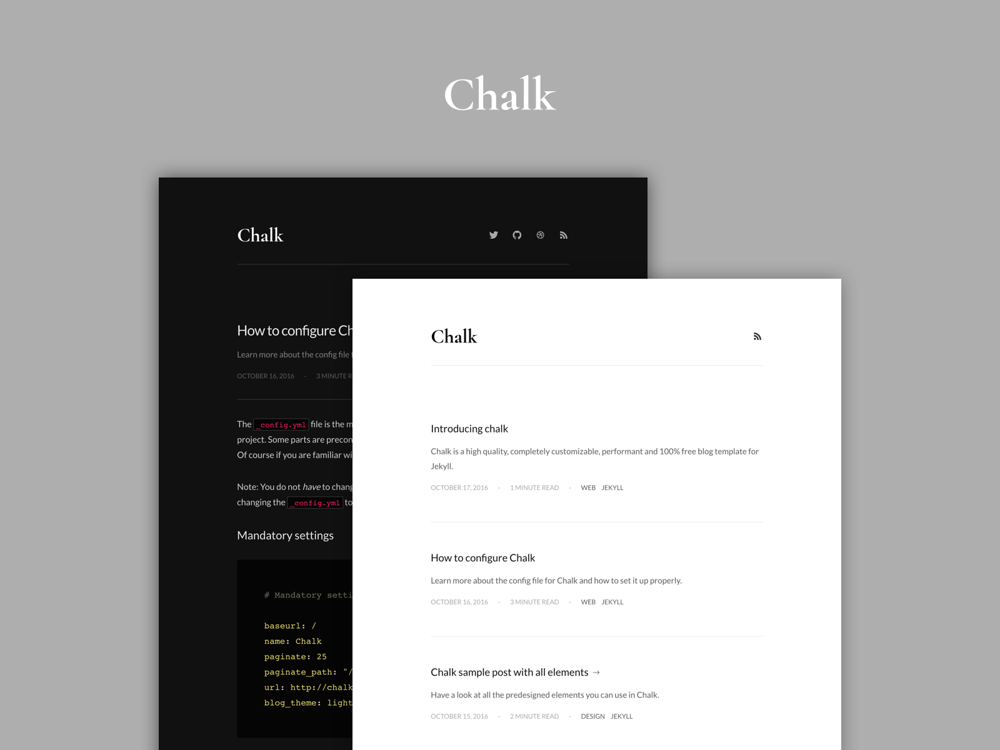

Chalk is a high quality, completely customizable, performant and 100% free blog template for Jekyll.

## Overview

Features:
  - Dark and Light theme.
  - Filter on tags.
  - customizable pagination.
  - Beautified link sharing in Facebook and other social media.
  - Automatic time to read post indicator.
  - Automatic RSS feed.
  - About page.
  - 404 page.
  - SEO optimized.
  - PageSpeed optimized.
  - Cross browser support (supports all modern browsers).
  - Media embed for videos.
  - Enlarge images on click (like Medium).

Integrations
  - [Google Analytics](https://analytics.google.com/analytics/web/)
  - [Google Fonts](https://fonts.google.com/)
  - [Disqus](https://disqus.com/)
  - [Ionicons](http://ionicons.com/)
  - Social media links

Used tools
  - [Autoprefixer](https://github.com/postcss/autoprefixer)
  - [Bower](http://bower.io/)
  - [Circle CI](https://circleci.com/)
  - [Html-proofer](https://github.com/gjtorikian/html-proofer)
  - [Jekyll](http://jekyllrb.com/)
  - [Jekyll assets](https://github.com/jekyll/jekyll-assets)
  - [Jekyll Sitemap](https://github.com/jekyll/jekyll-sitemap)
  - [HTML5 Boilerplate](https://html5boilerplate.com/) (Influenced by)
  - [Kickster](http://kickster.nielsenramon.com/)
  - [Retina.js](http://imulus.github.io/retinajs/)
  - [STACSS](http://stacss.nielsenramon.com/)

## Usage

### Installation

If you haven't installed the following tools then go ahead and do so (make sure you have [Homebrew](http://brew.sh/) installed):

    brew install ruby
    brew install npm

Next setup your environment:

    bin/setup

### Development

Run Jekyll:

    bundle exec jekyll serve

### Deploy to GitHub Pages

Run this in the root project folder in your console:

    bin/deploy

You can find more info on how to use the gh-pages branch and a custom domain [here](https://help.github.com/articles/quick-start-setting-up-a-custom-domain/).

[View this](https://github.com/nielsenramon/kickster#automated-deployment-with-circle-ci) for more info about automated deployment with Circle CI.

## License

MIT License

## Contributing

1. Fork it ( https://github.com/[my-github-username]/chalk/fork )
2. Create your feature branch (`git checkout -b my-new-feature`)
3. Commit your changes (`git commit -am 'Add some feature'`)
4. Push to the branch (`git push origin my-new-feature`)
5. Create a new Pull Request
