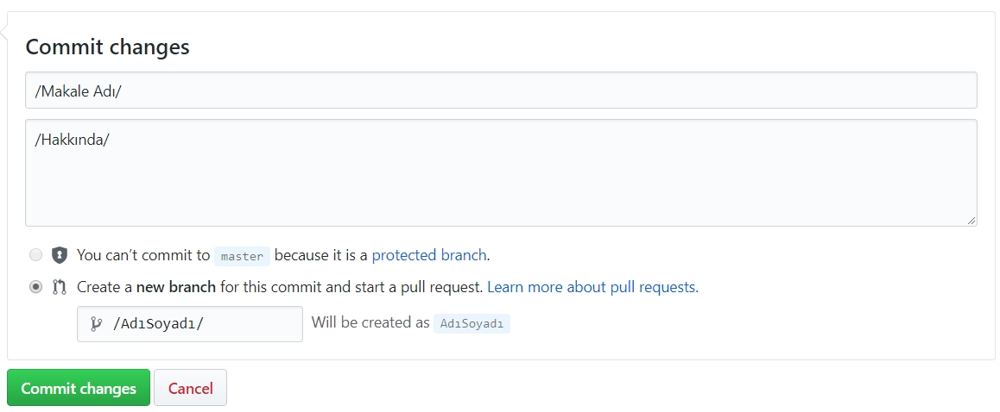

# PauSiber - Wiki

***Öncelikle katkılarınız için teşekkür ederiz.***

Makalenizi yayınlamadan önce makalenizin bazı kalıplarda olması gerekiyor. Makalenin adı ***2018-ay-gün-ad*** şeklinde olmalıdır. Eğer adı birkaç kelimeden oluşuyorsa ***“–“*** ile bitişik bir şekilde yazılmalı ve uzantısı **.md** olacak şekilde kaydedilmelidir. Örnek olarak **“ 2018-03-01-Des-3Des.md ”** şeklindedir.

Makale içeriğine geçecek olursak yazınızın başına

eklemeniz gerekiyor. Burada düzenlemeniz gereken title ve yazan bölümleridir. Daha sonrasında yazınızı yazabilirsiniz. Yazılarınızı yazarken markdown dilini kullandığınızı unutmayınız.

* .md uzantılı dosyanızı [Pausiber/wiki/post](https://github.com/PauSiber/wiki/tree/master/_posts) linkteki upload file bölümüne yükleyip 

aşağıdaki bu gibi düzenleyip gönderiniz.

Create pull request demeniz yeterli olacaktır.

Bazı online markdown editörleri

[Github Markdown Editör](http://jbt.github.io/markdown-editor/)

[StackEdit.io](https://stackedit.io/app)

