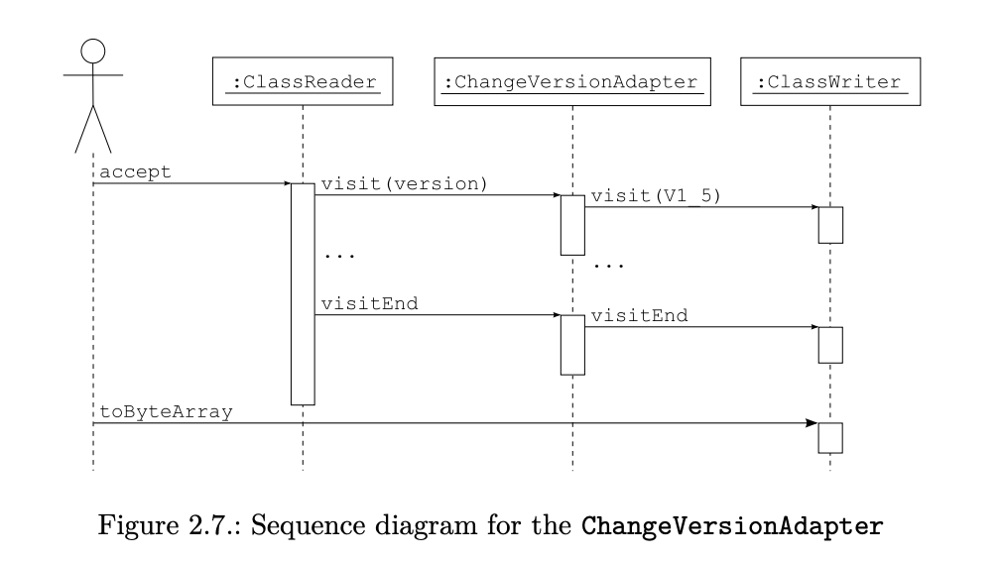

### 2.18.1 动态代理

参考[动态代理](./2018-10-21-2.8 动态代理.md)

### 2.18.2 编译 + AbstractProcessor实现

通过注解, 在编译时期使用`AbstractProcessor`生成代码

### 2.18.3 ASM (字节码操控框架)
- Java类文件结构, 参考[类文件结构](./2018-10-21-2.3 类文件结构.md)
- 使用

```Java
  // 1. 继承ClassAdapter
  class AddSecurityCheckClassAdapter extends ClassAdapter {
    public AddSecurityCheckClassAdapter(ClassVisitor cv) {
      //Responsechain 的下一个 ClassVisitor，这里我们将传入 ClassWriter，
      // 负责改写后代码的输出
      super(cv);
    }

    public MethodVisitor visitMethod(final int access, final String name, final String desc, final String signature, final String[] exceptions) {
      MethodVisitor mv = cv.visitMethod(access, name, desc, signature, exceptions);
      MethodVisitor wrappedMv = mv;
      if (mv != null) {
        if (name.equals("operation")) {
          wrappedMv = new AddSecurityCheckMethodAdapter(mv);
        }
      }
      return wrappedMv;
    }
  }

  // 2. 继承MethodAdapter, 在operation首部插入方法
  class AddSecurityCheckMethodAdapter extends MethodAdapter {
    public AddSecurityCheckMethodAdapter(MethodVisitor mv) {
      super(mv);
    }

    // ClassReader读到方法首部时调用visitCode
    public void visitCode() {
      visitMethodInsn(Opcodes.INVOKESTATIC, "SecurityChecker", "checkSecurity", "()V");
    }
  }

  public static void main() throws Exception {
    ClassReader cr = new ClassReader("Account");
    ClassWrite cw = new ClassWriter(ClassWriter.COMPUTE_MAXS);
    ClassAdapter classAdapter = new AddSecurityCheckClassAdapter(cw);
    cr.accept(classAdapter, ClassReader.SKIP_DEBUG);
    byte[] data = cw.toByteArray();
    File file = new File("Account.class");
    FileOutputStream fout = new FileOutputStream(file);
    fout.write(data);
    fout.close();
  }

```

  - 流程图

  


### 2.18.3 BCEI

### 参考
- [ASM 6 Developer Guide](https://asm.ow2.io/developer-guide.html)
