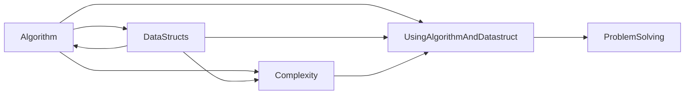

<center>



</center>

[문제를 계산하기 위해 알고리즘을 어떻게 생각해 내거나 기존 알고리즘을 찾아 적용하는 방법을 알 수 있습니까?](https://www.quora.com/How-do-I-come-up-with-algorithms-or-know-how-to-find-and-apply-existing-ones-for-computing-problems)   
[문제 해결 및 알고리즘](http://sofia.cs.vt.edu/cs1114-ebooklet/chapter4.html)

알고리즘은 **어떤 문제를 해결하기 위해 정해진 일련의 절차나 방법을 공식화한 형태로 표현한 것, 계산을 실행하기 위한 단계적 절차를 의미**합니다. 즉, 문제 해결에 필요한 계산 절차 또는 처리 과정의 순서를 뜻합니다.

알고리즘을 활용할 때, **이해는 반드시 필요하며 외우는 것보다는 빠르게 찾을 수 있는 능력이 더 중요합니다.** 알고리즘(또는 계획)을 개발하는 것은 문제 해결의 핵심적인 단계입니다. 알고리즘이 개발되면 컴퓨터 프로그램으로 구현할 수 있습니다. 우리의 알고리즘 개발 프로세스는 주로 다음과 같은 5가지 주요 단계로 이루어집니다.

<center>
  
  ```mermaid
  flowchart LR
    A[문제에 대한 설명을 얻습니다.] --> B[문제를 분석합니다.]
    B --> C[고급 알고리즘을 개발합니다.]
    C --> D[세부 정보를 추가하여 알고리즘을 구체화합니다.]
    D --> E[알고리즘을 검토합니다.]
  ```

</center>

프로그래밍에는 문제를 해결하는 다양한 방법이 있습니다. 그러나 이러한 방법들의 효율성은 다양하게 나타납니다. 어떤 방법은 다른 방법들보다 더 정확한 결과를 제공하는데 더 적합합니다. 이때 알고리즘은 문제를 해결하는 최상의 방법을 찾는 데 도움을 줍니다.

다시 말해, 효율적인 코드를 작성하고 문제를 최적 또는 거의 최적으로 해결하기 위해 알고리즘을 활용하는 것은 매우 유용합니다. 알고리즘을 적용하면 다음과 같은 프로그램의 효율성 향상이 기대됩니다.

* 최적의 알고리즘을 사용하면 컴퓨터 프로그램이 매우 정확한 결과를 얻을 수 있습니다. 이로써 소프트웨어의 정확성을 향상시킬 수 있습니다.
* 알고리즘을 활용하여 프로그램이 문제를 빠르게 실행할 수 있도록 개선할 수 있습니다. 효율적인 알고리즘을 사용하면 문제 해결에 소요되는 시간을 줄일 수 있어, 실행 속도를 향상시킬 수 있습니다.
* 메모리 사용량은 선택한 알고리즘에 따라 다르게 나타납니다. 적절한 알고리즘 선택으로 프로그램이 최소한의 메모리를 사용하도록 만들 수 있습니다.

알고리즘과 자료구조를 적용하지 않을 경우, 동일한 문제를 반복해서 해결해야 할 수 있으며 이는 자원 낭의 특징은 다음과 같습니다.

|특성|설명|
|:-:|---|
|유한성|알고리즘의 단계들은 반드시 유한한 횟수를 거친 후에 종료돼야 한다.|
|효율성|모든 과정은 명백히 실행(검증) 가능한 것이어야 합니다.|
|입력|알고리즘은 0또는 그 이상의 입력들을 갖습니다. 즉 밖에서 들어오는 데이터가 없거나 1개 이상입니다.|
|출력|알고리즘은 하나나 그 이상의 출력들을 갖습니다. 즉 최소한 출력이 1개라도 있어야 합니다.|

<br>

**자료구조는 컴퓨터 과학 분야에서 데이터의 조직, 관리, 저장을 효율적으로 수행할 수 있도록 하는 방법을 나타냅니다.** 더 정확하게 말하면, 자료구조는 데이터 값의 집합, 데이터 간의 관계, 그리고 데이터에 적용 가능한 함수나 명령을 포함합니다.

다시 말해, 자료구조는 추상적으로 표현된 데이터의 형태와 그 데이터를 다루는 연산에 대한 정의입니다.

**자료구조는 개발자가 데이터를 효율적으로 처리할 수 있도록 도와주므로, 컴퓨터 과학에서 매우 중요한 역할을 합니다.** 소프트웨어의 주요 기능 중 하나는 사용자 데이터를 빠르게 저장하고 검색하는 것이므로, 자료구조는 소프트웨어 및 프로그램의 성능 향상에 중요한 역할을 합니다.

데이터 구조는 컴퓨터에서 데이터를 효율적으로 저장하고 조직하는 방법을 제공하는 데이터 요소의 집합으로 정의할 수 있습니다. 이는 프로그램을 설계하고 데이터를 효과적으로 다루기 위한 핵심 개념 중 하나입니다.

일반적인 데이터 구조의 예시로는 배열, 링크드 리스트, 스택, 큐 등이 있습니다. 이러한 데이터 구조들은 데이터를 저장하고 접근하는 방식에 따라 다양하게 구성되어 있습니다.

데이터 구조는 데이터를 효율적으로 저장하고 정리하는 방법을 나타내며, 데이터를 조작하고 관리하는 데 도움이 됩니다. 데이터 구조는 데이터를 선형으로 정리하는 선형 데이터 구조와 비선형적으로 정리하는 비선형 데이터 구조로 나눌 수 있습니다. 선형 데이터 구조에는 배열, 링크드 리스트, 스택, 큐 등이 포함되며, 비선형 데이터 구조에는 트리와 그래프가 포함됩니다.

또한, Abstract Data Type(추상 데이터 타입)은 문제 해결을 단순화하고 모델화하기 위한 개념으로, 데이터 구조와 해당 데이터에 적용 가능한 연산을 하나로 묶어 추상적으로 정의한 것을 나타냅니다. 이것은 프로그래머가 문제를 해결하고 프로그램을 구조화하는 데 도움을 줍니다.

<center>

  
  
</center>

[Big O cheet sheet](https://www.bigocheatsheet.com/)

동영상을 보듯이, 자료구조(이를 "thing"으로 표현합니다)와 알고리즘(이를 "doing"으로 표현합니다)을 사용하는 것은 데이터를 효과적으로 다루고 문제를 해결하는 핵심입니다.

문제에 직면했을 때, 가능한 해결책을 찾기 위해 여러 가지 접근법을 고려하고 비교합니다. 이러한 과정을 통해 가장 효과적인 알고리즘을 선택하고 자료구조를 활용하여 문제를 해결할 수 있습니다. 이것이 문제 해결의 핵심입니다.

* [Programmers: 알고리즘과 좌료구조가 실무에서 어떻게 쓰이는지에 대한 참고](https://prgms.tistory.com/134)
