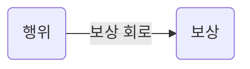

게임이 지루하지 않고 재미있을라면 플레이어가 어떤 행동을 하는 것에 대해 보상회로가 있어야합니다.

컨셉과 트레일러로 초반 보상회로를 구축한 예시들

* 디스 워 이즈 마인
* 프로스트 펑크
* 스타크래프트 시네마틱
* 아이들 마인의 매니저

게임을 하지 않은 사람들이 게임에 재미를 느끼게 하기 위해선 자연스럽게 보상회로를 구축해야 합니다.

* 새로운 보상회로를 구축하는 것은 보통 어렵다고 합니다.
* 해당 장르의 게임을 좋아한다는 것은 해당 장르의 게임에 보상회로를 가지고 있다는 것을 의미합니다.

보상회로를 구축하는 방법으로 System1과 System2를 이용한 예시입니다.
