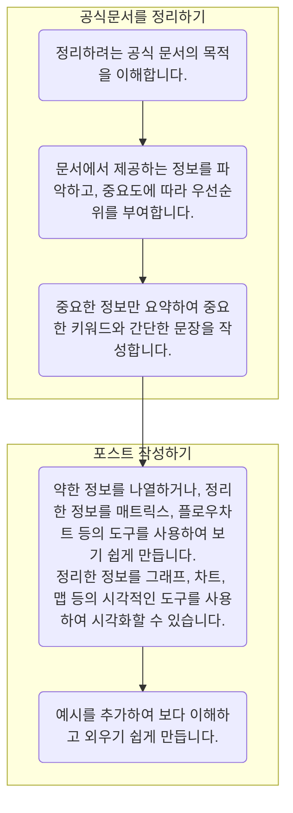

```mermaid
flowchart TD

subgraph 공식문서를 정리하기
    UnderstandDocumentPurpose(정리하려는 공식 문서의 목적을 이해합니다.)
    CheckPriority(문서에서 제공하는 정보를 파악하고, 중요도에 따라 우선순위를 부여합니다.)
    SummarizeInformation(중요한 정보만 요약하여 중요한 키워드와 간단한 문장을 작성합니다.)
end
subgraph 포스트 작성하기
    MakeListAndVisualization(약한 정보를 나열하거나, 정리한 정보를 매트릭스, 플로우차트 등의 도구를 사용하여 보기 쉽게 만듭니다.<br>정리한 정보를 그래프, 차트, 맵 등의 시각적인 도구를 사용하여 시각화할 수 있습니다.)
    AddSample(예시를 추가하여 보다 이해하고 외우기 쉽게 만듭니다.)
end

UnderstandDocumentPurpose-->CheckPriority
CheckPriority-->SummarizeInformation
SummarizeInformation-->MakeListAndVisualization
MakeListAndVisualization-->AddSample
```

* 엔진의 공식문서는 도구모음과 도구를 사용하는 설명집으로 생각하고 정리합니다. 따라서 도구들이 뭐가 있고, 사용한 예시들을 모아 정리합니다.