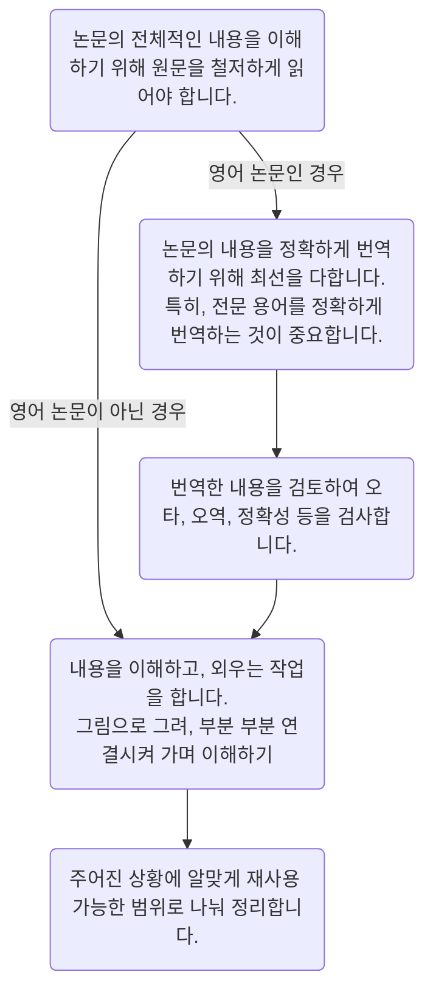

```mermaid
flowchart TD

ReadFirst(논문의 전체적인 내용을 이해하기 위해 원문을 철저하게 읽어야 합니다.)
Translate(논문의 내용을 정확하게 번역하기 위해 최선을 다합니다.<br>특히, 전문 용어를 정확하게 번역하는 것이 중요합니다.)
ReviewTranslation(번역한 내용을 검토하여 오타, 오역, 정확성 등을 검사합니다.)
Understand(내용을 이해하고, 외우는 작업을 합니다.<br>그림으로 그려, 부분 부분 연결시켜 가며 이해하기)
Divide(주어진 상황에 알맞게 재사용 가능한 범위로 나눠 정리합니다.)

ReadFirst--영어 논문인 경우-->Translate
ReadFirst--영어 논문이 아닌 경우-->Understand
Translate-->ReviewTranslation
ReviewTranslation-->Understand
Understand-->Divide
```

