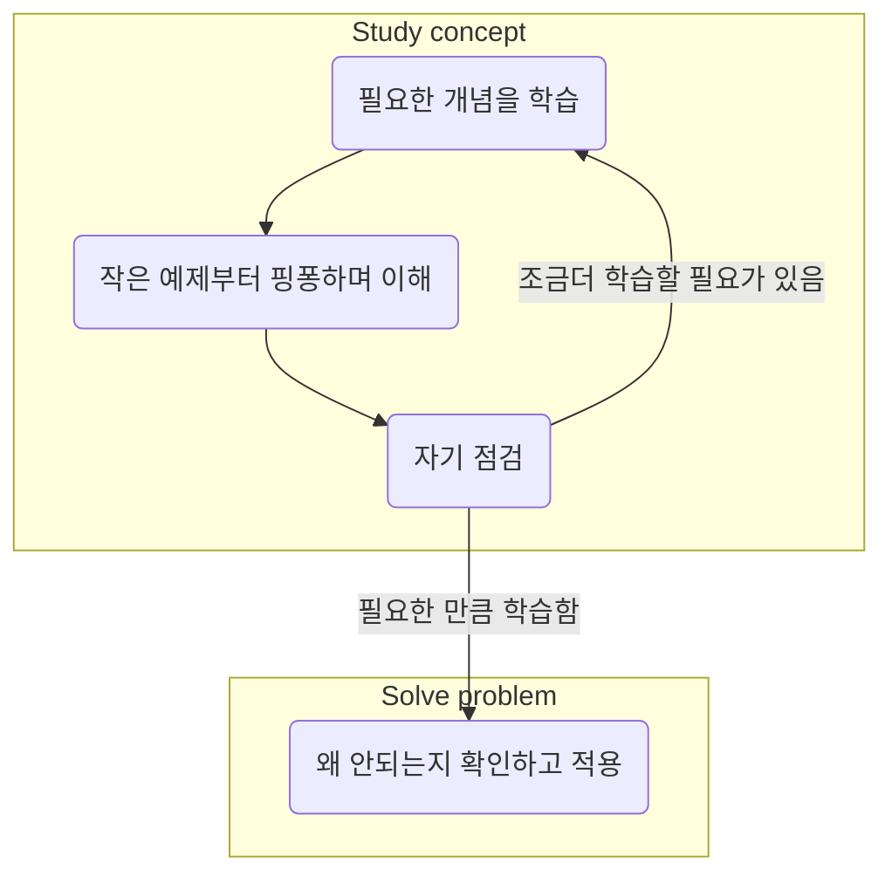

## For successful and efficient study

### 필요한 습관
1. 일정 만들기: 공부 시간을 미리 계획하고 그에 충실하세요. 이렇게 하면 추적을 유지하고 모든 자료를 다룰 수 있는 충분한 시간을 확보하는 데 도움이 됩니다.
2. 휴식을 취하십시오: 매 시간마다 짧은 휴식을 취하면 집중력을 유지하고 번아웃을 피하는 데 도움이 될 수 있습니다.
3. 플래시 카드 사용: 플래시 카드는 정보를 빠르게 암기하고 검토할 수 있는 좋은 방법입니다.
4. 능동적 회상 연습하기: 메모를 수동적으로 읽는 대신 스스로에게 퀴즈를 내거나 다른 사람에게 자료를 가르쳐 정보를 적극적으로 기억해 보십시오.
5. 충분한 수면을 취하십시오: 수면은 학습과 기억에 필수적입니다. 두뇌가 정보를 통합하는 데 도움이 되도록 매일 밤 충분한 수면을 취하십시오.
6. 정리된 상태 유지: 학습 자료와 메모를 정리하여 필요한 내용을 쉽고 빠르게 찾을 수 있습니다.
7. 스터디 그룹 찾기: 스터디 그룹은 동기를 유지하고 다른 사람들과 자료를 검토할 수 있는 좋은 방법이 될 수 있습니다.
8. 긍정적인 태도를 가지십시오: 당신이 할 수 있다는 것을 믿으십시오. 긍정적인 태도와 사고 방식을 가지면 동기를 유지하고 도전을 극복하는 데 도움이 될 수 있습니다.
