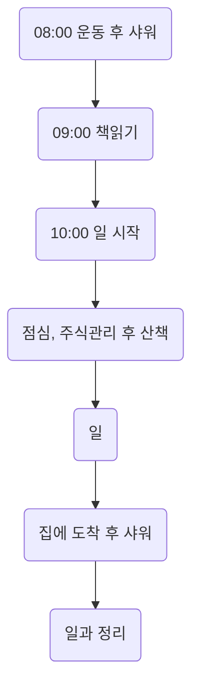

## 깨긋하게 관리하기

### 몸에서 향기나기
#### 샤워
* 샤워는 하루 두번 아침 저녁으로 합니다.
* 몸을 씻을때는 다음과 같은 순서와 샤워용품을 이용합니다. 
  1. 면도는 면도기를 이용합니다.
  1. 머리는 닥터 그루트 샴푸를 이용합니다.
  2. 귀뒤, 겨드랑이, 사타구니는 비누를 이용합니다.
  3. 몸은 클린 랩스 프리미엄 바디워시를 뭍힌 타월을 이용합니다.

#### 구강
* 양치는 점심에 한번, 자기전에 한번해서 두번닦습니다.
  * 이를 닦을 때는 이 사이에 낀 것을 제거하는데 집중합니다.
  * 혀 클리너를 이용하여 백태를 지우는데 집중합니다.

#### 향수
* 손목에 향수를 뿌린 후 귀뒤에 뭍히는 식으로 향수를 뿌립니다.

#### 의류
* 월, 화, 수, 목, 금 5세트를 준비하여 관리합니다.
* 집에서 입을 일상복은 따로 관리합니다.

#### 침구류
* 이불과 베개는 커버를 이용하고, 일주일에 한번 빨래합니다.
* 이불과 베개는 한달에 한번 빨래합니다.

#### 의자
* 의자에서 냄새가 날 경우 페브리즈를 뿌려 관리합니다.

### 집을 관리하기
#### 습도의 관리
* 제습기를 이용하여 집안의 습도를 조절합니다.