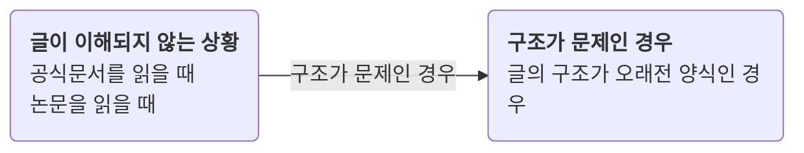

어떤것을 읽고 이해해야 할 때, 너무 어려워 이해하기 어려운 경우가 있습니다. 이럴 때 경우에 따라서 어떻게 행동해야 할지 정리입니다.

예를 들어 Unity API를 보았는데 도통 무슨말인지 이해하지 못하는 경우가 있습니다. 저의 경우 익숙하지 않은 글의 구조를 가지고 있었고, 이미지와 설명이 머리속에서 실제로 어떻게 작동하는지 상상하기에 부족하기 때문에 이해하기 어려웠습니다.

* 머리속에서 어떻게 작동하는지 상상하기 어려울때는, 핑퐁 주기를 빠르게 하는 것이 방법이 될 수 있습니다. 예를 들어 실제로 눌러서 작동하면서 API를 보는 것 입니다.