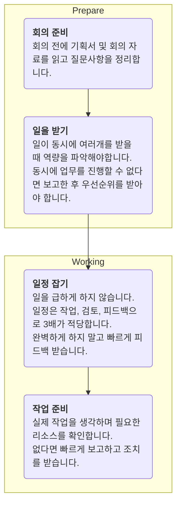

```mermaid
graph TD

subgraph Prepare
    PrepareMeeting(<div align=left><b>회의 준비</b><br>회의 전에 기획서 및 회의 자료를 읽고 질문사항을 정리합니다.</div>)
    GetTask(<div align=left><b>일을 받기</b><br>일이 동시에 여러개를 받을 때 역량을 파악해야합니다.<br>동시에 업무를 진행할 수 없다면 보고한 후 우선순위를 받아야 합니다.</div>)
end

subgraph Working
    CreateSchedule(<div align=left><b>일정 잡기</b><br>일을 급하게 하지 않습니다.<br>일정은 작업, 검토, 피드백으로 3배가 적당합니다.<br>완벽하게 하지 말고 빠르게 피드백 받습니다.</div>)
    PrepareTask(<div align=left><b>작업 준비</b><br>실제 작업을 생각하며 필요한 리소스를 확인합니다.<br>없다면 빠르게 보고하고 조치를 받습니다.</div>)
end

PrepareMeeting --> GetTask
GetTask --> CreateSchedule
CreateSchedule --> PrepareTask
```

