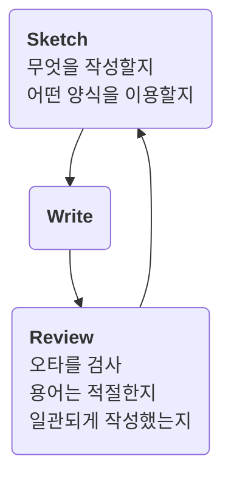

## 쉽게 쓰기

### 이슈를 전달하기

Sample

> **문제를 한문장으로 표현**
> 
> * 문제에 대한 설명
> * 현재 상황에 대한
> * ...
> 
> `영상 및 이미지`

 

* 영상을 이용하기
  * 글로 작성한 경우, 실제로 어떤것이 문제인지 상상해야하며 그 과정에서 잘못 전달 될 수 있습니다. 영상을 이용하여 빠르게 전달할 수 있도록 합니다.