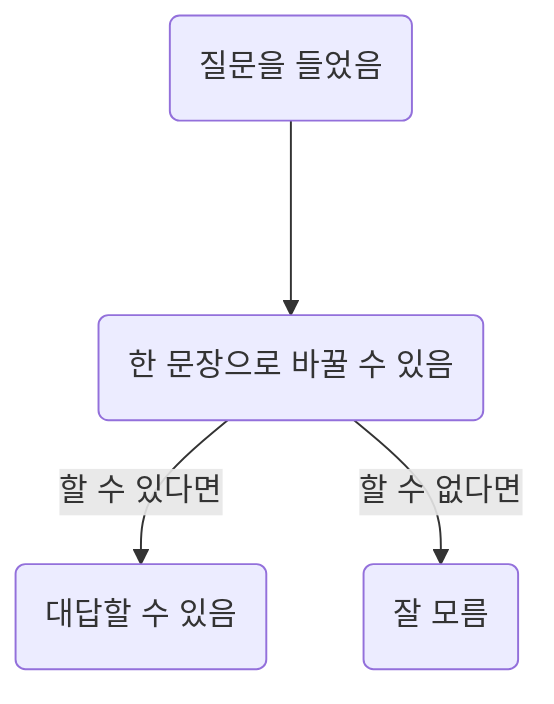

## 일관되게 말하기(speak coherently)
말을 조리있게 한다는 느낌을 위해서는 (말을 쉽게 표현하기 위해서는) 머리속에 생각을 정리할 필요가 있습니다. 생각을 정리하기 위해서는 `한마디로 표현하면`을 생각하면 도움이 됩니다.

```mermaid
graph TD

HeardQuestion(질문을 들었음)
IsAllowChangeOneSentence(한 문장으로 바꿀 수 있음)
CanAnswer(대답할 수 있음)
NotSure(잘 모름)

HeardQuestion ---> IsAllowChangeOneSentence
IsAllowChangeOneSentence --할 수 있다면--> CanAnswer
IsAllowChangeOneSentence --할 수 없다면--> NotSure

```

