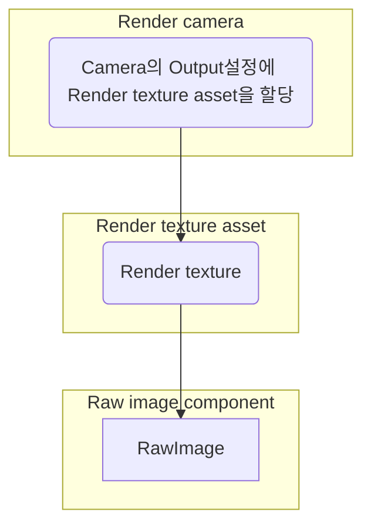

## Object render

```mermaid
graph TD

subgraph "Raw image component"
  RawImage
end

subgraph "Render texture asset"
  RenderTexture(Render texture)
  
  RenderTexture --> RawImage
end

subgraph "Render camera"
  Output
  
  Output(Camera의 Output설정에 Render texture asset을 할당) --> RenderTexture
end

```
### Render camera

### Render texture asset
[Render texture](https://docs.unity3d.com/Manual/class-RenderTexture.html)

### Raw image component
