# Lab1 Android Reverse 学习总结

## Step1

> 参考：[创建 Android 项目](https://developer.android.google.cn/training/basics/firstapp/creating-project)

根据实验要求创建安卓新项目，参数：API23；Android6.0；Empty Activity。

### 开发基础

`Android` 开发的四大组件为：
- `Activity` ：用于表现功能
- `Service` ：后台运行的服务
- `Broadcast Receiver`：用于接收广播
- `Content Provider` ：等同于数据库

#### Activity

- 定义：用户操作的可视化界面，提供一个完成操作指令的窗口。当创建完毕 `Activity` 之后，需要调用 `setContentView()` 方法来完成界面的显示。
- 依赖：需要在 `AndroidManifest.xml` `配置相关信息，否则系统将不识别也不执行该Activity` 。在 `android stdio` 会自动生成。
- 通信： `Activity` 之间通过 `Intent` 通信。
- 生命周期： `Android` 中维护一个 `Activity Stack` ， 使得一个 `Activity` 有四种状态： `Active` ； `Paused` ； `Stoped` ； `Destroyed` 。
> 暂停和停止的区别作于：暂停一般系统不会销毁该活动；而停止状态是该活动被其他活动完全覆盖（或点击 `HOME` 键退入后台），系统在需要时会自动销毁该活动。

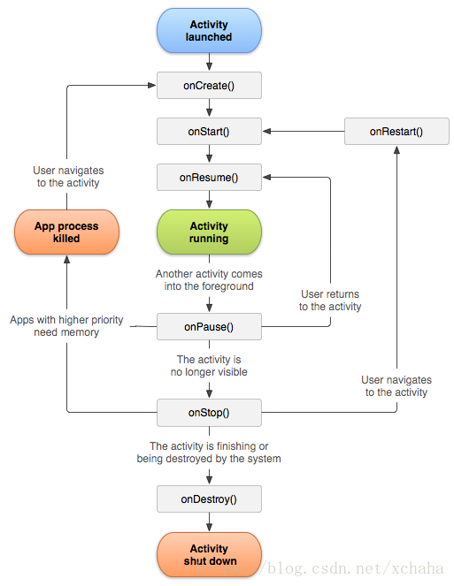<br>

#### Service

- 定义： `Service` 是一个专门在后台处理长时间任务的 `Android` 组件，没有 `UI` ，运行不依赖于任何用户界面。它有两种启动方式， `startService` 和 `bindService` 。
- 依赖：需要在 `AndroidManifest.xml` 配置相关信息，使用 \<service>\</service> 标签。
- 生命周期：这里分两种启动方式讨论。
  - `startService` ： 只是启动 `Service` ，启动它的组件（如 `Activity` ）和 `Service` 并 **没有关联** ，只有当 `Service` 调用 `stopSelf` 或者其他组件调用 `stopService` 服务才会终止。
  - `bindService` ： 其他组件可以通过 **回调** 获取 `Service` 的代理对象和 `Service` 交互，而这两方也进行了 **绑定** ，当启动方销毁时， `Service` 也会自动进行 `unBind` 操作，当发现 **所有绑定** 都进行了 `unBind` 时才会销毁 `Service` 。


#### Broadcast Receiver

- 定义：广播接收器是对发送出来的广播进行过滤接受并响应的一类组件。
> 广播是 `Android` 中一种广泛运用的在应用程序之间传输信息的机制。
- 依赖：
  - 广播接收器既可以在  `AndroidManifest.xml` 中注册（静态注册）。
  - 也可以在运行时的代码中使用 `Context.registerReceive()` 进行注册（动态注册）。
  > 当用来注册的 `Activity` 关掉后，动态注册的 `Broadcast Receiver` 也随之失效。
- 性质：
    - 应用可以使用它对外部事件进行过滤，使其只对感兴趣的外部事件（例如电话呼入、网络可用时）接收并响应。
    > 虽然 `Broadcast Receiver` 没有用户界面，但是它可以启动一个 `Activity` 或者 `Service` 来响应接收到的消息，或者用 `NotificationManager` 通知用户。通知方式包括闪灯，震动，放声，状态栏目标等等。

#### Content Provider

- 定义：该组件使一个应用程序的指定数据集可以提供给其他应用程序。其他应用可以通过 `ContentResolver` 类从该内容提供者中获取或存入数据。
> 即应用程序之间的通信（唯一方式），只有需要在多个应用程序间共享数据是才需要 `Content Provider` 。
- 依赖：没有依赖。 `ContentProvider` 使用 URI 来唯一标识其数据集，以 `content://` 作为前缀，表示该数据由 `ContentProvider` 来管理。
- 性质：
  - `ContentProvider` 用于保存和获取数据，即一份数据对所有应用程序可见。
  - 开发人员不会直接使用 `ContentProvider` 类对象，大多数通过 `ContentResolver` 对象实现对 `ContentProvider` 的操作。
  > `ContentProvider` 是一个抽象类。创建 `MyProvider` 类继承 `ContentProvider` ，实现6个抽象方法： `onCreate` 、 `getType` 、 `query` 、 `insert` 、 `delete` 、 `update` 。 `onCreate()` 方法会在创建的时候调用一次。其它方法通过ContentResolver的增删改查方法触发。[参考](https://blog.csdn.net/sjdjdjdjahd/article/details/103694314)


#### AndroidManifest.xml

- 定义： `AndroidManifest.xml` 是整个 `Android` 程序的信息扫描文件，它位于整个项目的根目录，描述了 `package` 中暴露的组件 （`Activities`，`Services`， `Content provider` 和 `Broadcast Receiver`） 的信息，是每个 `Android` 程序都必须的文件，该文件在程序创建自动生成的，不需要我们自己创建（该文件的文件名不能修改）。

- 结构：
  0. \<xml> : 版本和编码信息 
  1. \<manifest> : `package` ，用于指定应用程序的包名。
  2. \<application> : 
     1. Android:label : 指定 `Activity` 中标题栏的内容。默认为程序名。
     2. Android:supportsRtl (Rtl:right to left): 表示程序是否支持从右到左的布局方向。
     3. Android:allowBackup : `Android API Level 8`及其以上 `Android` 系统为应用程序提供的应用程序的数据备份和恢复功能。其默认为 `true` ，用户可以通过 `adb` 命令（ `backup` `restore` ） 对数据进行备份和恢复。
     > 存在安全隐患。
     4. ......
  3. \<activity> : 
     1. Android:name : 在创建活动时，需要通过 \<activity> 标签进行注册， name 即指定具体注册哪个互动。
     2. \<intent-fileter> : 为程序配置主活动（程序运行时首先启动的活动）。
     > 如果有多个< Activity >，那么其实有一个< intent-filter >标签就可以了，因为如果每个< Activity >标签中都含有< intent-filter >，那么就会按顺序去第一个含有< intent-filter >标签的< Activity >作为程序的主活动。
     3. android:permission ： 设置许可名，这个属性若在上定义的话，是一个给应用程序的所有组件设置许可的便捷方式，当然它是被各组件设置的许可名所覆盖的。
     4. android:presistent ： 该应用程序是否应该在任何时候都保持运行状态,默认为 `false` 。因为应用程序通常不应该设置本标识，持续模式仅仅应该设置给某些系统应用程序才是有意义的。
     5. ...
  4. \<intent-filter> : 
     1. \<action /> : 只有 android:name 一个属性，常见的 android:name 值为 android.intent.action.MAIN 。
     2. \<category /> : 也只有 android:name 这个属性，常见的 android:name 值为 android.intent.category.LAUNCHER 。
  5. \<meta-data> : 储存资源，供组件使用。
  6. \<activity-alias> : 创建 `activity` 的快捷方式。
  7. \<service> : 
     1. android:icon ： 声明图标，图片一般都放在 `drawable` 文件夹下
     2. android:enabled ： `Android` 系统是否能够实例化该应用程序的组件，如果为 `true` ，每个组件的 `enabled` 属性决定那个组件是否可以被 `enabled` 。如果为 `false` ，它覆盖组件指定的值；所有组件都是 `disabled` 。
     3. android:process ： 应用程序运行的进程名，它的默认值为元素里设置的包名，当然每个组件都可以通过设置该属性来覆盖默认值。如果你想两个应用程序共用一个进程的话，你可以设置他们的 android:process 相同，但前提条件是他们共享一个用户 ID 及被赋予了相同证书的时候
     4. ...
  8. \<Receiver> : 和 `service` 基本相同。
  9. \<Provider> : 
     1.  android:authorities：标识这个 `ContentProvider` ，调用者可以根据这个标识来找到它。
     2.  android:grantUriPermission：对某个URI授予的权限。

### Task1
有了以上安卓编程基础，可以开始实现 Task1，首先创建一个 Receiver：
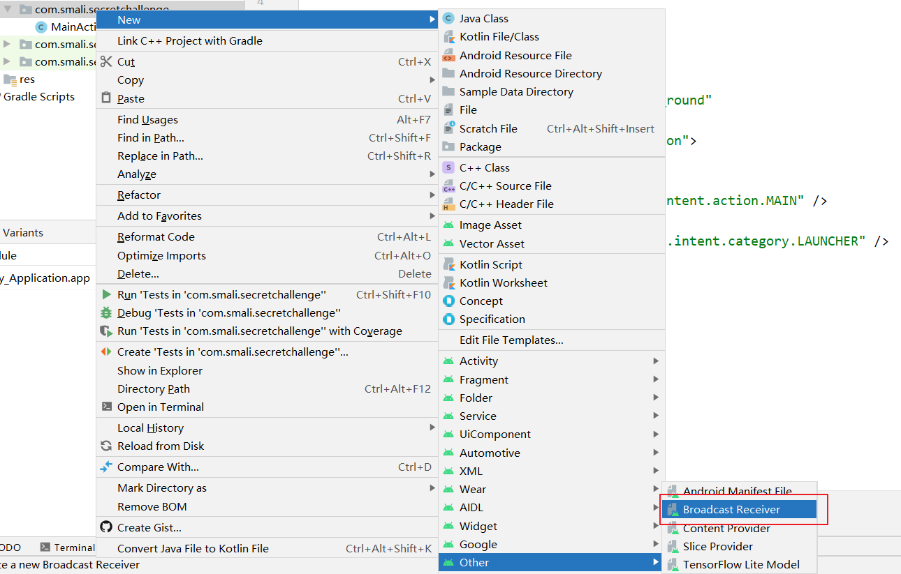
可以看见在AndroidManifest.xml中已经自动添加了receiver字段，接下来实现要求：开机自启动和后台自启动一个service。


为实现以上功能，在清单中申请开机自启权限：
`<uses-permission android:name="android.permission.RECEIVE_BOOT_COMPLETED" />`

然后完成receiver的onReceive方法，主要思路是：**Receiver通过接受系统开机加载完毕后发送的`BOOT_COMPLETED`广播，使用Intent加载Mainactivity完成自启动。**
```java
    @Override
    public void onReceive(Context context, Intent intent) {
        // TODO: This method is called when the BroadcastReceiver is receiving
        // an Intent broadcast.

        if (intent.getAction().equals("android.intent.action.BOOT_COMPLETED")){
            Intent i=new Intent(context,MainActivity.class);
            i.addFlags(Intent.FLAG_ACTIVITY_NEW_TASK);
            context.startActivity(i);
        }

        throw new UnsupportedOperationException("Not yet implemented");
    }
```
> 参考0：[要在清单中声明广播接收器，请执行以下步骤](https://developer.android.google.cn/guide/components/broadcasts)
> 参考1：[如何启动另一个activity](https://developer.android.google.cn/training/basics/firstapp/starting-activity)
> 参考2：[为什么要添加FLAG_ACTIVITY_NEW_TASK](https://blog.csdn.net/weixin_44618862/article/details/106268932)，因为Context并不存在任务栈，被启动的活动就无法进入启动它的活动的任务栈中，就会出现错误。

接下来实现无通知启动一个service，同理创建一个service文件后，receiver可以通过启动Mainactivity来间接启动service，即在Mainactivity中启动service。
```java
    @Override
    protected void onCreate(Bundle savedInstanceState) {
        super.onCreate(savedInstanceState);
        setContentView(R.layout.activity_main);

        Intent intent = new Intent(MainActivity.this, SecretService.class);
        startService(intent);
    }
```
> 报错：Installed Build Tools revision 33.0.0 is corrupted. Remove and install again using the SDK Manager.
> 解决：找到build tools目录中的d8.bat，将文件名修改为dx.bat。找到build tools目录中的lib/d8.jar，将文件名修改为dx.jar。

以上，第一步实现完毕。接下来实现获取设备位置信息并每三秒弹窗显示。


首先在清单中添加前台位置权限信息：
`<uses-permission android:name="android.permission.ACCESS_COARSE_LOCATION" />`
`<uses-permission android:name="android.permission.ACCESS_FINE_LOCATION" />`
然后在Mainactivity中申请权限：
```java
if (ContextCompat.checkSelfPermission(this, Manifest.permission.ACCESS_COARSE_LOCATION)
        != PackageManager.PERMISSION_GRANTED) {
    requestPermissions(new String[] { Manifest.permission.ACCESS_COARSE_LOCATION }, 0);
}
if (ContextCompat.checkSelfPermission(this, Manifest.permission.ACCESS_FINE_LOCATION)
        != PackageManager.PERMISSION_GRANTED) {
    requestPermissions(new String[] { Manifest.permission.ACCESS_FINE_LOCATION }, 1);
}
```
权限拿到手后，开始获取其位置信息，基本思路为使用LocationManager调用requestLocationUpdates方法每三秒获取位置信息，而LocationListener进行监听，监听结果使用toast进行显示。
```Java
    @Override
    public void onCreate() {
        super.onCreate();
        final LocationManager locationManager = (LocationManager) getSystemService(Context.LOCATION_SERVICE);
        LocationListener locationListener = new LocationListener() {
            public void onLocationChanged(Location location) {

                // 获取经纬度和准确度信息
                String latitude = Double.toString(location.getLatitude());
                String longitude = Double.toString(location.getLongitude());
                String accuracy = Double.toString(location.getAccuracy());

                // 打印Log
                Log.i("log", "Location changed : Lat: " + latitude + " Lng: " + longitude);

                // Toast输出
                Toast.makeText(SecretService.this, "getAccuracy:" + 
                accuracy + "\ngetLatitude:" + latitude + "\ngetLongitude:" + 
                longitude, Toast.LENGTH_SHORT).show();
            }

            // 必要的 Override， 不可删除
            @Override
            public void onStatusChanged(String provider, int status, Bundle extras) {
            }

            @Override
            public void onProviderEnabled(String provider) {
            }

            @Override
            public void onProviderDisabled(String provider) {
            }
        };

        //实现每三秒重新获取
        if (ActivityCompat.checkSelfPermission(
                this, Manifest.permission.ACCESS_FINE_LOCATION) != PackageManager.PERMISSION_GRANTED &&
            ActivityCompat.checkSelfPermission(
                this, Manifest.permission.ACCESS_COARSE_LOCATION) != PackageManager.PERMISSION_GRANTED) {
            return;
        }
        locationManager.requestLocationUpdates(LocationManager.GPS_PROVIDER, 3000, 0, locationListener);

    }
```

> 参考1：[官方文档-位置信息](https://developer.android.google.cn/training/location)
> 参考2：[官方文档-请求权限](https://developer.android.google.cn/training/permissions/requesting)
> 参考3：[官方文档-LocationManager](https://developer.android.google.cn/reference/android/location/LocationManager.html)
> 参考4：[官方文档-getSystemService](https://developer.android.google.cn/reference/android/content/ContextWrapper#getSystemService(java.lang.String))
> 参考5：[官方文档-LocationListener](https://developer.android.google.cn/reference/android/location/LocationListener)：其中的几个方法必须被覆盖。
> 参考6：[官方文档-Location](https://developer.android.google.cn/reference/android/location/Location)
> 参考7：[官方文档-toast](https://developer.android.google.cn/reference/android/widget/Toast)

### Task2 

> Android中线程按功能分的话，可以分为两个，一个是主线程（UI线程），其他的都是子线程。主线程不能执行那些耗时过长的代码或任务（执行耗时过长的代码会出现应用未响应的提示），所以都是使用子线程来执行耗时过长的代码，比如说下载文件等任务。一般情况，子线程中执行过长的代码，都是需要进行更新UI操作。但是Android中，为了防止安全，不允许在子线程更新UI的。

这里，我们使用 API `Handler` 可以实现子线程切换UI（本质上，这些API也是切换回了主线程来进行更新UI）。

为了实现 Task 需要的效果，添加一个 `button` 的点击事件并点击按钮开启一个线程后，调用以上 API 在子线程中进行 UI 更新，主要使用了 `Looper`。
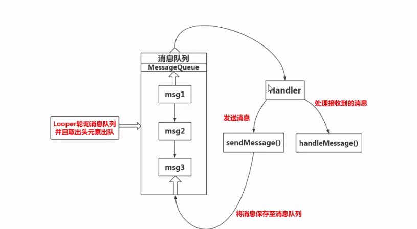  

具体代码如下：
```java
    // 在class 中声明以下 private 变量后 
    editText = (EditText) findViewById(R.id.edit);
    button = (Button) findViewById(R.id.button);
    textView = (TextView) findViewById(R.id.textView);

    button.setOnClickListener(new Button.OnClickListener() {
        // 点击事件
        public void onClick(View v) {
            final String input = editText.getText().toString();
            
            // 子线程运行事件
            new Thread(new Runnable() {
                @Override
                public void run() {
                    Looper.prepare();
                    Handler handler = new Handler(Looper.getMainLooper()) {

                        // 通过 HandleMessage 的机制更新 UI
                        @Override
                        public void handleMessage(Message msg) {
                            AlertDialog.Builder builder = new AlertDialog.Builder(MainActivity.this);
                            builder.setMessage(input);
                            builder.show();
                        }
                    };

                    // 设置 textView
                    handler.sendEmptyMessage(1);
                    Looper.loop();
                    textView.setText(input);
                }
            }).start();
        }
    });

```

> 参考1：[官方文档-Looper](https://developer.android.google.cn/reference/android/os/Looper)
> 参考2：[博客-Looper源码详解](https://blog.csdn.net/u012345683/article/details/108297844)
> 参考3：[博客-子线程更新UI的6种方式](https://www.cnblogs.com/stars-one/p/11666803.html)


### Task 3

将指定 jar 包导入程序的 libs 后，添加为 library 。查看其 PoRELab 文件。这里需要做的是获取其私有字符串成员 curStr 并调用其私有成员函数 privateMethod。

JAVA 反射机制是在运行状态中，对于任意一个类，都能够知道这个类的所有属性和方法；对于任意一个对象，都能够调用它的任意一个方法和属性，自然也就能解决以上问题。


```java
    PoRELab.publicMethod(input);
    PoRELab temp = new PoRELab();

    // 反射机制
    try {
        // 通过 getClass 获取Class对象
        Class class1 = temp.getClass();

        // 通过 getDeclaredField 获取指定名为 curStr 的变量
        Field field = class1.getDeclaredField("curStr");

        // 禁止 java 的语言访问检查
        field.setAccessible(true);

        // 通过 get 获取其示例值
        String g = (String) field.get(class1);

        // 通过 getDeclaredMethod 获取指定名为 privateMethod 的方法
        Method method = class1.getDeclaredMethod("privateMethod",String.class,String.class);

        // 禁止 java 的方法访问检查
        method.setAccessible(true);

        // 通过 invoke 即可调用该方法
        method.invoke(class1,"hello world",g);

        // 对于以上调用，catch 以上可能的 Exception 即可调用该方法
    }catch (NoSuchFieldException | IllegalAccessException | NoSuchMethodException | InvocationTargetException e){
        e.printStackTrace();
    }
```


> 参考1：[javapoint-reflection](https://www.javatpoint.com/java-reflection)


### Task 4 

按提示产出 APP 即可。这里发现产出的 APP 后缀为 .abb ，是谷歌从2021年8月份开始，Google Play商店的应用将从 .apk格式改为 .aab 格式。AAB（全称：Android App Bundle），其优势在于应用体积更小、拥有更安全的密钥签名、自定义功能模块交付等。


## Step 2

### Task 1
首先查看 `Checker.smali`，分析其文件结构
- 调用库
- 私有变量
  - secret
- constructor
  - 将 key 赋值给 secret
- checkStr1
  - 输入字符串 p1
  - 将其转换为数组开始 goto_b 遍历数组
    - 记录数组中前两个 x 的位置
  - 返回条件：
    - x的个数为2
    - 两个x之间间隔3个数
    - 第一个数为0
    - 最后一个数为9
    - 第一个数到第一个x之间包含key
- count
  - 输入字符串 p1
  - 将其转换为数组开始 goto_7 遍历数组
    - 记录 1 的个数并返回
- func
  - 输入整数 p1
  - 如果 p1 为 1 则返回 1
  - 否则递归返回 func(p1 - 1) * p1，最后结果应该为 p1 的阶乘
- check
  - 输入字符串 p1
  - 如果 p1 大于 16 或小于 12，返回 false
  - 将前十位输入 checkStr1 函数，剩余位输入 count 函数。
  - 如果 func(count(剩余位)) != count(剩余位) || !checkStr1，返回 false。
  - 返回 true。、

通过以上分析，可以构造出合适的值：0keyx123x9001
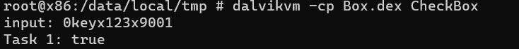。
并且可以还原出 java 代码：
```java
public class Checker {
    private String secret = "key";

    private boolean checkStr1(String str) {
        char[] charArray = str.toCharArray();
        int x_count = 0;
        int x_2 = 0;
        int x_1 = 0;
        for (int i = 0; i < charArray.length; i++) {
            if (charArray[i] == 'x') {
                x_count++;
                if (x_count == 1) {
                    x_1 = i;
                }
                if (i == 2) {
                    x_2 = i;
                }
            }
        }
        return x_count == 2 && 
               x_2 - x_1 == 4 && 
               charArray[0] == '0' && 
               charArray[charArray.length + -1] == '9' && 
               str.substring(0, x_1).contains(this.secret);
    }

    private int func(int i) {
        if (i <= 1) {
            return 1;
        }
        return func(i - 1) * i;
    }

    private int count(String str) {
        int i = 0;
        char[] charArray = str.toCharArray();
        for (int i2 = 0; i2 < str.length(); i2++) {
            if (charArray[i2] == '1')
                i++;
        }
        return i;
    }

    public boolean check(String str) {
        if (str.length() < 12 || str.length() > 16) {
            return false;
        }
        String substring = str.substring(0, 10);
        int count = count(str.substring(10, str.length()));
        if (func(count) != count || !checkStr1(substring)) {
            return false;
        }
        return true;
    }
}
```

### Task2
通过仔细阅读 `Encoder.smali`，也可以还原出其 java 代码：
```java
public class Encoder {

    private String algorithm = "MD5";
    private String charSet = "utf-8";
    private final String[] hexDigits = {"0", "1", "2", "3", "4", "5", "6", "7", "8", "9", "a", "b", "c", "d", "e", "f"};

    public String encoding(String str){
        Exception e;
        String str2 = "";
        String salt = getSalt();
        String str3 = str + salt;
        try {
            String str4 = str2 + byteArrayToHexString(MessageDigest.getInstance(this.algorithm).digest(str3.getBytes(this.charSet)));
            
            try {
                char[] cArr = new char[48];
                for (int i = 0; i < 48; i += 3) {
                    cArr[i] = str4.charAt((i / 3) * 2);
                    cArr[i + 1] = salt.charAt(i / 3);
                    cArr[i + 2] = str4.charAt(((i / 3) * 2) + 1);
                }
                return new String(cArr);
            } catch (Exception e2) {
                
                e = e2;
                str2 = str4;
                e.printStackTrace();
                return str2;
            }
        } catch (Exception e3) {
            e = e3;
            e.printStackTrace();
            return str2;
        }
    }

    private String getSalt() {
        Random random = new Random();
        StringBuilder sb = new StringBuilder(16);
        for (int i = 0; i < 16; i++) {
            if (random.nextBoolean()) {
                sb.append("1");
            } else {
                sb.append("0");
            }
        }
        return sb.toString();
    }

    private String byteArrayToHexString(byte[] bArr) {
        StringBuffer stringBuffer = new StringBuffer();
        for (byte b : bArr) {
            stringBuffer.append(byteToHexString(b));
        }
        return stringBuffer.toString();
    }

    private String byteToHexString(byte p1) {
        int v0 = 0;
        int p11 = 0;
        if(p1>=0){

            v0 = p1/0x10;
            int v1 = 0;
            v1 = p1 % 0x10;
            StringBuilder v2 = new StringBuilder();
            String v00 = this.hexDigits[v0];
            v2.append(v00);
            String v11 = this.hexDigits[v1];
            v2.append(v11);
            String v000 = v2.toString();
            return v000;
        }
        else{
            p11 = (p1 & 0xff);

            v0 = p11/0x10;
            int v1 = 0;
            v1 = p11 % 0x10;
            StringBuilder v2 = new StringBuilder();
            String v00 = this.hexDigits[v0];
            v2.append(v00);
            String v11 = this.hexDigits[v1];
            v2.append(v11);
            String v000 = v2.toString();
            return v000;
        }
            
        
        

        
    }

    public boolean check(String str, String str2) {
        char[] cArr = new char[32];
        char[] cArr2 = new char[16];
        if (str2.length() != 48) {
            return false;
        }
        for (int i = 0; i < 48; i += 3) {
            cArr[(i / 3) * 2] = str2.charAt(i);
            cArr[((i / 3) * 2) + 1] = str2.charAt(i + 2);
            cArr2[i / 3] = str2.charAt(i + 1);
        }
        String str3 = str + new String(cArr2);
        try {
            return ("" + byteArrayToHexString(MessageDigest.getInstance(this.algorithm).digest(str3.getBytes(this.charSet)))).equals(new String(cArr));
        } catch (Exception e) {
            e.printStackTrace();
            return false;
        }
    }


    public static void main(String[] args) {
            Encoder en = new Encoder();
            System.out.println(en.encoding("19307130247"));
    }

}    
```
从还原的代码中得到 encoding 的密文：
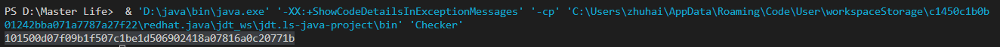  
运行程序，得到 true：
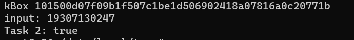  

## Step3

### task 1
将 APP 拖入 jadx 开始分析。
首先，在核心代码中，可以发现，将 I0 改为 99999 后，即满足 task 1 条件。
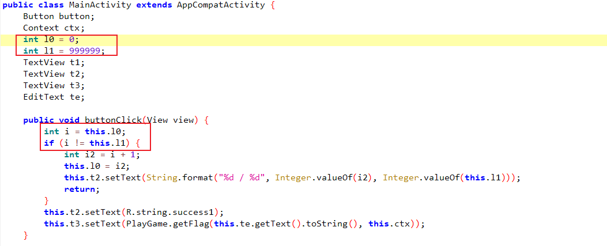  
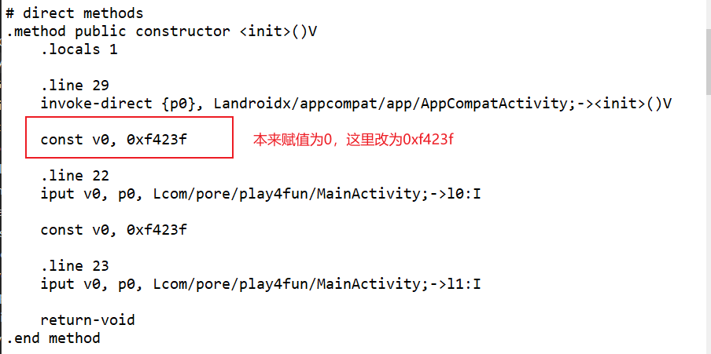  
重新打包并签名包后，可以看到成果：
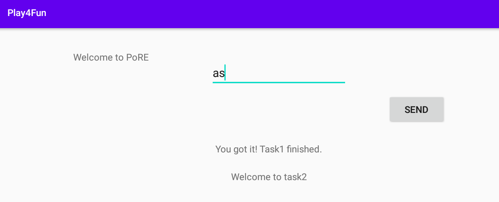  

### task 2
观察 playgame 中的代码，将其 Java 代码运行后得到：lightyellowdress，输入后即完成 task2 。
```java

public class Checker {

    private static String getFlag() {
        StringBuilder sb = new StringBuilder("pore");
        StringBuilder sb2 = new StringBuilder("pore");
        StringBuilder sb3 = new StringBuilder("pore");
        StringBuilder sb4 = new StringBuilder("pore");
        sb.setCharAt(0, (char) (sb.charAt(0) - 4));
        sb.setCharAt(1, (char) (sb.charAt(1) + 0));
        sb.setCharAt(2, (char) (sb.charAt(2) + 5));
        sb.setCharAt(3, (char) (sb.charAt(3) - 1));
        sb2.setCharAt(0, (char) (sb2.charAt(0) + 4));
        sb2.setCharAt(1, (char) (sb2.charAt(1) + '\n'));
        sb2.setCharAt(2, (char) (sb2.charAt(2) - '\r'));
        sb2.setCharAt(3, (char) (sb2.charAt(3) + 7));
        sb3.setCharAt(0, (char) (sb3.charAt(0) - 4));
        sb3.setCharAt(1, (char) (sb3.charAt(1) - 6));
        sb3.setCharAt(2, (char) (sb3.charAt(2) - 11));
        sb3.setCharAt(3, (char) (sb3.charAt(3) + 3));
        sb4.setCharAt(0, (char) (sb4.charAt(0) + 2));
        sb4.setCharAt(1, (char) (sb4.charAt(1) - '\n'));
        sb4.setCharAt(2, (char) (sb4.charAt(2) + 1));
        sb4.setCharAt(3, (char) (sb4.charAt(3) + 14));
        String res = "";
        return res.concat(sb3.toString()).concat(sb2.toString()).concat(sb.toString()).concat(sb4.toString());
    }


    public static void main(String[] args) {
            System.out.println(Checker.getFlag());
    }

}    
```
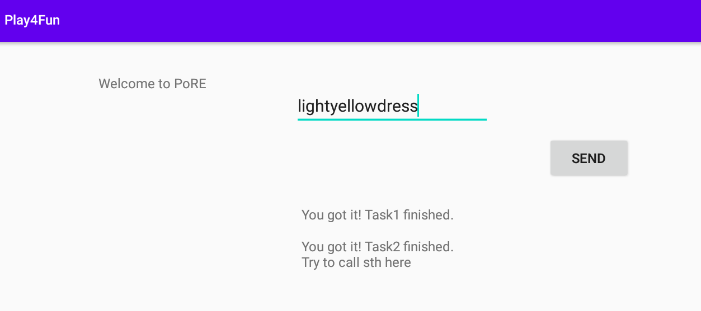  


### Task 3

通过提示（虽然没看懂提示），可以知道 playgame 中还有一个 native 函数没有调用。在 getflag 返回前调用一下该函数：
```smali
    const-string p0, "You got it! Task2 finished.\nTry to call sth here"
    
    invoke-static {p1}, Lcom/pore/play4fun/PlayGame;->skdaga(Ljava/lang/String;)Ljava/lang/String;

    move-result-object p0

    return-object p0
```
然后得到flag：SmaliIsCool。
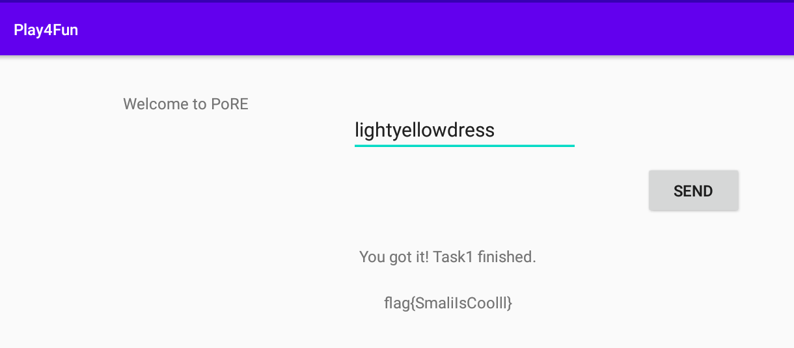  


### Task 4

通过 jadx 观察 app 运行逻辑，首先是 login 界面。
```java
    // login 界面的三个按钮点击

    // login 会调用 dologin 函数
    this.Login_Button.setOnClickListener(new View.OnClickListener() {
        /* class com.android.insecurebank.LoginScreen.AnonymousClass1 */
        
        public void onClick(View v) {
            LoginScreen.this.remember = (CheckBox) LoginScreen.this.findViewById(R.id.remember);
            // 判断是否点击 remember
            if (LoginScreen.this.remember.isChecked()) {
                LoginScreen.this.rememberme();
            }
            LoginScreen.this.dologin();
        }
    });

    // fill data 即填充原信息
    this.Fill_Data.setOnClickListener(new View.OnClickListener() {
        /* class com.android.insecurebank.LoginScreen.AnonymousClass2 */

        public void onClick(View v) {
            LoginScreen.this.fill_data();
        }
    });

    // 设置网络信息
    this.Preferences.setOnClickListener(new View.OnClickListener() {
        /* class com.android.insecurebank.LoginScreen.AnonymousClass3 */

        public void onClick(View v) {
            LoginScreen.this.setpref();
        }
    });

```

跟随运行链分析 dologin 函数：
```java
public int dologin() {
    // 处理信息
    this.username_text = this.Username_Text.getText().toString();
    this.password_text = this.Password_Text.getText().toString();
    TelephonyManager tm = (TelephonyManager) getBaseContext().getSystemService("phone");
    new UUID((long) (Settings.Secure.getString(getContentResolver(), "android_id")).hashCode(), (((long) (tm.getDeviceId()).hashCode()) << 32) | ((long) (tm.getSimSerialNumber()).hashCode())).toString();
    ((TelephonyManager) getBaseContext().getSystemService("phone")).getLine1Number();
    RestClient restClient = new RestClient();
    int statusCode = 0;
    try {
        SharedPreferences stuff = PreferenceManager.getDefaultSharedPreferences(this);
        // 调用 restClient.doLogin 函数获取 statusCode
        statusCode = restClient.doLogin(stuff.getString("serverip", null), stuff.getString("serverport", null), this.username_text, this.password_text);
    } catch (JSONException e) {
        e.printStackTrace();
    } catch (IOException e2) {
        e2.printStackTrace();
    } catch (HttpException e3) {
        e3.printStackTrace();
    }
    if (statusCode == -1) {
        SharedPreferences stuff2 = PreferenceManager.getDefaultSharedPreferences(this);
        String serverip = stuff2.getString("serverip", null);
        String serverport = stuff2.getString("serverport", null);
        Intent i = new Intent(this, PostLogin.class);
        i.putExtra("username", this.username_text);
        i.putExtra("password", this.password_text);
        i.putExtra("serverip", serverip);
        i.putExtra("serverport", serverport);
        startActivity(i);
    } else {
        Toast.makeText(this, "Login Failed", 0).show();
    }
    return statusCode;
}

```