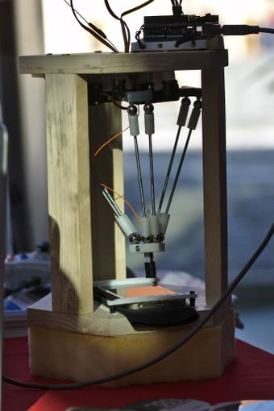
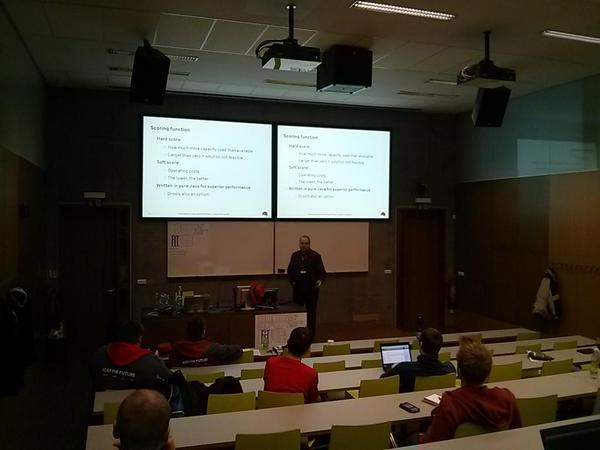

This weekend I got a chance to attend one of the leading open source developer conferences in the Czech Republic: [Developer Conference](http://www.devconf.cz/) 2015. It is organized by Red Hat every year in February in Brno. This year, the venue changed from FI MUNI to the very nice historical building of FIT VUT. I've visited this venue before, last summer, during the GUADEC (Gnome User And DEveloper Conference).

## Friday 6.

On Friday, most of the session I attended were focused on middleware and what the open source version of Red Hat's products have to offer. Here is a short list:

* Keynote -- two parts
    * Microservices -- Tom Burke
    * Red Hat JBoss Middleware -- Mark Little
* Architecting Large Enterprise Java Projects -- Markus Eisele
* Productive Java EE and HTML5 development with Eclipse
* Transactions Returning to NoSQL -- Mark Little
* How to start with Go (workshop) -- Michal Fojtík
* JBoss Windup -- Matej Břiškár
* DevAssistant -- Slavek Kabrda
* golang -- Vincent Batts
* Fabric8 v2 -- Marek Schmidt
* Two Lightning talks
    * Django Girls Rock! -- Mikey Ariel
    * Google Summer of Code -- Michal Privoznik

I enjoyed all of the sessions very much. Some of the speakers spoke not very fluent English which interrupted their presentations a bit IMHO, but everyone was very passionate about what they were doing, which compensated greatly. The atmosphere was very inspiring and motivating. If I could pick a few "best of" talks, they'd probably be Markus Eisele's talk on large Java EE project architecture and Matej Briskar's presentation of a new tool he's working on, JBoss Windup.

The Go talks I attended were also fascinating, and I will look at Go a bit more in depth in the future. The most surprising thing to me personally was the amount of influence Docker has had in all departments of programming. It is amazing, that 12 out of the 18 sessions I attended mentioned Docker in some way or the other (and most of the sessions I attended were Middleware/QA sessions).

## Saturday 7.

Most of the talks I attended on Saturday were QA themed. The PerfCake talk was a great start to the day, I bookmarked that project and will take a look at it next week. Next up were interesting talks on Arquillian Spacelift and a few other parts of Arquillian (Osmium and Droidium). Tadeas Kriz also created a physical "robot" for functional testing mobile applications.

Tapster. Photo by: [Jiri Folta](https://twitter.com/JiriFolta/status/564031697147400192)

After lunch, Lukas Krejci talked about his project Revapi -- if you manage a library/public API, check it out. Tomas Hradec presented Ceylon, which seems valuable for the future, especially thanks to the integration of Java libraries and very nice syntactical features.

And of course, the highlight of all the talks I attented at DevConf was the OptaPlanner talk by Lukas Petrovicky. Too bad I had to leave early to catch the train home because I was really enjoying the details of OptaPlanner's participation in the ICON scheduling competition. I'm hoping to catch the rest of the talk on YouTube, as most of the session were live-streamed and recorded. OptaPlanner has taken part in Google Summer of Code for the last few years and because I like the project very much, I am hoping to participate this year (I'm finally elligible!).

OptaPlanner talk by Lukas Petrovicky. Photo by: [me](https://twitter.com/oskopek/status/564054797226356736)

Here you can see a complete list of the sessions:

* Modern method for performance testing applied -- PerfCake -- Martin Vecera & Pavel Macik
* Automation of complex test scenarios via Arquillian Spacelift -- Karel Piwko
* Mobile testing challenges and solutions -- Tadeas Kriz
* 40 Jenkins plugins in 40 minutes -- Miroslav Cupak
* Evolving Java APIs -- revapi.org -- Lukas Krejci
* Ceylon -- Tomas Hradec
* Scheduling your clouds with Optaplanner: How we (almost) beat academia -- Lukas Petrovicky

## Sunday 8.

Unfortunately, for personal reasons, I couldn't attend Sunday's talks.

## Overall impressions

My impressions of DevConf are very very positive. The speakers were all professional, the venue was amazing. There were refreshments (cold snacks, soft drinks & coffee/tea) ready and always available, 5 talks simultaneously (too many interesting ones going on at the same time, as always!), a lot of lab workshops to try things out hands-on and of course the best part.. it was all for free! The only thing I found a bit lacking (I got it for free, but anyway) was the coffee -- it was terrible. But that's rather a personal incovenience than a complaint.

In general, I'm very happy I could attend and become part of the experience, and I promise I will prepare a lightning talk for next year's event. See you at DevConf 2016!
