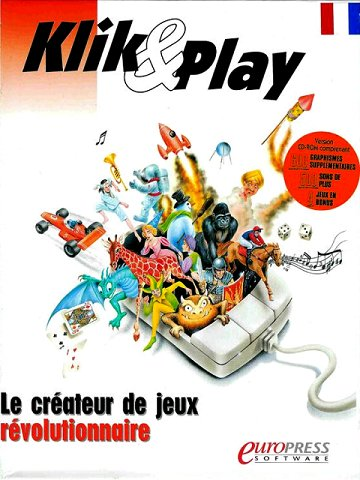

A couple of months ago, I was browsing through some old PC magazine CDs which I managed to save from the late 90s. Those are some of my oldest projects. I did have a bunch of 3d things I made with [Imagine3D](https://en.wikipedia.org/wiki/Imagine_(3D_modeling_software)) as far back as '96, but sadly I've lost all trace of them :( 
Anwyay, I knew one of those CDs contained a small video game I made back in '97, and that I submitted for a contest, so I set out to try and play it again.

Riding the time machine to 1997
-------------------------------
Back in '97, Windows 95 was everywhere, so in order to install the game, I had to run Win95 in a Virtual Machine. I settled on Win98 instead because 95 was just way too hard to deal with. Ain't nobody got time for that.

It was kinda fun to go through the whole thing. The actual installation process on a modern computer, regardless of the emulation, is way *way* faster than it ever was back then. And everything looks familiar, yet foreign. When I think about it, I must have gone through that installation process dozens and dozens of times. High-school and college students really have too much time on their hands. At least I did!
 
After it installed, a few little things cracked me up, like the nasty teal background, the bell rings when you click outside a modal dialog. I struggled a bit trying to find a graphics display device driver that would allow me to have a workable resolution and color depth. Who would have thought that PnP would still suck in 2015? Browsing through some VirtualBox messageboards, I managed to find all the missing bits and got things running. Yay!

Note: I see that [some other brave soul went through a similar thing!](https://www.youtube.com/watch?v=fMMY5AT9ITM)

The good old days of Klik&Play
------------------------------
Of course back then I wasn't writing games in C++. Hell, to this day I haven't done that, most of what I do nowadays is HTML and JS. No, I was using a program called The Games Factory (TGF), which was the newer, fancier, more powerful sequel to Klik&Play (K&P), both produced by a small [French software studio called ClickTeam](http://www.clickteam.com/about-clickteam). 

<figure class="content-image">
	
	<figcaption>Klik&Play - Back then, software came in a box.</figcaption>
</figure>

What both of these programs would offer was a graphical editor in which you could position background images, sprites, buttons and whatnot, and then they would give you some sort of scenario editor where you could say things like "move this character when I press right" and "stop the character's motion when it leaves the viewport". Simple, but incredibly powerful.

I played with K&P for a while in high school, after hearing about it in a really cool magazine called [PC Fun](http://www.abandonware-magazines.org/affiche_mag.php?mag=71&num=2580&album=oui). It was a weird time. Most people didn't have internet at home, and so in order to exchange programs or dev tips, people would go through the magazine who would publish them for all to see. After a while, somebody set up a club where we'd all send our programs to a central person, who would compile them all into one called Journal Interactif Multimedia (J.I.M) and then ship that (on 2-3 floppy disks!) to the members. It was exciting because K&P was fairly limited and limitations foster creativity, so with each issue of J.I.M., we'd all get to see what everyone was working on. It sounds so silly now.

It seems like there's quite a bit of remaining stuff online around K&P, I ran into [le Grenier de K&P](http://biblioklik.free.fr/LeGrenierDeKNP/LeGrenierDeKNP.htm), check it out for some more examples of games.

Jim
---
Anyway, at some point, PC Fun organized a contest to go with TGF's release. I decided to make a platform game. I had a lot of fun creing the graphics by hand in Paint Shop Pro (if you watch the video below, you'll see that some things look better than others!). I called the game Jim as a hat tip to the club. It was very heavily inspired from Super Mario, but the main character was a little kid who threw a ball at weird little creatures. I don't know what I was thinking, because the game was so hard. Seriously when I picked it back up recently, I couldn't believe how hard it 
was.

<figure class="content-youtube fourbythree">
	<iframe src="http://www.youtube.com/embed/ecVFHTsCt3Q" frameborder="0" allowfullscreen></iframe>
	<figcaption>A quick run through the first level. Sorry, there is no sound.</figcaption>
</figure>

Manikin
-------
During the production of Jim, I struggled quite a bit to draw the main character, because it's pretty hard to maintain a consistent figure throughout the frames of an animation. In order to help with that, I created another program (also in TGF) which I called Manikin, to help me produce animations. The program offered a few standard animations (walk, run, jump, fall, crouch) and all you had to do was draw body parts once and the program would generate all resulting animations for your new sprite. You'd then take a screenshot and save that for each animation frame. Tedious, but it worked!

<figure class="content-youtube fourbythree">
	<iframe src="http://www.youtube.com/embed/z-y0GZhf5kE" frameborder="0" allowfullscreen></iframe>
	<figcaption>Overview of how to use Manikin with the default character body parts</figcaption>
</figure>

Now what?
---------
Looking back on those things, I can't help but miss the ease of development. Of course that was balanced by the inherent limitations. Want to write or read to a file? No luck. I'm really happy that all these new HTML5 APIs allow me to create cool experiences, perhaps I should look into some of the newer HTML5 game development frameworks to get the best of both worlds: productivity and extensibility.

