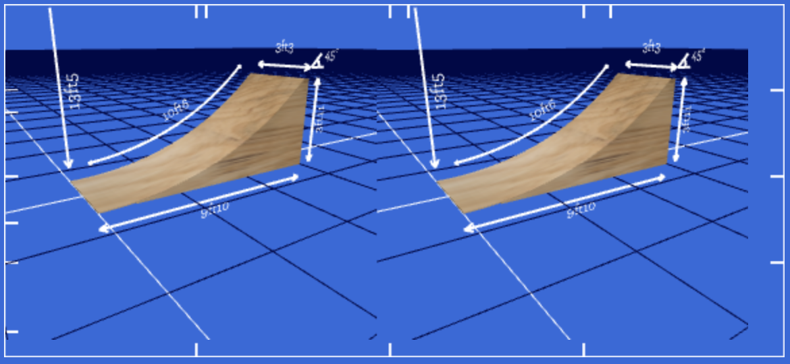

After I released [Draw Me A Kicker](/Releasing-Draw-Me-a-Kicker/), I started wondering how hard it would be to make it work with [Cardboard VR](https://www.google.com/get/cardboard/) on mobile. It turns out that there's a lot of code out there that is pretty easy to leverage, so overall it wasn't hard at all.

### The (not really) hard way
I've been going to some of the [SF WebGL](http://www.meetup.com/WebGL-Developers-Meetup/) meetups over the last few years, and as a result, I've been subscribed to one of its organisers (Tony Parisi)'s [Slideshare](http://www.slideshare.net/auradeluxe/vr-without-borders-river-webvr-april-2015) feed. I knew he'd posted some code on GitHub to help people get started, and sure enough it was [easy to find](https://github.com/tparisi/WebVR/blob/master/examples/cube-cardboard.html).

The code itself is pretty simple, it relies on two Three.js extensions:

- [`StereoEffect.js`](https://github.com/mikaelgramont/drawmeakicker/blob/master/public/scripts/StereoEffect.js) takes care of the dual rendering that VR necessitates. It just needs an existing renderer and a camera, and then it becomes the main entry point when it's time to perform the rendering.
- [`DeviceOrientationControls.js`](https://github.com/mikaelgramont/drawmeakicker/blob/master/public/scripts/DeviceOrientationControls.js) is used to translate the phone's orientation into camera control.

Both of these things [were pretty easy to integrate](https://github.com/mikaelgramont/drawmeakicker/commit/a861ab1eb505f0ede044e2b72edc6f84adfbccd9) and I got a working result in a very short time:

<figure class="content-image">
	
	<figcaption>It's pretty fun to do VR on the web.</figcaption>
</figure>

Of course at this point, the environment is a little... bare. But the 3d effect still works, so it was pretty gratifying to see it work so quickly after spending a bunch of time just productionizing the site and working on boring stuff!

### Lessons learned
Surprisingly, the hardest part was handling fullscreen mode. I hadn't played with that API much before, and while I understand the security concerns behind its design, it just kind of sucks to use: you can only go into fullscreen from the exact event listener that is triggered when clicking an element. You can't use `CustomEvent` or any kind of pubsub, it has to be done right there and then in the listener. And then the API doesn't give you a way to tell whether you're in fullscreen or not. You end up writing crap like this:

```javascript
// this.rendererEl is the DOM element three.js renders to.
var isFullScreen = (
	window.innerHeight == this.rendererEl.clientHeight &&
    window.innerWidth == this.rendererEl.clientWidth
);
```

There are worse problems of course, I should probably be glad it's 2015, and the API actually works :)

### The outcome
A few things stand out. The good first:

- it's pretty damn exciting to see something take form in front of you!
- of course, this is old news now, but it's so cheap to get started if you have a phone!

And then there's the bad:

- While things do work, it's all a little bit laggy. By that I mean that there's slightly perceptible delay between moving your head and seeing the response. I doubt there is much that can be done to reduce latency at this level, especially considering the scenes I deal with are really quite empty.
- If you're not engaged with the 3d scene and you start to focus on the screen, you can see the pixels. Of course that's dependent on your hardware, but I doubt there's a very big difference between phones at this point.
- Sometimes, the device orientation data can get wonky and the camera will start drifting. Not a great experience, as you'll feel a little uncomfortable.
- As far as I can tell, there isn't a standard way to access controls through Carboard on the web (I'm thinking of the magnet). Some people claim conductive tape can be leveraged. Maybe I'll give that a shot!
- The phone tends to shut the screen off pretty quickly as it doesn't know you're interacting with it, and there's no API for that.

To address that last point, I was thinking of hacking something with a `<video>` element. Turns out serendipity brought [Boris Smus's WebVR boilerplate](https://github.com/borismus/webvr-polyfill) project to my attention, and he's already addressed it.This was great news because I wasn't going to be able to find a solution to the iPhone version for a while I think. The [wakelock](https://github.com/borismus/webvr-boilerplate/blob/master/src/wakelock.js) code is pretty straightforward.

WebVR boilerplate also implements some kind of motion prediction that should also alleviate some of the lag, I look forward to digging into that.

### Conclusion
I may have to rewrite my implementation of the VR stuff to bring in WebVR boilerplate. I'm really glad to see that project exists. I feel like it's gonna take me a little while to get my bearings around this new space, and that project should help learn it.

More stuff on the TODO list!