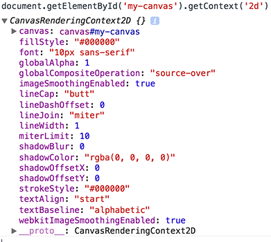
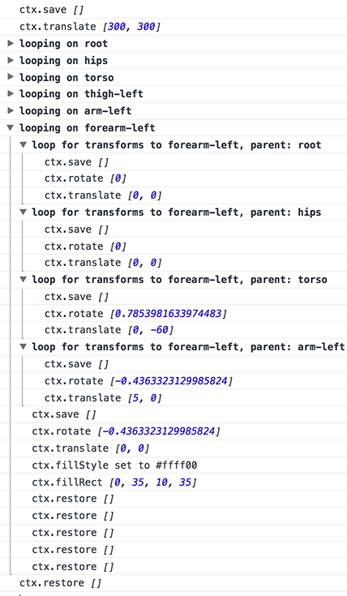

As I was working on a port of [my old Manikin project](https://github.com/mikaelgramont/manikin) to the web, I quickly regretted deciding to build all the drawing code from scratch. You might think 'how hard can it be to build a hierarchy of objects and render that to canvas?'. As it turns out, if you're only going to use canvas transforms to do it like I am, it can be pretty confusing. So how do you debug that stuff?

 There isn't much debug support from the Chrome tools since they [removed](https://code.google.com/p/chromium/issues/detail?id=475808) the [Canvas Inspector](http://www.html5rocks.com/en/tutorials/canvas/inspection/). I didn't get much luck with the Firefox Canvas Debugger either, it seems like it should be called WebGL debugger as it looks to me like that's all it is for (which is still great but no help for me here).

## Now what?

The reason why debugging canvas apps is hard is that there isn't much to inspect when things go wrong. You have your `canvas` element, but there isn't much to look at there. Then you have your `context`, which you get through `document.getElementById('my-canvas').getContext('2d')`, and that does have some properties, but you can't see method calls.

<figure class="content-image">
	
	<figcaption>A few properties are available on the context object.</figcaption>
</figure>

Wouldn't it be nice if you could get a log of all the method calls and property changes on the context object?

## First attempt at a solution

Well it turns out that you can get those things through the use of a proxy object and some `apply` magic:

```javascript
let instrumentContext = (ctx) => {
	/*
	  Substitute our proxy for the original object.
	  We'll return the proxy at the end of the function.
	*/
	let _ctx = ctx;
	ctx = {};
	
	ctx.save = () => {
		console.log('ctx.save');
		_ctx.save();
	}
	ctx.restore = () => {
		console.log('ctx.restore');
		_ctx.restore();
	}
	ctx.translate = (...args) => {
		console.log('ctx.translate', args);
		_ctx.translate.apply(_ctx, args);
	}
	ctx.rotate = (...args) => {
		console.log('ctx.rotate', args);
		_ctx.rotate.apply(_ctx, args);
	}
	ctx.fillRect = (...args) => {
		console.log('ctx.fillRect', args);
		_ctx.fillRect.apply(_ctx, args);
	}

	return ctx;
}
```

This would be used in the following way:

```javascript
let ctx = document.getElementById('my-canvas')
	.getContext('2d');
ctx = instrumentContext(ctx);

ctx.save();
ctx.rotate(45);
ctx.translate(10, 10);
ctx.fillRect(20, 20, 50, 50);
ctx.restore();
```

And that would result in the following logs in the console:

```javascript
ctx.save
ctx.translate [20, 20]
ctx.rotate [25]
ctx.fillRect [20, 20, 50, 50]
ctx.restore
```

See the [live example on CodePen](http://codepen.io/mikaelgramont/pen/avjxMv/).

It gets the job done so far, but several things are wrong here:

- for every method I want to snoop into, I'm repeating the same code.
- it doesn't track property changes, and worst of all, those are actually lost, meaning that doing a `ctx.fillStyle = '#ff0000'` doesn't actually change the real context object, meaning that instead of painting with red, we stay with whatever color was previously used, likely black.

To solve the first problem, we can just create a whitelist of functions to instrument, and loop over those:

```javascript
let fnWhitelist = [
	'save', 'restore', 'translate',
	'rotate', 'fillRect'];
fnWhitelist.forEach((fnName) => {
	ctx[fnName] = (...args) => {
	  console.log('ctx.' + fnName, args);  
	  _ctx[fnName].apply(_ctx, args);
	};
});
```

See the [live example on CodePen](http://codepen.io/mikaelgramont/pen/dYjEbv/).

## Round 2: observers!

It would seem like Object.observe would be a good solution to the second issue. Something along the lines of:

```javascript
Object.observe(ctx, (changes) => {
	changes.forEach((change) => {
		if (change.type != 'update') {
			return;
		}
		_ctx[change.name] = ctx[change.name];
		console.log(`ctx.${change.name}`,
			change.object[change.name]);
	});
});

ctx.save();
ctx.translate(20, 20);
ctx.rotate(25);
ctx.fillStyle = '#ff0000';
ctx.fillRect(20, 20, 50, 50);
ctx.restore();
```

See the [live example on CodePen](http://codepen.io/mikaelgramont/pen/KdBLdL/).

The problem with this is that the change notifications are asynchronous and they happen at the end of the microtask at hand. That means that property change notifications will all trigger after the rest of the code has run, and in the case above, the `fillStyle` change won't be applied until after the call to `fillRect`. This actively makes debugging more confusing than it was!

To make things clearer, adding this at the bottom of our list of instructions will illustrate things further:

```javascript
setTimeout(() => {
  ctx.fillRect(20, 20, 50, 50);
}, 0)
```

This results in a little red square rendered on top of the initial black one. That's because the `setTimeout(x, 0)` pushed the call to `fillRect` to the next tick, which happens after the notifications have all been fired. For more information on this, check out [Jake Archibald](https://twitter.com/jaffathecake)'s [excellent article on tasks, microtasks, queues and schedules](https://jakearchibald.com/2015/tasks-microtasks-queues-and-schedules/). There's a whole new world of pain out there that I didn't suspect before reading that.

## Round 3: property change interception through setters

Much in the same way we intercepted method calls, we can do the same thing through the use of property setters:

```javascript
  let propWhitelist = ['fillStyle'];
  propWhitelist.forEach((propName) => {
		Object.defineProperty(ctx, propName, {
			set: function(value) {
			 	_ctx[propName] = value;
				console.log(`ctx.${propName} set to ${value}`);
			}		  
		});    
  });
```
See the [live example on CodePen](http://codepen.io/mikaelgramont/pen/BoPezq/).

## Victory... ?

This allows us to capture things like the following:

<figure class="content-image">
	
	<figcaption>Property changes and method calls are logged.</figcaption>
</figure>

Pretty nice. I think I'll try to build a little library to help with this. Hopefully that'll be helpful to someone before the Chrome team re-releases the Canvas Inspector as an extension! :)

Some nice features would be a possibility to convert rotation angles from radians into degrees on the fly, use a specific logger object, filter out the things that should be logged. I can also imagine replaying actions step by step, and visualizing canvas transforms.