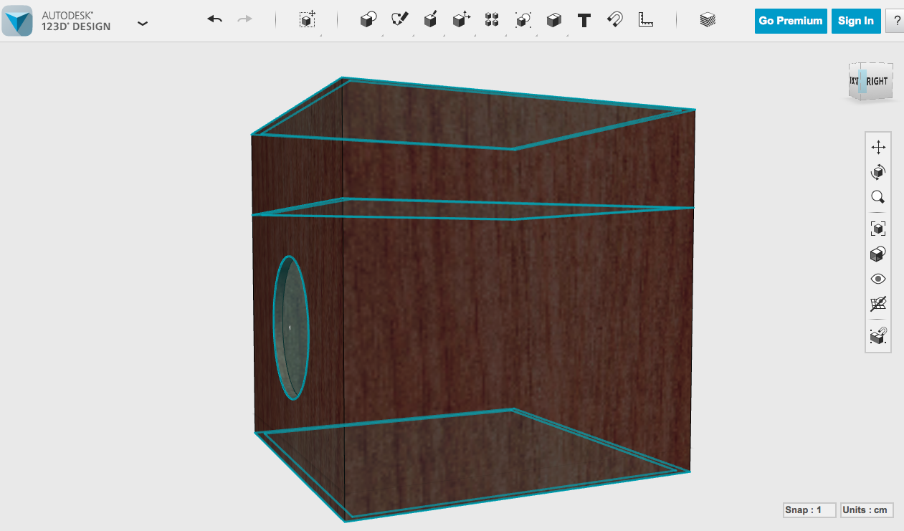

# Sandstorm Box

The Sandstorm Box is part of a larger art project called Interactive Picture Frames.
The Interactive Picture Frames project consists of a collection of five picture frames, which combine photographs with responsive technology (sensors and actuators), each frame aiming to affect one of the five senses. That is, these frames presents still images and associate the idea or the meaning of each image to a experience of sight, sound, smell, taste or touch.

The Sandstorm Box is the project that brings up the experience of touch. 
The frame holds a picture of a sandstorm and a box with a opening is positioned right under it. This box has a false top, where all the hardware is positioned on. When the user introduces a hand inside of the box, a sensor detects that motion. Then, a microcontroler activate "fans" that blows the sand sitting on the bottom of the box. As long as the user keeps a hand inside of the box, she will experience the sand coliding with the hand, simulating tactile experience of a contained sandstorm.

There is no specific reason for this project to exist rather than we are leaving on an exciting moment that this type of technology is made available, simplified and cheap. It CAN be done and that's awesome!  

Certainly, it would be great to see this project take form and place in the "art world", to see people of all ages and backgrounds playing with it and to start a discussion about new ways to combine technology and photography. But so far this is just a school project and its primary function is to learn the technology, practice executing a complete project and documenting it on my own. 
By the end of the semester, I will present it to my classmates and I hope they can have fun with it.
Also, I will report all my steps to build this project in this blog so conceivably it can inform anyone working in a similar project.

###Parts list
1. Photo of a sandstorm (size to be define)
2. Picture frame (size to be define) + 15x15x15cm box
3. Quadcopter blades
4. Pcs Motors
5. Water Pipes (or laser cut customized ones)
6. Arduino Uno
7. PIR Sensor (Rev B)
8. 9v battery
9. Switch

!(../images/blades.png)

In the place of the fans I will try to use quadcopter blades. They blow a lot of ar and the kit with blades and 2 pcs motors is not expensive. 
Whater pipers will be used to channel the air.

###Materials List
1. Masonite
2. Acrylic
3. Sand (light sand?)
4. Nylon

A first prototype will be made with masonite but the ideia is to make the final prototype in clear acrylic so the user not only feels the sand moving inside of the box but also sees it.
A nylon adjustable sleeve will hang from the opening. By fastening it around the arm, the user will prevent that sand comes out of the box.

Eventually, some sand might come out and that will need some maintainance. Also, depending on the location the project is been show, humidity might affect the way sands blow. 

