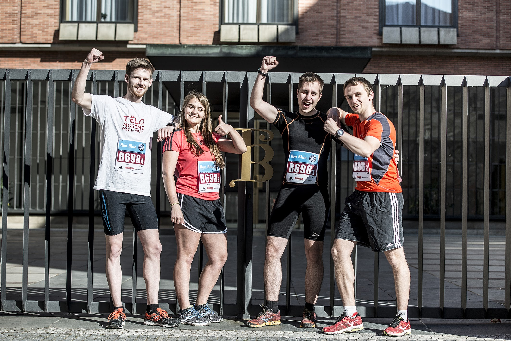

Another few months went by fast and it's already summer break again. All my exams are finished,
all that's left are the two programs I have to write in order to get the last few credits.

A lot happened during the last few months:

* a couple of friends and me took part in the Volkswagen Prague Marathon 2016 Relay as part of the University Cup run

* I got accepted into Microsoft's summer internship program and I'll be working full-time at MSFT during the summer in Oslo, Norway!
* My adviser and me agreed on my bachelor thesis topic and I'm slowly starting to work on that too
* Matej and me started to write down a short summary of last year's biking trip from [Bratislava to Salzburg](https://goo.gl/photos/NYqAx6G9M4tePmwa9), which I'll add a link to here shortly

The past few months have been very hectic and I'm excited to take few days off and go hiking with Lukas, Tom and Matej into Krkonose.
Next academic year, there will be less exams for me and more work on my bachelor thesis and other projects (and hopefully more free time). Have a nice summer!

