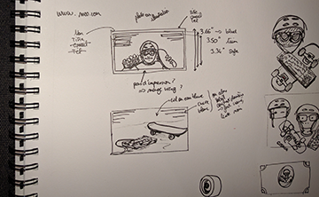
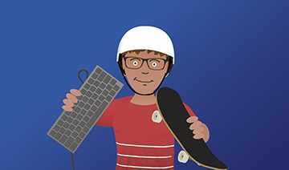

After my recent move back to France, I realized I needed to toss all my business cards since they were obsolete, and perhaps get new ones. I considered doing something simple and sober, [name and title on some fancy paper](https://www.youtube.com/watch?v=cISYzA36-ZY) but then for some reason I thought I'd try something a little more fun and unusual. My vector self on a business card.

### Vector drawing is fun.

I played with Corel Draw (version 3!) a lot when I was a kid, so I have a decent grasp on the workflow and tools involved, and I thought doing a bit of vector drawing was going to be a good opportunity to finally get into [Adobe Illustrator](http://www.adobe.com/products/illustrator.html), but I didn't really want to subscribe to their Creative Cloud stuff. Also [Inkscape](https://inkscape.org) refused to work, so instead I bought a licence for [Affinity Designer](https://affinity.serif.com/en-gb/designer/). It turns out it's a good product and it does what it does fairly well, but it's also a bit limited. No perspective deformation or "fancy" things like that.

### Drawing what?

Anyway. Since I'm really into two things, board-riding and keyboard-smashing, I figured I'd try to show those two aspects of me in the picture.

<figure class="content-image">
	
	<figcaption>Exploring a couple of avenues. <a href="../images/vector-me/hand-drawing-big.png">Full version</a></figcaption>
</figure>

### The final thing

<figure class="content-image">
	
	<figcaption>What I look like in vector. <a href="../images/vector-me/finished-drawing-big.png">Full version</a></figcaption>
</figure>

It's not amazing, but it's close enough, and quirky enough to be fun and memorable on a business card, which is a good thing to have. Of course that wouldn't fly if I was a lawyer or if I had some kind of grown-up job, but I'm a pixel pusher, so I think it's alright.

I haven't had them made yet, no rush. Also I'm not sure what fonts to use. Ugh. I hate picking fonts!