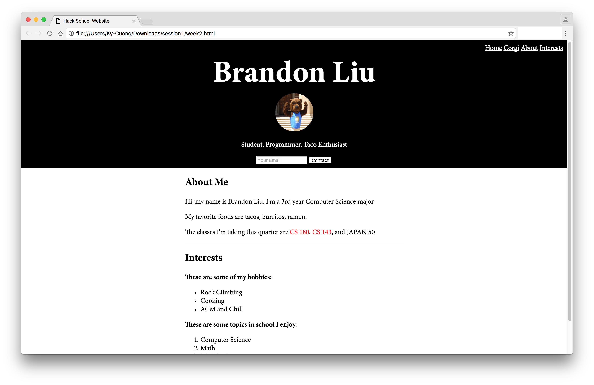

We all hope you enjoyed your first Hack School session! As part of our
commitment to your success, we'll post written versions of all the material
covered. For this first session, we learned HTML and CSS as part of
constructing a personal webpage. You'll want such a page as a portfolio to show
off your work to recruiters.


### Tools for the Job

A plain text editor is needed for this. We want to write plain text without any
formatting applied, and we want do so in a monospaced (typewriter) font to let
us vertically align code for readability.

Please download [Sublime Text](https://www.sublimetext.com/3) (or a text editor like Atom, Notepad++, etc. of
your choice).

The last thing we'll need is a web browser. Google Chrome and Safari are
our recommendations to ensure that you're seeing support for the latest
and greatest.


### Debugging Tips

Many people last night encountered errors along the way. Don't worry, this is
perfectly normal. Computers are very particular in what they expect. If your
webpage wasn't displaying correctly last night, here were the most common
causes:

* CSS rule declarations were missing a semicolon. For example: `text-align: center` instead of `text-align: center;`

* The HTML and CSS files were in different folders, which caused the wrong CSS file to be included via the `<link>` tag (if one was found at all). It probably looked like edits were having no effect, even after saving the file.

* Edits were not saved, and so your web browser was rendering an old version of the files. Be sure to save before re-loading the webpage in your browser.

* HTML tags or attributes were misspelled. For example, `tite` instead of `title`, `herf` instead of `href`, and so on.

* Closing quotes were missing around an attribute's value in a tag. For example, `rel="stylesheet` instead of `rel="stylesheet"`.


### Style Tips

In English, we're told to avoid run-on sentences, overly long paragraphs, and bad document formatting. A similar set of
recommendations applies to code.

To assist us in assisting us, please:

* Use 2 or 4 spaces consistantly to indent your code like so:

```html
<!DOCTYPE html>
<html>
    <head>
        <link rel="stylesheet" type="text/css" href="mystyle.css" />
        <!-- This is an HTML comment to let you explain things to yourself.
             It will not appear on the page itself -->
    </head>
</html>
```

Notice the visual structure that this establishes. We say that tags are
"nested" inside of each other. They "encapsulate" each other, so that we can
see what is part of what.

A CSS example:

```css
p {
    // This is a CSS comment. Use them to explain things.
    text-align: center;
}

.alert-section a {
    color: blue;
}
```

Notice that there is always a space before the opening curly brace (`{`),
which is also on the same line as the selector.


### Recommended References

As you go along, you'll likely need to look up many things. 
Here are some of the best places to do so: 

* [W3Schools' HTML Tutorial](http://www.w3schools.com/html/default.asp)
* [W3Schools' CSS Tutorial](http://www.w3schools.com/css/default.asp)
* [Mozilla Developer Network (MDN) HTML reference](https://developer.mozilla.org/en-US/docs/Web/HTML)
* [Mozilla Developer Network (MDN) CSS reference](https://developer.mozilla.org/en-US/docs/Web/CSS)


### What is HTML?

HTML stands for HyperText Markup Language. It's the language we use to tell the web browser what our website looks like. CSS stands for Cascading Style Sheets. We use CSS to describe the style of our website (spacing, colors, fonts, etc.). We use it to make our HTML pretty!


### How to Write HTML

HTML comprises of content surrounded by "tags", which have certain properties (or attributes). Each tag expresses its content differently and means something else in the context of the document. Tags usually have an "open tag" (`<p>` and a "close tag" (`</p>`), with the content in between them. Tags can have an **attribute** with an assigned value (`<p id="my-paragraph">`)


### Useful Tags

Now let's see some of the most useful HTML tags.


#### Header Tags

The header tag can either be from 1-6, with one being the most important (biggest to 6 being the least important (smallest). Header tags are used to express section titles/subtitles and other important information.

`<h2>About Me</h2>`

Other header tags: `<h1>`, `<h2>`, ..., `<h6>`


#### Paragraph Tags

The `<p>` tag is a paragraph tag, and is used to hold text, even if it's just a line.

`<p>Hack School is a quarter long course that will teach you the fundamentals of web development.</p>`


#### Image Tags

The `` tag is used to insert images. `` tags generally have a src attribute with a value of a URL to an image.

You can use direct URLs, such as the images you can find on google.

``

You can also use relative URLs if the image file is in a local folder.

``

**Note**: The `` tag does NOT have a closing `</img>` tag.


#### Input Tags

The `<input>` tag is used to get input from users. It has an attribute called *type* which indicates the type of value you want the user to input. Some possible values for this are "text", "number" and "email". `<input>` tags can also have a placeholder value that will show up in the box as a hint to the user.

`<input type="text" placeholder="Your Name"`


#### Divider Tags

A `<div>` tag is used for stylistic purposes. It displays no content. We use this tag to divide our HTML document into sections so that it doesn’t remain one big blob. Divs are usually accompanied by a class or id attribute.

```html
<div id="bestDivID" class="bestDivClass">
  <!-- Content -->
</div>
```


### Basic Document Structure

HTML documents are usually structured like this:

```html
<!DOCTYPE html>
<html>
    <head>
        <title>Website Title</title>
        <link rel="stylesheet" type="text/css" href="mystyle.css" />
    </head>
    <body>
        <h1>Welcome to my Website!</h1>
    </body>
</html>
```

The first line, `<!DOCTYPE html>`, tells the web browser how to interpret the
page -- like an HTML document. All of the website content should be between the
`<html>` and `</html>` tags. Information between the `<head>` and `</head>`
tags are for information _about_ the document, like title, meta data, CSS
links, scripts, etc., and are not displayed. Conversely, all content between
`<body>` and `</body>` is to be displayed.


## The Project

### Getting Started

Create a folder to put your files in, like `hack_school_week1`. Make sure when you edit your HTML and CSS, all of the files are in this folder. Name HTML files by appending ".html" to the end of them (e.g. `mywebsite.html`) and name CSS files by appending ".css" to the end of them (e.g. `mystyles.css`). Opening the HTML and CSS files in a plain text editor, like [Sublime Text](https://www.sublimetext.com), will let you edit them. Opening your HTML file in a web browser will let you see your website.


### Let's Introduce Ourselves

We'll start off simple by making a website with a title and a header.
Copy the layout below and put your name in `<h1> </h1>` tags for the world to see.

```html
<!DOCTYPE html>
<html>
  <head>
    <title>Hack School Website</title>
  </head>
  <body>
    <h1>Your Name</h1>
  </body>
</html>
```

Save your changes to an html file like `hackschool.html` then open it up in your web browser.

<!-- You should now see your shiny new website // TODO IMAGE -->


### Show Off Your Looks

Now let's show the world how awesome we look by adding an image to our page. First we need to get a picture of ourselves either from a website like facebook or on our computer. If you're using an online image, you just need the url like this: ``

If you're using a picture saved on your computer, then copy it into the same folder as your HTML file then use the filename as your image source: ``

We also want to put our header in a `<div> </div>` tag so we can start separating our content.

The resulting file should look like this

```html
<!DOCTYPE html>
<html>
  <head>
    <title>Hack School Website</title>
  </head>
  <body>
    <div id="header">
      <h1>Your Name</h1>
      
    </div>
  </body>
</html>
```

<!-- // TODO after every html, put an image -->


### Say Something About Yourself

Now that we've been dazzled by your looks, let's get to know you more.
Use the `<p> </p>` tag to add a short description about yourself.

`<p>Student. Programmer. Taco enthusiast. </p>`


### Add a Contact Field

With an award winning website like this, people are going to want to contact
you, so let's give them the option. We're going to use the `<input>` tag to
make a small contact form.

Below your short description, add the following lines: 
`<input type="email">`
`<button>Contact me</button>`

We set the `<input>` tag's "type" attribute to "email" because we want the user
to give us their email address. If we wanted them to leave their phone number
then we would change our "type" attribute to "number".

Now we know that the form is made for emails, but the user has no idea. Let's
make it clear to them by adding a placeholder attribute, which will give them a
hint. Update your `<input>` tag as follows:

`<input type="email" placeholder="Your Email"`

**Note**: This form doesn't actually do anything since we require JavaScript to
add the actual functionality. No worries, you'll be learning JavaScript next
week!

Your site should now have the following code:

```html
<!DOCTYPE html>
<html>
  <head>
    <title>Hack School Website</title>
  </head>
  <body>
    <div id="header">
      <h1>Your Name</h1>
      
      <p>Your description</p>
      <input type="email" placeholder="Your Email">
      <button>Contact me</button>
    </div>
  </body>
</html>
```

<!-- And look like this: //TODO -->


### Spice It Up with CSS

CSS stands for Cascading Style Sheets, and it “is used to describe the
presentation of a document written in a markup language” (Wikipedia). It
basically makes your website look really pretty. It can be used to add color,
change element sizes and format your page.

Our website so far is pretty great, but it lacks style. We need to
differentiate ourselves and really put our personality into it. That's what CSS
allows us to do.


#### How Does CSS Work?

```css
selector {
  property: value;
  property: value;
}
```

The selector specifies exactly what elements we wish to style. The property is the specific thing we want to change for those elements. The value is the actual value we want for that property.


#### Selectors

You can select by element, by simply typing in the element. Note that this will select all elements that are of your selector type.

```css
p {
  color: white;
}
```

You can select by the class attribute (period)

```css
.class-name {
  color: blue;
}
```

You can select by the id attribute (pound sign)

```css
#id-name {
  color: red
}
```


#### More on 'class' and 'id'

HTML elements can have a class and/or id attribute that can be used for CSS.
**class** can be applied to multiple elements while **id** can only be applied to one element.

The following is valid because the id's are unique:

```html
<h1 class="my-class" id="header">
  Hi
</h1>
<p class="my-class" id="paragraph">
  I love paragraphs
</p>
```

While the following is invalid because the same id is used for multiple elements:

```html
<h1 class="my-class" id="same">
  Hi
</h1>
<p class="my-class" id="same">
  I love paragraphs
</p>
```

Divs are usually accompanied by a class or id since they are mainly used for stylistic purposes.

```html
<div class="column" id="about-me">
  <!-- Snazzy column -->
</div>
```


#### Setting up for CSS

We can actually add style within our HTML file, but we like to keep our styles
separate from our HTML to keep our files more organized.

First, create a file in the same folder as your HTML called `styles.css`.

In your HTML file, after your `<title>` tag in your `<head>`, add the following
line: `<link rel="stylesheet" type="text/css" href="styles.css">`

This links our CSS file to our HTML file, so our web browser can know where to
look for our styles.

Your HTML should look like this:

```html
<head>
    <title>Hack School Website</title>
    <link rel="stylesheet" type="text/css" href="styles.css">
</head>
```


#### Re-sizing our image

In your `styles.css` file, add the following lines to change your image size:

```css
img {
  width: 100px;
  height: 100px;
}
```

We want to modify the image so we use `img` as our selector. We adjust the
width and height properties to a smaller size of 100px.

There's a problem here though. Since our selector is `img`, we have selected
every image on the page. If we haev other images on the page, they will also be
re-sized. What we really want is to only target our profile image, so let's fix
that.


#### Select by id

In your HTML file, let's add an `id` attribute to your profile image. Update your img tag:
``

Now we can select by this id using the `#` character in our CSS. Update your CSS file as follows:

```css
#prof-pic {
  width: 100px;
  height: 100px;
}
```

Now we only change the size of our profile image, so any other images on our page are safe.


### What We Have So Far

<!-- // TODO image -->

Right now we have a basic page containing a header, image, short description
and a mini contact form. We've learned the basics of HTML, but we still don't
know much yet. We learned how CSS works but we're not proficient yet.

In the following section, we'll be adding more content to our website via HTML,
and adding more styles in the CSS.

Since you already know the basics of HTML and CSS, the next section will be a
little bit more fast paced.


### What We're Going to Add

For our personal website, we're going to add two main sections.

1. About
  * Name, major, year
  * Where you're from, your favorite color, food.
  * Classes you're taking this quarter
2. Interests
  * Your hobbies
  * Clubs you're interested in


#### Breakdown of the Page

We'll have one div that contains all our main section content. Each section will then live in its own div.

```html
<div class="container">
  <div id="about">About section goes here</div>
  <div id="interests">Interests section goes here</div>
</div>
```

<!-- // TODO slide 32, breakdown of page format -->

Restructure your HTML to look like this:

<!-- // TODO html structure with divs -->


#### About Me

We can add a sub-title using the `<h2>` tag. Then, we can use `<p>` tags to inert some information about us. This all lies within our "about" `<div>`.

```html
<div id="about">
  <h2>About Me</h2>
  <p>Hi. I'm Brandon. I'm a 3rd year at UCLA, studying Computer Science.</p>
  <p>I'm from San Diego even though I was bron in Minnesota.</p>
  <p>My favorite foods include tacos, burritos, ramen, and just about everything else.</p>
</div>
```


#### Lists

We don't always want paragraphs and headers. Sometimes we want to make a list of things. For this, we can use the `<ul>` and `<ol>` tags.
An unordered list (`ul`) has no numbers, just bullets. It is contained within `<ul>` and `</ul>` tags.

An ordered list (`ol`) is used for ordering, and it automatically numbers list items.

To populate our list, we use `<li></li>` tags, which stand for list items.

Example:
```html
<ol>
  <li>First list item</li>
  <li>Second list item</li>
</ol>
```


#### Interests

Now that we have filled out our "About" section, we can move onto your "Interests" section. We will tell our users what we like to do outside of school, as well as what topics we're interested in. We'll be using the list tags for this. All of this will be in our "interests" `<div>`.

```html
<div id="interests">
  <h2>Interests</h2>
  <p>Here are some of my hobbies:</p>
  <ul>
    <li>Rock Climbing</li>
    <li>Cooking</li>
    <li>ACM</li>
  </ul>
  <ol>
    <li>Computer Science</li>
    <li>Engineering/Tech Management</li>
    </li>Not Physics</li>
  </ol>
</div>
```

We add our hobbies as an unordered list since we like them all equally. However, our school interests are listed in order of preference, so we use an ordered list.


#### Anchors

By this point our webpage will have some decent content, but it would be nice to perhaps add a link to our Facebook, LinkedIn, or Twitter!
We’ve gone through images, but not anchors! Anchors are similar to images except that instead of putting in a URL to an image, we put a URL to a website. There is an opening AND closing anchor tag, and whatever lies in between is clickable.

Example: `<a href="www.google.com">Click Here to go to Google</a>`

We're going to use images and anchors to create a footer for our webpage.


#### Footer

Underneath your container div, add a div with the id="footer". Here, you can add links to your social media accounts.

```html
<div id="footer">
  <a href="github.com/yourusername">Github</a>
</div>
```

In our anchor tags, we acn replace the text with an image. Simply add an `` tag on the inside.

Example: `<a href=“github.com/yourusername”></a>`

Finally, let's clean up our footer by resizing our footer images.

First, let's add a class attribute to our logos.
``

**Note**: The ordering of our attributes does not matter.

Now, in our `styles.css` file, we can change the width and height of our images:

```css
.logo-img {
  width: 40px;
  height: 40px;
}
```

If you'd like to closely inspect and test changes to your page,
it's worth learning how to use Chrome DevTools. 
A quick way to get started is Google's [official documentation](https://developers.google.com/web/tools/chrome-devtools/). A more in-depth tutorial
can be found with [CodeSchool](https://www.codeschool.com/courses/discover-devtools).


### Deep Dive into CSS

Now we've finished most of our HTML, but our webpage still doesn't look beautiful enough. With CSS, we can transform our webpage into a work of art!


#### Styling Our Header

Let's change the size of our header

```css
h1 {
  font-size: 80px;
}
```

Now let's change some colors to make things less boring. We'll select our "header" by id and give it some style.

```css
#header {
    text-align: center;
    background-color: black;
}
```

<!-- // TODO image -->

Oh no!, our text is now invisible :( . Thankfully, it's a quick fix.
We just need to add `color: white;` to our #header styles to change the text color.

```css
#header {
    text-align: center;
    background-color: black;
    color: white;
}
```


##### Positioning

An element actually has several parts to it.


1. The actual content.
2. Padding: Space around the content that is “cushion” from the inside.
3. Border: A border around the element that you can also style.
4. Margin: Sets white space outside the border.

We can visualize all of this using the *CSS box model*
(image from [here](http://www.mandalatv.net/itp/drivebys/css/)):


In general, margins are outside of the element/block while padding is on the inside.
You can use margin to separate the element from things outside, and padding can be used to move content away from the edges of the block.

If you look back at our `<h1>` tag, you’ll see that there’s a margin that we don’t want. And there’s also a margin on our <body> that we don’t want either!
We didn’t put this there. It’s a default styling that can be overridden.

```css
body {
    margin: 0px;
}
```

Then do the same for our `<h1>` tag

```css
h1 {
    margin: 0px;
}
```

Things look almost good. But the input field and button are too close to the bottom. It’d be nice if there were some *padding* between that and the edge of the element.

```css
#header {
    padding-bottom: 10px;
}
```

If you just do padding or margin on it’s own, it adds it to all sides. If you want to select a specific side (top, bottom, left, right) you add a dash and the direction.

We're almost done with our header, but we can make some final touches.
We can add the following attribute to our image: `border-radius: 50%;`

And if you want to add some padding or margins here and there to make your page look a bit prettier
Suggestions: make the spacing between your picture, <p> tag, and input fields the same.


#### Moving Onto the Main Content

The main content includes everything including and within our “container” div.
That includes, the `<div id=“about”>` and the `<div id=“interests”>` and any other div containing content.


##### Creating a Column for Our Content

With two (or more) sections of information, we’ll stack them on top of each other. We’ll give each `<div>` the same class “column”, since they’ll form one single column. They still have different ids -- “about” and “interests” though!

`<div class=“column” id=“about”>`
`<div class=“column” id="interests">`

Since we want to keep them looking like columns, the width we want will be 40%, plus or minus a few percent to your liking.

```css
.column {
    width: 40%;
}
```

To refine how our column looks a bit, we can add a line separating each one. We also want to keep our text in the column itself top-aligned (using vertical-align), that is, it is “stuck” to the top.

```css
.column {
  width: 40%;
  text-align: left;
  border-bottom: 1px solid black;
}
```

Align makes our text “align” itself to the direction which we specify. That way if we center our div, the text will stay aligned.

Since the header is centered, it would probably look nice our columns were
centered too! There’s an issue though, we cannot just center the text within
our div, because our container div is split into several divs! A way to center
a div within a div is as follows:

```css
.column {
    margin: 0 auto;
}
```

This automatically sets margin to the sides to push the div to the center.


##### Centering Things in HTML

Centering things in HTML is actually pretty tough.
For example, it takes different CSS attributes to center text within a div versus centering a div within a div.
It’s actually not necessary to memorize how to do it. Often you can quickly Google the solution to it.


##### A CSS Tip: Selectors

Let’s say that we want to bold the paragraphs in our “Interests” section. One way would be to assign them both a class, and then to give that a font-weight attribute with the value bold.

Here’s another way.

```css
#interests p {
    font-weight: bold;
}
```

We didn’t make everything in #interests bold. Nor did we make all paragraphs in
general bold. We made all paragraphs within #interests id bold. This particular
CSS syntax scopes the selection to paragraphs within the `#interests` id. It’s
pretty useful, especially when you only want to style particular things.


##### Using `<span>` Tags to Style Inline Text

Now in my list of classes, I want to be able to highlight somehow which classes are my CS classes and which are GEs to help people easily differentiate. This can be done by adding html `<span>` tags.
The `<span>` tag basically allows you to group inline elements and assign a class or id, which you can then style with CSS.

<!-- Here's how we want it to look: // TODO image, slide 62 -->

The `<span>` tags go around each snippet of text that you want to style a certain way, and classes will be added for each style you want to add. In this case, we want the CS classes to be styled a certain way and the GEs to be styled a certain way, so we make classes for each accordingly.

```html
<p>The classes I'm taking this quarter are <span class="cs-class">CS180 (algorithms)</span>, <span class="cs-class">CS143 (databases)</span>, and <span class="ge">JAPAN50 (Japanese Civilization)</span>. </p>
```

We want our GE class names to be blue:

```css
.ge {
  color: blue;
}
```

Meanwhile, we want the CS classes to be red and bolded (which can be styled using the `font-weight` attribute):

```css
.cs-class {
  font-weight: bold;
  color: red;
}
```


#### Finalizing the Footer

Now that the header and main section of our webpage is finished, all that’s left is the footer. We also would like to center our footer.
And because it’s always nice to play around with positioning, perhaps a margin here or padding there would be nice!

```css
#footer {
    text-align: center;
    margin-top: 20px;
}
```


#### Adding a Navbar

A navbar is a useful tool for people on your site to navigate to different
parts of the page, and perhaps also different webpages. While navbars are
sometimes the first things built, I wanted things more set in stone before we
tried to put it together. And the cool thing is now that we know HTML and CSS,
we can hopefully start piecing them both together at once.

HTML actually has a pretty neat tag called <nav> that is more of a semantic, which is used to create navbars.

Example:

```html
<nav>
    <a>Your navbar content goes here.<a>
</nav>
```

Your navbar content will be listed out on the same line, one after the other. It’s a bit like an `<ol>` or `<ul>`, and `<a>` tags are generally used like `<li>`.

So let’s go ahead and create our navbar. We’ll put it in it’s own div.

```html
<div id=“navbar”>
  <nav>
    <a href=“mywebsite.html”>Home</a>
    <a href=“#about”>About</a>
    <a href=“#interests”>Interests</a>
  </nav>
</div>
```

**Note:** Having an anchor tag with a pound (#) character links to the page content with that id.

That’s pretty much all the content we need for the navbar. Let’s style it!

```css
#navbar {
    background-color: black;
    padding: 10px;
    text-align: right;
}
```

Set a similar background color, put some space between each nav item, and push it to the right side of our webpage.

Lastly, we just need change the font to white. One thing to note is that anchor tags are a bit different to style compared to `<h1>` and `<p>`, so we’ll just target them directly:

```css
#navbar a {
    color: white;
}
```

If you remember, the `#navbar a` selector picks out all anchor tags within the `#nav` div.

And so our final result is: 



You can find our reference implementation (as live-coded)
[here](https://codepen.io/KyCuongHuynh/pen/rrdLbG).
For easy cloning, here's a backup [GitHub Gist](https://gist.github.com/anonymous/c52e5f6551c58e1b49c9781f978d8625).


### Other Stylistic Changes

Your webpage is about done! But maybe it’s not looking quite how you want it to. Here’s a few topics that might give you inspiration to make your webpage your own!

* Fonts. In your body selector you can change your entire webpage’s font.

* Margin/padding to make things more pretty.

* More sections. This can be done by creating another container and adding in
  two more columns, or perhaps adding a third column per row!

* If there’s anything that you want to change or add, and you don’t know how,
  just Google for it and  practice.
