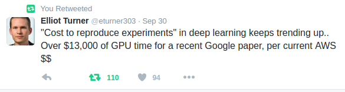

Deep Learning is cool. But it's also expensive.
So it makes sense to look at what options are available for training deep models in the cloud. 

Naturally, pretty powerful compute resources are needed to do really interesting stuff.

Options to obtain these capabilities include:

* Buying a server
    - For example, from [System76](https://system76.com/desktops/silverback)
    - Or from [Exxact](http://exxactcorp.com/deep-learning-overview.php)
* Renting resources from
    - [Amazon EC2](https://aws.amazon.com/ec2/instance-types/)
    - [Google Cloud ML](https://cloud.google.com/products/machine-learning/)
    - [Rescale](http://www.rescale.com/pricing/)

Let's look at cloud machine learning (ML) providers in more detail. With the goal to use [TensorFlow](https://www.tensorflow.org/) as the ML tool.

**Disclaimer:** *These opinions are based on my limited experience using each of the platforms mentioned. 
I may be grossly off in my analysis. Take with the ton of salt! You've been warned!*

## Amazon EC2
Amazon offers a range of choices, starting with older systems that only cost $0.65/hour at the bottom end, all the way up to bleeding-edge monsters - 16GPUs+64CPUs - that cost $14.40/hour.

EC2 is an established platform, with a lot of tools built on top of it.

### Pros

* Full-cloud Linux platform, no limitations
* Very familiar

### Cons

* Instancies with older GPUs will need TensorFlow re-compiled to support the GPU compute capability < 3.5
* Not a managed platform: if cluster of instancies is needed, have to use fairly low-level AWS APIs to configure, provision, and manage the cluster

## Google Cloud ML
Just out of *beta*, the Google Cloud ML platform looks very promising. It was developed by the same minds at Google who were responsible for TensorFlow --- so we can expect all the latest bells and whistles.

Even though Cloud ML is a recent product, Google Cloud itself is a very mature platform, with App Engine, multiple storage options, and management and logging tools.

You can choose among several different types of workers. I tried the standard (cheapest) one, and was somewhat disappointed by the performance --- time per batch was **7 times(!) slower** than the cheapest EC2 machine (`g2.2xlarge`). I seems as though  you need to write training code for distributed architecture from the start to get anywhere.

### Pros

* Managed platform
* Distributed TensorFlow is built-in
* $300 credit to get startedf

### Cons

* A single worker seem to be pretty weak 
* Locks you into the Google cloud infrastructure (have to use Google Storage for data)

## Rescale
Very easy to start, has nice no-nonsense dashboard. GPU workers are pretty fast (on par or better than EC2 `g2.2xlarge`).
TensorFlow is pre-installed. Cluster startup time is considerble (4--8 minutes). 

The long start-up time led to an issue when I used Rescale. A typo in the startup script produced (understandably)
a failure. But I had to wait that 4-8 minutes for the cluster to start to realise the error. 
And, most strangely, the error incurred a **charge of about $1**. Not sure if its a bug in the billing or I missed something in the pricing sheet. As configured, one worker should cost about $1.20 per hour.

In addition, I found the credit of $10 to start playing with the platform is too small. After making few configuration mistakes and training a sample model for less than 4 hours, the free credit was exhausted. 
Again, as configured, I should have had about 8-10 hours of "free" play time.

### Pros

* Semi-managed platform. Can be seen as a middle ground between Google Cloud ML (completely managed) and EC2 (completely unmanaged).
* Powerful workers

### Cons

* Meager $10 free credit to get started
* Billing mechanism is not clear as they apparently charge for configuration errors(!?)

## The Actual Cost of Deep Learning is Hidden
All cloud ML providers quote cost per worker and per hour. But the workers are wildly different. Comparing pricing on their face value is misleading.

In any case, running large experiements requires large budget.

A mental experiment:
Would you pay twice as much per hour to make your model train four times faster? Sure you would! You will spend less 
money to train your model on a more expensive (per hour) machine.

What we really want is the cost per model per epoch of training. And it still may vary significantly depending on your model. Such an analysis has yet to be completed.

## Summary

For my tasks, EC2 still seems like the best option, because:

* A single GPU worker is still sufficient
* EC2 provides a training environment that is identical to the development machine (my laptop). 
  So no surprises when deploying in the cloud
* My amount of training data is still pretty small --- no need to go for cloud storage yet

We should prepare to write **distributed** TensorFlow training code. Sooner or later data will expand beyond the capabilities of a single worker.
