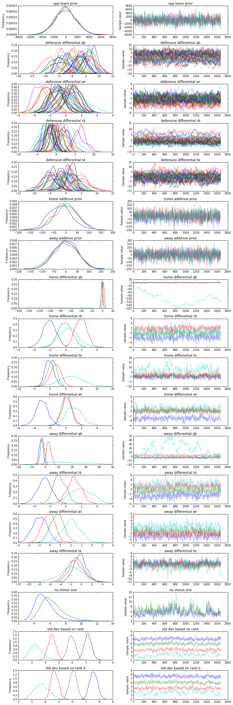
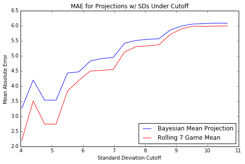
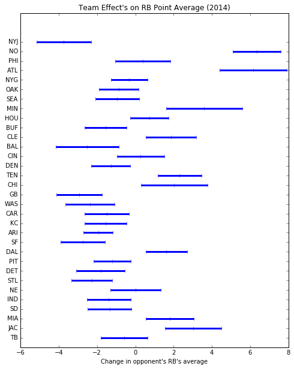
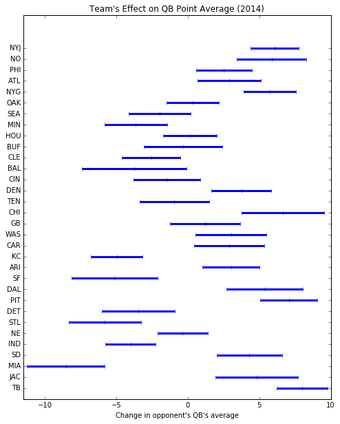
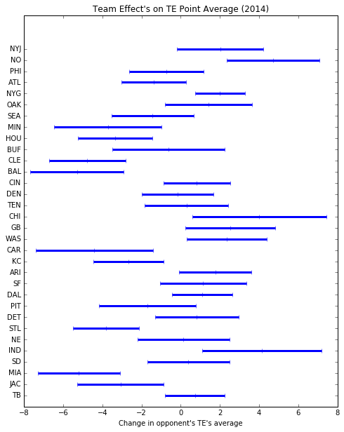
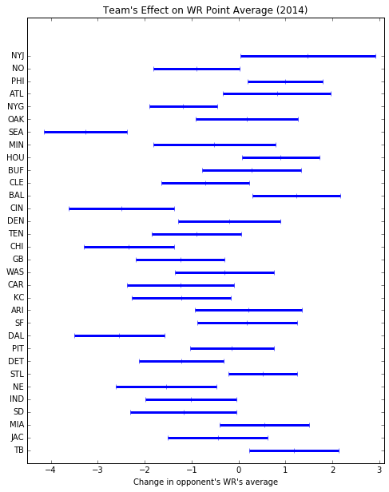

In this post, we're going to use a Bayesian hierarchical model to predict fantasy football scores. By employing partial pooling, we will model the dynamics of each team against each position resulting in an explainable and informative model from which we can draw insights. The model will be able to indicate more likely projections and to more quantitatively assign "OPP ranks" to teams based on their effect on players' scores.

We will use the 2014 data points to train the model and we will predict the entire 2015 season. We will measure the result not only in mean absolute error, but also by exploring the Bayesian model's characteristics and gleaning insights (and confidence in our projections) from there. We have two main goals:
    - Use the model not only for projections, but confidence levels for each individual projection.
    - Use the model to model different team's defensive abilities against different positions.
I would like to clarify that confidence levels for each projection will be in terms of the standard deviation of each projection. A high standard deviation indicates the model is uncertain about the projection whereas a low standard deviation indicates more certainty. This is the same utility you have in classification problems where standard model implementations can output a decision or a likelihood value-- something typically missing from most regression setups.

## The Data

The [data set](../files/bayesff/2013-2015_ff.csv) contains weekly score data for 2013-2015 for the NFL with a fantasy score that I calculated myself off of raw stats (mentioned in previous posts). I pulled the original data from the NFL api using nflgame in Python (also in a previous post). Each row is a unique entry based on player, year, and week, containing the additional information of the player's fantasy score, the teams involved, the player's fantasy score average based on the previous 7 games, the player's rank based on the previous 7 games, an indicator if the player is on the home team, and their position. 

As the data has already been cleaned, we will simply engineer the features slightly. In order to create the Bayesian model, we will assign a unique numeric ID to all the teams and we will one-hot encode the position.


```python
# Load and clean the data

import numpy as np
import pandas as pd

data = pd.read_csv('2013-2015_ff.csv')

# One-hot-encode the positions
data['pos_id'] = data['position']
data = pd.get_dummies(data,columns=['position'])

# Identify teams with integer
ids = np.array([k for k in data['opp_team'].unique()])
team_names = ids.copy()
data['opp_team']=data['opp_team'].apply(lambda x : np.where(x == ids)[0][0])
data['team']=data['team'].apply(lambda x : np.where(x == ids)[0][0])


pos_ids = np.array([k for k in data['pos_id'].unique()])
data['pos_id']=data['pos_id'].apply(lambda x : np.where(x == pos_ids)[0][0])
data['diff_from_avg'] = data['score'] - data['7_game_avg']

# We are using a single year for the analysis
explore = data[data.apply(lambda x : x['year'] == 2013,axis=1)]
train = data[data.apply(lambda x : x['year'] == 2014,axis=1)]
test = data[data.apply(lambda x : x['year'] == 2015,axis=1)]

explore.head()
```


<div>
<table border="1" class="dataframe">
  <thead>
    <tr style="text-align: right;">
      <th></th>
      <th>Unnamed: 0</th>
      <th>week</th>
      <th>year</th>
      <th>score</th>
      <th>is_home</th>
      <th>playerid</th>
      <th>name</th>
      <th>opp_team</th>
      <th>team</th>
      <th>7_game_avg</th>
      <th>rank</th>
      <th>pos_id</th>
      <th>position_QB</th>
      <th>position_RB</th>
      <th>position_TE</th>
      <th>position_WR</th>
      <th>diff_from_avg</th>
    </tr>
  </thead>
  <tbody>
    <tr>
      <th>653</th>
      <td>653</td>
      <td>1</td>
      <td>2013</td>
      <td>6.2</td>
      <td>1</td>
      <td>00-0029683</td>
      <td>Ronnie Hillman</td>
      <td>20</td>
      <td>18</td>
      <td>2.971429</td>
      <td>2</td>
      <td>0</td>
      <td>0</td>
      <td>1</td>
      <td>0</td>
      <td>0</td>
      <td>3.228571</td>
    </tr>
    <tr>
      <th>654</th>
      <td>654</td>
      <td>1</td>
      <td>2013</td>
      <td>33.1</td>
      <td>1</td>
      <td>00-0027874</td>
      <td>Demaryius Thomas</td>
      <td>20</td>
      <td>18</td>
      <td>18.614286</td>
      <td>1</td>
      <td>1</td>
      <td>0</td>
      <td>0</td>
      <td>0</td>
      <td>1</td>
      <td>14.485714</td>
    </tr>
    <tr>
      <th>655</th>
      <td>655</td>
      <td>1</td>
      <td>2013</td>
      <td>5.2</td>
      <td>1</td>
      <td>00-0027690</td>
      <td>Eric Decker</td>
      <td>20</td>
      <td>18</td>
      <td>17.085714</td>
      <td>1</td>
      <td>1</td>
      <td>0</td>
      <td>0</td>
      <td>0</td>
      <td>1</td>
      <td>-11.885714</td>
    </tr>
    <tr>
      <th>656</th>
      <td>656</td>
      <td>1</td>
      <td>2013</td>
      <td>2.2</td>
      <td>0</td>
      <td>00-0029264</td>
      <td>Bernard Pierce</td>
      <td>18</td>
      <td>20</td>
      <td>6.742857</td>
      <td>2</td>
      <td>0</td>
      <td>0</td>
      <td>1</td>
      <td>0</td>
      <td>0</td>
      <td>-4.542857</td>
    </tr>
    <tr>
      <th>657</th>
      <td>657</td>
      <td>1</td>
      <td>2013</td>
      <td>13.2</td>
      <td>0</td>
      <td>00-0027996</td>
      <td>Torrey Smith</td>
      <td>18</td>
      <td>20</td>
      <td>7.757143</td>
      <td>2</td>
      <td>1</td>
      <td>0</td>
      <td>0</td>
      <td>0</td>
      <td>1</td>
      <td>5.442857</td>
    </tr>
  </tbody>
</table>
</div>


## Data Exploration / Feature Engineering

I used the 2013 data to explore the data and to define some of our features. By training the model on the 2013 data and measuring convergence, I selected features to use on the final model, which is trained on 2014. Remember, one goal is to have a model that is somewhat explanative, and so it's more important to have simplicity here if possible.

Some of the features that I intended to use were:
    - Indicator of the strengh/weakness of the defense
    - A feature that represented the players expected average points (so, any projection could be used here, even say from ESPN)
    - A feature for the home team advantage / away team disadvantage
    
    
Unfortuately, I did not have an injury indicator for the data. In addition, I intended to use partial or full pooling based on a rank assigned to the player, their position, their team.. etc. The rank attribute is based on the previous 7-day averages of that year/week, bucketed into quartiles. 

I found that the strength/weakness of the defense partially pooled based on position and then in another layer by team converged reasonable well, so I left it as is. It could be extended to whether or not the team is the away team or not. It was interesting but not surprising to see inconsistent teams had wider standard deviations in their posteriors.

I trained the model at first allowing the home team advantage to be totally pooled by all measurements. This lead to a strong convergence on an "average home team improvement"-type variable. That was unsatisfactory. So, then I tried to partially pool by position and then by player and the results were terrible-- most players did not converge at all. Ultimately, I attempted to pool the performance boost/decrease based on rank, each having a prior partially pooled on position. There was one rank that had trouble converging for most positions (it was the lowest rank, with the most inconsistent players). I chose to leave in the lower ranked players as typically they are very uncertain and unpredictable, and the model will identify those predictions through higher standard deviations.

### A Tale of Two Likelihoods

Then came a modeling decision: when including position and rank based home/away advantages, an apparent indication of some degree of correlation between the features effecting convergence emerged. This negatively effected the convergence of the defense strength/weakness feature. So, I decided to approach this via two observables to improve convergence. I would tie the difference in the final projection directly to the defensive team by assigning it a data model with observables given by the score minus the projection average. Then, I added another likelihood which contains other corrective factors, hoping that it would help the defense feature converge and allow the corrective features to find a value. Indeed, this turned out to be the case the case.

This technique is very similar to setting two objective functions in a minimization function, with some weighting between the two depending on the standard deviations of the distributions. You can see this connection if you think about how linear regression can be reframed as a Bayesian inference problem. Imagine a simple Bayesian model with a flat prior for $$\alpha$$ and $$\sigma$$ fixed being fitted to data $$(x_i, y_i)$$.
\begin{equation}
y_i \sim \mathrm{Normal}(\alpha x_i, \sigma)
\end{equation}
\begin{equation}
\alpha \sim \mathrm{FlatPrior}(-\infty,\infty)
\end{equation}

Then, the posterior distribution for $$\mu(x)$$ could be written
\begin{equation}
p( \alpha | y_i, x_i, \sigma ) \propto \ell( y_i | \sigma, x_i, \alpha ) p(\alpha) = \ell( y_i | \sigma, x_i, \alpha )
\end{equation}
and recall the maximum a-priori estimate of $$\alpha$$ is the value of $$\alpha$$ that maximizes the likelihood, i.e.
$$
\mathrm{argmax}_\alpha \ell(y_i | \sigma, x_i, \alpha).
$$
However, since the $$\log$$ is monotonic over $$\mathbb{R}^+$$, the following is true
$$
\mathrm{argmax}_\alpha \ell(y_i | \sigma, x_i, \alpha) = \mathrm{argmax}_\alpha \log \ell(y_i | \sigma, x_i, \alpha).
$$

So if we take the log of $$\ell$$, which is the PDF for the Normal distribution, we get for some constant c
\begin{equation}
\log \ell (y_i | \sigma, x_i, \alpha) = \log \left ( \prod_{i=1}^n \frac{1}{\sigma\sqrt{2\pi}}e^{\frac{-(y_i-\alpha x_i)^2}{2\sigma^2}}  \right ) = \sum_{i=1}^n -\frac{1}{2\sigma^2}(y_i- \alpha x_i)^2 + c.
\end{equation}
as the equation we want to maximize. Of course, to maximize this equation, we have to choose $$\alpha$$ that makes the non-constant fraction as close to zero as possible! This is equivalent to the least squares minimization problem: find $$\alpha$$ which minimizes
\begin{equation}
\min_\alpha \sum_{i=1}^{n} (y_i- \alpha x_i)^2.
\end{equation}

Therefore, we included the defensive team terms essentially twice, they will have a higher influence over the resulting optimization "in the background" of the sampling. If we allow each standard deviation to vary, then the sampling algorithm will find the weighting of the objection functions to find the best fit. 

## The Bayesian Hierarchical Model

This model is only as good as its base projection. A key idea behind the model is to take a projection that is "pretty good" and try to correct it with external information about the game. In particular, we try to use dynamics of each team vs. each position to make the correction, along with the advantage of the home team. Of course, if we had more data, we could do our own projection using a model inside the hierarchy for example, but that is outside of the scope of this post. For our purposes, we will use the 7 game average of the player's fantasy points as our base model. It would be a simple exercise to use either ESPN or Yahoo's projections instead. 

A key aspect of this model is the partial pooling across different levels. The partial pooling is essential to performance in this case, possibly due to the large (-ish) number of variables coming from each distribution. Partial pooling allows you to give different coefficients to the same variables depending on selected factors, and the coefficients are drawn from a common distribution. This is different from other approaches-- typical linear regression "pools" all measurements by giving a single regression coefficient to each variable, while the alternative of no pooling is giving each row its own unique equation. This partial pooling allows information to be shared across variables, and one example of which is such partial pooling can pull posterior distributions of the coefficients closer together.

I apologize that we're about to descend into "notation hell". For the less mathematically curious (or pedantic), see the code below. I am writing this model to be identical to the code below (no shortcuts!).

The players' fantasy scores $$p_i$$ for game $$i$$'s difference with the previous 7 game average $$\overline{p}_i$$ is modeled as a Student T distribution (due to extremes) with data model

$$
p_i - \overline{p}_i \sim \mathrm{StudentT}(\Delta, \sigma_{1,r}, \nu_0)
$$

$$
\sigma_{1,r} \sim \mathrm{Uniform}(0, 100^2)  \quad \text{for r=1,...,4}
$$

$$
\nu_j \sim \mathrm{Exponential}(1,1/29)+1 \quad \text{for j=1,2}
$$

where $$\sigma_{1,r}$$ is partially pooled over the four ranks and $$nu_j$$ partially pooled over each likelihood. The average $$\mu$$ is driven by the dynamics of the specific defensive team $$t$$ against that position $$k$$, $$d_{t,k}$$:
\begin{equation}
\Delta := \sum_{t\in \mathcal{T}, k\in \mathcal{P}} d_{t,k} \chi_{k}
\end{equation}
Note that $$\chi_k$$ an indicator function that is 1 when the player is of position $$k$$ and 0 otherwise. The set of all teams we will define as $$\mathcal{T}$$ and of all positions $$\mathcal{P}$$, which is limited to offensive positions. 

The dynamics of the defense are partially pooled per each position with a hyperparameter which is also partially pooled.
\begin{equation}
d_{j,k} \sim \mathrm{Normal}(\delta_k, 100^2) \quad k\in \mathcal{P}
\end{equation}
\begin{equation}
\delta_{k} \sim \mathrm{Normal}(0, 100^2)
\end{equation}

Another data model is assigned with the addition of terms at the position and rank level and includes the above terms:

$$
p_i  \sim \mathrm{StudentT}(\overline{p}_i+\Delta+\alpha_{r}, \sigma_{2,r}, \nu_1)
$$

$$
\sigma_{2,r} \sim \mathrm{Uniform}(0, 100^2) \quad \text{for r=1,...,4}
$$

Using the notation $$h_{k,r}$$ and $$a_{k,r}$$, we can define a home and away advantage per position $$k$$ and rank $$r$$. 
\begin{equation}
\alpha_{r} := \sum_{k\in \mathcal{P}} \left( h_{k,r}\chi_h + a_{k,r}(1-\chi_h)\right ) \chi_p
\end{equation}
where $$\chi_h$$ indicates if the player was playing a home game or not. This term depends on the rank $$r$$ of the player and reduces to a single term for each player. We also can define the priors for these terms:
\begin{equation}
 h_{k,r} \sim \mathrm{Normal}(\eta_k , 10^2) \quad \text{for r= 1,..., 4}
\end{equation}
\begin{equation}
 a_{k,r} \sim \mathrm{Normal}(\rho_k , 10^2) \quad \text{for r= 1,..., 4}
\end{equation}
\begin{equation}
 \rho_k \sim \mathrm{Normal}(0 , 100^2)
\end{equation}
\begin{equation}
 \eta_{k} \sim \mathrm{Normal}(0 , 100^2) 
\end{equation}

Therefore, the full model in all its glory is:

$$
p_i - \overline{p}_i \sim \mathrm{StudentT}(\Delta, \sigma_{1,r}, \nu_0)
$$

\begin{equation}
\sigma_{1,r} \sim \mathrm{Uniform}(0, 100^2)  \quad \text{for r=1,...,4}
\end{equation}
\begin{equation}
\nu_j \sim \mathrm{Exponential}(1,1/29)+1 \quad \text{for j=1,2}
\end{equation}
\begin{equation}
\Delta := \sum_{t\in \mathcal{T}, k\in \mathcal{P}} d_{t,k} \chi_{k}
\end{equation}
\begin{equation}
d_{j,k} \sim \mathrm{Normal}(\delta_k, 100^2) \quad k\in \mathcal{P}
\end{equation}
\begin{equation}
\delta_{k} \sim \mathrm{Normal}(0, 100^2)
\end{equation}

$$
p_i  \sim \mathrm{StudentT}(\overline{p}_i+\Delta+\alpha_{r}, \sigma_{2,r}, \nu_1)
$$

\begin{equation}
\sigma_{2,r} \sim \mathrm{Uniform}(0, 100^2) \quad \text{for r=1,...,4}
\end{equation}

\begin{equation}
\alpha_{r} := \sum_{k\in \mathcal{P}} \left( h_{k,r}\chi_h + a_{k,r}(1-\chi_h)\right ) \chi_p
\end{equation}

\begin{equation}
 h_{k,r} \sim \mathrm{Normal}(\eta_k , 100^2) \quad \text{for r= 1,..., 4}
\end{equation}
\begin{equation}
 a_{k,r} \sim \mathrm{Normal}(\rho_k , 100^2) \quad \text{for r= 1,..., 4}
\end{equation}
\begin{equation}
 \rho_k \sim \mathrm{Normal}(0 , 100^2)
\end{equation}
\begin{equation}
 \eta_{k} \sim \mathrm{Normal}(0 , 100^2) 
\end{equation}

Admittedly, it seems a little overkill for projecting fantasy football, especially considering I started off with three bulleted features in mind. Regardless, assuming the model converges and performs, we will be able to glean some important insights from these variables because of its complicated structure (yet mostly simple construction). The variable $$d_{t,k}$$ will be an explicit "OPP rank" value for a team against a specific position, and it will be measured in how that team effects the average of the player they face. Moreover, $$h$$ will quantitatively give the home advantage in the form of effect on player's average. Of course, as this term is pooled over all measurements, it will be an average advantage rather than specifically at the player level. Similarly, the rank/position level home/away terms will also further give more insight into the data.


```python
#### import pymc3 as pm
import theano

num_positions=4
ranks=4
team_number = len(team_names)
np.random.seed(182)

with pm.Model() as mdl:
    nu = pm.Exponential('nu minus one', 1/29.,shape=2) + 1 # from https://pymc-devs.github.io/pymc3/notebooks/BEST.html
    err = pm.Uniform('std dev based on rank', 0, 100, shape=ranks)
    err_b = pm.Uniform('std dev based on rank b', 0, 100, shape=ranks)

    # Theano shared variables to change at test time
    player_home = theano.shared(np.asarray(train['is_home'].values, dtype = int))
    player_avg = theano.shared(np.asarray((train['7_game_avg']).values, dtype = float))
    player_opp = theano.shared(np.asarray((train['opp_team']).values, dtype = int))
    player_team = theano.shared(np.asarray((train['team']).values, dtype = int))
    player_rank = theano.shared(np.asarray((train['rank']-1).values, dtype = int))
    qb = theano.shared(np.asarray((train['position_QB']).values.astype(int), dtype = int))
    wr = theano.shared(np.asarray((train['position_WR']).values.astype(int), dtype = int))
    rb = theano.shared(np.asarray((train['position_RB']).values.astype(int), dtype = int))
    te = theano.shared(np.asarray((train['position_TE']).values.astype(int), dtype = int))
    pos_id = theano.shared(np.asarray((train['pos_id']).values, dtype = int))

    # Defensive ability of the opposing team vs. each position, partially pooled
    opp_def = pm.Normal('opp team prior',0, sd=100**2, shape=num_positions)
    opp_qb = pm.Normal('defensive differential qb', opp_def[0], sd=100**2, shape=team_number)
    opp_wr = pm.Normal('defensive differential wr', opp_def[1], sd=100**2, shape=team_number)
    opp_rb = pm.Normal('defensive differential rb', opp_def[2], sd=100**2, shape=team_number)
    opp_te = pm.Normal('defensive differential te', opp_def[3], sd=100**2, shape=team_number)
    
    # Partially pooled ability of the player's rank partially pooled based on position
    home_adv = pm.Normal('home additivie prior', 0, 100**2,shape = num_positions)     
    away_adv = pm.Normal('away additivie prior', 0, 100**2,shape = num_positions)     
    pos_home_qb = pm.Normal('home differential qb',home_adv[0],10**2, shape = ranks)
    pos_home_rb = pm.Normal('home differential rb',home_adv[1],10**2, shape = ranks)
    pos_home_te = pm.Normal('home differential te',home_adv[2],10**2, shape = ranks)
    pos_home_wr = pm.Normal('home differential wr',home_adv[3],10**2, shape = ranks)
    pos_away_qb = pm.Normal('away differential qb',away_adv[0],10**2, shape = ranks)
    pos_away_rb = pm.Normal('away differential rb',away_adv[1],10**2, shape = ranks)
    pos_away_wr = pm.Normal('away differential wr',away_adv[2],10**2, shape = ranks)
    pos_away_te = pm.Normal('away differential te',away_adv[3],10**2, shape = ranks)

    # First likelihood where the player's difference from average is explained by defensive abililty
    def_effect = qb*opp_qb[player_opp]+ wr*opp_wr[player_opp]+ rb*opp_rb[player_opp]+ te*opp_te[player_opp]
    like1 = pm.StudentT('Diff From Avg', mu=def_effect, sd=err_b[player_rank],nu=nu[1], observed = train['diff_from_avg'])
    
    # Second likelihood where the score is predicted by defensive power plus other smaller factors
    mu = player_avg + def_effect
    mu += rb*pos_home_rb[player_rank]*(player_home) + wr*pos_home_wr[player_rank]*(player_home) 
    mu += qb*pos_home_qb[player_rank]*(player_home) + te*pos_home_te[player_rank]*(player_home) 
    mu += rb*pos_away_rb[player_rank]*(1-player_home) + wr*pos_away_wr[player_rank]*(1-player_home) 
    mu += qb*pos_away_qb[player_rank]*(1-player_home) + te*pos_away_te[player_rank]*(1-player_home) 
    like2 = pm.StudentT('Score', mu=mu, sd=err[player_rank], nu=nu[0], observed=train['score'])

    # Training!
    trace=pm.sample(10000, pm.Metropolis())
```
    100%|██████████| 10000/10000 [01:12<00:00, 138.86it/s]


```python
tr=trace[-5000::3]
%matplotlib inline
_=pm.traceplot(tr)
```





Remember, we were aware from the beginning that certain inputs would be inherently unpredictable as we are missing enough features and data to fully describe the phenomenon in the data set. This manifests itself in poor convergence in certain variables, but overall we decided this was worthwhile in our case because we want the model to indicate projections we should be confident in as well as some quantitative metrics on the teams. As we can see, the posterior distributions have reasonably converged and there is no obvious indication of a problem outside of our a priori assumption that certain variables would have poor convergence due to a variety of factors. If one were to see terrible results on the test set, that would be another indication of a model that either is simply poor and/or has not converged.

# Evaluation

    All models are wrong but some are useful.
        - George Box

To evaluate the model, we are going to test the model on the 2015 season. We are going to employ a variety of metrics so that we can better understand the fit of the model. Since Bayesian models give us a standard deviation for each projection, we can use that projection to assess our confidence in that specific projection. We'll do that by transforming the evaluation into a classification problem and by using the standard deviation as a cutoff, similarly to how you would for say a precision/recall curve or ROC curve.


## Projecting on the Test Set

Due to the construction of the model, we need to replace the values of certain theano shared variables we defined. Then, we can sample from the posterior distribution via pymc3's sample_pcc function.


```python
# Set the shared variables to the test set values
player_home.set_value(np.asarray(test['is_home'].values, dtype = int))
player_avg.set_value(np.asarray((test['7_game_avg']).values, dtype = float))
player_opp.set_value(np.asarray((test['opp_team']).values, dtype = int))
player_rank.set_value(np.asarray((test['rank']-1).values, dtype = int))
pos_id.set_value(np.asarray((test['pos_id']).values, dtype = int))
player_team.set_value(np.asarray((test['team']).values, dtype = int))
qb.set_value(np.asarray((test['position_QB']).values.astype(int), dtype = int))
wr.set_value(np.asarray((test['position_WR']).values.astype(int), dtype = int))
rb.set_value(np.asarray((test['position_RB']).values.astype(int), dtype = int))
te.set_value(np.asarray((test['position_TE']).values.astype(int), dtype = int))

ppc=pm.sample_ppc(tr, samples=1000, model= mdl)
```

    100%|██████████| 1000/1000 [00:31<00:00, 31.97it/s]


## Mean Absolute Error

The first metric we will look at is for point estimates. We will average over the posterior distribution to generate a point estimate for each data point and then calculate it's mean absolute error. We will then compare it to the error of our base projection we used, the 7 day average.


```python
from sklearn.metrics import mean_absolute_error

print('Projection Mean Absolute Error:', mean_absolute_error(test.loc[:,'score'].values, ppc['Score'].mean(axis=0)))
print('7 Day Average Mean Absolute Error:', mean_absolute_error(test.loc[:,'score'].values, test.loc[:,'7_game_avg'].values))

```

    Projection Mean Absolute Error: 6.08107236551
    7 Day Average Mean Absolute Error: 5.988962818


As you can see, the error is very similar. This tells us that we did not necessarily gain any accuracy at the point estimate level via our process, but then again, it was meant to allow us more meta-information about the projections. It's comforting that the projection MAE did not become WORSE (which is easily doable with a poor model as the spread of predictions will be too wide, driving poor average performance). 

## Confidence in Projections

We can use the standard deviation to understand the accuracy of our projections, as we've mentioned before. As one would hope, lower standard deviations lead to higher accuracy, but how should we measure it? We detail one approach below.

ROC and Precision/Recall curves are popular in classification tasks, but now we can do a similar curve in this case. We can select cutoffs for the standard deviation, and calculate the mean absolute error ONLY on the projections with standard deviations LOWER than the cutoff. The code and resulting graph is as folows:


```python
import matplotlib.pyplot as plt

max_sd = d['sd'].max()
plt.figure(figsize=(8,5))
ax=plt.gca()
ax.plot(np.linspace(0,max_sd,30), np.array([d[d['sd'] <= k]['proj MAE'].mean() for k in np.linspace(0,max_sd,30)]))
ax.plot(np.linspace(0,max_sd,30), np.array([d[d['sd'] <= k]['historical avg MAE'].mean() for k in np.linspace(0,max_sd,30)]), color='r')
ax.set_ylabel('Mean Absolute Error')
ax.set_xlabel('Standard Deviation Cutoff')
ax.set_title('MAE for Projections w/ SDs Under Cutoff')
ax.legend(['Bayesian Mean Projection', 'Rolling 7 Game Mean'], loc=4)
```





As espected, the lower the standard deviation, the approximately better the projections in terms of a lower mean absolute error overall. We have approximately quantified this relationship via this graph. Therefore, if a prediction had a standard deviation of 4-5, it's more likely to occur than a prediction with a standard deviation of 9-10. The larger standard deviation indicates the instability of the coefficients drawn during the samples for that data point, meaning at least a key distribution was "wide" or unstable or perhaps didn't converge well.

Of course, you won't see this information on many fantasy websites. Typically, you can only see a hint of this analysis in aggregation sites that provide a range for each player. The range is implying some type of probability distribution, but it is empirical off usually a small number of projections. The output of a Bayesian model will provide a probability distribution for each player based on the data and assumptions. Of course, our approach could also be used with the aggregation of projections, but you would have to be careful for colinearity between features as it is unknown what was used in the projections. 

# Conclusions From The Model

As we have designed the model to have clear features, we can interpret them easily. By taking the posteriors of different factors, we can see how they contribute to our understanding of the results. Any insights will be specifically applicable to the 2014 season, as that is the year used in the training set.

There are many obvious insights to draw from the model's trace plot. You can see different ranks have different standard deviations, and you can see that different positions (and ranks) are effected differently on the home/away dynamic. Some of these insights are obvious (i.e. if rank was defined well, this is expected to happen), and some are not. What is hard to discern is the team level factors information, which we will detail now.

Below are the graphs of the team level "defensive differentials". This is meant to be interpreted as "when this team is on defense, this is what most likely happens to the average score of position X." You can see that quite literally by looking at the model definition. This gives us a quantitative way to look at each team beyond that the team is the "32nd ranked against QBs" or have the "2nd least points scored by TEs in the league". These directional statements imply what could happen to a score but have limited application.

Let's do an example on a quarterback. If a team X has a +5 effect against quarterbacks, that means that on average, the quarterback's average in his scoring distribution increases by 5. So that means, they're a bad defense against quarterbacks. A good defense would have a negative effects value.

Directionally, these values are mostly in line with what you'd see in 2014's statistics. There are more dynamics modeled here, so it can give a more or less rosy picture of the team because we also looked at home vs. away dynamics in our other features. An easy metric to compare is a team's rushing yards per game in 2014. Lowest rushing yards per game in 2014 were granted by the Lions, Broncos, Seahawks, Ravens and Jets. All five of those teams have negative values on our RB chart:


```python
import matplotlib.pyplot as plt
t = pd.DataFrame({'projection':  tr['defensive differential rb'].mean(axis=0), 'sd' : tr['defensive differential rb'].std(axis=0),'name': team_names})
f=plt.figure(figsize=(8,10))
plt.errorbar(x=t['projection'],y=range(1,len(t)+1),xerr=t['sd'], lw=3, fmt='|')
plt.title('Team Effect\'s on RB Point Average (2014)')
end=plt.yticks(range(1,len(t)+1), [name for name in t['name']])
plt.xlim([-6,8])
plt.xlabel('Change in opponent\'s RB\'s average')
```




We will present the others below simply for completion, and encourage you to explore the results with your own intution from 2014.


```python
import matplotlib.pyplot as plt
t = pd.DataFrame({'projection':  tr['defensive differential qb'].mean(axis=0), 'sd' : tr['defensive differential qb'].std(axis=0),'name': team_names})
f=plt.figure(figsize=(8,10))
plt.errorbar(x=t['projection'],y=range(1,len(t)+1),xerr=t['sd'], lw=3, fmt='|')
plt.title('Team\'s Effect on QB Point Average (2014)')
end=plt.yticks(range(1,len(t)+1), [name for name in t['name']])
plt.xlim([-11.5,10])
plt.xlabel('Change in opponent\'s QB\'s average')
```




```python
import matplotlib.pyplot as plt
t = pd.DataFrame({'projection':  tr['defensive differential te'].mean(axis=0), 'sd' : tr['defensive differential te'].std(axis=0),'name': team_names})
f=plt.figure(figsize=(8,10))
plt.errorbar(x=t['projection'],y=range(1,len(t)+1),xerr=t['sd'], lw=3, fmt='|')
plt.title('Team Effect\'s on TE Point Average (2014)')
end=plt.yticks(range(1,len(t)+1), [name for name in t['name']])
plt.xlim([-8,8])
plt.xlabel('Change in opponent\'s TE\'s average')
```




```python
import matplotlib.pyplot as plt
t = pd.DataFrame({'projection':  tr['defensive differential wr'].mean(axis=0), 'sd' : tr['defensive differential wr'].std(axis=0),'name': team_names})
f=plt.figure(figsize=(8,10))
plt.errorbar(x=t['projection'],y=range(1,len(t)+1),xerr=t['sd'], lw=3, fmt='|')
plt.title('Team\'s Effect on WR Point Average (2014)')
end=plt.yticks(range(1,len(t)+1), [name for name in t['name']])
plt.xlim([-4.5,3.1])
plt.xlabel('Change in opponent\'s WR\'s average')
```



