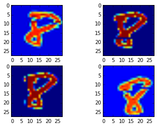
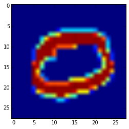

In this post, we're going to look at the [Digit Recognizer](https://www.kaggle.com/c/digit-recognizer) challenge from Kaggle. This challenge uses the MNIST dataset of handwritten digits. We're going to train a Convolutional Neural Network with [Keras](http://keras.io) to recognize the digits. We will employ some preprocessing steps to improve the generalization of our model.

In our analysis, we'll use pandas, NumPy, and even a tool from sci-kit learn. A side goal is to build a framework that could be used in other Kaggle competitions as well. The key idea is to **make a validation set** from the training set to test your ideas, rather than submitting to the leaderboards.

## Setup


    %%capture
    %matplotlib inline
    import pandas as pd
    import numpy as np
    from keras.callbacks import ModelCheckpoint
    from keras.models import Sequential
    from keras.layers.core import Dense, Activation, Dropout, Flatten
    from keras.layers.convolutional import Convolution2D, MaxPooling2D
    from scipy.ndimage.interpolation import rotate, shift, zoom
    from keras.datasets import mnist
    
    # Load data
    train = pd.read_csv('train.csv', dtype=np.float32)
    X_test = pd.read_csv('test.csv', dtype=np.float32).values
    
    np.random.seed(182)


## Prepare the Training, Validation, and Test Set

When we take a look at the training set, we see that the label column has multiple values. Our eventual goal is to use a SoftMax layer for our network, so we will need to convert it to multiple columns with binary values. Because we are going to modify the images as we train, we need to use a separate validation set to see the progress of the Neural Network, as opposed to using Keras built in functionality. Out of convenience, we will use sklearn's train_test_split function.
We will use pandas get_dummies to convert the labels column to multiple values.


    from sklearn.cross_validation import train_test_split
    
    y_train = pd.get_dummies(train.loc[:, "label"])
    print(y_train.head())
    
    # Get numpy version
    y_train = y_train.values.astype(np.int32)
    X_train = train.drop("label", axis = 1).values
    
    X_train, X_valid, y_train, y_valid = train_test_split(X_train,
                                                          y_train, 
                                                          test_size=0.1)
    
    X_train = X_train.reshape((X_train.shape[0],1,28,28))/255
    X_valid = X_valid.reshape((X_valid.shape[0],1,28,28))/255
    X_test = X_test.reshape((X_test.shape[0],1,28,28))/255


       0  1  2  3  4  5  6  7  8  9
    0  0  1  0  0  0  0  0  0  0  0
    1  1  0  0  0  0  0  0  0  0  0
    2  0  1  0  0  0  0  0  0  0  0
    3  0  0  0  0  1  0  0  0  0  0
    4  1  0  0  0  0  0  0  0  0  0
    

## Model Definition

We are going to set up a simple CNN with two convolutional layers. The architecture will be:

* Convolutional Layer (32x3x3) -> ReLu Activation (x2)
* MaxPooling (2,2) -> Dropout (.25)
* Fully Connected Layer (128 Units) -> ReLu Activation -> Dropout (.5)
* Fully Connected Layer (10 Units) -> SoftMax

This is not a particularly creative architecture, and in fact, it's the same architecture used in Keras' [example](https://github.com/fchollet/keras/blob/master/examples/mnist_cnn.py).


    # Keras 0.3.2
    model = Sequential()
    model.add(Convolution2D(32,3,3, border_mode="valid", input_shape=(1,28,28)))
    model.add(Activation('relu'))
    
    model.add(Convolution2D(32,3,3))
    model.add(Activation('relu'))
    
    model.add(MaxPooling2D(pool_size=(2,2)))
    model.add(Dropout(.25))
    
    model.add(Flatten())
    model.add(Dense(128))
    model.add(Activation('relu'))
    model.add(Dropout(.5))
    model.add(Dense(10))
    model.add(Activation('softmax'))
    
    model.compile(loss='categorical_crossentropy', optimizer='adadelta')


## Preprocessing

An important piece of this post is the preprocessing we will do to the images. We are going to introduce random noise (jargon: jitter) to the image. We're going to randomly apply the jitter in the following ways:

* Deleting a column
* Deleting a row
* Shifting the image
* Rotating the image

We will use NumPy for all of these effects. We will perform each action with probability \\(p=.7\\). The probability that an image is perturbed is \\(1-(1-.7)^4 = .99\\). With a training set of over 32000, we expect approximately 320 images to stay the same. We will repeat this process each epoch.


    def rand_jitter(temp):
        if np.random.random() > .7:
            temp[np.random.randint(0,28,1), :] = 0
        if np.random.random() > .7:
            temp[:, np.random.randint(0,28,1)] = 0
        if np.random.random() > .7:
            temp = shift(temp, shift=(np.random.randint(-3,3,2)))
        if np.random.random() > .7:
            temp = rotate(temp, angle = np.random.randint(-20,20,1), reshape=False)
        return temp

    import matplotlib.pyplot as plt
    import matplotlib.cm as cm
    
    # Copy to not effect the original
    ind = np.random.randint(len(X_train))
    test_image = lambda : np.copy(X_train[ind,0,:,:]) 
    
    # Jitter examples
    plt.figure()
    f, ax = plt.subplots(2, 2)
    for k in range(2):
        for j in range(2):
            ax[k,j].imshow(rand_jitter(test_image()))


 

## Training

In the interest of time, I will only train two epochs. Each epoch we copy the training set so that we can modify the array itself when we apply the jitter. The first epoch we use the original training set, but every epoch afterwards we use the perturbed data set.


    # Callback for model saving:
    checkpointer = ModelCheckpoint(filepath="auto_save_weights.hdf5", 
                                   verbose=1, save_best_only=True)
    
    # Parameters
    n_epochs = 2
    
    # Training
    for k in range(0, n_epochs):
        X_train_temp = np.copy(X_train) # Copy to not effect the originals
        
        # Add noise on later epochs
        if k > 0:
            for j in range(0, X_train_temp.shape[0]):
                X_train_temp[j,0, :, :] = rand_jitter(X_train_temp[j,0,:,:])
    
        model.fit(X_train_temp, y_train, nb_epoch=1, batch_size=128, 
                  validation_data=(X_valid, y_valid), show_accuracy=True, verbose=1, 
                  callbacks=[checkpointer])

    Train on 37800 samples, validate on 4200 samples
    Epoch 1/1
    37800/37800 [==============================] - 508s - loss: 0.2920 - acc: 0.9100 - val_loss: 0.0816 - val_acc: 0.9710
    Epoch 00000: val_loss improved from inf to 0.08161, saving model to auto_save_weights.hdf5
    Train on 37800 samples, validate on 4200 samples
    Epoch 1/1
    37800/37800 [==============================] - 506s - loss: 0.2615 - acc: 0.9199 - val_loss: 0.0529 - val_acc: 0.9807
    Epoch 00000: val_loss improved from 0.08161 to 0.05290, saving model to auto_save_weights.hdf5
    

## Predicting on the Test Set

If we were going to submit this model to the competition, then we'd want to retrain the model on the full training set when we are happy with our validation score. If we were using a less time consuming approach, we could choose to use cross validation rather than a validation set. Either way, it's important to train the final model on the full data set.

But it will not make a difference for our demonstration, so we'll make our predictions on the test set. As a sanity check, we will validate a prediction by visualizing the input image and comparing to our prediction.


    # Make predictions
    predictions = model.predict(X_test, batch_size=128)

    # Visualize prediction
    print("Predicted value: %d" % np.argmax(predictions[1]))
    plt.imshow(X_test[1,0,:,:])

    Predicted value: 0
  

