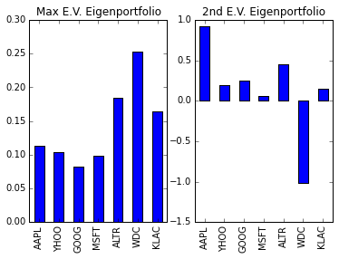
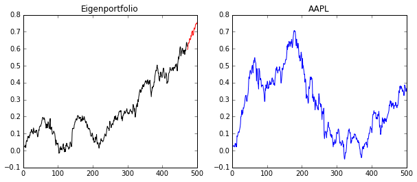

Correlation is a very fundamental and viseral way of understanding how the stock market works and how strategies perform. Modern portfolio theory has made great progress in tying together stock data with portfolio selection. Today, we're going to explore how the eigendecomposition of the returns covariance matrix could help you invest. This will be the first post in a series of posts to help you understand how advanced mathematics can fit into investing.

First, let's get some definitions out of the way. We will denote the covariance matrix of the returns over some period as $$\Sigma$$. The price for an asset $$i$$ at a given time $$t$$ is $$p_{i,t}$$ and returns for each stock $$i$$ will be written as $$r_{i,t}=(p_{i,t}-p_{i,t-1})/p_{i,t-1}$$. These returns can be arranged into a matrix and used to find the sample covariance which we will do below. 

    Warning! The analysis herein is a presentation of a part of Markowitz Portfolio Theory. 
    Notes you may come across for this theory assumes linear returns (not log!), 
    and it will be confusing as some notes do casually use log-returns without so much as 
    a mention of the extentions to correct for this.

We will further define the amount invested in stock $$i$$ relative to one's total capital as $$w_i$$. If $$w_{Apple}=.5$$, this means we are investing 50% of our capital into Apple. This is also called going "long" in a stock. If a weight is negative, that is related to a "short sale", where you borrow capital to buy the stock. Usually, you "long" (verb) stocks that will increase in value and "short" (verb) stocks that will decrease.

# Portfolio Theory Fundamentals

If we have a set of stocks $$S$$ and our chosen weights represented as a vector $$w = [w_i]_{i \in S}$$, then the pair $$(S,w)$$ describes a portfolio allocation. This can be used, for instance, in a "buy and hold" strategy for investing. If we had access to the covariance matrix $$\Sigma$$, then the risk (variance!) of the investing strategy is given by the formula
\begin{equation}
\text{risk} = w^T \Sigma w,
\end{equation}

This is an extremely important idea-- we have a way to quantify our risk for a given portfolio! Let me add one interesting point mathematically. This formula lends itself to be used in all sorts of optimization problems (which we may head into later), but there's a very simple one we can point out immediately. If we would like the minimum risk when the weight are of unit length in $$L^2$$, the weight are simply *the eigenvector associated with the smallest eigenvalue and the risk is the smallest eigenvalue.* We have just witnessed a powerful connection, and frankly, one of the most approachable applications of eigenvalues and eigenvectors. 

## Introducing Eigenportfolios

Let's switch gears and talk about the covariance matrix. For those familiar with Principal Component Analysis, some of this next section will look familiar. In fact, since the covariance matrix is similar by definition to the correlation matrix (in the sense of a linear transformation similarity), the eigenvalues will be the same and the eigenvectors (which we are interested in) have a 1-1 correspondence between them, assuming none of the variances for any of the stocks are equal to 0.

The covariance matrix has some nice properties in the case of stock returns. First of all, it is a symmetric matrix, and so its eigenvalues are positive and its eigenvectors are orthogonal to each other. The typical interpretation of the eigenvalue decomposition of a covariance matrix is this:

* The eigenvalues give the "variance" of each "factor" or eigenvector
* The variance associated with each factor is "uncovariated" with the others (If we use the correlation matrix, this would be uncorrelated.)

I put the words above in quotes because this is meaningless until you connect it to where the matrix came from. Here, we know loosely that each eigenvalue corresponds to the risk of a portfolio and that the eigenvectors can represent an allocation of weights. So in this context, we can make the interpretations

* Eigenvectors are the "eigenportfolios", strategy weight allocations which are uncorrolated to other eigenportfolios
* Eigenvalues are the "risk" of the given eigenportfolio

## The Market Eigenvalue

As an aside, it has been empirically verified that the largest eigenvalue and associated eigenportfolio will correlate strongly with the market, assuming the data you built the matrix with captures the market. Usually, when using this technique in practice, you may want to remove that eigenportfolio so that your returns will be (hopefully) disconnected with the marked.

# A Numerical Example

To show an example, first we need to construct a correlation matrix from closing stock price data.

## pandas API

Now, we're going to introduce how to use the pandas API to get stock data off of Yahoo. We'll also use pandas to prepare the data for the analysis. This data should not necessarily be used for investment strategies because (but not limited to) Yahoo's data suffers from survivers' bias (stocks that don't exist anymore are dropped) and their treatment of splits and dividends. However, to read basic data is very easy. Pandas uses the DataReader class combined with the ticker and a start and end date to grab data.

We are going to grab a stocks and calculate their returns.


    import pandas as pd
    import datetime as dt
    from pandas.io.data import DataReader
    
    start, end = dt.datetime(2012, 1, 1), dt.datetime(2013, 12, 31)
    
    tickers = ['AAPL', 'YHOO','GOOG', 'MSFT','ALTR','WDC','KLAC'] 
    # List shamelessly taken from:
    # http://stackoverflow.com/questions/28174193/add-new-column-based-on-a-list-and-sort-date-by-newest
    
    prices = pd.DataFrame()
    
    for ticker in tickers:
        prices[ticker] = DataReader(ticker,'yahoo', start, end).loc[:,'Close'] #S&P 500
        
    prices.head()



<table border="1" class="dataframe">
  <thead>
    <tr style="text-align: right;">
      <th></th>
      <th>AAPL</th>
      <th>YHOO</th>
      <th>GOOG</th>
      <th>MSFT</th>
      <th>ALTR</th>
      <th>WDC</th>
      <th>KLAC</th>
    </tr>
    <tr>
      <th>Date</th>
      <th></th>
      <th></th>
      <th></th>
      <th></th>
      <th></th>
      <th></th>
      <th></th>
    </tr>
  </thead>
  <tbody>
    <tr>
      <th>2012-01-03</th>
      <td>411.230000</td>
      <td>16.290001</td>
      <td>665.411118</td>
      <td>26.770000</td>
      <td>37.599998</td>
      <td>30.980000</td>
      <td>47.459999</td>
    </tr>
    <tr>
      <th>2012-01-04</th>
      <td>413.440010</td>
      <td>15.780000</td>
      <td>668.281154</td>
      <td>27.400000</td>
      <td>37.169998</td>
      <td>31.299999</td>
      <td>46.910000</td>
    </tr>
    <tr>
      <th>2012-01-05</th>
      <td>418.029995</td>
      <td>15.640000</td>
      <td>659.011109</td>
      <td>27.680000</td>
      <td>37.459999</td>
      <td>32.759998</td>
      <td>47.520000</td>
    </tr>
    <tr>
      <th>2012-01-06</th>
      <td>422.400002</td>
      <td>15.520000</td>
      <td>650.021102</td>
      <td>28.110001</td>
      <td>37.490002</td>
      <td>33.490002</td>
      <td>47.730000</td>
    </tr>
    <tr>
      <th>2012-01-09</th>
      <td>421.730000</td>
      <td>15.460000</td>
      <td>622.461047</td>
      <td>27.740000</td>
      <td>37.779999</td>
      <td>33.750000</td>
      <td>48.180000</td>
    </tr>
  </tbody>
</table>


    returns = prices.pct_change()
    returns.head()


<table border="1" class="dataframe">
  <thead>
    <tr style="text-align: right;">
      <th></th>
      <th>AAPL</th>
      <th>YHOO</th>
      <th>GOOG</th>
      <th>MSFT</th>
      <th>ALTR</th>
      <th>WDC</th>
      <th>KLAC</th>
    </tr>
    <tr>
      <th>Date</th>
      <th></th>
      <th></th>
      <th></th>
      <th></th>
      <th></th>
      <th></th>
      <th></th>
    </tr>
  </thead>
  <tbody>
    <tr>
      <th>2012-01-03</th>
      <td>NaN</td>
      <td>NaN</td>
      <td>NaN</td>
      <td>NaN</td>
      <td>NaN</td>
      <td>NaN</td>
      <td>NaN</td>
    </tr>
    <tr>
      <th>2012-01-04</th>
      <td>0.005374</td>
      <td>-0.031308</td>
      <td>0.004313</td>
      <td>0.023534</td>
      <td>-0.011436</td>
      <td>0.010329</td>
      <td>-0.011589</td>
    </tr>
    <tr>
      <th>2012-01-05</th>
      <td>0.011102</td>
      <td>-0.008872</td>
      <td>-0.013871</td>
      <td>0.010219</td>
      <td>0.007802</td>
      <td>0.046645</td>
      <td>0.013004</td>
    </tr>
    <tr>
      <th>2012-01-06</th>
      <td>0.010454</td>
      <td>-0.007673</td>
      <td>-0.013642</td>
      <td>0.015535</td>
      <td>0.000801</td>
      <td>0.022283</td>
      <td>0.004419</td>
    </tr>
    <tr>
      <th>2012-01-09</th>
      <td>-0.001586</td>
      <td>-0.003866</td>
      <td>-0.042399</td>
      <td>-0.013163</td>
      <td>0.007735</td>
      <td>0.007763</td>
      <td>0.009428</td>
    </tr>
  </tbody>
</table>

We remove the first row of NaN's and we're finished cleaning the data. Now, we're going to take the finance equivalent of a training set and test set. They typically test their algorithms "in sample" and "out of sample".


    returns = returns.iloc[1:, :] # Remove first row of NA's
    
    training_period = 30
    in_sample = returns.iloc[:(returns.shape[0]-training_period), :].copy()
    
    # Save the tickers
    tickers = returns.columns.copy()



## The Eigenvalues of the Covariance Matrix

Let's extract an eigenportfolio! To avoid the dreaded Market-correlated portfolio (we aren't trying to build an index fund here!), let's take a portfolio using the next eigenvector. We are going to use pandas combined with NumPy.


    import numpy as np
    
    covariance_matrix = in_sample.cov()
    
    D, S = np.linalg.eigh(covariance_matrix)
    
    eigenportfolio_1 = S[:,-1] / np.sum(S[:,-1]) # Normalize to sum to 1
    
    eigenportfolio_2 = S[:,-2] / np.sum(S[:,-2]) # Normalize to sum to 1

    # Setup Portfolios
    eigenportfolio = pd.DataFrame(data= eigenportfolio_1, columns = ['Investment Weight'], index = tickers)
    eigenportfolio2 = pd.DataFrame(data= eigenportfolio_2, columns = ['Investment Weight'], index = tickers)
    
    # Plot
    %matplotlib inline
    import matplotlib.pyplot as plt
    f = plt.figure()
        
    ax = plt.subplot(121)
    eigenportfolio.plot(kind='bar', ax=ax, legend=False)
    plt.title("Max E.V. Eigenportfolio")
    ax = plt.subplot(122)
    eigenportfolio2.plot(kind='bar', ax=ax, legend=False)
    plt.title("2nd E.V. Eigenportfolio")
    


This is a typical chart for visualizing an allocation strategy. Each bar indicates the weight associated with a stock and the tickers are arranged in alphabetical order. These two portfolios are supposed to have uncorrolated returns, and possibly in large part, because of their different treatment of WDC. Of course, we could calculate the expected risk or returns for this portfolio, but it would be more fun to see it in action!

## Visualizing the Results

At this point, we are ready to see how our modest strategy will perform on real data. However, the caveat is the short sale, or the negative weight we found for TSLA. Short selling would require more logic built into a simulation and it's not very instructive, so instead we're going to zero out that weight and renormalize.

### In Sample vs. Out of Sample

In machine learning speak, we are really interested in our performance on the test set, but are happy to know a little about the performance on the training set. To do this, we're going to plot our culmulative returns over time in the out of sample period.

Culmulative returns at time $$t$$ is given by $$CR_t = \prod_{i=0}^t (1+r_i)-1$$ where $r_i$ is the return of the period. This will allow us to visualize the performance of the algorithms better over time.

Again, to avoid issues around short sales, I am going to use the portfolio without them.


    import matplotlib.pyplot as plt
    %matplotlib inline
    
    def get_cumulative_returns_over_time(sample, weights):
        return (((1+sample).cumprod(axis=0))-1).dot(weights)
    
    in_sample_ind = np.arange(0, (returns.shape[0]-training_period+1))
    out_sample_ind = np.arange((returns.shape[0]-training_period+1), returns.shape[0])
    
    cumulative_returns = get_cumulative_returns_over_time(returns, eigenportfolio).values
        
    f = plt.figure(figsize=(10,4))
    
    ax = plt.subplot(121)
    ax.plot(cumulative_returns[in_sample_ind], 'black')
    ax.plot(out_sample_ind,cumulative_returns[out_sample_ind], 'r')
    plt.title("Eigenportfolio")
    
    ax = plt.subplot(122)
    plt.plot((((1+returns.loc[:,'AAPL']).cumprod(axis=0))-1))
    plt.title("AAPL")



As you can see, the black is our "in sample" performance and the red is our "out of sample". If we compare this to Apple during the same time period, you'll see that we, in fact, did much better and avoided some of the volatility of Apple. Of course, we're using what would be the "Market Mode" if we had more stocks included, and so it's also the riskiest eigenportfolio, as it related to the highest eigenvalue.

# Extensions

We are really just scratching the surface as to what can be done. Once you begin thinking about portfolios as eigenvectors, then there are many many avenues to continue this direction of research. For example,

* This seems very ad-hoc... aren't there optimization problems to choose portfolios based on certain criteria? Yes! That's one of the main questions of Markowitz Portfolio Theory!
* How can I get out of a bad strategy before it's too late?  Is there a way to tell if my strategy is performing as expected? We can address this with some statistical modeling of your strategy.
* Stability of eigenvectors: What if your second eigenportfolio suddenly switched places with your first and IT becomes the most 
correlated to the market? You selected it to avoid market correlation! This is an active area of research.
* How do we deal with sampling error? There is a lot of (seemingly random) error that can arise in building your correlation matrix. This can be alleviated with Random Matrix Theory. 

In the coming posts, I hope to expand upon this foundation and add more tools to your investing arsenal. And as always, be wary of trying this with real money!

The next post in the series can be found [here](../Eigenvesting-II-Optimize-Your-Portfolio-With-Optimization/).

