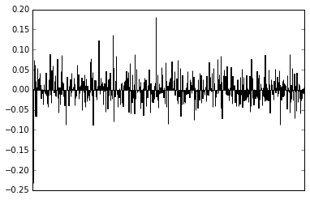
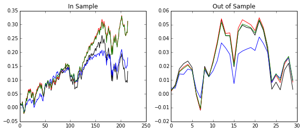

Correlation is a very fundamental and viseral way of understanding how the stock market works and how strategies perform. Modern portfolio theory has made great progress in tying together stock data with portfolio selection. Today, we're going to explore how the eigendecomposition of the returns correlation matrix could help you invest. This will be the first post in a series of posts to help you understand how advanced mathematics can fit into investing.

## Definitions

First, let's get some definitions out of the way. We will denote the covariance matrix of the returns over some period as $$\Sigma$$ and the correlation matrix as $$C$$. The price for an asset $$i$$ at a given time $$t$$ is $$p_{i,t}$$ and returns for each stock $$i$$ will be written as $$r_{i,t}=(p_{i,t}-p_{i,t-1})/p_{i,t-1}$$ and the standard deviation of the return in time as $$\sigma_i$$. These returns can be arranged into a matrix and used to find the sample covariance and correlation matrix which we will do below. 

    Warning! The analysis herein is a presentation of a part of Markowitz Portfolio Theory. Notes you may come across for this theory assumes linear returns (not log!), and it will be confusing as some notes do casually use log-returns without so much as a mention of the extentions to correct for this.

We will use $$\sigma = [\sigma_1^2, \dots, \sigma_N^2]$$ to denote the variances of $$N$$ stocks each with standard deviation $$\sigma_i$$ over the period in question. The notation $$D(\sigma)$$ will be a diagonal matrix such that $$D(\sigma)_{ii} = \sigma_i$$ and $$D(\sigma)_{ij}=0$$ for $$i\neq j$$. Therefore, we have the relation
\begin{equation}
 \Sigma = D(\sigma)^{1/2} C D(\sigma)^{1/2}
\end{equation}

We will further define the amount invested in stock $$i$$ relative to one's total capital as $$w_i$$. If $$w_{Apple}=.5$$, this means we are investing 50% of our capital into Apple. This is also called going "long" in a stock. If a weight is negative, that is related to a "short sale", where you borrow capital to buy the stock. Usually, you "long" (verb) stocks that will increase in value and "short" (verb) stocks that will decrease.

# Portfolio Theory Fundamentals

If we have a set of stocks $$S$$ and our chosen weights represented as a vector $$w = [w_i]_{i \in S}$$, then the pair $$(S,w)$$ describes a portfolio allocation. This can be used, for instance, in a "buy and hold" strategy for investing. If we had access to the covariance matrix $$\Sigma$$, then the risk (variance!) of the investing strategy is given by the formula
\begin{equation}
\text{risk} = w^T \Sigma w,
\end{equation}

and the expected return of a portfolio for the period in question would be
\begin{equation}
\text{expected return } = \sum_{i\in S} w_i E(R_i)
\end{equation}
where $$E(R_i)$$ is the expected return for the stock defined for a period. The formula is $$E(R_i) =( p_{end} - p_{start}) / p_{start}$$. See [section 2](https://www.nr.no/files/samba/bff/SAMBA0304.pdf) for more information on why it is defined like this.

This is an extremely important idea-- we have a way to quantify our risk for a given portfolio! Let me add one interesting point mathematically. This formula lends itself to be used in all sorts of optimization problems (which we may head into later), but there's a very simple one we can point out immediately. If we would like the minimum risk when the weight are of unit length in $$L^2$$, the weight are simply *the eigenvector associated with the smallest eigenvalue and the risk is the smallest eigenvalue.* We have just witnessed a powerful connection, and frankly, one of the most approachable applications of eigenvalues and eigenvectors. 

## Introducing Eigenportfolios

Let's switch gears and talk about the correlation matrix. Since the correlation matrix is a similarity transform of the covariance matrix, any insights we glean from the correlation matrix can be applied to the covariance and this question of selecting allocation weights. For those familiar with Principal Component Analysis, some of this next section will look familiar...

The correlation has some nice properties in the case of stock returns. First of all, it is a symmetric matrix, and so its eigenvalues are positive and its eigenvectors are orthogonal to each other. The typical interpretation (PCA) of the eigenvalue decomposition of a correlation matrix is this:
    1. The eigenvalues give the "variance" of each "factor" or eigenvector
    2. The variance associated with each factor is "uncorrolated" with the others
I put the words above in quotes because this is meaningless until you connect it to where the matrix came from. Here, we know loosely that each eigenvalue corresponds to the risk of a portfolio and that the eigenvectors can represent an allocation of weights. So in this context, we can interpret the eigenvalues and eigenvectors as
    - Eigenvectors are the "eigenportfolios", strategy weight allocations which are uncorrolated to other eigenportfolios
    - Eigenvalues are the "risk" of the given eigenportfolio
Now, all that's left is how to do it!

## Solving for Eigenportfolios

First, let's relate risk to the correlation matrix.

\begin{equation}
\text{risk} = w^T \Sigma w = w^T [D(\sigma)^{1/2} C D(\sigma)^{1/2}] w = (D(\sigma)^{1/2}w)^T C (D(\sigma)^{1/2}w) = v^T C v
\end{equation}
 where $$v = D(\sigma)^{1/2}w$$. Solving for the minimum risk portfolio (in $$L^2$$) is equivalent to $$v$$ being the eigenvector (eigenportfolio) of $$C$$ associated with the minimum eigenvalue. For convenience, define $$\mathbb{1} = (1, \dots,  1)^T$$ as a vector of all 1's. To transform this back to allocation weights, we can use the formula
 
\begin{equation}
  w = D(\sigma)^{-1/2}v / (D(\sigma)^{-1/2}v)^T \mathbb{1}
\end{equation}

where $$(D(\sigma)^{-1/2}v)^T \mathbb{1}$$ is a normalizing factor so that all the weights sum to 1.

Any eigenportfolio found through the correlation matrix can be mapped back to allocation weights. In fact, because the correlation matrix is symmetric, *any allocation* can be written as a linear combination of eigenportfolios. So, any buy and hold investing strategy can be thought of as choosing weights of the eigenportfolios.

## The Market Eigenvalue

As an aside, it has been empirically verified that the largest eigenvalue and associated eigenportfolio will correlate strongly with the market, assuming the data you built the matrix with captures the market. Usually, when using this technique in practice, you may want to remove that eigenportfolio so that your returns will be (hopefully) disconnected with the marked.

# Numerical Example

To show an example, first we need to construct a correlation matrix from closing stock price data.

## Cleaning the Data

The data for this section can be found [here](../files/eigenvesting1/sp500hst.csv). We begin by reading in a table with the columns Ticker, Date and (Closing) Price . Each row has the value for one date. First, let's read in the data, parse the strings and order the dataframe with pandas. 


    import pandas as pd
    import numpy as np
    
    dateparse = lambda dates: [pd.datetime.strptime(x, '%Y%m%d') for x in dates]
    
    d = pd.read_csv('sp500hst.csv', header=0, parse_dates=[0], date_parser=dateparse)
    d.sort(columns=['Ticker','Date'], inplace=True)
    
    d.head()



<table border="1" class="dataframe">
  <thead>
    <tr style="text-align: right;">
      <th></th>
      <th>Date</th>
      <th>Ticker</th>
      <th>Price</th>
    </tr>
  </thead>
  <tbody>
    <tr>
      <th>0</th>
      <td>2009-08-21</td>
      <td>A</td>
      <td>25.60</td>
    </tr>
    <tr>
      <th>1</th>
      <td>2009-08-24</td>
      <td>A</td>
      <td>25.64</td>
    </tr>
    <tr>
      <th>2</th>
      <td>2009-08-25</td>
      <td>A</td>
      <td>25.50</td>
    </tr>
    <tr>
      <th>3</th>
      <td>2009-08-26</td>
      <td>A</td>
      <td>25.32</td>
    </tr>
    <tr>
      <th>4</th>
      <td>2009-08-27</td>
      <td>A</td>
      <td>25.50</td>
    </tr>
  </tbody>
</table>

We will calculate expected returns while calculating the returns for each stock for each day.

    # Expected returns
    expected_returns = pd.Series(index= d['Ticker'].unique())
    
    for stock in d['Ticker'].unique():
        # Pandas dataframes do not copy the values when you use a slice for the .iloc attribute
        indices = np.where(d['Ticker'] == stock)[0]
        min_ind, max_ind = np.min(indices), np.max(indices)+1
        # Expected returns
        expected_returns.loc[stock] = (d.iloc[max_ind-1, 2] - d.iloc[min_ind, 2])/d.iloc[min_ind,2]
        # So we can safely set the values here
        d.iloc[min_ind:max_ind, 2]=d.iloc[min_ind:max_ind, 2].pct_change()
    d.head()


<table border="1" class="dataframe">
  <thead>
    <tr style="text-align: right;">
      <th></th>
      <th>Date</th>
      <th>Ticker</th>
      <th>Price</th>
    </tr>
  </thead>
  <tbody>
    <tr>
      <th>0</th>
      <td>2009-08-21</td>
      <td>A</td>
      <td>NaN</td>
    </tr>
    <tr>
      <th>1</th>
      <td>2009-08-24</td>
      <td>A</td>
      <td>0.001562</td>
    </tr>
    <tr>
      <th>2</th>
      <td>2009-08-25</td>
      <td>A</td>
      <td>-0.005460</td>
    </tr>
    <tr>
      <th>3</th>
      <td>2009-08-26</td>
      <td>A</td>
      <td>-0.007059</td>
    </tr>
    <tr>
      <th>4</th>
      <td>2009-08-27</td>
      <td>A</td>
      <td>0.007109</td>
    </tr>
  </tbody>
</table>

As you can see, the first entry of every ticker will be NaN. We will address this soon, but first, we will convert this into an N by T matrix with N stocks and T dates with pandas.

    tickers = d['Ticker'].unique()
    dates = d['Date'].unique()
    df = pd.DataFrame(index = tickers, columns = dates).astype(float)
    
    for k in range(0,len(d)):
        df.at[d.at[k,'Ticker'],d.at[k,'Date']] = d.at[k,'Price']
    
    print(df.iloc[:5,:5])


          2009-08-21  2009-08-24  2009-08-25  2009-08-26  2009-08-27
    A            NaN    0.001562   -0.005460   -0.007059    0.007109
    AA           NaN    0.009494   -0.014890   -0.023071   -0.004072
    AAPL         NaN    0.013050   -0.003353   -0.002892   -0.002072
    ABC          NaN    0.000946   -0.014650    0.000959   -0.000479
    ABT          NaN    0.003291    0.006342   -0.004346    0.007639

We also will remove the NaN's by interpolating. 

    # Since we aren't investing off of this data, we'll interpolate the missing values
    df = df.apply(lambda x : x.interpolate(), axis=1)
    
    in_sample = df.iloc[:, :(df.shape[1]-30)].copy()
    out_sample = df.iloc[:, (df.shape[1]-30):].copy()
    
    # Get the standard deviations
    standard_deviations = in_sample.apply(lambda x : x.std(), axis=1)
    
    # Again, we're not investing! Let's just fill in some NA's...
    in_sample.fillna(0, inplace=True)
    out_sample.fillna(0,inplace=True)
    
    # Save the tickers
    tickers = standard_deviations.index.copy()



## The Eigenvalues of the Correlation Matrix

Finally! We've cleaned the data. That's really the hardest part... now, let's extract an eigenportfolio! To avoid the dreaded Market-correlated portfolio (we aren't trying to build an index fund here!), let's take a portfolio using the next eigenvector.



    correlation_matrix = np.corrcoef(in_sample.values)
    
    D, S = np.linalg.eigh(correlation_matrix)

    D_sigma_12 = np.diag(standard_deviations.values)
    D_sigma_12_inv = np.diag(1./ standard_deviations.values)
    
    eigenportfolio_1 = np.dot(D_sigma_12_inv, S[:,-2]) / np.sum(np.dot(D_sigma_12_inv, S[:,-2]))
    
    # Plot
    eigenportfolio = pd.DataFrame(data= eigenportfolio_1, columns = ['Investment Weight'], index = tickers)
    
    def plot_portfolio(portfolio):
        %matplotlib inline
        import matplotlib.pyplot as plt
        f = plt.figure()
        ax = plt.subplot(111)
        portfolio.plot(kind='bar', ax=ax, legend=False)
        ax.get_xaxis().set_visible(False)
    
        print(portfolio.head())
    
    plot_portfolio(eigenportfolio)
        


          Investment Weight
    A              0.001618
    AA            -0.002425
    AAPL          -0.002973
    ABC            0.013844
    ABT            0.012251
    

This is a typical chart for visualizing an allocation strategy. Each bar indicates the weight associated with a stock and the tickers are arranged in alphabetical order.

At this point, you could start pulling portfolios and mixing and matching them to form new portfolios! Here's an example where we mix the $$L^2$$-Min Variance portfolio with the second highest eigenvector.



    eigenportfolio_min = np.dot(D_sigma_12_inv, S[:,0]) /np.sum(np.dot(D_sigma_12_inv, S[:,0]))
    
    # Invest in them at a rate of 2 to 1
    # Divide by 3 to keep the sum of the weights equal to 1
    final_portfolio = (2*eigenportfolio_1 + 1*eigenportfolio_min)/3
    
    final_eigenportfolio = pd.DataFrame(data= final_portfolio, columns = ['Investment Weight'], index = tickers)
    plot_portfolio(final_eigenportfolio)


          Investment Weight
    A              0.001079
    AA            -0.231904
    AAPL           0.074214
    ABC            0.020855
    ABT            0.061139
    

Lastly, we can calculate the estimated risk and expected return for our portfolio!


    # Calculate the covariance matrix
    covariance_matrix = np.dot(D_sigma_12, np.dot(correlation_matrix, D_sigma_12))
    
    eigenportfolio_market = np.dot(D_sigma_12_inv, S[:,-1]) /np.sum(np.dot(D_sigma_12_inv, S[:,-1]))
    
    # Calculate the risk
    expected_return = np.vdot(expected_returns, eigenportfolio_market)
    risk = np.vdot(eigenportfolio_market, np.dot(covariance_matrix, eigenportfolio_market))
    print('Market Eigenportfolio: The outcome of our investment strategy is approximately %f +/- %f\n' % (expected_return, np.sqrt(risk)))
    
    expected_return = np.vdot(expected_returns, eigenportfolio_min)
    risk = np.vdot(eigenportfolio_min, np.dot(covariance_matrix, eigenportfolio_min))
    print('L2 Min-Risk Eigenportfolio: The outcome of our investment strategy is approximately %f +/- %f\n' % (expected_return, np.sqrt(risk)))
    
    expected_return = np.vdot(expected_returns, eigenportfolio_1)
    risk = np.vdot(eigenportfolio_1, np.dot(covariance_matrix, eigenportfolio_1))
    print('Second Highest Eigenvalue Eigenportfolio: The outcome of our investment strategy is approximately %f +/- %f\n' % (expected_return, np.sqrt(risk)))
    
    expected_return = np.vdot(expected_returns, final_portfolio)
    risk = np.vdot(final_portfolio, np.dot(covariance_matrix, final_portfolio))
    print('Weighted Eigenportfolio: The outcome of our investment strategy is approximately %f +/- %f\n' % (expected_return, np.sqrt(risk)))
    
    

    Market Eigenportfolio: The outcome of our investment strategy is approximately 0.104488 +/- 0.011548
    
    L2 Min-Risk Eigenportfolio: The outcome of our investment strategy is approximately 0.401921 +/- 0.000000
    
    Second Highest Eigenvalue Eigenportfolio: The outcome of our investment strategy is approximately 0.196333 +/- 0.011584
    
    Weighted Eigenportfolio: The outcome of our investment strategy is approximately 0.264862 +/- 0.007723
    
    

This is very loose because I'm not taking short sales into account correctly. It would be better if we constrained the weights to be positive in some kind of optimization problem... 

## In Sample vs. Out of Sample

In machine learning speak, we just validated our performance on our "training" set-- i.e. we have not really done anything. What we'd really want to do is validate our performance on data the strategy has not seen. To do this, we're going to plot our culmulative returns over time in the out of sample period.

Culmulative returns at time $$t$$ is given by $$CR_t = \prod_{i=0}^t (1+r_i)-1$$ where $r_i$ is the return of the period. This will allow us to visualize the performance of the algorithms better over time.

Again, to avoid issues around short sales, I am going to remove them from the strategy and reweight each asset accordingly. We will compare the in sample returns against the month following the out of sample returns.



    import matplotlib.pyplot as plt
    %matplotlib inline
    
    def get_cumulative_returns_over_time(sample, weights):
        filter = np.vectorize(lambda x: 0 if x < 0 else x)
        return (((1+sample).cumprod(axis=1))-1).apply(lambda x : np.multiply(x, filter(weights)/np.sum(filter(weights))), axis=0).sum(axis=0)
    
    f = plt.figure(figsize=(10,4))
    
    ax = plt.subplot(121)
    ax.plot(get_cumulative_returns_over_time(in_sample, eigenportfolio_market), 'black')
    ax.plot(get_cumulative_returns_over_time(in_sample, eigenportfolio_min), 'r')
    ax.plot(get_cumulative_returns_over_time(in_sample, eigenportfolio_1), 'b')
    ax.plot(get_cumulative_returns_over_time(in_sample, final_portfolio), 'g')
    plt.title("In Sample")
    
    ax = plt.subplot(122)
    plt.title("Out of Sample")
    ax.plot(get_cumulative_returns_over_time(out_sample, eigenportfolio_market), 'black')
    ax.plot(get_cumulative_returns_over_time(out_sample, eigenportfolio_min), 'r')
    ax.plot(get_cumulative_returns_over_time(out_sample, eigenportfolio_1), 'b')
    ax.plot(get_cumulative_returns_over_time(out_sample, final_portfolio), 'g')
    



    [<matplotlib.lines.Line2D at 0xc880390>]

Note the colors are:

Color | Portfolio
--- | ---
Black | Market Eigenportfolio
Red | L2 Min Variance Eigenportfolio
Blue | Second Eigenportfolio
Green | Weighted Portfolio

As you can see, although there was a large performance difference during the in sample period, the out of sample period was largely the same. The red and green portfolios performed about the same, where the blue performed similarly with less volatility (eye-balling that). 

# Extensions

We are really just scratching the surface as to what can be done. Once you begin thinking about portfolios as eigenvectors, then there are many many avenues to continue this direction of research. For example,

  * Stability of eigenvectors: What if your second eigenportfolio suddenly switched places with your first and IT becomes the most correlated to the market? You selected it to avoid market correlation! This is an active area of research.
  * How do we deal with sampling error? There is a lot of (seemingly random) error that can arise in building your correlation matrix. This can be alleviated with Random Matrix Theory. 
  * Aren't there optimization problems to choose portfolios based on certain criteria? Yes! That's one of the main questions of Markowitz Portfolio Theory!

In the coming posts, I hope to expand upon this foundation and add more tools to your investing arsenal. And as always, be wary of trying this with real money!

