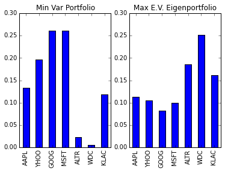
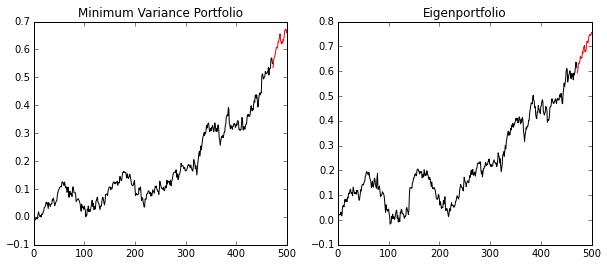

In the last [post](../Eigenvesting-I-Linear-Algebra-Can-Help-You-Choose-Your-Stock-Portfolio), we talked about using eigenportfolios for investing. To continue the series, we are going to present more of Markowitz Portfolio Theory. In particular, we will demonstrate how optimization yields the Minimum Variance Portfolio.

# Minimum Variance Portfolio

We are going to use the notation from the last post. For a universe of $$N$$ stocks, let $$\Sigma$$ be the covariance matrix and $$w$$ the corresponding allocation weight for each stock arranged as a vector. Then, the Minimum Variance Portfolio is the solution to the following problem:
    \begin{equation} \min_{w} w^T \Sigma w \end{equation}
    subject to \begin{equation} w^T \mathbb{1} = 1\end{equation}
    
where $$\mathbb{1}$$ is a vector of 1's. This problem has the unique solution
\begin{equation}
 w =  \frac{ \Sigma^{-1}\mathbb{1} }{ (\Sigma^{-1}\mathbb{1})^T \mathbb{1}  }.
\end{equation}

This solution depends on the covariance matrix, which is of course estimated from data. Even if we had access to the true covariance matrix, the covariance matrix changes over time. This means that your estimate of the true Minimum Variance Portfolio will change as well, and you will have to alter your investments occasionally with this technique. Occasionally, you should rebalance your portfolio, and at that time you could update the covariance matrix.

## Proof

If you define the function 
\begin{equation}
 \mathcal{L}(w,\lambda) := w^T\Sigma w + \lambda (w^T \mathbb{1} - 1),
\end{equation}
then since $$\Sigma$$ is symmetric, the quadratic part is positive definite and a unique minimizer exists and occurs at $$(w,\lambda)$$ such that $$\nabla \mathcal{L}(w,\lambda) = (0,\dots,0)^T.$$ Solving this equation gives two equations that are satisfied: from the $$\lambda$$ component of the gradient we recovery the constraint $$w^T \mathbb{1} = 1$$. From the top $$N$$ components associated with $$w$$, we have the equation (after some algebra)
\begin{equation}
\Sigma w = -\lambda \mathbb{1}.
\end{equation}
If $$\Sigma$$ is invertible, then the unique solution is
\begin{equation}
 w = -\lambda  \Sigma^{-1}\mathbb{1} = \frac{ -\lambda  \Sigma^{-1}\mathbb{1} }{1}.
\end{equation}
By substituting the constraint in for the denominator, we eliminate $$-\lambda$$ to have the solution:
\begin{equation}
 w = \frac{ -\lambda  \Sigma^{-1}\mathbb{1} }{w^T \mathbb{1} } = \frac{ -\lambda  \Sigma^{-1}\mathbb{1} }{ (-\lambda  \Sigma^{-1}\mathbb{1})^T \mathbb{1}  } =  \frac{ \Sigma^{-1}\mathbb{1} }{ (\Sigma^{-1}\mathbb{1})^T \mathbb{1}  }.
\end{equation}

# Example

We're going to use the code from the last post and expand upon it with our new analytical tool. First, we get the data as we did before:


    import pandas as pd
    import datetime as dt
    from pandas.io.data import DataReader
    
    start, end = dt.datetime(2012, 1, 1), dt.datetime(2013, 12, 31)
    tickers = ['AAPL', 'YHOO','GOOG', 'MSFT','ALTR','WDC','KLAC'] 
    prices = pd.DataFrame()
    for ticker in tickers:
        prices[ticker] = DataReader(ticker,'yahoo', start, end).loc[:,'Close'] #S&P 500
    returns = prices.pct_change()
    returns = returns.iloc[1:, :] # Remove first row of NA's
    training_period = 30
    in_sample = returns.iloc[:(returns.shape[0]-training_period), :].copy()
    tickers = returns.columns.copy() # Save the tickers


Now, we're going to calculate the inverse of the covariance matrix using a pseudo-inverse (incase it is ill-conditioned or singular) and then construct the minimum variance strategy weights.


    import numpy as np
    
    covariance_matrix = in_sample.cov().values
    inv_cov_mat = np.linalg.pinv(covariance_matrix) # Use pseudo-inverse incase matrix is singular / ill-conditioned
    
    # Construct minimum variance weights
    ones = np.ones(len(inv_cov_mat))
    inv_dot_ones = np.dot(inv_cov_mat, ones)
    min_var_weights = inv_dot_ones/ np.dot( inv_dot_ones , ones)
    
    min_var_portfolio = pd.DataFrame(data= min_var_weights, columns = ['Investment Weight'], index = tickers)
    min_var_portfolio


<table border="1" class="dataframe">
  <thead>
    <tr style="text-align: right;">
      <th></th>
      <th>Investment Weight</th>
    </tr>
  </thead>
  <tbody>
    <tr>
      <th>AAPL</th>
      <td>0.133215</td>
    </tr>
    <tr>
      <th>YHOO</th>
      <td>0.196214</td>
    </tr>
    <tr>
      <th>GOOG</th>
      <td>0.260885</td>
    </tr>
    <tr>
      <th>MSFT</th>
      <td>0.261103</td>
    </tr>
    <tr>
      <th>ALTR</th>
      <td>0.023642</td>
    </tr>
    <tr>
      <th>WDC</th>
      <td>0.006199</td>
    </tr>
    <tr>
      <th>KLAC</th>
      <td>0.118743</td>
    </tr>
  </tbody>
</table>

We will also compare it to the largest eigenvalue's eigenportfolio:


    # Largest eigenvalue eigenportfolio
    D, S = np.linalg.eigh(covariance_matrix)
    eigenportfolio_1 = S[:,-1] / np.sum(S[:,-1]) # Normalize to sum to 1
    eigenportfolio_largest = pd.DataFrame(data= eigenportfolio_1, columns = ['Investment Weight'], index = tickers)
    
    # Plot
    %matplotlib inline
    import matplotlib.pyplot as plt
    f = plt.figure()
    ax = plt.subplot(121)
    min_var_portfolio.plot(kind='bar', ax=ax, legend=False)
    plt.title("Min Var Portfolio")
    ax = plt.subplot(122)
    eigenportfolio_largest.plot(kind='bar', ax=ax, legend=False)
    plt.title("Max E.V. Eigenportfolio")
    print(min_var_portfolio)


          Investment Weight
    AAPL           0.133215
    YHOO           0.196214
    GOOG           0.260885
    MSFT           0.261103
    ALTR           0.023642
    WDC            0.006199
    KLAC           0.118743
    

Now let's test the algorithm on returns data and compare it to the eigenprofile related to the largest eigenvalue.


    def get_cumulative_returns_over_time(sample, weights):
        return (((1+sample).cumprod(axis=0))-1).dot(weights)
    
    in_sample_ind = np.arange(0, (returns.shape[0]-training_period+1))
    out_sample_ind = np.arange((returns.shape[0]-training_period+1), returns.shape[0])
    
    cumulative_returns = get_cumulative_returns_over_time(returns, min_var_portfolio).values
    cumulative_returns_largest = get_cumulative_returns_over_time(returns, eigenportfolio_largest).values
    
    
    f = plt.figure(figsize=(10,4))
    
    ax = plt.subplot(121)
    ax.plot(cumulative_returns[in_sample_ind], 'black')
    ax.plot(out_sample_ind,cumulative_returns[out_sample_ind], 'r')
    plt.title("Minimum Variance Portfolio")
    
    ax = plt.subplot(122)
    ax.plot(cumulative_returns_largest[in_sample_ind], 'black')
    ax.plot(out_sample_ind,cumulative_returns_largest[out_sample_ind], 'r')
    plt.title("Eigenportfolio")


The minimum variance portfolio did not beat the eigenportfolio (with the most variance), but it had less variance! Usually, this type of portfolio could be blended with other strategies to try to guarantee some returns in bad times. If we didn't trust our math, we could calculate this variance like so for verification:


    # Variance = w^T Sigma w
    largest_var = np.dot(eigenportfolio_1, np.dot(covariance_matrix, eigenportfolio_1))
    min_var = np.dot(min_var_weights, np.dot(covariance_matrix, min_var_weights))
    
    print('The eigenportfolio has a variance of %f.\nThe minimum variance portfolio has a variance of %f'
          % (largest_var,min_var))


    The eigenportfolio has a standard deviation of 0.000139.
    The minimum variance portfolio has a standard deviation of 0.000092

## Additional Modeling Constraints

You can extend this problem by adding more constraints or terms to the function we with to optimize.

### "Efficiency" Portfolios

Let $$\mu$$ be a vector of expected (linear) returns for each stock. Then you can calculate the minimum variance portfolio according to a given return $$\gamma$$ for a period
    \begin{equation} \min_{w} w^T \Sigma w \end{equation}
    subject to \begin{equation} w^T \mathbb{1} = 1\end{equation}
    \begin{equation} w^T \mu = \gamma. \end{equation}
Notice, this approach gives you the minimum variance for a set return over a period... hence, "efficiency". This formulation also has an exact solution that can be solved via Lagrange multipliers. 

### No Short Sales

Adding the constraints $$w_i \geq 0$$ for all stocks $$i$$ to any portfolio optimization problem will give us a solution with no short sales. This already would make life much easier for a basic backtesting algorithm, and for the common investor to implement as an investing strategy. However, this problem would typically be solved with a quadratic programming solver (not analytically like we have done thus far).
