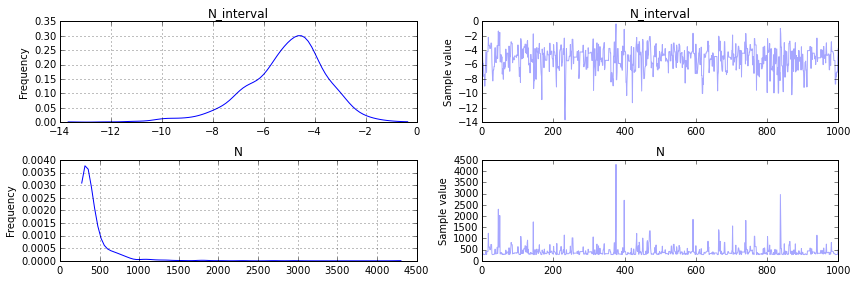
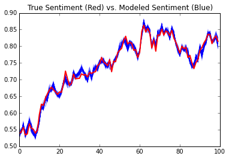
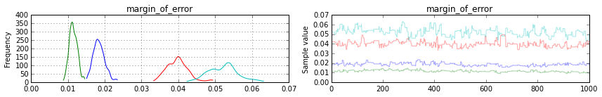

In today's post, we're going to introduce two problems and solve them using Markov Chain Monte Carlo methods, utilizing the PyMC3 library in Python. We aim to demonstrate the value of such methods by taking difficult analytical problems, and transforming each of them into a simpler Bayesian inference problem.  

PyMC3 is still in beta but it's a great library with a slick syntax. It's still in active development so there are some kinks, but overall it's a great choice. It's also much easier to install than it's predecessor PyMC2.

## Bayesian Crash Course

The Bayesian approach is based on Bayes rule from probability, that is
\begin{equation}
p( A | B ) = \frac{p(B | A) p(A)}{p(B)}.
\end{equation}
Without the "normalizing factor", this relationship can be written with the "proportional to" symbol
\begin{equation}
p( A | B ) \propto p(B | A) p(A).
\end{equation}
This is commonly written in a "Bayesian" context as
\begin{equation}
\text{Posterior} \propto \text{Likelihood} \times \text{Prior}.
\end{equation}
Let's go through an example with a view towards sampling. Say you would like to estimate some parameter $$p$$ and you have data $$d$$. One example is checking if  coin is biased, and $$p$$ is the probability a coin lands heads. You have some initial guess about $$p$$ that we represent as a probability distribution called the prior. You can write this as $$p \sim Dist(a,b)$$ where Dist is some distribution dependong on some fixed parameters $$a,b$$. Then, we assume our data $$d$$ was generated from a data model also modeled as a probability distribution that depends on our parameter $$p$$: $$d \sim Dist(p)$$, which is also called the likelihood. Combining these two pieces of information gives us an updated picture of the prior, called the posterior distribution, on our beliefs about the parameter $$p$$. When you write the problem in a sampling-friendly notation, the posterior distribution is never written explicitely, because it comes about from sampling. Instead we only write the prior and likelihood which implicitly say "after we sample from this distribution, we will be sampling from the posterior $$\pi( p | d)$$". Note, we only use $$\pi$$ to not write the sometimes confusing $$p(p)$$. 

The notation more commonly associated with sampling methods is
\begin{equation}
d_i \sim Dist(p)
\end{equation}
\begin{equation}
p \sim Dist(a,b).
\end{equation}
Now that we have our notation in order, let's look at some worked examples.

 
# Two Problems 

The two problems are are going to present are the German tank problem and measuring population sentiment over time via polls. Both of these problems demonstrate the flexibility of the Bayesian framework and the applicability of sampling theory in general to problem solving.

## The German Tank Problem

As a warm up, we discuss how we can model the German Tank problem in a Bayesian setting. The German Tank Problem comes from World War Two. The Allies hypothesized that the serial numbers on German tanks started at $$s_0=1$$ and each additional serial number followed the rule $$s_n=s_{n-1} +1$$ for $$n>0$$. Of course, this seems like a wild assumption, but an apocryphal reason I've heard given for this hypothesis is "because they're German".

This was actually very helpful for the Allies. By knowing how many tanks they captured and the maximal serial number they captured, they could estimate the total number of German tanks, and they were actually pretty close! The more remarkable thing is they did it with an analytical solution. However, Bayesian methods give a practical and intuitive sampling solution.

Think of how you'd simulate the answer. We first would select a total number of tanks $$N$$. Then, we'd at random sample $$k$$ serial numbers from $$(0,N)$$. What we want to know is what are likely values of $$N$$ given the numbers we selected. 

Assume we have selected numbers $$n_1,n_2,\dots, n_k$$ at the outset. It seems reasonable to assume the German's didn't have more than 10000 tanks. This would give us a prior of
\begin{equation}
N \sim \text{Uniform}(\max_i n_i,10000)
\end{equation}
Now, once we have selected $$N$$, we want to know how likely it was to select the numbers we did given $$N$$ is the total. If we assume (which may be bogus) that we have the same change to select each tank from $$0$$ to $$N$$, then the likelihood is just a Uniform distribution, that is
$$n_i \sim \text{Uniform}(0,N).$$
The final model in all its glory is simply
\begin{equation}
n_i \sim \text{Uniform}(0,N)
\end{equation}
\begin{equation}
N \sim \text{Uniform}(\max_i n_i,10000).
\end{equation}

    
    Caveat: You could be more precise and assume the distributions are discrete uniform distributions,
    but we're already approximating so why split hairs. Also, currently PyMC3 (which is in beta) 
    is having some issues around that distribution...

Putting this together, we have a sampling model that is intuitive in a way the maximum likelihood estimator is not (unless, obviously, you regularly do statistics). If you are familiar with the typical approach, you'll notice that there is a **lot** of thought put into it. You have to think about your maximum serial number and the likelihood that your maximum serial number would appear given some maximum $$N$$ and then sum a series of probabilities from your maximum to...... sorry, I dozed off there. Let's take a look at the code!



    import numpy as np
    import pymc3 as pm
    observed = np.array([7,275,182,86])
    m = max(observed)
    
    with pm.Model() as model:
        N = pm.Uniform('N',m,10000)
        L = pm.Uniform('Likelihood', 0, N, observed=observed)


    Applied interval-transform to N and added transformed N_interval to model.
    



    with model:
        step = pm.Metropolis()
        start ={'N' : m}
        samples = pm.sample(10000, step,start)


     [-----------------100%-----------------] 10000 of 10000 complete in 0.8 sec



    %matplotlib inline
    pm.traceplot(samples[-2000::2])



    np.median(samples[-2000::2]['N'])



    346.15605336535555

You can see immediately in our plot for N that our posterier distribution is reasonable. The (frequentist) analytical solution is $$\hat{N} = m + m/k - 1=  342.75$$ and that seems to agree with the peak (and median) in the distribution we found for $$N$$, but now we have an actual probability distribution that we can do analysis with! In fact, it turns out that there is a 68% change according to our analysis that the Germans had 400 or less tanks:


    sum(samples[-2000::2]['N'] <= 400)/len(samples[-2000::2]['N'])


    0.68500000000000005

## Determining Sentiment

This example is admittedly a lot more complicated than the previous example. The model presented below is inspired by Simon Jackman's paper "Pooling the Polls Over an Election Campaign". The focus of the model is tracking the determination of how many people will vote for a certain candidate (or support an issue, etc) over time.

### Generating Data

We are going to generate data for this experiment. First, we will generate the true sentiment towards an issue (i.e. the % of the population for it) using a Gaussian Random Walk up to time $$T$$. We will call the true sentiment $$S$$.
\begin{equation}
S_t \sim N(\alpha_{t-1}, .02^2),\ t=2,\dots, T
\end{equation}
\begin{equation}
\alpha_1 = .53
\end{equation}
To generate fake polls, let $$\omega_i$$ be the margin of error for pollster $$i$$, then we simulate their polls $$p_{i,t}$$, the % polled that agree with the issue, via
\begin{equation}
p_{i,t} \sim Normal(S_t, \omega_i),\ t=1,\dots, T.
\end{equation}


    # Create fluctuating poll data for four pollsters
    starting_sentiment = .53
    true_sentiment = starting_sentiment + np.random.normal(0,.02,size=100).cumsum()
    margin_of_error_poll_1 = .02
    margin_of_error_poll_2 = .01
    margin_of_error_poll_3 = .04
    margin_of_error_poll_4 = .05
    poll_data = [ np.random.normal(true_sentiment, margin_of_error_poll_1, size=100),
                np.random.normal(true_sentiment, margin_of_error_poll_2,size=100),
                np.random.normal(true_sentiment, margin_of_error_poll_3,
                                                  size=100),
                np.random.normal(true_sentiment, margin_of_error_poll_4,
                                                  size=100)]


### Modeling the Interactions in a Hierarchical Setting

Now, to model this, our likelihood comes from the values of the polls. We are going to break up the equations into their function below to explain them. Here are some of the modeling decisions we made:

1. We want a model that explains all the polling data, so we pool the starting point of the random walk.
2. We partially pool the margin of error $$w_i$$ because it is different for each pollster but they're all trying to track the same sentiment.
3. Since we know there is no bias (ha!), we are not modeling it.

You can now see how we did this as equations below:

Likelihood:
\begin{equation}
p_{i,t} \sim N(\mu_{t}, \omega_i),\ t=1,\dots, T.
\end{equation}

Pooled Poll Outcome (with prior):
\begin{equation}
\mu_{t} = p_{0} + \alpha_t
\end{equation}
\begin{equation}
 p_0 \sim Normal(0.55, 0.3).
\end{equation}

Gaussian Random Walk for the Sentiment:
\begin{equation}
\alpha_t \sim Normal(\alpha_{t-1},1/\sigma^2), \alpha_0 = 0
\end{equation}
\begin{equation}
\sigma \sim Exponential(\tau = 1/.2)
\end{equation}

Partially Pooled Margin of Error:
\begin{equation}
\omega_i \sim Uniform(0,.3)
\end{equation}

Let me discuss a few of these assumptions and why we made them. For example,
$$
\mu_t $$ is defined such that the sentiment average at a certain time $$t$$ is given by the starting sentiment plus the position of the random walk at time $$t$$.
The prior for $$\omega $$ states that we believe the margin of error squared for our sentiment analysis will be between 0 and .3 (that's pretty generous). Our prior $$p_0$$ has came from previous poll data. The prior on $$\sigma$$ states that on average our random walk will take steps of size .2.

    
    # Creating the proper indices to assign variables to the correct polls
    polling_ind = np.zeros((4,100))
    polling_ind[1] = np.ones(100)
    polling_ind[2] = np.ones(100)*2
    polling_ind[3] = np.ones(100)*3
    polling_ind = polling_ind.astype(int)
    
    
    with pm.Model() as poll_model:
        #Prior for starting point
        prior = pm.Normal('p', mu=.55, sd=.3)
        
        # Random walk and hyperprior
        sigma = pm.Exponential('sigma', 1./.2, testval=.1) # No more than 20% avg
        s = pm.GaussianRandomWalk('s', sd=sigma**-2, shape=100)
    
        # Margin of error prior
        sigma2 = pm.Uniform('margin_of_error',lower = 0, upper = .5, shape=4, testval=.05)
        
        # Deterministic formula for mu
        mu = pm.Deterministic('mu',prior + s)
        
        # Likelihood function
        poll = pm.Normal('Likelihood', mu=mu, sd=sigma2[polling_ind], observed=poll_data)


    Applied log-transform to sigma and added transformed sigma_log to model.
    Applied interval-transform to margin_of_error and added transformed margin_of_error_interval to model.
    

Let's clarify what we did here. Our observed data is a (4,100) array, 4 polls for 100 time periods. In the variable $$s$$, we gave it a shape of length (1,100) because $$s$$ only changes in time. The same $$s$$ is used for all polls. On the other hand, we want the same poll starting points to be used for the same polls for all time, so we define an array of size (4,100) where each entry in the first row is 0, each entry in the second row is 1, etc. This way, when we attach it to the variable starting_point_i and sigma2, each row will use  the same draw from the prior.


    # Sampling
    with poll_model:
        step = pm.Metropolis()
        samples3 = pm.sample(20000, step)


     [-----------------100%-----------------] 20000 of 20000 complete in 8.7 sec

Next, we're going to plot multiple samples paths of $$s$$ and compare it to the true sentiment in red.


    import matplotlib.pyplot as plt
    
    for k in range(1,1000):
        plt.plot(samples3[-k]['p']+samples3[-k]['s'], 'b', alpha=.01)
        
    plt.plot(true_sentiment, linewidth=2, color='r')
    plt.title('True Sentiment (Red) vs. Modeled Sentiment (Blue)')


You can also see that our margin of error estimates for each poll aligns with their true values:


    pm.traceplot(samples2[-1000:], varnames=['margin_of_error'])


Note: blue is poll 1, green is poll 2, red is poll 3 and teal is poll 4.

# Closing Thoughts

Bayesian modeling really gives you the flexibility to quantify what you know and what you don't know. In my opinion, it's a great tool for modeling tons of problems which usually are intractible or require very complicated analytical solutions. So the next time you run into a problem... don't get bogged down by the analytical details-- simulate it! It might just be more practical.
