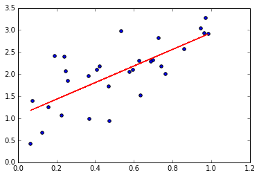
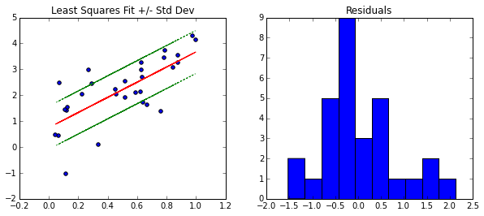
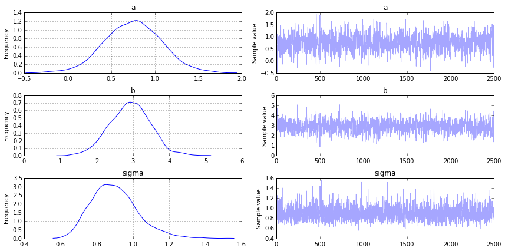
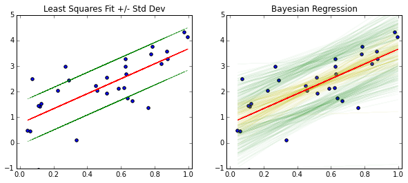

The basic least squares optimization problem is an extremely influencial concept. We are going to trace its roots from the mathematical underpinnings to a Bayesian interpretation.

Least squares itself is a simple minimization problem. Given a set of points, find a "best-fit" line in the sense of the Euclidian distance. Due to its limited scope, more analytical machinery has been built around least squares by both the statistical and mathematical communities. While mathematicians have favored regularization methods, the statistical community expanded the concept to a mechanism for prediction/description called linear regression. This method was then expanded upon again by Bayesian statisticians to include "prior" information on the problem at hand. 

    It's interesting to note that regularization appears 
    naturally in a Bayesian context and we plan to 
    expand upon that later.

Bayesian regression used to be very controversial because of the concept of the prior. The prior is a distribution for the parameters of the models (like a standard deviation $$\sigma$$) that are unknown a priori. In the example above, a Bayesian would put a "prior" on $$\sigma$$ that would give a distribution for the possible values for $$\sigma$$. This "subjectivity" upset many statisticians at the time, and the Bayesian approach was shunned from science for decades. Lately, Bayesian statistics has came back into vogue due in part to the Machine Learning community.

## Least Squares Optimization

Mathematically, it takes a little work to write this down, and to define the problem we need some notation. Let $$x$$ be a vector in $$\mathbb{R}^n$$ and the 2-norm of $$x$$ denoted $$\| x \|^2 =  \sum_{i=1}^n x_i^2$$. For some m by n matrix $$A$$ and vector $$y\in \mathbb{R}^m$$, the least squares problem is formulated as finding the $$x$$ satisfying
\begin{equation}
\min_{x} || Ax - y||^2.
\end{equation}

The usual proof involves differentiation: If you notice that the 2-norm may be written as the dot product of two vectors:
\begin{equation}
 || Ax - y||^2 = (Ax-y)^T(Ax-y) = (Ax)^T(Ax) - 2(Ax)^Ty +y^Ty
\end{equation}
then using the product rule and differentiating:
\begin{equation}
\frac{ \partial}{\partial x}  || Ax - y||^2 = 2 A^TAx -2 A^Ty.
\end{equation}
To find the minimizer, we set this equal to 0 and solve (assuming invertibility) for $$x$$ to find
\begin{equation} 
x = (A^TA)^{-1}A^Ty.
\end{equation}
Of course, we know this is a minimizer because the 2-norm is clearly a quadratic polynomial by definition. One example of a solution is plotted above.

### Connecting Notation

Typically, in applications, m is the number of "predictors" and n is the number of data points we have. The m by n data matrix (A) is denoted $$X$$ and the unknown coefficients (x) are denoted $$\beta$$. The data points continue to be denoted $$y$$. Now, the typical solution to this problem 
the least squares problem is formulated as finding the $$\beta$$ satisfying
\begin{equation}
\min_{\beta} \| X\beta - y\|^2.
\end{equation}
This is the usual presentation of the problem in the statistics literature.

To get from data to least squares, you must first have data points $$\{ (x_i, y_i)\}_{i=1}^{n}$$ where $$x_i \in \mathbb{R}^m$$ and $$y_i\in\mathbb{R}$$. Arranging the (row vectors) $$x_i$$ into a matrix $$X$$ gives you the typical representation of the data matrix $$X$$. 

## Linear Regression

The change from least squares to linear regression is the addition of the data model. A data model is just a probability distribution that is supposed to have generated the data we observed. Statisticians assume a data model to the quanitity they're interested in predicting, and if the data model "fits" well enough, then they expect reasonable predictions or conclusions (i.e. either the perspectives of predictive or descriptive statistics). 

Let's talk about an example. Let $$y=f(x)$$ be some quantity we would like to estimate that is based on $$x$$, our data. We assume the data model for $$y$$ is a normal distribution, that is, $$y\sim N( \mu(x), \sigma)$$ where $$\mu$$ is some function of $$x$$. 

Because they expect the mean $$\mu$$ to be linear, they model the mean as the dot product $$x \cdot \beta$$ for some unknown vector of coefficients $$\beta$$. A nice representation is given by writing
\begin{equation}
y_i \sim N(\mu(x), \sigma)
\end{equation}
\begin{equation}
\mu(x) = \beta \cdot x.
\end{equation}
Now, interestingly enough, the maximum likelihood estimator of the coefficients is again given by $$\beta_{MLE} = (X^TX)^{-1}X^Ty$$. This is the same solution as in the Least Squares problem. If our data $$X$$ is standardized by column (in each predictor), then $$X^TX$$ is almost the correlation matrix.

To think of why this works, remember that the setting is we have a collection of points and we want to draw a line through them which represents a best-fit. Unless these points are literally in a line, there is going to be some error. Statisticians represent this error in their model via the normal distribution. So,  a "model checking" procedure is to verify that "the residuals are normally distributed". The idea is if our estimate is close enough to the true mean line, then we should see the residuals ($$\| X\beta - y\|^2$$) approximately normally distributed with 0 mean.

 It does make sense that we will "miss" points and so we begin to see the need of clarifying how often and how much we miss such points with the idea of a distribution. Including this error helps the model generalize to new points outside of our data set by giving us a confidence/predictive interval.


    import numpy as np
    %matplotlib inline
    import matplotlib.pyplot as plt
    
    np.random.seed(182) #Blink

    b = 2
    a = 1
    sig = .8
    x = np.random.uniform(0,1,size=(30,)) 
    y = b*x+a + np.random.normal(0, sig, size=(30,))
    
    #Arrange data matrix + intercept
    X = np.ones(shape=(30,2))
    X[:,0] = x
    
    # Solve for estimates on beta and sigma
    beta =  np.dot(np.linalg.pinv(np.dot( np.transpose(X), X)),
                   np.dot(np.transpose(X), y))
    sigma = (np.dot(X,beta)-y).std()
    
    print('Data Model : Normal(%fx + %f, %f^2)' % (b,a,sig))
    print('Estimated Data Model : Normal(%fx + %f, %f^2)'% (beta[0],beta[1],sigma))
    
    
    plt.figure(figsize=(10,4))
    plt.subplot(121)
    plt.scatter(x, y)
    plt.plot(x, np.dot(X,beta), 'r')
    plt.plot(x, np.dot(X,beta)+sigma, color='g',linestyle='dotted')
    plt.plot(x, np.dot(X,beta)-sigma, color='g',linestyle='dotted')
    plt.title('Least Squares Fit +/- Std Dev')
    
    plt.subplot(122)
    plt.hist(np.dot(X,beta)-y)
    plt.title('Residuals')

    Data Model : Normal(2.000000x + 1.000000, 0.800000^2)
    Estimated Data Model : Normal(2.215662x + 0.982888, 0.836160^2)


Notice, the residuals $$x_i \cdot \beta - y_i$$ are approximately normally distributed, which confirms the choice of the data model $$y_i \sim N(\mu(x),\sigma)$$.

The green lines should give us a 65% confidence interval for new points (due to the rule about the normal distribution and points within one standard deviation), but the issue is our model does not take into account changes in the coefficients. So at this point, the green line can be a useful heuristic, but it is not something that we have strong confidence in.

## Bayesian Linear Regression

So far, we have been solving for exactly one function $$\mu$$. This process has assumed we know nothing about $$\beta$$ or $$\sigma$$, but what if we have some prior information about these variables? This brings us to the Bayesian perspective.

Bayesian inference is based on the concept of the "posterior" distribution. The posterior distribution is proportional to the likelihood of the observed data times the prior distribution assigned, or in symbols,
\begin{equation}
\text{posterior} \propto  \text{(likelihood)} \times \text{(prior)}.
\end{equation}
In other words, if we give each variable a "best guess" or prior probability distribution, then combined with the data, we can determine the most likely values (i.e. a distribution!) for the parameters. This can be used to improve our confidence/prediction intervals. 

Let's write rewrite the regression problem with prior distributions. If you look at the formulation, we don't know $$\sigma$$ or $$\beta_i$$. So, we can put an "uninformative" prior on them that will be molded by the data:
\begin{equation}
y_i \sim N(\mu(x_i), \sigma)
\end{equation}
\begin{equation}
\mu(x) = \beta \cdot x.
\end{equation}
\begin{equation}
\sigma \sim \text{Uniform}(0,100)
\end{equation}
\begin{equation}
\beta_i \sim \text{Normal}(0,100^2)
\end{equation}
Here, we are using the fact that the scaled data $$X$$ will lead to smaller coefficients.

Solving this problem will lead to the posterior probability distribution (or pdf) of the prior variables, in particular:
\begin{equation}
p(\beta_i, \sigma | x, y) \propto  p(y | \beta_i, \sigma, x) p(\beta_i)p(\sigma).
\end{equation}

Then, we can use the resulting information to make confidence intervals for our predictions because we have a full probability distribution for all the coefficients and the variance! Let's see it in action.

### PyMC3 Example

In this example, we're going to use PyMC3 for a 1-d example of a Bayesian linear regression. The package uses a Markov Chain Monte Carlo sampling method to estimate the posterior distributions. After solving for the posterior distributions, we are going to plot multiple realizations of our data model to give ourselves confidence intervals.


    import pymc3 as pm
    
    with pm.Model() as model:
        _sigma = pm.Uniform('sigma',0,100)
        _b = pm.Normal('b',mu=0,sd=100**2)
        _a = pm.Normal('a',mu=0,sd=100**2)
        _mu = pm.Deterministic('mu', _a + x * _b)
        _likelihood = pm.Normal('y', mu=_mu, sd=_sigma, observed = y)
        
    with model:
        step = pm.NUTS()
        trace = pm.sample(2000, step)

    pm.traceplot(trace[-1000:], varnames=['a','b','sigma'])



    Applied interval-transform to sigma and added transformed sigma_interval to model.
     [-----------------100%-----------------] 2000 of 2000 complete in 5.1 sec

Above are the probability distributions for $$a$$, $$b$$ and $$\sigma$$. Let's explore how they fit the data. The first thing we need to do is find the maximum a posteriori (MAP). This is the mode of the (joint) posterior distribution (approximately the parameters that give you the highest point for each variable in the images above). This will be used when we plot the data.


    # Find the MAP
    with model:
        map_ = pm.find_MAP()

    def reverse_transform(x,a,b):
        # Reverses pymc3's interval transform
        return (b - a) * np.exp(x) / (1 + np.exp(x)) + a

    map_a = reverse_transform(map_['a_interval'],-10,10) # Use the same range as on the original Uniform dist
    map_b = reverse_transform(map_['b_interval'],-10,10)

    # Plot Linear Regression results
    plt.figure(figsize=(10,4))
    plt.subplot(121)
    plt.title('Regression')
    plt.scatter(x, y)
    plt.plot(x, np.dot(X,beta), 'r')
    plt.plot(x, np.dot(X,beta)+sigma, color='g',linestyle='dotted')
    plt.plot(x, np.dot(X,beta)-sigma, color='g',linestyle='dotted')
    plt.title('Least Squares Fit +/- Std Dev')
    plt.xlim(-.02, 1.02)
    plt.ylim(-1, 5)
    
    # Plot Bayesian Results
    plt.subplot(122)
    plt.title('Bayesian Regression')
    plt.scatter(x, y)
    
    # Plot 65% Confidence Lines
    for j in range(0,len(trace[-100:])):
        plt.plot(x,trace['a'][-j]+trace['b'][-j]*x + trace['sigma'][-j],
                 color='g', alpha=.03)
        plt.plot(x,trace['a'][-j]+trace['b'][-j]*x - trace['sigma'][-j],
                 color='g', alpha=.03)
    
    # Plot line for given realization of a and b
    for k in range(0,len(trace[-100:])):
        plt.plot(x,trace['a'][-k]+trace['b'][-k]*x, color='y', alpha=.05)
        
    # Plot a mean line
    plt.plot(x,map_a + map_b*x, color='r')
    plt.xlim(-.02, 1.02)
    plt.ylim(-1, 5)



Here's how you would interpret what you see. The red line is the MAP line. The yellow lines are plots of individual realizations of $$a$$ and $$b$$ superimposed on each other, and the green lines are superimposed realizations of $$bx+a\pm \sigma$$. The green region gives you a 65% confidence region for the location of new values of $$y$$ where the yellow region gives you the distribution for the mean (the red line).

Without performing regression multiple times and doing additional statistical tests, you won't have a confidence interval for the red line, you'll only have an (incorrect) predictive interval using the red line and the green line (since it will not take into account changes in the coefficients which results in the yellow region).

In this context, the methods are still similar. The true differences appear when you are faced with multiple groups that you are trying to fit data to at the same time. This is when the concept of Bayesian Hierarchical Modeling comes into play.

# Connecting the Dots

At this point, it's clear that both linear regression and Bayesian inference are connected to least squares. It may be less clear how they relate to each other.

The "maximum likelihood estimator" is a statistical way of choosing a parameter that most agrees with the data. For example, if we have data $$(x_i,y_i)_{i=1}^{n}$$ with $$y_i \sim Normal(\mu(x_i), \sigma)$$ where $$\sigma$$ is fixed in $$\mathbb{R}$$, then the likelihood function $$f(x | \mu)$$ is defined via the pdf of the Normal distribution:
\begin{equation}
f(x| \mu) =  \prod_{i=1}^{n}\frac{1}{\sigma \sqrt{2\pi}} e^{ - \frac{(x_i - \mu)^2}{2\sigma^2}}
\end{equation}
The maximum likelihood estimator of $$\mu$$ is $$\mu_{MLE}$$ such that 
\begin{equation}
\mu_{MLE} = \text{argmax}_{\mu} f(x | \mu).
\end{equation}

From a Bayesian perspective, assume some prior $$p_0$$ for $$\mu$$. In our case, the MAP estimator is defined via:
\begin{equation}
\mu_{MAP} = \text{argmax}_{\mu} f(x | \mu) p_0(\mu).
\end{equation}

If $$p_0$$ is chosen as the uniform prior (i.e. $$ p_0(\mu) = 1$$ for all $$\mu$$), then it follows that 
$$\mu_{MLE} = \mu_{MAP}$$
after a somewhat complicated proof because the prior is improper (doesn't integrate to 1, or even a finite value).

In my opinion, the maximum likelihood estimator's interpretation from a Bayesian perspective is more natural: It is the mode of the posterior distribution with a uniform prior. It turns out that selecting a prior is a very powerful tool.

