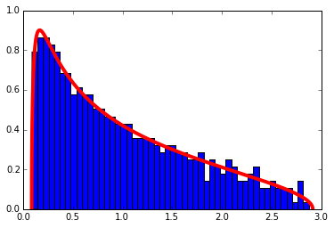
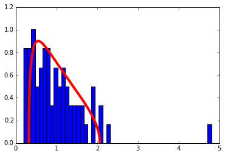
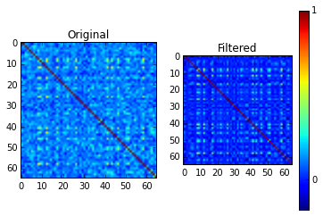
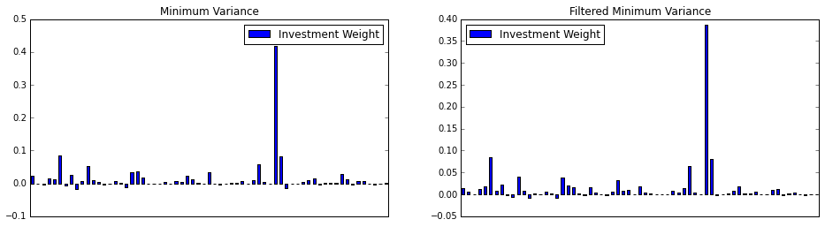
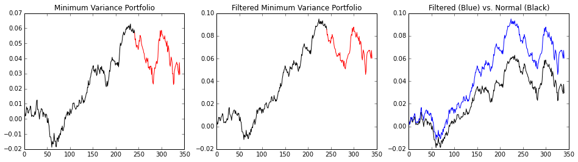

At a talk by [Alan Edelman](https://en.wikipedia.org/wiki/Alan_Edelman), he said that some students who attended his class on random matrix theory [(notes)](http://web.eecs.umich.edu/~rajnrao/Acta05rmt.pdf) at MIT dropped out and started a hedge fund. They're apparently doing pretty well today. In this post, we're going to introduce random matrix theory and some of its most important applications to finance.

One area of random matrix theory is understanding the distribution of the eigenvalues in a (large) random matrix. Under certain assumptions, eigenvalues found in a predicted theoretical range are thought of as due to random interactions in the data. Because of this, we can discard eigenvalues found in such a predicted range to (try to) "filter" randomness from our data, leaving us with only actual trends. It's easy to see how this could be a big deal.

The random matrix we are going to talk about is called a Wishart matrix. It is a square matrix of the form $$W = XX^*$$ where $$X$$ is an $$N\times T$$ matrix and the entries of $$X$$ are i.i.d. random Normal variables, i.e. $$x_{i,j}\sim\mathcal{N}(0,1)$$. Note, for a real-valued values matrix, $$X^* = X^t$$, the transpose of $$X$$. A more general notion would be when all random variables have a fixed variance $$\sigma$$, but without loss of generality, we'll take it to equal 1.

In the case that $$T\geq N$$ and $$N$$ is large, the distribution of the eigenvalues of such a matrix $$W$$ (as defined above) will be distributed approximately like the Marchenko-Pastur distribution. A description and precise theorem may be found [here](https://en.wikipedia.org/wiki/Marchenko%E2%80%93Pastur_distribution).

# An Important Example: Correlation Matrices

A correlation matrix can be and example of Wishart matrices if the data matrix $$X$$ containing $$T$$ data points of $$N$$ variables has i.i.d. Normal entries. The next code will create a correlation matrix from such a matrix and display its eigenvalues with the theoretical distribution superimposed.


    %matplotlib inline
    import matplotlib.pyplot as plt
    import numpy as np
    
    # Definition of the Marchenko-Pastur density
    def marchenko_pastur_pdf(x,Q,sigma=1):
        y=1/Q
        b=np.power(sigma*(1 + np.sqrt(1/Q)),2) # Largest eigenvalue
        a=np.power(sigma*(1 - np.sqrt(1/Q)),2) # Smallest eigenvalue
        return (1/(2*np.pi*sigma*sigma*x*y))*np.sqrt((b-x)*(x-a))*(0 if (x > b or x <a ) else 1)
    
    def compare_eigenvalue_distribution(correlation_matrix, Q, sigma=1, set_autoscale = True, show_top = True):
        e, _ = np.linalg.eig(correlation_matrix) # Correlation matrix is Hermitian, so this is faster
                                   # than other variants of eig
    
        x_min = .0001 if np.power(sigma*(1 - np.sqrt(1/Q)),2) < .0001 else np.power(sigma*(1 - np.sqrt(1/Q)),2)
        x_max = np.power(sigma*(1 + np.sqrt(1/Q)),2)
            
        fig = plt.figure()
        ax  = fig.add_subplot(111)
        bins = 50
        if not show_top:
            # Clear top eigenvalue from plot
            e=e[ e <= x_max+1]
        ax.hist(e, normed = True, bins=50) # Histogram the eigenvalues
        ax.set_autoscale_on(set_autoscale)
        
        # Plot the theoretical density
        f = np.vectorize(lambda x : marchenko_pastur_pdf(x,Q,sigma=sigma))
        
        x_min = .0001 if np.power(sigma*(1 - np.sqrt(1/Q)),2) < .0001 else np.power(sigma*(1 - np.sqrt(1/Q)),2)
        x_max = np.power(sigma*(1 + np.sqrt(1/Q)),2)
        
        x = np.linspace(x_min,x_max,5000)
        ax.plot(x,f(x), linewidth=4, color = 'r')
    
    # Create the correlation matrix and find the eigenvalues
    N= 500
    T= 1000
    X= np.random.normal(0,1,size=(N,T))
    cor = np.corrcoef(X)
    Q= T/N
    compare_eigenvalue_distribution(cor, Q)


# Correlation Filtering

Although it's not always true, it is common to model the log of the daily returns of a stock price as a normal distribution. This approximation holds well enough that much of the modern theory of finance was based around it. (Even today, the basic concepts still hold, with the Normal being replaced with a more skewed distribution.) Therefore, the correlation matrix of the log returns partially falls under the example above.

The idea behind correlation filtering is this: 

1. Calculate the eigenvalues of the correlation matrix
2. If they fall within the theoretic range given by the Marchenko-Pastur distribution, we set those eigenvalues equal to 0, then we reconstruct the matrix. 

Any eigenvalue coming found in that range is considered information that's due to randomness, and so it is thrown out. Let's go through an example. Because of the requirement that N and T be large, this time we are going to use a pre-downloaded dataset of stock prices.

## The Data

First, we pull data from Yahoo for a large universe of stocks. This [list](../files/eigenvesting3/yahoo_tickers_2010.csv) of tickers was cleaned from the list from [here](https://ubuntuincident.wordpress.com/2010/12/17/extract-yahoo-stock-list/). I used the list posted and cleaned it into the file used below. Note, that by default, pandas places the data in a $$T \times N$$ format, and so we will use the built in functions to do things like calculate the correlation/covariance matrix.


    import numpy as np
    import pandas as pd
    import datetime as dt
    from pandas.io.data import DataReader
    
    np.random.seed(777) #Jackpot
    
    start, end = dt.datetime(2012, 1, 1), dt.datetime(2013, 12, 31)
    tickers = pd.read_csv('yahoo_tickers_2010.csv', header=None)[0]
    tickers = np.random.choice(tickers.values, size=100, replace=False) # Choose a random set of headers
    prices = pd.DataFrame()
    for ticker in tickers:
        try:
            prices[ticker] = DataReader(ticker,'yahoo', start, end).loc[:,'Close']
        except Exception as e:
            pass
    returns = prices.pct_change()
    returns = returns.iloc[1:, :]# Remove first row of NA's generated by pct_changes()
    returns.dropna(axis = 1, thresh=len(returns.index)/2, inplace=True) # Drop stocks with over half the data missing
    returns.dropna(axis = 0, thresh=len(returns.columns), inplace=True) # Drop days without data for all stocks
    training_period = 100
    in_sample = returns.iloc[:(returns.shape[0]-training_period), :].copy()
    tickers = in_sample.columns # Remove tickers that were dropped

    returns.shape #(323, 69)


## Log Transformation

The cleaning steps are largely the same as in the first post on Eigen-vesting, but this time we have to convert to the log returns. This extra step will be added without fanfare. The explanation for the steps can be found in the previous post.

The log transform is $$r_{i,t} \mapsto \text{log}(r_{i,t} +1 )$$.

Ironically, because the taylor expansion for the log around 1 is
\begin{equation}
\sum_{n=1}^\infty (-1)^{n-1}\frac{x^n}{n}
\end{equation}
most of the values will remain about the same. Note: we only need to do this for the in sample data points.


    import numpy as np
    
    log_in_sample = in_sample.apply(lambda x : np.log(x+1))
    log_in_sample.dropna(0, inplace= True) #Drop those NA
    log_in_sample.dropna(1, inplace = True) 
    
    # We will need the standard deviations later:
    variances = np.diag(log_in_sample.cov().values)
    standard_deviations = np.sqrt(variances) 


## The Eigenvalues of the Correlation Matrix

Finally! We've cleaned the data. That's really the hardest part... now, the theory breaks down some when T is no longer greater than N, but we'll manage. Pandas, unlike numpy, does a correlation on the columns rather than the rows, so we're going to just use numpy's corrcoeff().

We're going to show a cute computation that gives more evidence to the fact that the standardized log returns satisfy approximately the assumptions of Wishart matrices. As an experiment, we're going to take the matrix we just made and shuffle each row (i.e. the time series for each return). Then, if each row was a Normal(0,1) variable, now the entries should be i.i.d. because any relationship between rows (in time) we will have shuffled away. Take a look at the distribution:


    T, N = returns.shape # Pandas does the reverse of what I wrote in the first section
    Q=T/N
    
    correlation_matrix = log_in_sample.interpolate().corr()
    
    compare_eigenvalue_distribution(correlation_matrix, Q, set_autoscale = False)


Wow! So it looks like all of our assumptions approximately hold when there's no time stucture, so any deviations implies a non-random structure in the data. Time to filter the matrix... this part in many ways amounts to voodoo. As advised by [Merrill Lynch](http://faculty.baruch.cuny.edu/jgatheral/randommatrixcovariance2008.pdf), the theoretical distribution may not quite fit your data because of sampling error, so you can "tune" the Q and $$\sigma$$ parameters (see the function definition above) to get a better fit. The fit looks good enough to me without tinkering for our exercise.


    # Let's see the eigenvalues larger than the largest theoretical eigenvalue
    sigma = 1 # The variance for all of the standardized log returns is 1
    max_theoretical_eval = np.power(sigma*(1 + np.sqrt(1/Q)),2)
    
    D, S = np.linalg.eigh(correlation_matrix)
    
    print(D[D > max_theoretical_eval])


    [ 2.07255233  2.23927193  4.80235965]
    

Only 36 eigenvalues remain of 69! You'll also notice that one eigenvalue is larger than the rest by a decent margin. This is called the market eigenvalue and perhaps we'll talk more about it in the future. Now, let's "filter" the matrix and put it back together.


    # Filter the eigenvalues out
    D[D <= max_theoretical_eval] = 0
    
    # Reconstruct the matrix
    temp =  np.dot(S, np.dot(np.diag(D), np.transpose(S)))
    
    # Set the diagonal entries to 0
    np.fill_diagonal(temp, 1)
    filtered_matrix = temp
    
    f = plt.figure()
    ax = plt.subplot(121)
    ax.imshow(correlation_matrix)
    plt.title("Original")
    ax = plt.subplot(122)
    plt.title("Filtered")
    a = ax.imshow(filtered_matrix)
    cbar = f.colorbar(a, ticks=[-1, 0, 1])


One thing I find curious is the literature advises setting the filtered correlation matrix's diagnoal entries to 1 to preserve the typical interpretation of the correlation matrix (for example, (here)[http://polymer.bu.edu/hes/articles/pgrags02.pdf]). I attempted other methods like a similarity transform to make them all 1 or directly scaling the eigenvalues, and neither seemed to work very well.

## Comparison for Constructing the Minimum Variance Portfolio

Here we will do a quick in/out-of-sample comparison between the minimum variance portfolio of the filtered and standard covariance. Let $$D= diag(\Sigma)$$, that is the matrix with $$D_{i,i} = \Sigma_{i,i}$$ and $$D_{i,j} = 0$$ for $$i\neq j$$. We will make use of the fact that the correlation matrix $$C$$ and the covariance matrix $$\Sigma$$ are related by the formula
\begin{equation}
\Sigma = D^{1/2} C D^{1/2}.
\end{equation}

By replacing $$C$$ with the filtered correlation matrix $$\hat C$$, then we have the filtered covariance matrix $$\hat \Sigma$$.


    # Reconstruct the filtered covariance matrix
    covariance_matrix = in_sample.cov()
    inv_cov_mat = np.linalg.pinv(covariance_matrix)
    
    # Construct minimum variance weights
    ones = np.ones(len(inv_cov_mat))
    inv_dot_ones = np.dot(inv_cov_mat, ones)
    min_var_weights = inv_dot_ones/ np.dot( inv_dot_ones , ones)
    
    plt.figure(figsize=(16,4))
    
    ax = plt.subplot(121)
    min_var_portfolio = pd.DataFrame(data= min_var_weights, 
                                     columns = ['Investment Weight'],
                                     index = tickers)
    min_var_portfolio.plot(kind = 'bar', ax = ax)
    plt.tick_params(axis='x', which='both', bottom='off', top='off', labelbottom='off')
    plt.title('Minimum Variance')
    
    # Reconstruct the filtered covariance matrix from the standard deviations and the filtered correlation matrix
    filtered_cov = np.dot(np.diag(standard_deviations), 
                               np.dot(filtered_matrix,np.diag(standard_deviations)))
    
    filt_inv_cov = np.linalg.pinv(filtered_cov)
    
    # Construct minimum variance weights
    ones = np.ones(len(filt_inv_cov))
    inv_dot_ones = np.dot(filt_inv_cov, ones)
    filt_min_var_weights = inv_dot_ones/ np.dot( inv_dot_ones , ones)
    ax = plt.subplot(122)
    filt_min_var_portfolio = pd.DataFrame(data= filt_min_var_weights, 
                                     columns = ['Investment Weight'],
                                     index = tickers)
    filt_min_var_portfolio.plot(kind = 'bar', ax = ax)
    plt.tick_params(axis='x', which='both', bottom='off', top='off', labelbottom='off')
    plt.title('Filtered Minimum Variance')
    
    print(filt_min_var_portfolio.head())
 
   

                 Investment Weight
    BANSWRAS.NS           0.014983
    ETEC.OB               0.005088
    ALRN                  0.000680
    CE2.DE                0.012353
    SUL.AX                0.017722
    

Now, let's plot their return over time. Since both contain short sales, we're going to remove short sales and redistribute their weight.


    def get_cumulative_returns_over_time(sample, weights):
        # Ignoring short sales
        weights[weights <= 0 ] = 0 
        weights = weights / weights.sum()
        return (((1+sample).cumprod(axis=0))-1).dot(weights)
    
    in_sample_ind = np.arange(0, (returns.shape[0]-training_period+1))
    out_sample_ind = np.arange((returns.shape[0]-training_period), returns.shape[0])
    
    cumulative_returns = get_cumulative_returns_over_time(returns, min_var_portfolio).values
    cumulative_returns_filt = get_cumulative_returns_over_time(returns, filt_min_var_portfolio).values
    
    f = plt.figure(figsize=(16,4))
    
    ax = plt.subplot(131)
    ax.plot(cumulative_returns[in_sample_ind], 'black')
    ax.plot(out_sample_ind,cumulative_returns[out_sample_ind], 'r')
    plt.title("Minimum Variance Portfolio")
    
    ax = plt.subplot(132)
    ax.plot(cumulative_returns_filt[in_sample_ind], 'black')
    ax.plot(out_sample_ind,cumulative_returns_filt[out_sample_ind], 'r')
    plt.title("Filtered Minimum Variance Portfolio")
    
    ax = plt.subplot(133)
    ax.plot(cumulative_returns, 'black')
    ax.plot(cumulative_returns_filt, 'b')
    plt.title("Filtered (Blue) vs. Normal (Black)")


Of course, the covariance matrix is time dependent regardless of the filtering, and the filtering changes overtime. As there is no free lunch, it's possible for the unfiltered portfolio to beat the filtered portfolio on occasion, but if it does, it's probably due to random chance.
