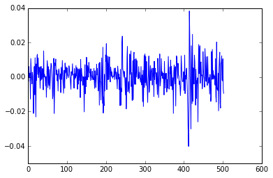
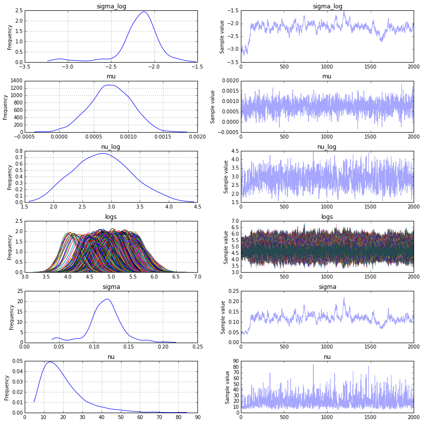
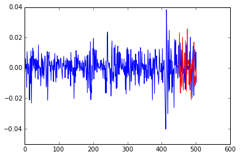
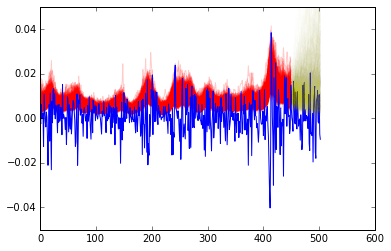
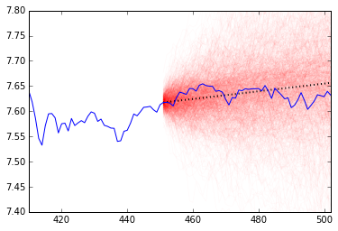

Up to this point we've covered how to choose a portfolio, but how would we evaluate if our portfolio is "working" or not? Today we explore ways to predict stock/portfolio value in the near term to determine if our strategy is horribly failing.

This post is inspired by a blog from Quantopian on what they call the [Bayesian Cone](http://blog.quantopian.com/bayesian-cone/). Their approach strikes me as a  version of what is called a stochastic volatility model combined with a linear drift or trend in the stock price. We plan to take a similar approach but extende it and include some of the finer details. However, to simplify the code and the analysis, we will be working with predicting a single security. The methed easily extends to a portfolio or strategy.

The first thing to talk about is how we will model the stock price. Traditionally, stock prices (or portoflio cumulative returns) are modeled by geometric Brownian motion. We are going to start from this equation and develop our own model which can be used to estimate future stock prices.

The equation for geometric Brownian motion is a stochastic differential equation: 
\begin{equation}
dS_t = \mu S_t dt + \sigma S_t dW_t
\end{equation}

where $$W_t$$ is a Brownian motion and $$\mu,\sigma\in\mathbb{R}$$ are called the "drift" and volatility" respectively. This has an analytics solution, namely 

\begin{equation}
S_t = S_0 \text{exp}( (\mu-\sigma/2 ) t + \sigma W_t)
\end{equation}

where $$S_t$$ is the stock's value at time $$t$$. If we take the log, and combine a few terms, then we can choose constants such that

\begin{equation}
\log S_t = \alpha t + \beta W_t
\end{equation}

In words, this is saying that the log-stock price is composed of a constant change "drift" ($$\mu$$) plus a stochastic term for volatility.
Due to the definition of [$$W_t$$](https://en.wikipedia.org/wiki/Wiener_process), the different between two log-prices gives the following:

\begin{equation}
\log (S_{t+\Delta t} / S_{t}) = \alpha (\Delta t) + \beta \cdot\text{Normal}( 0, \Delta t).
\end{equation}

By subbing $$\Delta t = 1$$, then 

\begin{equation}\log (S_{t+1}/S_t) =  \alpha + \beta \cdot\text{Normal}( 0, 1).\end{equation}

Let's assume that $$\alpha$$ is constant in time but infact $$\beta$$ changes ($$\alpha$$ technically contains part of $$\beta$$ but for simplicity we will ignore this). Although the analysis does not hold for a $$\beta$$ which changes in time and depends on its last value, we can use the analysis as the motivation to choose to model the log ratio as
\begin{equation}
\log (S_{t+1}/S_t) \sim \text{Normal}( \alpha, \beta_t^2),
\end{equation}

and furthermore, since log-prices are known to not quite follow a normal distribution, we can choose to use a Student T's distribution instead. This gives us a hierarchical Bayesian model. For convenience, we will resuse variables from above, but these will be new definitions for them. The model is given by

\begin{equation}
\log (S_{t+1}/S_t) / s_t \sim \mu + t_\nu
\end{equation}
\begin{equation}
\log s_t \sim \text{Normal}( \log s_{t-1}, \sigma^2)
\end{equation}
\begin{equation}
\sigma \sim \text{Exp}(50)
\end{equation}
\begin{equation}
\mu \sim \text{Normal}(0, 5)
\end{equation}
\begin{equation}
\nu \sim \text{Exp}(.1).
\end{equation}.

where $$t_\nu$$ is the standard T distribution with $$\mu$$ degrees of freedom. Another way to write it would be $$\text{StudentT}(df=\nu, loc = \mu, scale = s_t)$$ if we are using the definition of scale and loc found [here](https://en.wikipedia.org/wiki/Student%27s_t-distribution) which agrees with SciPy's implementation. PyMC3 uses a different definition of scale, which can cause confusion. I also use the convention of Normal(mean,variance) for writing normal distribution.

This model is simular to the model for stochastic volatility presented in the [NUTS paper](http://www.stat.columbia.edu/~gelman/research/published/nuts.pdf). The paper uses a model which appears to be without drift, and similarly, so does Quantopian. In the Quantopian post, drift appears to be applied outside of the MCMC process by adding the linear trend of the stock. 

# The Data

For our experiment, we will use data from the S&P500 for 2014. We get the data and transform it into the log returns and separate it into a training and test set.


    import numpy as np
    import pandas as pd
    import datetime as dt
    from pandas.io.data import DataReader
    import matplotlib.pyplot as plt
    %matplotlib inline
    
    np.random.seed(1000000) #Who wants to be a millionaire
    
    start, end = dt.datetime(2014, 1, 1), dt.datetime(2015, 12, 31)
    sp500 = DataReader('^GSPC','yahoo', start, end).loc[:,'Close']
    
    train, test = np.arange(0, 450), np.arange(451,len(returns))
    n=len(train)
    
    returns = np.log(sp500[1:] / sp500[0:-1].values) # Calculate log returns
    plt.plot(returns)


# Implementation in PyMC3

In this section, we modified the example of stochastic volatility in the PyMC3 [Getting Started](https://pymc-devs.github.io/pymc3/getting_started/) guide. 


    with pm.Model() as model:
        sigma = pm.Exponential('sigma', 1./.02, testval=.1)
        mu = pm.Normal('mu', 0, sd=5, testval=.1)
    
        nu = pm.Exponential('nu', 1./10)
        logs = pm.GaussianRandomWalk('logs', tau=sigma**-2, shape=n)
    
        #lam uses variance in pymc3, not sd like in scipy
        r = pm.StudentT('r', nu, mu=mu, lam=1/pm.exp(-2*logs), observed=returns.values[train]) 


    Applied log-transform to sigma and added transformed sigma_log to model.
    Applied log-transform to nu and added transformed nu_log to model.
    

    import scipy as sp

    # Running the MCMC as suggested by PyMC3's getting started guide

    with model:
        start = pm.find_MAP(vars=[logs], fmin=sp.optimize.fmin_l_bfgs_b)

    with model:
        step = pm.NUTS(vars=[logs, mu, nu,sigma],scaling=start, gamma=.25)
        start2 = pm.sample(100, step, start=start)[-1]
    
        # Start next run at the last sampled position.
        step = pm.NUTS(vars=[logs, mu, nu,sigma],scaling=start2, gamma=.55)
        trace = pm.sample(2000, step, start=start2)


     [-----------------100%-----------------] 100 of 100 complete in 15.7 sec

     [-----------------100%-----------------] 2000 of 2000 complete in 91.3 sec


    pm.traceplot(trace)


## Posterior Predictive Checks and Other Sanity Checks

We can do a few sanity checks to make sure our simulation makes sense. First, here's an example of the returns we predicted in the test set, followed by a posterior predictive check that our learned volatility predicts the training data and furthermore, works well on the test set.


    plt.plot(returns)
    plt.plot(1+len(train)+np.arange(0,len(test)), new_ret[1,:], color='r')




    [plt.plot(1/np.exp(trace[k]['logs']),color='r',alpha=.2) for k in range(1000,len(trace))]
    plt.plot(returns)
    [plt.plot(1+len(train)+np.arange(0,len(test)),1/np.exp(vol[j,:]), alpha=.01, color='y') for j in range(0,1000)]
    ax = plt.gca()
    ax.set_ylim([-.05,.05])


In the second plot, the red and yellow represent the volatility. The red is in sample and the yellow is out of sample.

# Projecting the Stock Price

Once we have trained the model, we will then use the data model to generate possible stock price trajectories. We will do this as follows:

Let $$n$$ represent the last day of the training set. For each $$(\nu, \mu, \sigma, \log s_n)$$ which we sample from the posterior distribution, we will

1. Sample $$\log s_{i+1} \sim \text{Normal}(\log s_{i}, \sigma^2)$$ for $$i > n$$.
2. Sample the change in the log stock price via 
$$\log (S_{t+1}/S_t) \sim \text{StudentT}( \nu,\mu, sd=s_t)$$
3. Repeat until we have done this for every day of the test set.

Then, we can add $$\log(S_t)$$ to each $$\log(S_{t+1}/S_t)$$ resulting in the log price for each day. If $$S_t$$ was modeling a portfolio's cumulative return, the process described above would translate identically.


    import scipy.stats as stats
    
    def generate_proj_returns(burn_in, trace, len_to_train):
        num_pred = 1000
        mod_returns = np.ones(shape = (num_pred,len_to_train))
        vol = np.ones(shape = (num_pred,len_to_train))
        for k in range(0,num_pred):
            nu = trace[burn_in+k]['nu']
            mu = trace[burn_in+k]['mu']
            sigma = trace[burn_in+k]['sigma']
            s = trace[burn_in+k]['logs'][-1]        
            for j in range(0,len_to_train):
                cur_log_return, s = _generate_proj_returns( mu,
                                                            s, 
                                                            nu,
                                                            sigma)
                mod_returns[k,j] = cur_log_return
                vol[k,j] = s
        return mod_returns, vol
            
    def _generate_proj_returns(mu,volatility, nu, sig):
        next_vol = np.random.normal(volatility, scale=sig) #sig is SD
        
        # Not 1/np.exp(-2*next_vol), scale treated differently in scipy than pymc3
        log_return = stats.t.rvs(nu, mu, scale=np.exp(-1*next_vol))
        return log_return, next_vol
    
    sim_returns, vol = generate_proj_returns(1000,trace,len(test))


Then, we can add $$\log(S_t)$$ to each $$\log(S_{t+1}/S_t)$$ resulting in the log price for each day starting with $$S_n$$. If $$S_t$$ was modeling a portfolio's cumulative return, the process described above would translate identically.


    #Convert simulated returns to log-price 
    prices = np.copy(sim_returns)
    for k in range(0, len(prices)):
        cur = np.log(sp500[test[0]])
        for j in range(0,len(prices[k])):
            cur = cur + prices[k, j]
            prices[k, j] = cur


## Visualizing and Interpreting the Results

Now that we have calculated the log-stock price for each simulation, we will plot each of them and superimpose the true stock price for the test period. Quantopian suggests using the resulting cone to evaluate a trading algorithm: if the algorithm has overfit or has a bug in any way, then its performance should change drastically from what is projected by the cone. If the true value begins to drop outside of the cone, especially if it is sudden, then you should probably re-evaluate your strategy.

Although stock prices don't necessarily have these issues, it can help to serve as a warning sign that a stock is performing outside of it's expected volatility.

Below, we have plotted the projection in red and a dotted black line to represent the average linear trend estimated via the mean of the posterior of $$\mu$$. 


    slope = trace[1000:]['mu'].mean()
    
    trend = np.arange(0,len(test))*slope
    
    ind = np.arange(len(train)+1,1+len(train)+len(test))
    ind2 = np.arange(training_start,1+len(train)+len(test))
    
    [plt.plot(ind, prices[j,:], alpha=.02, color='r') for j in range(0,1000)]
    plt.plot(ind, trend + np.log(sp500)[len(train)+1],
             alpha=1, 
             linewidth = 2, 
             color='black', 
             linestyle='dotted')
    
    plt.plot(ind2,np.log(sp500)[ind2])
    
    ax = plt.gca()
    ax.set_ylim([7.4,7.8])
    ax.set_xlim([training_start,len(sp500)-2])


## Disclaimer
Of course, the usual disclaimer is this method words until it doesn't. It's unlikely that this method can predict a large market event but it can give you a starting point to judge different trading strategies and their potential. 
