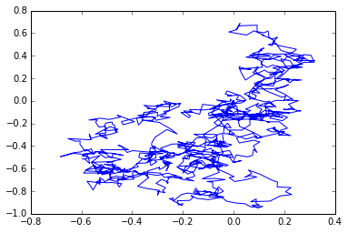
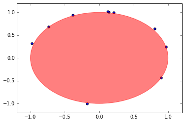
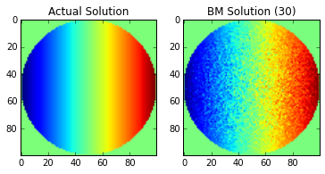
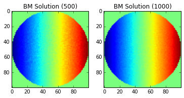

A random walk seems like a very simple concept, but it has far reaching consequences. Not only does it "limit" to Brownian Motion, but it can be used to solve Partial Differential Equations numerically. Today, we're going to introduce the theory of the Laplace Equation and compare the analytical and numerical solution via Brownian Motion. The remarkable conclusion is that one can use random processes to solve deterministic equations.

# Brownian Motion

Brownian Motion (a Weiner Process to those mathematicians reading) is a stochastic process which is ubiqutious in science. A stochastic process is a fancy word for a system which evolves over time with some random element. In this post, we first explore how to model Brownian Motion in Python and then apply it to solving partial differential equations (PDEs). 

Brownian Motion is usually defined via the random variable $$W_t$$ which satisfies a few axioms, the main axiom is that the difference in time of $$W_t$$ is modeled by a normal distribution:
\begin{equation}
W_{t} - W_s \sim \mathcal{N}(0,t-s).
\end{equation}
There are other stipulations-- $$W_0=0$$, each $$W_t$$ is independent of the others, and the realizations of $$W_t$$ in time are continuous (i.e. paths of Brownian Motion are continuous). Our first order of business is to simulate trajectories of Brownian Motion which we will use in the second part of this post.

The simulation is derived from the equation above. Say we want to simulate a Brownian Motion which "walks" until time $$t$$. Then we could partition the interval $$(0,t)$$ evenly into $$n$$ pieces satisfying $$t/n = \Delta t$$. One path of Brownian Motion could be realized by the following scheme: For each $$j=1=,\dots,n$$, assume we are at $$W_{j-1}$$. We know $$W_{j}-W_{j-1} \sim \mathcal{N}(0,\Delta t) = \sqrt{\Delta t} \mathcal{N}(0,1)$$ so we sample from this distribution call the realization $$dW_{j-1}$$. Then we set $$W_j = W_{j-1} + dW_{j-1}$$.


    %matplotlib inline
    import numpy as np
    import matplotlib.pyplot as plt
    
    t=1
    n = 1000
    delta_t = np.sqrt(t/n)
    
    # Create each dW step
    dW = delta_t * np.random.normal(0,1,size=n)
    W = np.zeros(n+1)
    
    # Add W_{j-1} + dW_{j-1} 
    W[1:] = np.cumsum(dW)
    
    plt.plot(W)



# Introduction to Laplace's Equation

Now, we're going to introduce a PDE and show how annoying calculating a solution can be to motivate our use of Brownian Motion to solve the same PDE.

Laplace's equation is given by

\begin{equation}
\Delta u (x) = 0
\end{equation}
for $$x\in \mathbb{R}^n$$ and in two dimentions can be written
\begin{equation}
u_{yy}(y,z) + u_{zz}(y,z) = 0
\end{equation}
for $$y,z\in \mathbb{R}$$.
This equation is an example of an elliptic partial differential equation. Solutions to Laplace's equation are called harmonic and satisfy many important properties, including analyticity (solution can be represented by a power series) and the mean-value property. These are technical results that are outside of our scope, but I wanted to mention that these are well-studied functions in mathematics.

In our case, we're going to look at a 2-d equation to start but note that this method extends to $$n$$ dimensions. To solve PDEs numerically (on the computer) can require tedius finite element or finite difference methods-- but stochastic processes, and in particular Brownian Motion, can be used to approximate the solution in a much simpler way.

A common question is to find a solution $$u$$ satisfying Laplace's equation on some domain $$D$$ with a presecribed value on the boundary $$\partial D$$ given as a function $$f$$:
\begin{equation}
\Delta u (x) = 0 \text{ in D}
\end{equation}
\begin{equation}
u (x) = f(x) \text{ on } \partial D.
\end{equation}
This is called the boundary value problem for Laplace's equation.  Such problems are sometimes referred to as Cauchy problems. 

Let's do an example. We're going to let $$D$$ denote the unit circle in $$\mathbb{R}^2$$ and $$f(\theta)=\cos(\theta)$$ (for convenience we are defining $$f$$ via polar coordinates). In this case, there is an analytical solution which can be written in polar coordinates $$(r,\theta)\in [0,1]\times [-\pi,\pi]$$ as

\begin{equation}
u(r,\theta) = \frac{1}{2\pi} \int_{-\pi}^\pi f(\phi)d\phi + \frac{1}{\pi} \sum_{n=1}^\infty \left(\frac{r}{n} \right)^n \int_{-\pi}^{\pi} \cos( n(\theta-\phi)) f(\phi) d\phi.
\end{equation}

This solution is typically found via the separation of variables technique. The derivation can be found [here](https://www.math.hmc.edu/~ajb/PCMI/lecture11.pdf). This equation is very confusing to the uninitiated, and in many undergraduate courses, if this is shown at all, $$f$$ will be chosen so that the formulas can be simplified to be a simple series that can be computed easily by hand. However, many times in the "real world" this doesn't happen, and you must rely on numerical integration to approximate the integrals.

In this case, we can calculate the integrals directly:
\begin{equation}
 \int_{-\pi}^{\pi} \cos( n(\theta-\phi)) \cos(\phi) d\phi = -\frac{2 n \sin(\pi n) \cos(n \theta)}{n^2-1}
\end{equation}
and the sum as well (thanks [Wolfram](http://www.wolframalpha.com/)):
\begin{equation}
 \sum_{n=1}^\infty \left(\frac{r}{n} \right)^n \left ( -\frac{2 n \sin(\pi n) \cos(n \theta)}{n^2-1} \right ) = \pi r \cos \theta,
\end{equation}
and because the cosine is even, the first integral $$\int_{-\pi}^\pi \cos (\phi)d\phi = 0$$.

So, the solution to our problem is 

\begin{equation}
u(r,\theta) = \pi r \cos(\theta)
\end{equation}

which can be written in $$(x,y)$$ coordinates as 
\begin{equation}
u(x,y) = \sqrt{ x^2+y^2} \cos(\text{arctan2}(y,x))
\end{equation}

where arctan2 is a special variant of the arctangent as defined on the [wiki](https://en.wikipedia.org/wiki/Polar_coordinate_system#Polar_equation_of_a_curve).
It is also implemented in NumPy via the arctan2 function. As you can see, for a more complicated $$f$$ this could become extremely tedius. 

# Simulating the PDE via Brownian Motion

The idea of using Brownian Motion to solve PDEs is perhaps most famously known as the Feynman-Kac theorem (although mathematicians discovered it first, see [Kolmogorov's Backward Equation](https://en.wikipedia.org/wiki/Kolmogorov_backward_equations_%28diffusion%29])), but we're going to use another approach to solve Laplace's Equation. This technique is sometimes called the "Random Walk" method.

The process to solve such an equation with Brownian motion (in this case) depends on the idea of the "exit point" of a Brownian motion path. Say we start a Brownian Motion at $$x \in D$$. At some point it will intersect with $$\partial D$$, thus exiting $$D$$. The point where the path of the Brownian Motion exits $$D$$ after starting at $$x$$ is defined as $$\text{Exit}(x, D)$$. With this defintion, we have a formula for the solution $$u$$:

\begin{equation}
u(x) = \mathbb{E}( f(\text{Exit}(x, D) ) ).
\end{equation}

The proof of this stems from the mean-value property I mentioned earlier and is an altogether simpler proof than the Feynman-Kac formula. The two ideas are related, both using a known analytic form of the solution and combining it with probabilistic techniques. 

This formula is striking for several reasons. Practically, the important part about the formula above is that it is much easier to simulate on the computer, even compared to some analytic versions of the solution (i.e. formulas). The second reason this formula is striking is that our solution involves a process that varies in time (namely, Brownian motion), but our partial differential equation does __not__. In fact, Laplace's equation can be referred to as the "steady-state heat equation", pointing to the fact that it's time independent.

Let's build up the machinery to calculate a solution.

## Simulating 2D Brownian Motion

To simulate 2-d Brownian motion, we simply simulate two 1-d Brownian motion and use one for the $$x$$ component and one for the $$y$$:


    %matplotlib inline
    import numpy as np
    import matplotlib.pyplot as plt
    
    t=1
    n = 1000
    delta_t = np.sqrt(t/n)
    
    # Create each dW step
    dW1 = delta_t * np.random.normal(0,1,size=n)
    dW2 = delta_t * np.random.normal(0,1,size=n)
    W = np.zeros((n+1,2))
    
    # Add W_{j-1} + dW_{j-1} 
    W[1:,0] = np.cumsum(dW1)
    W[1:,1] = np.cumsum(dW2)
    
    plt.plot(W[:,0],W[:,1], '-')


Notice how, opposed to our first simulation, this Brownian motion moves in all directions.

## Simulating an Exit Point

To simulate an exit position, we can simply check when the Brownian motion intersects with the boundary. In our case, this means that the path intersects the circle of radius 1-- which is the same as having norm (length) equal to 1.


    def check_if_exit(v):
        # Takes a vector v=(x,y)
        # Checks if v has intersected with the boundary of D
        if np.linalg.norm(v,2) >=1:
            return True
        return False
    
    def simulate_exit_time(v):
        # Simulates exit time starting at v=(x,y), returns exit position
        delta_t = np.sqrt(.001)
        exit = False
        x = v.copy()
        while not exit:
            x = x + delta_t * np.random.normal(0,1,size=2)
            exit = check_if_exit(x)
        return x
    
    v=np.array((0,0)) # The origin
    exit_times = np.array([simulate_exit_time(v) for k in range(0,10) ])

    circle1=plt.Circle((0,0),1,color='r', alpha=.5)
    plt.gcf().gca().add_artist(circle1)
    plt.axis([-1.2, 1.2, -1.2, 1.2])
    plt.scatter(exit_times[:,0],exit_times[:,1])



The choice of the simulation depends on the choice of $$\Delta t$$, but in the interest of time, a larger $$\Delta t$$ leads to a faster simulation. If it looks like some have "exited" the domain, it is because our time step allowed the points to jump out of the circle.

## Simulating the PDE

### Warm Up

To simulate Laplace's equation, we have to calculate the expected value of $$f(\text{Exit}(x,D))$$ for each $$x\in D$$ of interest. Let's simulate $$u(x)$$ for a single point to get the idea.



    np.random.seed(8) #Side Infinity
    
    def check_if_exit(v):
        # Takes a vector v=(x,y)
        # Checks if v has intersected with the boundary of D
        if np.linalg.norm(v,2) >=1:
            return True
        return False
    
    def simulate_exit_time(v):
        # Simulates exit time starting at v=(x,y), returns exit position
        delta_t = np.sqrt(.001)
        exit = False
        
        # Copy because simulation modifies in place
        if hasattr(v,'copy'): # For NumPy arrays
            x = v.copy() 
        else:
            x = np.array(v) # We input a non-NumPy array
        while not exit:
            x += delta_t * np.random.normal(0,1,size=2) # += modifies in place
            exit = check_if_exit(x)
        return x
        
    v=np.array((.5,.5)) # The origin
    u = lambda x : np.linalg.norm(x,2)*np.cos(np.arctan2(x[1],x[0]))
    f = lambda x : np.cos(np.arctan2(x[1],x[0]))
    
    def get_exp_f_exit(starting_point, n_trials): 
        return np.mean([f(simulate_exit_time(starting_point)) for k in range(0,n_trials)])
    
    exp_f_exit = get_exp_f_exit(v,2000) # Expected value of f(Exit(x,d))
    print('The value u(v) = %s\nThe value of Exp(f(Exit))=%s' %(u(v), exp_f_exit)) 


    The value u(v) = 0.5
    The value of Exp(f(Exit))=0.49756011454
    

### Comments on Solving PDEs Numerically

You may notice that our approximation is not exactly the same value as the function, and that's because in numerical computations, you will never have the exact solution but an approximate solution. In fact, there are entire fields dedicated to how to calculate PDEs numerically. There's issues around floating point error that can be painful and there's always a question of convergence. Numerical algorithms typically become closer to the true solution as you vary one of the parameters of the numerical scheme. In our case, the parameter is the number of exit points we take in the expectation. For us, the central limit theorem gives us an idea of the convergence rate because we're actually using the expectation to calculate an integral, which is the same idea of Monte Carlo integration. Therefore, our solution should converge with a rate of $$O\left(\frac{1}{\sqrt{n}}\right)$$.

Heuristically, our solution should be within a constant times $$1/\sqrt{2000}\approx 0.022$$, and indeed, it is. This gives you a bound on the error so you can have an idea on how "close" your solution is to the true solution. As you can imagine, simulating a solution naively can be very slow, but the nature of the problem allows one to distribute the work quite easily.

## The Discretized Solution

To calculate a discretized solution, one typically does so on a grid in the domain of interest. In this simple case, we do not need to actually approximate the solution, but it's a good practice to first try your numerics on a simple case that you can verify before moving onto a more complicated problem. We will do this below.

We are going to show a few examples of taking a different number of values for the average to show how the technique "converges" to the solution across the points of the domain.



    lin = np.linspace(-1, 1, 100)
    x, y = np.meshgrid(lin, lin)
    print(x.shape)
    u_vec = np.zeros(x.shape)
    bm_vec_30 = np.zeros(x.shape)
    bm_vec_500 = np.zeros(x.shape)
    bm_vec_1000 = np.zeros(x.shape)
    
    # Convert u to a solution in x,y coordinates
    u_x = lambda x,y : np.linalg.norm(np.array([x,y]),2)*np.cos(np.arctan2(y,x))
    
    # Calculate actual and approximate solution for (x,y) in D
    for k in range(0,x.shape[0]):
        for j in range(0,x.shape[1]):
            x_t = x[k,j]
            y_t = y[k,j]
            
            # If the point is outside the circle, the solution is undefined
            if np.sqrt((x_t)**2 + (y_t)**2) > 1:
                continue
            
            # Calculate function value at this point for each image
            u_vec[k,j] = u_x(x_t,y_t)
            bm_vec_30[k,j] = get_exp_f_exit((x_t,y_t),30)
            bm_vec_500[k,j] =  get_exp_f_exit((x_t,y_t),500)
            bm_vec_1000[k,j] =  get_exp_f_exit((x_t,y_t),1000)

    fig = plt.figure()
    ax = fig.add_subplot(121)
    plt.imshow(u_vec)
    plt.title('Actual Solution')
    
    ax = fig.add_subplot(122)
    plt.title('BM Solution (30)')
    plt.imshow(bm_vec_30)
    
    fig = plt.figure()
    
    ax = fig.add_subplot(121)
    plt.title('BM Solution (500)')
    plt.imshow(bm_vec_500)
    
    ax = fig.add_subplot(122)
    plt.title('BM Solution (1000)')
    plt.imshow(bm_vec_1000)



    Note: the imshow function does not correctly label the x-y axis. 
    The center of the image is the origin.

Of course, the images will continue to improve as you continue add more points to the Brownian Motion simulation (growing $$n$$), but without a more sophisticated solution (using multiple processors, etc), the current approach can take a long time to run. We also have not added considerations for floating point error, which will eventually cause our solution to stop improving as $$n$$ increases.

# Extensions

This technique can be extended to solve many different partial differential equations, including PDEs that involve time. One such equation is the Black-Scholes PDE from finance or the Backwards Heat Equation, which has applications to deblurring imaging. In the future, we hope to explore some of these topics as well, but as they say, you have to start somewhere.
