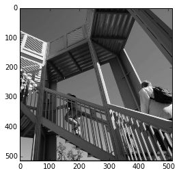
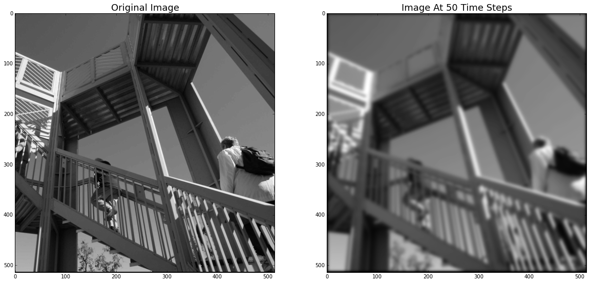
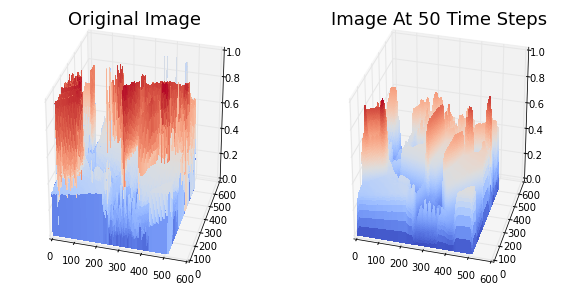
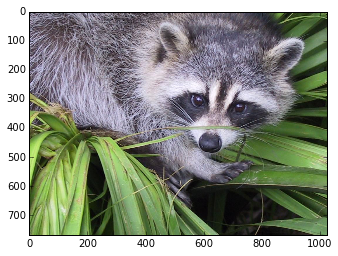
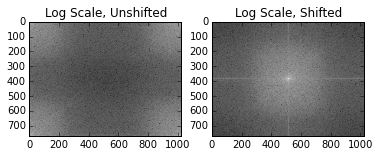
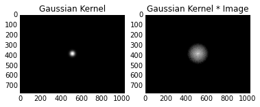
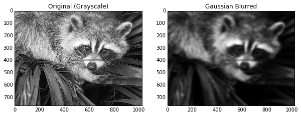
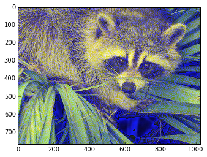

Image processing is so common place that it's easy to forget about all the math behind the scenes. Some of the most ubiquitious techniques were started development in the 1800's, but not for image processing! Many people are familiar with a Gaussian Blur, but did you know the blurred image is really just a solution to the heat equation? In this pose, we explore this connection in-depth with Python.

# The Heat Equation

The heat equation models how temperature changes time and is derived from [Newton's law of Heating](https://en.wikipedia.org/wiki/Newton%27s_law_of_cooling#Heat_transfer_version_of_the_law):
    
    The rate of heat loss of a body is proportional to the difference in temperatures between the body and its surroundings.

Mathematically, we can write the equation in $$n$$ dimensions as a partial differential equation.
For $$x$$ in some domain $$D\subset\mathbb{R}^n$$,

\begin{equation}
\frac{\partial}{\partial t} u (x,t) = \kappa \Delta u(x,t) 
\end{equation}

where $$\kappa>0$$. Note, cooling can also be described this way if $$\kappa < 0$$. In this post, we will use the heating version.

The initial value problem is finding $$u$$ given a temperature distribution is given at $$t=0$$:

\begin{equation}
u(x,0) = f(x).
\end{equation}

For our purposes, $$D$$ is going to be the LxW pixel grid of our image. Our image is represented by the function $$f(x)$$, or the intensity at each pixel. Here, I am using $$x=(x_1,x_2) \in \mathbb{R}^2$$ and typically $$x_i \in [0,255]$$ for RGB images. However, we are going to work with grayscale images to keep the math clear.

# How to Apply the Heat Equation to Images

To apply the heat equation to an image, we will solve for the value of the heat equation at time $$T$$ given the initial condition that the temperature distribution is equal to the intensity of the image.

Numerically, there are two components necessary for solving the heat equation:
    1. We must discretize the Laplacian operator.
    2. We must solve the PDE in time via Euler's method (time stepping).

As a technical consideration, this discussion assumes "Neumann boundary conditions". After this, we can solve the heat equation at any time $$t$$ via an iterative algorithm.

### Discretizing the Laplacian

Discretizing an operator means we will compute its values on a grid and use them in the subsequent computation. From calculus, you may recall that the derivative is defined in one dimension via
\begin{equation}
f^\prime(x) = \lim_{h \to 0} \frac{f(x+h) - f(x)}{h}.
\end{equation}

To calculate this on the computer, there are many "finite difference" schemes. Usually, a scheme is chosen because it improves the convergence of the calculation. For example, the central difference is given by
\begin{equation}
f^\prime(x) = \frac{f(x+ \frac{1}{2}h) - f(x-\frac{1}{2}h)}{h} + O(h^2),
\end{equation}
which is faster than the naive calculation of the derivative which is only $$O(h)$$ (and technically $$o(h)$$, but this doesn't give a strong bound). The Laplacian in the case of Neumann boundary conditions is given by the following finite difference formula in two dimentions :
\begin{equation}
\Delta f(x,y) \approx \frac{f(x-h,y) + f(x+h,y) + f(x,y-h) +f(x,y+h) - 4f(x,y)}{h^2}
\end{equation}

for $$x,y,h \in \mathbb{R}$$. In our case, $$h=1$$ is sufficient.

### Euler's Method

Euler's Method is a time-stepping approach to solving ODEs (note, the heat equation is a PDE) but can be applied in this context. If we fix an $$x\in \mathbb{R}^2$$  in the equation $$\partial_t u(x,t) = \kappa \Delta_x u (x,t)$$, then this equation can be viewed as an $$ODE$$. If we do this for each $$x$$ and solve the equation up to time $$T$$, then we have a solution for $$u(x,T)$$.

Euler's method is as follows. Given an ODE
\begin{equation} \frac{d}{dt} x(t) = f(t),
\end{equation}
the time step update is given by 
$$x(t+dt) = x(t) + dt \cdot f(t)$$. This can be iterated and solved for any length of time desired. Of course, this method can be extended for more precision but this basic approach will work in our case. We will ignore the question of convergence and just say that you choose a small $$dt$$ so that your approximate numerical solution is close to the actual solution.

## Putting Them Together

To solve the Heat Equation, we will perform iterative updates to our solution. In the first step, we discretize the Laplacian for any time $$t$$,
making the definition
\begin{equation}[\Delta] u(x,y,t) := u(x-1,y,t) + u(x+1,y,t) + u(x,y-1,t) +u(x,y+1,t) - 4u(x,y,t).\end{equation}
Notice, since our initial wave is only defined at each pixel, we take $$h=1$$.

At any time $$t$$, starting at $$t=0$$, we then calculate the next value of $$u$$ at each $$(x,y,t)$$ via $$u(x,y,t+dt) = u(x,y,t) + dt \cdot [\Delta]u(x,y,t)$$. We then iterate this process until the desired length of time has passed.

# Blurring an Image via the Heat Equation

Now that we know the basic process, let's take an image and apply it. To be able to use the discretized formula on the boundaries, we pad have to pad it with a row of $$0$$'s. We will do this with NumPy:


    from scipy import misc
    face = misc.ascent()
    %matplotlib inline
    import matplotlib.pyplot as plt
    min = np.min(face.shape)
    max = np.max(face.shape)
    plt.imshow(face, cmap=plt.cm.gray)
    imag = np.pad(face.copy(), 1, mode='constant')
    plt.imshow(imag, cmap=plt.cm.gray)
    print(imag)


    [[  0   0   0 ...,   0   0   0]
     [  0  83  83 ..., 117 117   0]
     [  0  82  82 ..., 117 117   0]
     ..., 
     [  0 178 178 ...,  57  57   0]
     [  0 178 178 ...,  57  58   0]
     [  0   0   0 ...,   0   0   0]]
    

Next, we make a function that will be responsible for our time step updates.


    def time_step_update(imag,j,k, dt = .1):
        lplcn = imag[j,k-1] + imag[j-1,k] + imag[j,k+1] + imag[j+1,k] - 4*imag[j,k]
        return imag[j,k] + dt*lplcn


To perform a complete timestep, we have to calculate the next step for all the internal (non-padded) indices of the image. We are going to initialize one array that we'll use for the whole of the time step that will be our "next" image. This image will then be updated to be the "current image" for the next time step.

A key part of the algorithm is each $$u(x,y,t+dt)$$ is calculated with the Laplacian applied to $$u(x,y,t)$$.


    cur_imag = imag.copy()
    for L in range(0,50):
        next_img = np.zeros(imag.shape)    
        for k in range(1, imag.shape[0]-1):
            for j in range(1, imag.shape[1]-1):
                next_img[j,k] = time_step_update(cur_imag,j,k)
        cur_imag = next_img
        
    plt.figure(figsize=(20,20))
    plt.subplot(121)
    plt.title('Original Image', fontsize=18)
    plt.imshow(imag, cmap=plt.cm.gray)
    plt.subplot(122)
    plt.title('Image At 50 Time Steps',fontsize=18)
    plt.imshow(cur_imag, cmap=plt.cm.gray)


As you can see, it looks like a typical Gaussian Blur, which we will discuss soon. However, before we do that, let's plot the image and the blurred image as a 3d "surface" and see the effect of applying the heat equation.


    from mpl_toolkits.mplot3d import Axes3D
    
    z = np.linspace(0,514, 514)
    X, Y = np.meshgrid(z,z)
    
    fig = plt.figure(figsize=(10,5))
    ax = fig.add_subplot(121, projection='3d')
    plt.title('Original Image', fontsize=18)
    surf = ax.plot_surface(X, Y, imag/255, rstride=1,
                           cstride=1, cmap=plt.cm.coolwarm,
                           linewidth=0, antialiased=False)
    ax.view_init(elev=30., azim=-75)
    ax = fig.add_subplot(122, projection='3d')
    plt.title('Image At 50 Time Steps',fontsize=18)
    surf = ax.plot_surface(X, Y, cur_imag/255, rstride=1,
                           cstride=1, cmap=plt.cm.coolwarm,
                           linewidth=0, antialiased=False)
    ax.view_init(elev=30., azim=-75)


As you can see, the high intensity "peaks" have been "diffused" and are now less pronounced. This is the same thing that happens when heat diffuses in, say, a rod.

# Relation to Gaussian Blur

The blurred images you saw above may remind you of a Gaussian Blur. That's because the Heat Equation is equivalent to a Gaussian Blur. Why? I'm glad you asked!

If we solve the heat equation (as we have defined it) on the the plane ($$\mathbb{R}^2$$) given an initial value $$f(x)$$ for $$x\in \mathbb{R}^2$$, then the solution has a special form:
\begin{equation}
u(x,t) = (G \star f ) (x,t) = \int_{\mathbb{R}^2} G(x-y,t)f(y) \, dy
\end{equation}
where $$\star$$ indicates the convolution of the functions. The function $$G$$ is the "fundamental solution" to the homogenous heat equation, and is given by the formula
\begin{equation}
G(x-y,t) = \frac{1}{4\kappa \pi t} e^{\frac{-|x-y|^2}{4\kappa t}}
\end{equation}
where $$|\cdot |$$ indicates the vector 2-norm. This might look familiar. In fact, it's also called a Gaussian Kernel because it is very similar to the PDF of the Gaussian distribution.

This formulation is usually derived by using the Fourier Transform, and indeed the process to calculate this formula is the same process that is used in image processing to apply a Gaussian Blur. In case you were wondering, this technique has its roots in the 19th century work by Gauss and Fourier. Fourier used a related technique in his analysis of heat flow, and today we will use it to blur an image of a racoon. How the times have changed.

If I denote the Fourier Transform process as $$\mathcal{F}$$, the transform satisfies the important relation 
\begin{equation}
 \mathcal{F} ( f\star g) = (\mathcal{F}f )\cdot (\mathcal{F}g),
\end{equation}
that is, it converts convolution in the space domain to multiplication in the Fourier domain. This allows us to represent the solution to the heat equation in Fourier Space as $$\mathcal{F}u = (\mathcal{F}G)(\mathcal{F}f)$$ which is much easier to compute than an integral. 

In image processing, this is done by multiplying a Gaussian kernel with the Fourier transform of the initial image together pixel by pixel. Then, we transform the image back via the inverse Fourier Transform to see the blurred image. This actually gives us a scheme for solving the heat equation which is MUCH easier than what we outlined above. Indeed, the same approach to blurring images can be used to solve the distribution of heat on a rod, or in a coffee cup, or on the surface of the ocean. 

## Example of Gaussian Blur using the Heat Kernel

We want to apply the approach we just discussed to generate a Gaussian Blur (while simultaneously solving the heat equation!). However, there's a few extra steps needed to do it using the libraries provider by NumPy.

This time, we're going to use this method (as we could use the above method) to blur just ONE color inside an RGB image. First, let's go through the basic process.

We are going to blur the following image included in SciPy.



    imag = misc.face()
    plt.imshow(imag)



This is an RGB image and as such is stored as 3 768x1024 matrices:


    imag.shape


    (768, 1024, 3)

We are going to take one of the colors and blur it, and then reassemble the image.

## The Fourier Transform for Images

Usually, the image of the Fourier space you see is the log-scale of the image after shifting the quadrants of the image. We use the fft2, fftshift, and ifftshift functions in NumPy to accomplish this from the fft package.

As a practical consideration, the FFT will introduce complex numbers, and so we need to take the absolute value to plot them.


    def fourier_transform(image):
        """
        Computes the Fourier transform on the image and shifts it to the "typical" 
        representation that is shown.
        """
        temp = np.fft.fft2(image)
        temp = np.fft.fftshift(temp) # Shift!
        return temp
    
    def plot_fourier_image(image):
        plt.imshow(np.log10(np.abs(image)**2+1), cmap=plt.cm.gray)
    
        
    f_imag = fourier_transform(imag[:,:,2])
    
    # Plot the image in log scale and shifted.
    plt.subplot(121)
    plt.title("Log Scale, Unshifted")
    plot_fourier_image(np.fft.ifftshift(f_imag))
    plt.subplot(122)
    plt.title("Log Scale, Shifted")
    plot_fourier_image(f_imag)


## Blurring with the Heat Kernel 

Each frequency pixel contains information about the image. If we dampen them, we change the image. The most important frequencies of the image are found in the middle of the shifted plot. The other points can be inferred by seeing what happens to the image when you remove them. When we apply a Gaussian kernel, we remove detail, leaving us with a blurred image just like in the case of the heat equation!

We are going to use the Gaussian kernel we described above to push the connection to the heat equation. The kernel can also be called the Heat Kernel.


    def gaussian(image, kappa = 1, t = .001):
        # Gaussian Kernel for the Heat Equation in Fourier Space
        
        n,k = image.shape
        center_i = int(n/2)
        center_j = int(k/2)
        
        # This image is symmetric so we do one quadrant and fill in the others
        gaussian = np.zeros((n,k))
        for i in range(0,n-center_i):
            for j in range(0,k-center_j):
                temp = np.exp(-(i**2+j**2)*kappa*t)
                gaussian[center_i+i,center_j+j] = temp
                gaussian[center_i-i,center_j+j] = temp
                gaussian[center_i+i,center_j-j] = temp
                gaussian[center_i-i,center_j-j] = temp
                
        return gaussian
    
    # Calculate Gaussian Kernel and apply to Fourier image
    gauss = gaussian(f_imag)
    combination = np.multiply(gauss,f_imag) # Element wise
    
    # Plot the Gaussian Kernel and the combination.
    plt.subplot(121)
    plt.title("Gaussian Kernel")
    plot_fourier_image(gauss)
    plt.subplot(122)
    plt.title("Gaussian Kernel * Image")
    plot_fourier_image(combination)


Here we see that the image has "blotted out" all the other (low) frequencies and now we're ready to see what it looks like.


    def inverse_fourier_transform(f_input_imag):
        temp = np.fft.ifftshift(f_input_imag)
        imag = np.fft.ifft2(temp)
        return np.abs(imag)**2 # Remove those imaginary values
    
    new_imag = inverse_fourier_transform(combination)
    
    
    plt.figure(figsize=(10,20))
    plt.subplot(121)
    plt.title("Original (Grayscale)")
    plt.imshow(imag[:,:,2], cmap=plt.cm.gray)
    plt.subplot(122)
    plt.title("Gaussian Blurred")
    plt.imshow(new_imag, cmap=plt.cm.gray)



    # Let's put this blurred image back into the RBG channel...
    new = imag.copy()
    new[:,:,2] = new_imag
    plt.imshow(new)


# Final Comments

Techniques to solve partial differential equations can explain Gaussian Blurring, and such methods have become one of the de facto approaches to techniques in image processing. As you have noticed, the Fourier Transform technique opens up a wealth of possibilities for experimenting with image processing. But, historically, the technique was born out of trying to understand heat flows, and that's a fun fact.
