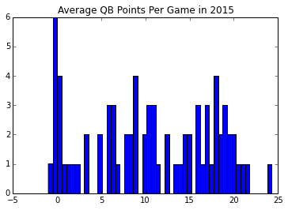

Something that seems daunting at first when switching from R to Python is replacing all the ready-made functions R has. For example, R has a nice CSV reader out of the box. Python users will eventually find pandas, but what about other R libraries like their HTML Table Reader from the xml package? That's very helpful for scraping web pages, but in Python it might take a little more work. So in this post, we're going to write a brief but robust HTML table parser.

# Writing a Table Scraper

Our parser is going to be built on top of the Python package BeautifulSoup. It's a convenient package and easy to use. Our use will focus on the "find_all" function, but before we start parsing, you need to understand the basics of HTML terminology.

An HTML object consists of a few fundamental pieces: a tag. The format that defines a tag is 

       <tag property1="value" property2="value">
       
and it could have attributes which consistes of a property and a value. A tag we are interested in is the table tag, which defined a table in a website. This table tag has many elements. An element is a component of the page which typically contains content. For a table in HTML, they consist of rows designated by elements within the tr tags, and then column content inside the td tags. A typical example is

    <table>
        <tr>
            <td> Hello! </td>
            <td> Table </td>
        </tr>
    </table>

It turns out that most sites keep data you'd like to scrape in tables, and so we're going to learn to parse them.

## Parsing a Table in BeautifulSoup

To parse the table, we are going to use the Python library BeautifulSoup. It constructs a tree from the HTML and gives you an API to access different elements of the webpage. 

Let's say we already have our table object returned from BeautifulSoup. To parse the table, we'd like to grab a row, take the data from its columns, and then move on to the next row ad nauseam. In the next bit of code, we define a website that is simply the HTML for a table. We load it into BeautifulSoup and parse it, returning a pandas data frame of the contents.


    import pandas as pd
    from bs4 import BeautifulSoup
    
    html_string = '''
      <table>
            <tr>
                <td> Hello! </td>
                <td> Table </td>
            </tr>
        </table>
    '''
    
    soup = BeautifulSoup(html_string, 'lxml') # Parse the HTML as a string
    
    table = soup.find_all('table')[0] # Grab the first table
    
    new_table = pd.DataFrame(columns=range(0,2), index = [0]) # I know the size 
    
    row_marker = 0
    for row in table.find_all('tr'):
        column_marker = 0
        columns = row.find_all('td')
        for column in columns:
            new_table.iat[row_marker,column_marker] = column.get_text()
            column_marker += 1
    
    new_table


<table border="1" class="dataframe">
  <thead>
    <tr style="text-align: right;">
      <th></th>
      <th>0</th>
      <th>1</th>
    </tr>
  </thead>
  <tbody>
    <tr>
      <th>0</th>
      <td>Hello!</td>
      <td>Table</td>
    </tr>
  </tbody>
</table>

As you can see, we grab all the tr elements from the table, followed by grabbing the td elements one at a time. We use the "get_text()" method from the td element (called a column in each iteration) and put it into our python object representing a table (it will eventually be a pandas dataframe).

# Using Requests to Access a Web Content

Now, that we have our plan to parse a table, we probably need to figure out how to get to that point. That's actually easier! We're going to use the requests package in Python.


    import requests
    url = "https://www.fantasypros.com/nfl/reports/leaders/qb.php?year=2015"
    response = requests.get(url)
    response.text[:100] # Access the HTML with the text property


    '\r\n<!DOCTYPE html>\n<html lang="en">\n\n<head>\n    <title>Fantasy Football Leaders Weeks 1 to 17 - QB</t'

# The Parser Object

So, now we can define our HTML table parser object. You'll notice we added more bells and whistles to the html table parser. To summarize the functionality outside of basic parsing:

    1. We take th elements and use them as column names.
    2. We cast any column with numbers to float.
    3. We also return a list of tuples for each table in the page. 

The tuples we return are in the form (table id, parsed table) for every table in the document. 



    import requests
    import pandas as pd
    from bs4 import BeautifulSoup
    
    class HTMLTableParser:
       
        def parse_url(self, url):
            response = requests.get(url)
            soup = BeautifulSoup(response.text, 'lxml')
            return [(table['id'],self.parse_html_table(table))\
                    for table in soup.find_all('table')]  
    
        def parse_html_table(self, table):
            n_columns = 0
            n_rows=0
            column_names = []
    
            # Find number of rows and columns
            # we also find the column titles if we can
            for row in table.find_all('tr'):
                
                # Determine the number of rows in the table
                td_tags = row.find_all('td')
                if len(td_tags) > 0:
                    n_rows+=1
                    if n_columns == 0:
                        # Set the number of columns for our table
                        n_columns = len(td_tags)
                        
                # Handle column names if we find them
                th_tags = row.find_all('th') 
                if len(th_tags) > 0 and len(column_names) == 0:
                    for th in th_tags:
                        column_names.append(th.get_text())
    
            # Safeguard on Column Titles
            if len(column_names) > 0 and len(column_names) != n_columns:
                raise Exception("Column titles do not match the number of columns")
    
            columns = column_names if len(column_names) > 0 else range(0,n_columns)
            df = pd.DataFrame(columns = columns,
                              index= range(0,n_rows))
            row_marker = 0
            for row in table.find_all('tr'):
                column_marker = 0
                columns = row.find_all('td')
                for column in columns:
                    df.iat[row_marker,column_marker] = column.get_text()
                    column_marker += 1
                if len(columns) > 0:
                    row_marker += 1
                    
            # Convert to float if possible
            for col in df:
                try:
                    df[col] = df[col].astype(float)
                except ValueError:
                    pass
            
            return df


# Usage Example

Let's do an example where we scrape a table from a website. We initialize the parser object and grab the table using our code above:


    hp = HTMLTableParser()
    table = hp.parse_url(url)[0][1] # Grabbing the table from the tuple
    table.head()


<table border="1" class="dataframe">
  <thead>
    <tr style="text-align: right;">
      <th></th>
      <th>Rank</th>
      <th>Player</th>
      <th>Team</th>
      <th>Points</th>
      <th>Games</th>
      <th>Avg</th>
    </tr>
  </thead>
  <tbody>
    <tr>
      <th>0</th>
      <td>1</td>
      <td>Cam Newton</td>
      <td>CAR</td>
      <td>389.1</td>
      <td>16</td>
      <td>24.3</td>
    </tr>
    <tr>
      <th>1</th>
      <td>2</td>
      <td>Tom Brady</td>
      <td>NE</td>
      <td>343.7</td>
      <td>16</td>
      <td>21.5</td>
    </tr>
    <tr>
      <th>2</th>
      <td>3</td>
      <td>Russell Wilson</td>
      <td>SEA</td>
      <td>336.4</td>
      <td>16</td>
      <td>21.0</td>
    </tr>
    <tr>
      <th>3</th>
      <td>4</td>
      <td>Blake Bortles</td>
      <td>JAC</td>
      <td>316.1</td>
      <td>16</td>
      <td>19.8</td>
    </tr>
    <tr>
      <th>4</th>
      <td>5</td>
      <td>Carson Palmer</td>
      <td>ARI</td>
      <td>309.2</td>
      <td>16</td>
      <td>19.3</td>
    </tr>
  </tbody>
</table>

If you had looked at the URL above, you'd have seen that we were parsing QB stats from the 2015 season off of FantasyPros.com. Our data has been prepared in such a way that we can immediately start an analysis.



    %matplotlib inline
    import matplotlib.pyplot as plt
    
    plt.figure()
    avg=table['Avg'].values
    plt.hist(avg, bins = 50)
    plt.title('Average QB Points Per Game in 2015')


# Final Thoughts

As you can see, this code may find it's way into some scraper scripts once Football season starts again, but it's perfectly capable of scraping any page with an HTML table. The code actually will scrape every table on a page, and you can just select the one you want from the resulting list. Happy scraping!
