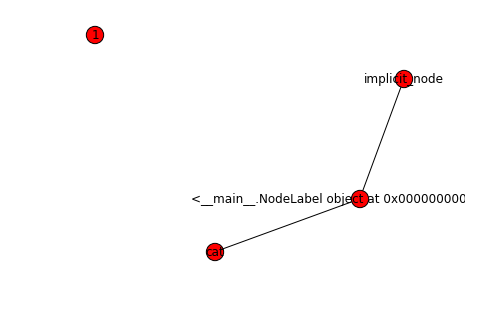
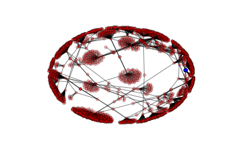
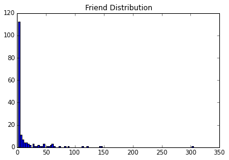
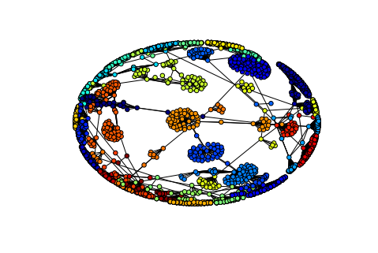

In this post, we're going to briefly introduce the Steam Web API and build a graph of a Steam friends list using NetworkX and Python. Afterwards, we're going to use this graph to detect communities inside the base list and discuss some interesting applications.

The basis for all web based analysis is understanding how to access the data. Data could either be gathered via web crawling and scraping pages or through a public API. Public API's make gathering data much easier, but also have their limitations in the form of the data available and possible limits on requests. It's important to give at least a cursory glance at the terms of service before using any API to ensure you don't get your access revoked.

# Steam Web API

The Steam web API allows you to query data from Valve on different aspects of Steam-- game data, player data, and economy data in particular. The API works via HTTP requests. The URI contains all the inputs to their API and it will return the data to you (typically in JSON or XML dependeing on the settings). We will be working with the JSON. The format as written in their [documentation](https://partner.steamgames.com/documentation/webapi) is:

    http://api.steampowered.com/{interface}/{method}/{method_version}/
    
There are supplementary [websites](https://wiki.teamfortress.com/wiki/WebAPI) that help you navigate all the different API calls one can make. Today, we will be focused on accessing the Steam friends list.

### A Word on Request Limits

As with any public API, there are access limits. At the time of writing, the limit is 100000 queries per day. There is no documentation I can find that indicates a request per minute limit, but we'll
add a delay between requests to be polite.

## Setting up a Request

Next, we are going to build a simple function that will send a request to the Steam Web API and return a list of Steam ID's in a friends list. We use the "ISteamUser" interface combined with the "GetFriendList" method. 

To make this call, we can use the urllib.request.urlopen() function. From there, we use the read method on the returned object and decode it into utf-8. At this point, the object will be a string contraining a JSON object. We use the JSON library to convert it into a dictionary. We iterate over that object and pick out the steam ID's of every person in the returned friends list.  


    # Define a function to return your friends of <Steam ID> as a list
    import urllib
    import json
    
    def get_friends(steam_id, key):
        request = 'https://api.steampowered.com/ISteamUser/GetFriendList/v1?steamid={steamid}&key={key}'
        r = urllib.request.urlopen(request.format(key=key,steamid=steam_id))
        string = r.read().decode('utf-8')
        list_of_friends = [x['steamid'] for x in json.loads(string)['friendslist']['friends']]
        return list_of_friends


# Building a Network (Graph) in Python

We are going to use the NetworkX package in Python to build a graph of a Steam friends list. 
NetworkX has a lot of tools built in to analyze graphs including graphing capabilities, which we
will take advantage of here.

### Building A Graph

The basic idea of building a graph lies in its definition: a graph is a collection (set) of nodes (vertices) and edges. A node is a data point and an
edge is a "paths" between nodes. Mathematically, you can define a the graph $$G=(V,E)$$ where $$V$$ is a set of nodes and $$E$$ is a set of edges. So, to define a graph we simply need to determine the nodes and the connecting edges.

NetworkX's interface allows us to define a graph and add nodes and edges easily:


    import networkx as nx
    %matplotlib inline
    import matplotlib.pyplot as plt
    
    graph = nx.Graph()
    
    class NodeLabel:
        pass
    
    node_test = NodeLabel()
    
    # Add nodes
    graph.add_node(1) # Nodes are like keys in a dictionary, must be hashable
    graph.add_node('cat')
    graph.add_node(node_test)
    
    # Add edged
    graph.add_edge('cat',node_test)
    graph.add_edge(node_test, 'implicit_node') # You can add nodes implicitly
    
    # Draw
    nx.draw(graph, with_labels=True)


# A Network of Your Steam Friends

Now, we put together everything we've talked about to build a network of our steam friends. You'll need an API Key for the Steam Web API to perform this step. 

The algorithm for building the graph is as follows: We put the root steam ID into a "to use" list that we want to be the root of our network. Then, at every iteration, we remove the a steam ID from the "to use" list and call the web API to get a list of all the friends of that steam ID. The friends are added into our "to use" list and, via an edge, connected to the current friend. The current steam ID is then added to a "visited" list, and we repeat the process on the next node. This process ends when we have visited every node (unlikely) or a self-imposed limit is hit.


    import json
    import time
    import networkx as nx
    
    steam_id = '<Your Steam ID>'
    key = '<Your API Key>' # Get at http://steamcommunity.com/dev/registerkey
    
    G = nx.Graph()
    nodes = [steam_id]
    searched_nodes = []
    requests_limit = 100 # Read limit is 200 requests per 5 minutes
    count = 0
    while len(nodes)>0 and count<requests_limit:
        cur_id = nodes.pop()
        if cur_id not in searched_nodes:
            G.add_node(cur_id)
            friends_list = []
            
            # Private profiles can cause exceptions
            try:
                friends_list = get_friends(cur_id, key)
            except urllib.request.HTTPError:
                pass
                
            for friend in friends_list:
                nodes.append(friend)
                G.add_edge(cur_id,friend)
            count+=1
            searched_nodes.append(cur_id)
            time.sleep(1) # To be polite to Valve's servers

       

Next, we'll use some more plotting abilities of NetworkX to plot the root friend as blue and the rest as red. 


    import matplotlib.pyplot as plt
    import numpy as np
    %matplotlib inline
    
    np.random.seed(51111)
    
    pos=nx.spring_layout(G)
    nx.draw_networkx_nodes(G,pos,
                           nodelist=[steam_id],
                           node_color='blue',
                           node_size=40,
                           alpha=1)
    nx.draw_networkx_nodes(G,pos,
                           nodelist=[x for x in G.nodes() if x != steam_id],
                           node_color='r',
                           node_size=20,
                           alpha=0.3)
    nx.draw_networkx_edges(G,pos,width=1.0,alpha=0.5)
    plt.axis('off')


Looks like I'm not very popular. NetworkX provides some summary statistics right out of the box:


    print(nx.info(G))


    Name: 
    Type: Graph
    Number of nodes: 2192
    Number of edges: 2312
    Average degree:   2.1095
    

We can also use the graph to answer questions about how are friends are connected.

### Warm Up Analysis: Distribution of the Number of Friends

As a warm up, let's look at how we can answer questions about our friends circle via the graph. To demonstrate this, I'll look at the distribution of the number of friends of my friends. We can access the edges attached to each node via the Graph.edges() function. Note, we'll have to throw out people with only 1 friend because that is most likely a person we did not search (although, they could also just be lonely).


    num_of_friends = [len(G.edges(person))  for person in G.nodes() ]
    searched_nodes = [x for x in num_of_friends if x != 1]

    plt.hist(searched_nodes, bins=100)
    plt.title('Friend Distribution')


# Community Detection

We are going to use the [community](https://pypi.python.org/pypi/python-louvain) package (python-louvain on pip) to perform community detection. Community detection is a way to identify "communities" in a graph, or nodes that are densely connected. This is one of those situations in mathematics where the definition of a structure actually aligns with it's English definition. Of course, there are [plenty of definitions](http://mathoverflow.net/questions/35286/origins-of-names-of-algebraic-structures) that don't make sense but are simply named after agriculture (field, kernel, sieve, bundle, stalk, germ, fiber, root, sheaf...)-- or basically most definitions from Algebra.

We are going to plot the community, each with a different color. The elegant piece of code is shamelessly lifted from this succinct [post](http://ryancompton.net/2014/06/16/community-detection-and-colored-plotting-in-networkx/). As [Picasso](https://en.wikiquote.org/wiki/Pablo_Picasso) said, "Good artists copy, great artists steal".


    import community
    
    part = community.best_partition(G)
    values = [part.get(node) for node in G.nodes()]
    
    nx.draw_spring(G, 
                   cmap = plt.get_cmap('jet'),
                   node_color = values, 
                   node_size=30, 
                   with_labels=False)


# Extentions

Because of how we build the graph, we expected our graph to be connected. If we started from multiple steam IDs, we may find more interesting structures. One could also define an Erdos or Bacon-like number for Steam by building a graph stemming off of a single person. If we had a larger number of API calls available, we could begin mining more data on the community and to try to what similarities between friends (if any) are identified by this community detection algorithm.
