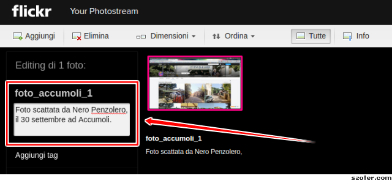
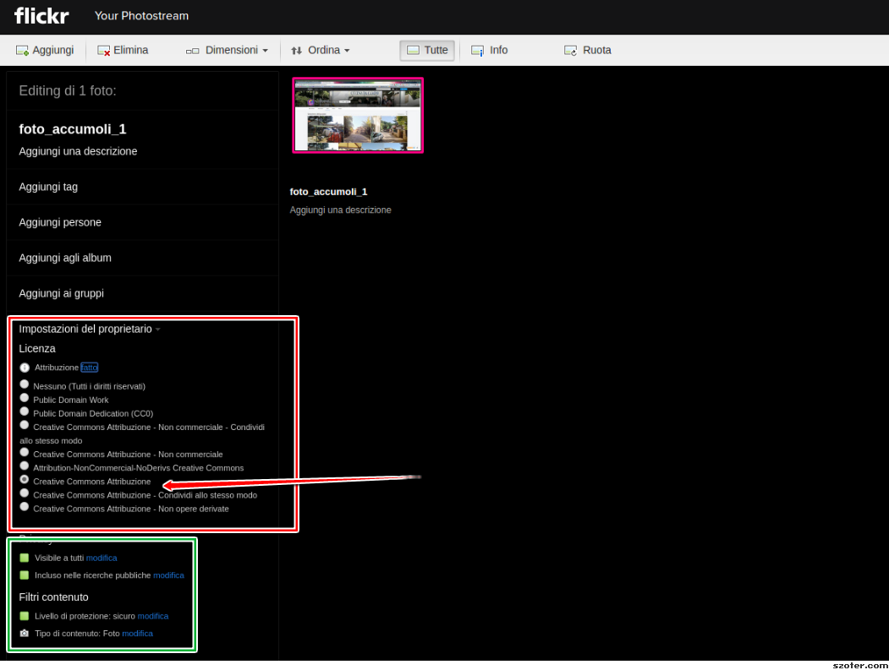
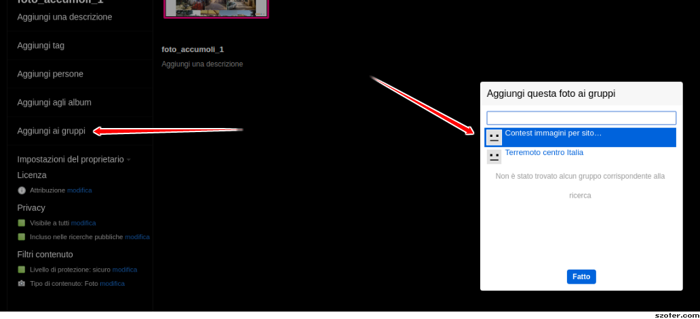

## L'idea
Per arricchire di immagini di qualità il sito, le app e quello che le nostre fervide menti stanno partorendo, abbiamo deciso di lanciare un **contest fotografico**, aperto a tutti, per selezionare le **immagini più significative legate al tema del terremoto**.

Per partecipare è necessario essere iscritti a [Flickr](https://www.flickr.com), l'iscrizione è gratuita e la puoi fare da [qui](https://it.aiuto.yahoo.com/kb/SLN12061.html), una volta iscritto puoi inviare a [questo](https://www.flickr.com/groups/3001605@N24/) gruppo le immagini con cui vuoi partecipare al contest, se hai dei dubbi su come fare [qui](https://www.flickr.com/help/forum/73970/?search=commento) trove tutte le indicazioni su come procedere.

## Le regole
Le immagini devono essere legate al recente **terremoto di agosto**, nella descrizione dell'immagine deve essere indicato il nome e cognome dell'autore, il luogo e la data dello scatto.

Il team di **Terremotocentroitalia.info** si riserva, a proprio insindacabile giudizio, la **rimozione delle immagini** che saranno ritenute **non "in linea" con il contest**.

L'inserimento di **tag** è utile ma non obbligatorio.

Non esiste un numero massimo di immagini con qui puoi partecipare al contest, ti invitiamo comunque a scegliere le migliori, **"quality over quantity" potrebbe essere il nostro motto**.

**Le immagini con cui parteciperai devono essere tue e devi caricarle nel tuo profilo su Flickr** utilizzando la licenza [**CC BY 4.0**](https://creativecommons.org/licenses/by/4.0/), le immagini seguenti ti illustrano come fare.

Dall'interfaccia di upload di **Flickr** scegli "Impostazione del proprietario", poi "Licenza" e come tipo di [**licenza "Attribuzione"**](https://creativecommons.org/licenses/by/4.0/).

Le impostazioni della **"Privacy"** devono essere **"Visibile a tutti"** e **"Incluso nelle ricerche pubbliche"**.

I **"Filtri contenuto"** devono essere **"Livello di protezione: sicuro"** e **"Tipo di contenuto: Foto"**.

Se ti sei già iscritto al **gruppo** ["Contest immagini per sito terremotocentroitalia.info"](https://www.flickr.com/groups/3001605@N24/) a questo punto potrai già scegliere la pubblicazione per il **contest attraverso il link "Aggiungi ai gruppi"** scegliendo il gruppo **"Contest immagini per sito terremotocentroitalia.info"**

Se hai dei dubbi puoi **scrivere nel forum di supporto a [questo](https://www.flickr.com/groups/3001605@N24/discuss/) indirizzo**.

## La scadenza
Il team di amministratori di **Terremotocentroitalia.info**, sceglierà le tre immagini più belle, tra quelle pubblicate **entro il 15 Ottobre**.

## Il premio
Gli **autori delle tre immagini più belle** riceveranno una **tshirt originale** creata dal team di **Terremotocentroitalia.info**.

In bocca al lupo!
