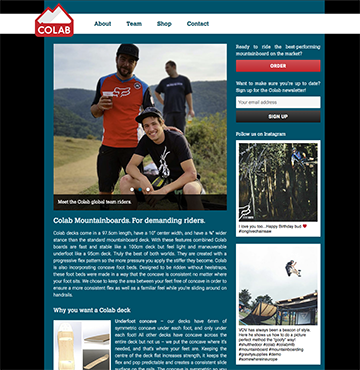
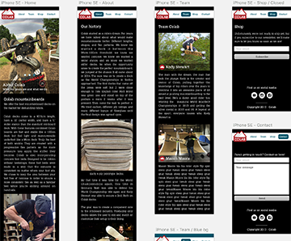
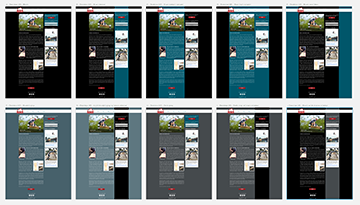

So I volunteered to help my friend Kody start a company by making a website for this business he's starting. As an experienced front-end developer, it's not a huge task for me set up a small site. But to design it? That's a challenge. I mean I have designed things before, but only for myself. So the pressure to come up with something good was different.

### The finished product

Let's skip ahead a bit and show where this is going. The site now lives at [www.colabmtb.com](https://www.colabmtb.com). It's meant to establish a web presence for Colab Mountainboards, a small company building premium [mountainboard](https://en.wikipedia.org/wiki/Mountainboarding) parts, as well as allow people to buy products online.

<figure class="content-image">
	
	<figcaption>The finished product. </figcaption>
</figure>

### Where do I start?

Initially, there was no brand, no logo, no color scheme. Kody had produced some hand-designed logo stickers so he could showcase them under his board during competitions and photo shoots in order kickstart brand awareness:

<figure class="content-image">
	
	<figcaption>Kody flying through the air on his Colab mountainboard. </figcaption>
</figure>

Before we did anything, I wrote up a list of questions for Kody to get a feel for what he had in mind for the Colab brand. Things like:

* What corporate or personal brands should Colab be inspired by?
* What’s the story behind the brand and the naming? Should that be reflected in the design?
* Do you want to focus the branding on: the product, who’s behind it, mountainboarding in general, or values (like commitment, work, competition, freedom, etc.)?
* Any colors you particularly like or dislike?

And then similar things for the content and presentation of the website:

* Do you want something elaborate or simple? Flashy of low-key?
* Are there sites that you particularly like?

### Step 1: brand colors

Armed with the answers, I mulled over this for a bit and decided to outsource the logo design to my friend Margo who's a fulltime graphics designer, and who happens to have a lot of clients in the mountain sports industry (check out her super solid work out at [highmountaincreative.com](http://highmountaincreative.com/work-1)). I did not feel like I was able to come up with something good enough and I knew she would.

I passed the information to Margo and acted as the middle-man, and after a couple of back-and-forths, we agreed on the following color palette:

<figure class="content-image">
	
	<figcaption>The final color palette.</figcaption>
</figure>

### Step 2: the logo

After the color palette was decided on, Margo produced the following logo, based off of Kody's older project Dust:

<figure class="content-image">
	
	<figcaption>The final logo.</figcaption>
</figure>

This is where I commend Margo for the speedy process, the flexibility and the high-quality results! Thanks so much!

### Step 3: get designing!

I know had a set of colors, a logo, and a pretty good idea of the pages and their content, so I set out to create the actual UI design. Keywords for this phase: Sketch, mobile first and iterations.

Everyone's been raving about Sketch for the last 4-5 years, and I did not have a whole lot of experience with it, so this was a good opportunity to ramp up properly. I picked up [the Sketch Handbook from Smashing Magazine](https://www.smashingmagazine.com/sketch-handbook/) and it's been helpful. Sketch is pretty easy to use, but it's nice to have someone guide you through features.

Anyway. Mobile-first. I'm not going to sell the concept, it's been around long enough. And yet it's always nice to use it: get down to basics for mobile, and then add on top for desktop. The transition for tablets and intermediate sizes can be a bit awkward, but things can be reigned in easily enough.

I designed the few pages we needed for mobile. At this point, it was more about layout and general design direction. Actual colors were going to change.

<figure class="content-image">
	
	<figcaption>First iteration of mobile design. </figcaption>
</figure>

### Step 4: code it up!

Once I had an initial design locked down, I coded it up in Wordpress. This is probably the first time I sit down and try to properly understand Wordpress. I have mixed feelings. On the one hand, the UI is great, and they've really polished everything, and there are plugins for everything. On the other hand though, code quality is err, somewhat not great.

If you swallow your (misplaced) pride though, Wordpress is a great platform to build things quickly. I'll definitely need to learn more of it.

### Step 5:

Once the whole thing was written, I went back to Sketch to build the desktop version up, and after a discussion on background colors, I created several variations:

<figure class="content-image">
	
	<figcaption>Screenshot of variations on the desktop version in Sketch </figcaption>
</figure>

The concern was that full-black was a little too "hardcore" for the brand which is tring to be inclusive, and more family-oriented than say, your average skateboard company. Blue felt a little overwhelming, so I looked into some grays, and in the end we settled for blue in the content background, surrounded by black on large screens.

### Conclusion

UI design is a different sort of creative process than my usual (coding). Over time, I've come to get a good sense for what I'll plow through and what I'll struggle with, so I know before I take a task on where I'm going to be spending time. But I have less "cultural bagage" with UI design, and it feels quite a bit scarier at this point, ie I keep thinking "will I be able to do this?".

I suppose I need to do more of it!
