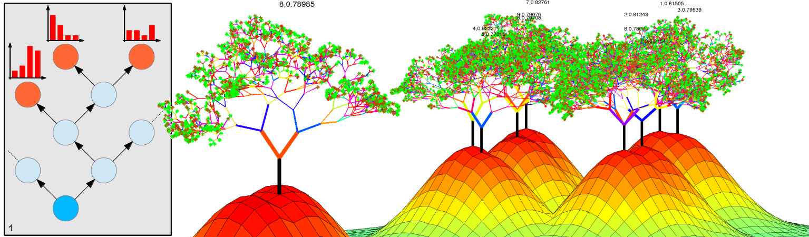

There was a time when working with big data was not technically possible because our compute resources couldn’t handle the amount of information involved. Beyond that, it took a while for the use case to develop around massive computing resources, so it wasn’t even considered a worthy pursuit. 15 years ago, I remember creating machine-learning algorithms using only a handful data points and then tweaking features representation for weeks. Back then, it was quite challenging to process the [20 newsgroup dataset](http://qwone.com/~jason/20Newsgroups/) and its 19 thousand news items.
 
Even as recently as five years ago, the situation hadn't improved much. At that time, I worked on putting a learning system with a continuous retroaction loop into production. To fit the budget, we could only train the Random Forest with 5,000 examples – only a few days of data. Using such a small data set alone would not have produced the desired results, so we had to implement many tricks to keep 'some' past data alongside the continuous feed of new data to keep everything running smoothly.

*Just 5 years ago, a typical server would have enough RAM to train a 5000-examples Random Forest*

On the positive side, however, the beauty of this era was that error analysis - for one thing - was extremely easy, since surveying the entire dataset could be performed manually. But it led to horrendous issues with accuracy and a blatant lack of generalization.
 
Today, we know for a fact that simple algorithms can perform near-magical feats on big data. Google Translate is the ultimate example. Google has published their neural network-based algorithm, which is quite simple compared to the monstrously large statistical machine translation systems. The [Google internal dataset](https://arxiv.org/pdf/1611.04558v1.pdf), however, is two- to three-orders of magnitude larger than any other datasets available: up to 36 billion sentence pairs per language. 
 
A further example can be found in another Google endeavor, the "Chinese chess" playing AI AlphaGo, an early version of which was trained on [160k games and 30M positions](https://www.scientificamerican.com/article/how-the-computer-beat-the-go-master/) – more than a Go Master would see in a lifetime. On top of this conventional 'dataset', game engines can use a technique called reinforcement learning in which the computer plays against itself millions of times and use the outcome to evolving towards the most winning strategy. A similar approach was used to train [Libratus](https://en.wikipedia.org/wiki/Libratus), an AI poker player, which now consistently beats professional poker players after being trained for [15 million processor-core-hours](http://spectrum.ieee.org/automaton/robotics/artificial-intelligence/meet-the-new-ai-challenging-human-poker-pros). 

| Dataset        | Year           | Size  |
| -------------- |:-------------:| -----|
| 20 Newsgroups | (1995) | 19k news |
| MNIST | (1998) | 70k images |
| WT10G | (2000) | 10Gb Web data |
| Google n-gram | (2006) | 100B sentences |
| Netflix challenge | (2009) | 100M ratings, 17k movies |
| ImageNet | (2012) | 150k images of 1000 objects |
| AlphaGo | (2015) |160k games and 30M positions |
| Google Translate | (2016) | 36B sentence pairs per language |

*Some classic big datasets*

### Train a bigger network and get more data

In [Machine Learning Yearning](http://www.mlyearning.org/), Andrew Ng writes "One of the most reliable ways to improve an algorithm's performance today is still to train a bigger network and get more data." He also makes the point that dataset creation is an iterative process. It’s better start quickly, with an imperfect dataset, representation and metrics, gain a better understanding of the problem, and evolve towards a perfect dataset that yields human-level performance. 
 
In my next post, I’ll look at the role of data quality vs quantity.

---
Random Forest visualisation was taken [here](http://www.rhaensch.de/vrf.html).

