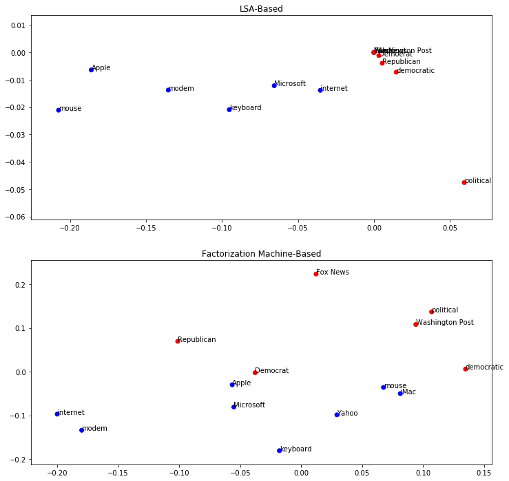

Taking cues from other disciplines is a great way to expand your data science toolbox. Factorization machines (and matrix factorization methods more generally) are particularly successful models for recommendation systems which have led to high scoring results in the Netflix challenge and many Kaggle competitions. In this post, we will apply feature hashing combined with Factorization Machines to a static text classification problem to excellent effect. We'll go through an example and explain the mathematical background of Factorization Machines in an easy-to-understand, simplified fashion. Finally, we will demonstrate how to use factorization machines for supervised visualization in the same vein as latent semantic analysis.

# Factorization Machines

At the most basic level, factorization machines take a linear regression model and add quadratic or second order interactions. A basic linear regression for inputs $$x\in \mathbb{R}^n$$ is
\begin{equation}y(x) = \sum_{i=1}^{n} w_i x_i + c\end{equation}
for some weights $$w_i$$. Let $$w_{i,j}$$ model the interaction between $$x_i$$ and $$x_j$$. Then the second order interactions can be added via
\begin{equation}y(x) = \sum_{i,j=1}^n w_{i,j}x_i x_j + \sum_{i=1}^{n} w_i x_i + c.\end{equation}


This can be written using the vector ($$\ell^2$$) dot product $$(\cdot, \cdot )$$ and definiting the matrix $$W=[w_{i,j}]_{i,j=1}^{n}$$.

\begin{equation}y(x) = (x, Wx) +  \sum_{i=1}^{n} w_i x_i + c.\end{equation}

The interaction matrix $$W$$ has a few special properties:

    - It is sparse (if the data is sparse)
    - It is typically low rank (due to the sparsity)
    - It is symmetric since the interaction between the i and j factor is the same as between the j and i factor

Therefore, if the matrix $$W$$ is symmetric and of rank $$d$$, one has the equality
$$$$ W = V V^T$$$$
for some matrix $$V \in \mathbb{R}^{n \times d}$$. This is a consequence of the eigenvalue decomposition of $$W$$. In general, you don't know the rank of $$W$$ but you assume it's low, so you just guess, making $$d$$ a hyperparameter of the model. Therefore $$W\approx VV^T$$ holds. Then you can rewrite the equation using the identity $$(x,Wx) \approx (x,VV^Tx) = (V^Tx, V^Tx)$$, which is true for a very mathematically technical reason. So finally, we can use the identity and define a factorization machine $$y$$ given by the equation

\begin{equation}y(x) := (V^Tx,V^Tx) +  \sum_{i=1}^{n} w_i x_i + c.\end{equation}

Now, $$W$$ had $$n^2$$ entries (with $$n$$ very large), but $$V$$ has $$nd$$ entries. Since typically $$d <<n$$, $$V$$ has a similar order of entries to learn as $$w_i$$, the linear terms. In other words, it's much easier to learn $$V$$ than $$W$$, yet we still get the utility of the concept of $$W$$ modeling the interactions.

### PyFactorizationMachines

We will use [my fork](https://github.com/srome/PyFactorizationMachines) of PyFactorizationMachines, a theano implementation of Factorization Machines. In my repo, I have adjusted the [original](https://github.com/srome/PyFactorizationMachines) implementation to allow sparse inputs and Python 3 support.

## Applying Factorization Machines to Free Text

Popular text classification approaches include using a TF-IDF transformations while others might use more sophisticated neural networks with word vectors. There are drawbacks to each approach. The TF-IDF approach [does not have a theoretical backing](https://en.wikipedia.org/wiki/Tf–idf#Justification_of_idf) and in some cases applies a heuristic that may be inappropriate for the problem. In addition, TF-IDF-style approaches do not work for online and out-of-core learning problems as they require the entire training corpus at the start of training. For word vectors, one may not have the necessary volume of domain-specific data to train word vectors, the available pre-trained word vectors are insufficient, or they simply want to avoid such complicated approaches due to time constraints. Factorization machines have the potential to scale a non-linear model to prohibitively large data sets when compared to other nonlinear models.

# The Data

For our example, we will use the "20 Newsgroups" data set that is included with sci-kit learn.


```python
from sklearn.datasets import fetch_20newsgroups
twenty_train = fetch_20newsgroups(subset='train', 
                                  shuffle=True, 
                                  random_state=42)
```

## Label Definition

First, we have to define the label for our classifier and subsequently create some features. The label part is going to be simple, we will label text from any newsgroup with "comp" in the label as "1" and otherwise "0".


```python
twenty_train.target_names
```


    ['alt.atheism',
     'comp.graphics',
     'comp.os.ms-windows.misc',
     'comp.sys.ibm.pc.hardware',
     'comp.sys.mac.hardware',
     'comp.windows.x',
     'misc.forsale',
     'rec.autos',
     'rec.motorcycles',
     'rec.sport.baseball',
     'rec.sport.hockey',
     'sci.crypt',
     'sci.electronics',
     'sci.med',
     'sci.space',
     'soc.religion.christian',
     'talk.politics.guns',
     'talk.politics.mideast',
     'talk.politics.misc',
     'talk.religion.misc']


```python
import pandas as pd
def define_label(x, target_names):
    name = target_names[x]
    return 1 if 'comp' in name else 0
    
target = pd.Series(twenty_train.target).apply(lambda x : define_label(x,twenty_train.target_names))
target.mean() # Prevalence of the label
```


    0.25950150256319604


# Feature Hashing

To allow us to train from the data (raw text), we will split the data by spaces and hash the output. Feature hashing is a robust way to create features in many contexts, not only text. It is fundamentally similar to one-hot encoding but can store additional information. As you will see, this simple approach is actually quite powerful.

Feature hashing has become popular in the context of online learning. In a feature hashing approach, one does not have to define features upfront, and so a model could be exposed to new data and learn new features over time, including new categorical values for pre-existing features. It also has the benefit of storing the data in a very small (and fixed) memory footprint which is great for learning on large data with a huge number of features (like text!).

So how does feature hashing work? Here's a simplified explanation. Imagine if before training you define a fixed hash table of a given size in which to store objects (or more precisely, references to objects). A hash table can be thought of as a big array, much bigger than you probably need, and then you identify a function that maps objects to indices for the array, and the object is stored in the box represented by that index. The function that assigns the index is called a hash function. In fact, a python dictionary is nothing more than a hash table implementation (or HashMap for you Java users).

For a suitably large hash table, and well chosen hash function, you expect every object to be assigned a unique index. However, this is NOT guaranteed. When two objects have the same hash value, a "collision" occurs. Collisions are exceedingly rare, but if your objects are individual strings, and lots of different strings, the likelihood is slightly higher. This originally was thought to be a flaw in the approach; however the current wisdom is that this actually acts as a form of regularization for a model, helping to prevent overfitting.

The short of it is-- hash away! It's very convenient and it allows you to skip a tedious feature engineering portion while maintaining much of the utility if a proper modeling approach is utilized.

### Note on Factorization Machines

One addition we make is that we turn each feature into an indicator if a word exists rather than a count. Factorization machines are used in many online learning algorithms and so typical text approaches like TF-IDF are not appropriate if you would not know the whole corpus up front, and so in that spirit, we make our features indicators.


```python
def clean_text(text):
    # Basic cleaning
    text=text.replace('\n','').replace('\t','').replace('<','').replace('>','').replace('|','')
    return [x for x in text.split(' ') if len(x) > 3]

X = [clean_text(x) for x in twenty_train.data]

from sklearn.feature_extraction import FeatureHasher

# Hash away!
fh = FeatureHasher(input_type='string',non_negative=True)
X_t = fh.transform(X)

# Bin the inputs so that the "interaction" terms are more interpretable
X_bin = X_t.copy()
X_bin[X_bin >= 1] = 1
```

# Sparse Data

A sparse matrix only stores nonzero values, which makes it a memory efficient format. Sparse data can allow you to leverage more raw information than you can store in memory in a "dense" format, meaning a matrix with 0's filled in. The sci-kit learn implementation of feature hashing results in a sparse matrix.

### Drawbacks

Some nonlinear models do not perform well against sparse data and many are not implemented to use sparse data at all. Training can also become prohibitively long in these cases. As we have mentioned, such drawbacks are not present in factorization machines.

As the number of features increases, tree based models built by the CART algorithm (like sklearn's decision trees) become exceedingly slow to train because they evaluate a subset ($$\subseteq$$) of the features at every split. Above, our sparse matrix technically has over 1 million features, due to the size of the hash table. To alleviate this you may choose a lower number of features to evaluate at each split or shallower trees, but then you may have to build more trees to be performant.

In the case of a neural network, you can run into issues as the number of weights increases. In our case, we also do not have a large volume of training examples (~ 11k). Depending on how the library is implemented, there can be hard limits on the memory usage of the weights of the hidden layers (for example, H2O's H2ODeepLearningEstimator model).

You could reduce the dimension of the inputs, but this may not help performance either due to the noise present in the data. Using a Truncated SVD (similar to PCA but works better for sparse data) will degradate information in your raw features and the goal is the leverage the total of the information available to the algorithm.

# Model Training


```python
from PyFactorizationMachines.src.pyfm import FactorizationMachineClassifier
from sklearn.model_selection import train_test_split

f = FactorizationMachineClassifier(X_t.shape[1], sparse=True)
X_train, X_test, y_train, y_test = train_test_split(X_bin, target, test_size=0.33, random_state=42)

f.fit(X_train, y_train, beta_w1=.01, beta_v=.01, nb_epoch=20, verbose=True, batch_size=250, shuffle=False)
    
```

    Epoch 1/20
     loss: 0.4580247571345378, min_loss: 0.4580247571345378
    Epoch 2/20
     loss: 0.28444270535751276, min_loss: 0.28444270535751276
    ...
    Epoch 20/20
     loss: 0.019713793716321436, min_loss: 0.019713793716321436


We check the result on the held out test set to make sure the model is useful for classification, otherwise the visualization will not be helpful.


```python
from sklearn.metrics import classification_report
pred = f.predict(X_test)

print(classification_report(y_test,pred))
```

                 precision    recall  f1-score   support
    
              0       0.88      0.95      0.91      2786
              1       0.80      0.61      0.69       948
    
    avg / total       0.86      0.86      0.85      3734
    


# Supervised Visualization

A typical approach to visualizing text data is using latent semantic analysis via a PCA or SVD. Since our data is sparse, we need to use the SVD. However, this approach is unsupervised and so the visualization is not specialized-- it simply is related to the theory behind the LSA and the semantics found in your documents. In our case, we'd like to visualize the words based on our supervised learning problem.

In fact, we can use the "latent factors" from the rows of $$V$$ and the hashing function to visualize our supervised model's understanding of different words. This approach was used in the Netflix challenge and it was found that the movies were grouped by genre. In our case, we will see that words associated with each label are loosely located together when using the location given by $$V$$.

To visualize the relationships of factors, you can use the first two entries of the vector of $$V$$ which corresponds to the index of the factor. To find this index, we pass the word through the hash function. For this example I only took words that would pertain to two "ideas", namely politics and computers.


```python
# LSA-based approach
from sklearn.decomposition import TruncatedSVD
from sklearn.feature_extraction.text import TfidfTransformer
import numpy as np

# Get the same training data for LSA
X_train, X_test, y_train, y_test = train_test_split(X_t, target, test_size=0.33, random_state=42)

tfidf = TfidfTransformer()
X_lsa = tfidf.fit_transform(X_train)
svd=TruncatedSVD(n_components=3)
M = np.transpose(svd.fit_transform(np.transpose(X_lsa)))

# V from Factorization Model
V=f.v.get_value().copy()
```

Now that we have the matrices, we can visualize the feature space.


```python
import matplotlib.pyplot as plt
%matplotlib inline

# Fit the model to the data to learn V
from sklearn.feature_extraction import _hashing # The hashing function we used

words = {}

# Terms that might be found in sci/comp
for word in ['keyboard', 'Microsoft', 'iMac','Apple',
             'internet', 'Yahoo', 'modem','mouse']:
    indx = fh.transform([[word]]).indices[0]
    words[indx] = (word, 1)

# Terms in the other groups, probably
for word in ['Republican',
             'Washington Post', 'Fox News',
             'political','Democrat','democratic']:
    indx = fh.transform([[word]]).indices[0]
    words[indx] = (word, 0)

def visualize_words_from_matrix(matrix, words, ax):
    # Plot the word's locations colored by label
    x = [matrix[1, k]  for k in words.keys()]
    y = [matrix[2, k]  for k in words.keys()]
    color = ['b' if x[1] else 'r' for x in words.values()]
    ax.scatter(x,y, color = color)

    # Add the words to the plot
    for i, v in words.items():
        word, target_class = v
        ax.annotate(word, (matrix[1, i], matrix[2, i]))

fig, ax = plt.subplots(2, figsize=(12,12))
ax[0].set_title('LSA-Based')
visualize_words_from_matrix(M, words, ax[0])
ax[1].set_title('Factorization Machine-Based')
visualize_words_from_matrix(V, words, ax[1])
```





You can see that loosely the words were grouped together by label in both cases. This lends more credence to how a linear model or an SVM like model could do well identifying the labels with few errors. LSA has been a very successful approach for grouping words by their topics as well, and so it's not surprising that it performed here. However, for more specific tasks that wouldn't break down by topic, the factorization machine approach could prove to be a useful tool. This was actually seen during the Netflix challenge when the matrix $$V$$ grouped movies by genre.


# Caveats

One disadvantage for using the hashing method on some data sets is losing explainability on these simple models. This is in part due to the collisions of the hash function, but also because many times hashing is used as a "one-hot encoder" by making the data set a series of strings "feature=value". In our case, we can actually map strings (which are words in the training set) through the hash function, thus finding their corresponding index in $$V$$. However, there is no way to map backwards from an index to a word uniquely in general, as this would depend on the hashing function.

# Extensions

There are many extensions to the presented techniques depending on context. Factorization machines themselves have been extended to different, more specialized models. For example, Field Aware Factorization Machines have won two Kaggle competitions on click-through rate prediction. You can use feature hashing on non-text data. In large scale online learning, probablistic feature inclusion can be used to cut down on the number of features or categorical values. 

### Example of Feature Hashing For Non Free Text

Although we have used this approach for text data, it is actually appropriate for any type of data. As we have mentioned, you can arrange your data set in the format of "feature=value" with the hash being a count. Here's an example. Let's say we have a data set where we are trying to predict someone's college major. Imagine some of the columns indicate their preferences:

    favorite_os, favorite_book, favorite_animal 
    
Using one-hot encoding on any of these columns could be problematic on a large data set. However, with feature hashing, we won't have any problems. To encode these features properly, one strategy is as follows:


```python
# Define a row of your data set
columns = ['favorite_os', 'favorite_book', 'favorite_animal']
data_row = ['Linux', 'Excession', 'cat']


new_data_row = ['%s=%s' % (x,y) for x,y in zip(columns, data_row)]
print(new_data_row)
```

    ['favorite_os=Linux', 'favorite_book=Excession', 'favorite_animal=cat']

