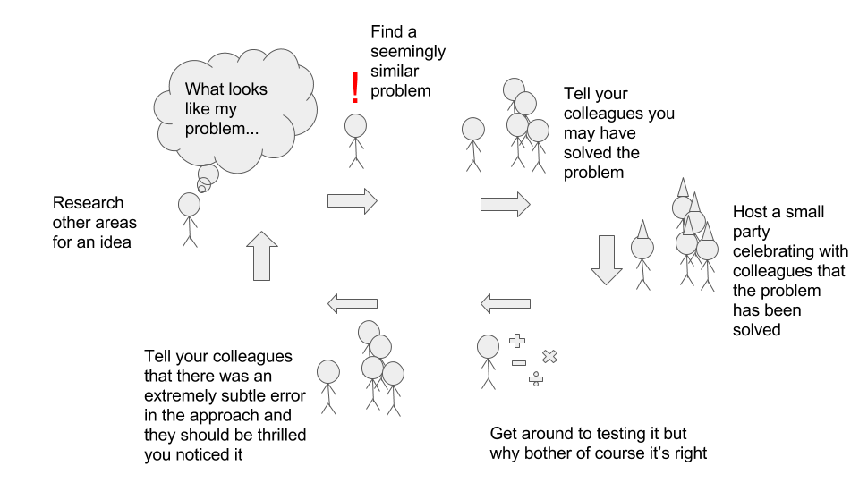

Most things you need to know when you start as a data science can be found online these days. Besides containing my own opinions, this post also aims to detail some important points that are either not always spelled out in detail or are glossed over. I also include practical advice to avoid typical mistakes a new data scientist can make. Of course, it's going to be tailored more towards python users (as I am one too), but that doesn't mean there's nothing there for other users.

After reading a friend's [post](https://philadelphiaphysicist.wordpress.com/2016/11/11/transitioning-from-physics-in-academia-to-data-science-lessons-learned/) on transitioning to industry from academia, I decided I wanted to give my own take on starting up as a data scientist.

## General Advice

Some of these may seem like common sense... but we still don't always do them.

### Read the Docs

Documentation is your best friend. You should fully read the documentation on any piece of your ML pipeline **in full** before you employ it. Make sure you understand any gotchas and special cases that are highlighted. I've been particularly bitten by H2O in the past...

### Work With Notebooks

No matter what language you use there's a concept of a notebook. Notebooks have become indispensible in my workflow for organizing my thoughts and analyses. I write this blog in a notebook. They allow you have code, output, and text side by side in a natural way to explain what is going on in your work. For research and for basic prototypes, notebooks are essential. For Python, the standard is the [jupyter notebook](http://jupyter.org/). There's a similar concept for scala and I'm sure for the other languages. It even allows to export your work directly to a pdf document, it can be converted easily into a powerpoint-ready presentation, you can include math equations with LaTeX, and even drop the code to a (say) Python .py file. It's a great place to start any analysis.

### Organize Your Projects With Version Control

This seems like an obvious statement-- but many of us are lazy and lose track of our projects. Maybe one avenue of analysis you took happened on a separate branch that you thought you merged in but you didn't. Maybe some exploratory analysis becomes important all of a sudden, and all the code is broken because you've updated a library. It seems crazy-- but it happens. You have to enforce a strict organizational policy on yourself.

There's many patterns I've seen for organizing your projects. I think they most important thing is to DO IT. Too long I let scripts and data float around my hard drive after I finished a prototype, and I had forgotten about it by the time business had decided to give the project legs. Then, I had to find everything and immediately remember the nuances of my undocumented work. Big mistake.

One tips I use was to keep all code/data for each project in a self contained folder, which itself is in a single folder (Say "research"). This was a great tip I saw on twitter actually. However, I want to extend the suggestion. If possible, you should store each individual project (sans data, probably) in a version controlled (git!) repo. My suggestion is a basic "models" repo with a folder for each project. Then, the readme for each project can contain any additional information needed to get up to speed with the analysis and the results. You should have your ETL script (or however you got the data), a notebook of the analysis, and information on the dataset, and where its permanent home is. Another important thing is to document the libraries used and their version. This can be an issue with early versions of libraries. For python users, a simple approach is to include a pip requirements.txt file with the versions pinned hard. It's very frustrating when you saved a model in the repo but can't load it because you've updated versions in the interim. More on that below (see virtualenv).

Keeping the ETL script is more important than you'd think. It's ideal if you have a data dictionary for the project, but for quick prototypes that you may do in your free time, you may not be able to do a full scale data dictionary. The ETL script (fully commented, of course) will really help.

#### Python Tip: Use virtualenv

Different projects have different requirements. Virtualenv allows you to upgrade any library you want and not break other projects as each project will have its own virutalenv setup with it's own requirements installed. Many older models I build on an old version of Keras broke when I upgraded, but I forgot what version I was running when I built it! If I had kept track of that, I could have spun up a virtualenv (or loaded the old one, if I had saved it) and been instantly back in the same position I was in-- seeing the same results as I had.

## Timebox Research

Research is a critical component as a data scientist, but the usual academic approach to research (which I have at least once been guilty of) should be timeboxed. That is, don't start doing research for a project without also deciding on a reasonable amount of time you'll spend on it-- and spend no more!



And even though it seems like the most important component, only make humorous graphics for talks after the main meat of it is completed... less stressful that way.

## On Evaluating Your Model Correctly

A "golden rule" that will always point you in the right direction in data science is "test exactly the process you want to generalize in the same manner as it will be evaluated". It sounds easy, but in practice there are some subtle nuances that can lead to poor results when missed. I break this statement down below.

I'm going to use "cross validation" in this section, but for large models you may not be able to do full cross validation. I understand this and in those cases you are probably far enough along that you don't need my advice :).


### The Process You Want To Generalize: Think Of Your Model as a Pipeline

Your model is not just the ML algorithm you use to predict. It's the entire pipeline including your data transformation, your scaling, your feature engineering (in many cases when automated), how you select hyperparameters, and your final model. When you identify these components together, it makes the following sections easier to understand conceptually why you do it.

### Test Your Process: Use Nested Cross Validation

I just said think of your pipeline as your model. Why? It makes the question of what to cross validate easy! You cross validate your WHOLE pipeline-- as that is what you want to generalize! No one disagrees that cross validation is an important tool in a data scientist's pocket, but many people do not do it properly and it can lead to disasterous results. 

Now, that may sound well and good, but there's a sneaky component to this. Many of us use cross validation to select parameters, and above I said to think of that piece as part of your pipeline. So yes, what I'm saying is, you should have 2 cross validations happening when you test your model (your pipeline!) with cross validation. This is called **nested cross validation**. The "outer" cross validation tests the generalization of your pipeline, where the "inner" cross validation is typically used to select hyperparameters or feature engineering steps. 

What this is also subtly implying is if you can't automate a process in order to cross validate it, it's likely (unless you are a seasoned expert) you shouldn't do it. If you want to cut off features that fail to a hit a threshold to cut down your data-- you better do it inside your pipeline so it can be cross validated as a part of your process.

The key is whatever your pipeline is, that's what you want to generalize. If you do anything outside of a cross validation framework, you could discover that your model doesn't actually generalize to new data when it's in production rather than catching it earlier. 

If you plan to try different models, this advice would include adding different algorithms (Random Forest, NN, Linear Regression, etc) to this nested cross validation scheme under ideal circumstances. Remember, however you are picking your final approach should be cross validated.


### In The Same Manner As It Will Be Evaluated: How is "Success" Judged By Business

Cross validation is a great tool, but you need to be aware of your goals. Many tips say to shuffle your data during training (either before it starts, or during epochs, etc.) which is great, but you may need to do more than that.

The important question to ask is what will you be predicing on in the future and what the business goal is-- what determines the success of your model. If you will be predicting on examples from the **SAME** population as your training set, and your CV metric generalizing is your goal, then a standard shuffle + CV is great for you. A proven model that answers the right question can achieve the business goal on the desired population. If you will be predicting on a **NEW** population, you should cross validate the same way it will be evaluated. 

Let's go through an example. Say you have data for multiple states for something you'd like to predict. Your goal is to predict on new states not in your current data set. You will be evaluated on how well the model predicts the quantity on each individual state and an average taken of the success. This is a situation where you do **not** want to simply cross validate on your training set. If you simply shuffled and cross validated, you would be answering the **WRONG** question-- as in production, your model won't be evaluated by business on its performance on this type of data. You should use Labeled (or Grouped) cross validation. This labels the data based on the population they're in, and then during cross validation, it ensures that the group will never be "split" into both the training and the test set. This way, for every fold, you will be training on A B and C and predicting on a new group. This is exactly what your goal is, and you're getting an estimate on how well your process generalizes! For python users, try the [GroupKFold](http://scikit-learn.org/stable/modules/generated/sklearn.model_selection.GroupKFold.html) class in sci-kit learn.

This is important as you as the data scientist should be confident that your model will satisfy the business goals you commit to do, as you are the one who is being judged along side your model and it's your career that is effected by its performance.


#### Read the docs more!!

Take sci-kit learn's [GridSearchCV](http://scikit-learn.org/stable/modules/generated/sklearn.model_selection.GridSearchCV.html). The "iid" indicator is defaulted to true-- let's see what this does:

    If True, the data is assumed to be identically distributed across the folds, and the loss minimized is the total loss per sample, and not the mean loss across the folds.
    
This is very subtle. What does it mean for your data to be IID? In our grouped cross validation example, I'd prefer to set this setting to "False" as I'd want a low mean loss per fold AND a low standard deviation to be sure my model generalizes on the question I'm asking of it.


## An Example Python Model Training Script

Below I'll give an example model in sci-kit learn. Now, I do not always advocate for all of these techniques, but I wanted to include as much as possible to identify the proper approach based on the previous points. 


```python
from sklearn.model_selection import GridSearchCV, GroupKFold, cross_val_score
from sklearn.decomposition import PCA
from sklearn.feature_selection import SelectKBest
from sklearn.linear_model import SGDClassifier
from sklearn.pipeline import Pipeline

data_labels = [...] # Labels for your data set's groups

# Pipeline definition

steps = [
    ('pca', PCA()), # Might as well...
    ('feature_selection', SelectKBest()), # Let's be selective
    ('classifier', SGDClassifier()) # Start simple
]

pipeline = Pipeline(steps)
params = {
    'pca__n_components': [.5,.7,.9],
    'classifier__loss' : ['log','hinge'],
    'classifier__alpha' : [.01,.001,.0001],
    'feature_selection__k' : ['all', 1000, 500]
}

model = GridSearchCV(pipeline, param_grid=params)

# Evaluating generalization to new overarching groups
scores = cross_val_score(model, X, y, groups=data_labels, cv=GroupKFold())

# Now fit your model on the data
model.fit(X,y)

# Test on final held out test set...
```

As of scikit-learn 0.18, you can't have the labels passed to the inner GridSearchCV, which is unfortunate, but at least the outer loop will respect the groupings.

## Assorted Practical Advice and Personal Preferences

### Quantile Your Predictions

If you're working on a problem in business, AUC is not always very helpful to communicate with business. If you can boil your problem down to a classification problems, it may make life easier. Business colleagues appreciate a yes or no answer from the model, and providing the raw likelihood output can be counter productive. They want a decision-- that's what they hired you for! Work with them to determine their goals and explain the model in those terms. You will have to guide business in many cases in their understanding and explaining the model's impact on business is always a good start. However, they still would like to understand different degrees of confidence in the predictions. A good approach is to bucket your predictions and explain the results with metrics evaluated for each bucket. Precision, recall and lift are more applicable and easier to speak about in many situations. 

### Sparsity is Your Friend

A sparse data set is the name for when your data has few nonzero data points. The libsvm file format is very helpful and a widely supported way to represent data sparsely. I've been able to reduce TBs to MBs by representing my data sets properly in a sparse format. This can really help you when trying to run parallel random forests in say sci-kit learn which notoriously copies your data set (last time I checked) for each tree.

### Treat Algorithm Selection as a Hyperparameter

The algorithm you suggest is no different from the number of trees you choose for your forest. If you are testing multiple candidate models, they should all be included in your inner CV in your pipeline-- otherwise you're not testing part of your process.

### A Winning Combo: More Data + Algorithms That Do Feature Engineering

I do not think I will be able to come up with the same features a random forest or a neural network can under ideal circumstances. In my mind, I should provide the model with as much data as possible and let the mathematics behind the algorithm power and direct learning. Of course, this approach does not necessarily work with simpler models and in those cases feature engineering might be necessary. It would also be inappropriate if you want an explainable model.

### Learn Your Regularization

Regularization is prevents overfitting to the data. Almost all basic models in mature packages automatically apply some form of regularization for you, but if you're a savvy user, you may want more say in your regularization. Do you want fewer features for your linear model? Use L1 regularization (Lasso). Do you want to ameliorate colinearity for a linear model? Use L2 regularization (Ridge). What about a little of both? Use both (ElasticNet). Are you working with convolutional neural networks? Dropout and gradient clipping. Did you apply dropout to a large sparse data set of dense layers? Probably a bad idea... How do you regularize random forests? More trees, less features per split, smaller bootstrapped samples, shallower trees. Every model will have its quirks, but it's important to understand what regularization is and how it can benefit your specific use case.

### Data Integrity is Key To Performance

When your model is not performing, or is performing strangely, try to diagnose the problem through the data. Look for leakage or mistakes in the ETL. It's also possible that certain features aren't scaled properly if the algorithm is not scale invariant. 

### Keep It Simple (Stupid)

My old English teacher used to say this a lot, and it's true in data science as well. A nice scale invariant model like a random forest typically does well in many instances. You don't usually need to play with the default hyperparameter settings. With the right data (and the right amount!), most implementations will do very well with their default settings. Ouside of Kaggle, you rarely need to use parameter search to have a decent model. If a model isn't working, it's sometimes better to try an alternative algorithm rather than diving into parameter searches. There's no free lunch, afterall. However, you should always try a baseline linear model before you break out too much machinery.

### Understanding Runtimes

It's helpful to get a basic understanding on how models work so you can understand how long it may run. Can a model be parallelized? How does it scale with samples? With more features? Random forests can become annoyingly slow with lots of features with many values, as most CART implementations will check every split on every feature sampled for a tree. This can be sped up, for example, by using "Extremely Random Trees". Stochastic gradient descent algorithms get better after more epochs, and can take a long time to converge, but sometimes converge to a decent model well before your random forest model could train to allow you to see a simple feasibility check. This can be very helpful when you're training models on your laptop. A good practice is to have a basic understanding of how the major algorithms scale with features and with samples.


