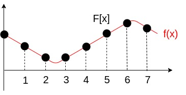
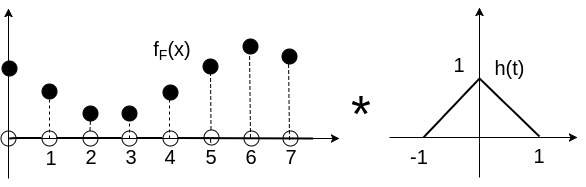
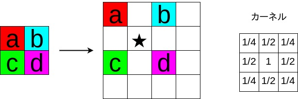
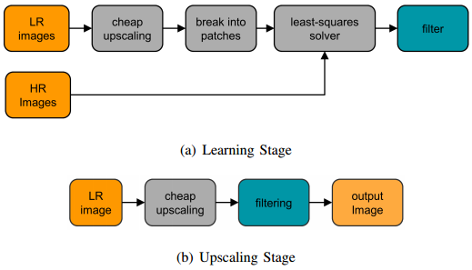
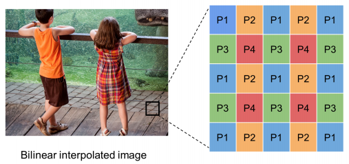
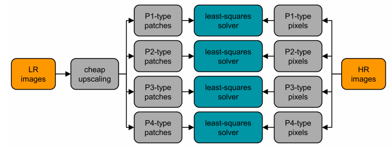
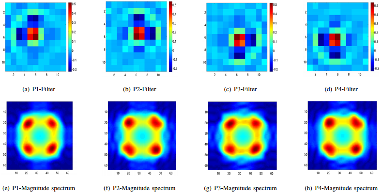

### TL;DR
- その１では RAISR の話はせず、前段となる定式化や基本的概念を説明する
- 基本となる考えは、bilinear補間のようなcheapな補間にさらにフィルタを適用して高精度化するというもの
- フィルタの学習には低解像度画像と高解像度画像のペアを用いる
- 学習したフィルタはバンドパスフィルタのような振る舞いをすることが示された
 

<!--
- 他のstate of the artと比べて遜色のない精度で、速度は2桁も速い
- bilinear補間のようなcheapな補間に学習したフィルタをかますことで高性能にする（Deep Learning的手法ではない）
- フィルタ学習には低解像度画像と高解像度画像のペアを用いる
- 画像を同じような輝度勾配情報を持つbucketに分け、ローカルの情報を考慮してフィルタを学習する
- 処理高速化のために勾配情報をハッシュ化したテーブルを構築する
-->

Googleが出した超解像の論文 RAISR:Rapid and Accurate Image Super Resolution [（原論文へのリンク）](https://arxiv.org/abs/1606.01299) を読んだ。

 

## 0.前準備
まず超解像の問題を定式化する。
Single Image Super Resolution (SISR) は低解像度の画像をインプットとして高解像度の画像をアウトプットするものである。
特に、線形の問題の場合は次のように定式化できる。

$$
\begin{align}
\textbf{z} = \textbf{D}_s \textbf{H} \textbf{x}.
\end{align}
$$

ここで、$$ \textbf{z} \in \mathbb{R}^{M \times N} $$ がインプットの低解像度の画像、
$$ \textbf{x} \in \mathbb{R}^{Ms \times Ns} $$ がアウトプットの高解像度の画像である。
線形演算子 $$ \textbf{H} \in \mathbb{R}^{M N s^2 \times M N s^2} $$ は高解像度の画像をfactor $$ s $$ にしたがいぼやけさせる働きをしていて（低解像度から高解像度の画像へはfactor $$ s $$ で拡大しているのでその逆のプロセス）、
それに $$ \textbf{D}_s \in \mathbb{R}^{M N \times M N s^2} $$ を作用させることで低解像度の画像を得ている。
実際の問題においては $$ \textbf{z} $$ から $$ \textbf{x} $$ を求めることになる。

次にbilinear補間に関しても述べておく。
RAISRはベースとするcheapな補間として何を選ぶかには特に制限がないが、論文ではbilinear補間を例に議論が展開されているためである。
1次元の線形補間が分かっていれば多次元への拡張はstraightforwardなので、ここでは1次元の場合を考える。
1次元の画像を考えれば、下図のように、横軸がピクセル番号で縦軸がピクセル値のように表せる。
$$F[x]$$が実際のデータの値で離散的なものであり、$$f(x)$$が無限に解像度を高くした場合の連続的なピクセル値を与える関数である。

{: .center}

補間とは離散にしか得られていないピクセル番号の間のピクセル値を得る方法である。
まず、離散的な$$F[x]$$を用いて以下のような関数を作る。

$$
\begin{align}
f_F (x) = \begin{cases}
  F[x] & x \text{ is integer} \\
  0 &  \text{otherwise}.
\end{cases}
\end{align}
$$

この関数と線形フィルタ $$h(t)$$ の畳み込みを考えることで、補間を実施した関数 $$\tilde{f}$$ を求めることができる。
$$ \tilde{f}(x) = \int dt \  h(t) \ f_F(x-t) $$.

{: .center}

このフィルタの働きを考えれば、upscaling（画像を拡大すること）を理解することも難しくはない。
下図は2Dで各方向をそれぞれ2倍する場合のupscalingである。
ピクセル間にピクセル値が0となるピクセルを挿入し、その後に上述のフィルタによる畳込みを行えばよい。
2Dになっているが、この場合はフィルタが四角錐のような形になる。

{: .center}

具体的な計算としては右に書いたカーネルを適用すればよい。
例えば、★ のピクセル値を計算したい場合、このピクセルにカーネルの中心を合わせて要素の積を足しあげればよい。
白抜きのセルはピクセル値が0であることに注意すれば、$$(a+b+c+d)/4$$ となることが分かる。

このbilinear補間では、計算のパターンとしては4つのパターンが繰り返されることが分かる。
拡大前の値をそのまま使うセル、水平方向の平均を使うセル、垂直方向の平均を使うセル、周りの4つの値の平均を使うセル、である。

これでupscalingは可能である。
問題は、いかにして良いフィルタを獲得するかということである。

 
## 1.globalフィルタの学習
いよいよ論文の内容に入っていく。
まずは、globalフィルタの学習の場合を議論する。　
基本的な戦略は下図（論文のFig.1）のようなものとなる。

{: .center}
{:height="300px" width="500px"}

(a)のlearning stageでは低解像度と高解像度の画像ペアからフィルタを学習し、(b)のupscaling stageでは学習したフィルタを使って実際に画像を拡大している。
cheap upscalingというのがさきほど説明したbilinear補間によるupscalingを指している。
patchというのはフィルタのサイズに対応するものであり、拡大した画像の1ピクセルを計算するために用いる周りのピクセルの数と思えばよい。
例えば、bilinear補間で画像を拡大した後、あるピクセルの値を補正するときにそのピクセルを中心とする $$3 \times 3$$ のピクセルを用いて計算する場合、patchサイズは $$3 \times 3$$ となる。

これを数式に落とそう。数式の方が分かりやすい。
$$\textbf{h} \in \mathbb{R}^{d^2}$$ をvectorizeしたフィルタ、$$\textbf{A}_i \in \mathbb{R}^{MN \times d^2}$$ をサイズ $$ d \times d $$ のパッチとcheap upscalingで拡大された画像のピクセル値で構成される行列（すなわちこれはcheap upscalingの手法とパッチサイズを定めれば一意に定まる）、$$ \textbf{b}_i \in \mathbb{R}^{MN} $$ は高解像度画像のピクセル値をベクトル化したものとする。
図のleast-squares solverは次のように定式化される。

$$
\begin{align}
\min_{\textbf{h}} \sum^{MN}_{i=1} || \textbf{A}_i \textbf{h} - \textbf{b}_i  ||^2.
\end{align}
$$

実に簡単である。
しかし、行列 $$ \textbf{A} $$ はかなり大きいサイズになってしまう。計算コストを落として良いフィルタを得るために、以下２つの独立したアプローチを採用する。

- 画像全部を対象にするのでなく、$$K << M$$ というサンプリングしたピクセルでフィルタを学習する
- 最適化の式を工夫して扱うことでメモリも計算量も減らした最適化に置き換える

後者に関して詳しく見てみよう。
$$\textbf{Q} = \textbf{A}^T \textbf{A} $$ と $$ \textbf{V} = \textbf{A}^T \textbf{b} $$ という量を導入することで、最適化問題は次のように書き換えられる。

$$
\begin{align}
\min_{\textbf{h}} \sum^{MN}_{i=1} || \textbf{Q} \textbf{h} - \textbf{V}  ||^2.
\end{align}
$$

これは単なる書き換えに過ぎないが、$$ \textbf{Q} $$ は $$ d^2 \times d^2 $$ という小さい行列であることに注意されたい。
$$ \textbf{V} $$ に関しても同様である。
この $$ \textbf{Q} $$ や $$ \textbf{V} $$ の計算は行列 $$ \textbf{A} $$ を全てメモリに確保するする必要はなく、chunk $$ \textbf{A}_j \in \mathbb{R}^{q \times d^2} (q << MN)$$ 毎の計算が可能である。

$$
\begin{align}
\textbf{Q} &= \textbf{A}^T \textbf{A} = \sum_j \textbf{A}_j^T \textbf{A}_j \\
\textbf{V} &= \textbf{A}^T \textbf{b} = \sum_j \textbf{A}_j^T \textbf{b}_j 
\end{align}
$$

省メモリで並列計算も可能なため、計算速度は確保しやすい。
さらに $$ \textbf{Q} $$ が半正定行列であるため、最適化問題は共役勾配法を使うことが可能である。

 
## 2.globalフィルタの学習結果
実際にbilinear補間をcheap upscalingとして採用した場合の結果を見てみる。
2Dの画像をx軸y軸共に2倍 upscaling する場合を考える。
この場合、次の図（論文のFig.2）で示すように4つのパターンのpatchが得られる。

{: .center}

この4つのpatchは、既に説明したbilinear補間における4つのパターンである。
画像全部でフィルタを学習するのではなく、それぞれのpatchでグループ分けしてフィルタを学習する。
それをexplicitに書いたのが次の図（論文のFig.3）である。

{: .center}

新しい画像を upscaling する場合も同様に patch に分けてからフィルタを適用し、それらをつなぎあわせて出力することになる。

実際に学習（上で示した子供が写っている画像で学習）されたフィルタは、次の図（論文のFig.4）のようにバンドパスフィルタのような結果が得られることが示されている。
バンドパスフィルタはその名の通り、特定の周波数のみを通してそれ以外は通さないフィルタのことである。

{: .center}

上段は学習したフィルタである。
フィルタサイズは $$11 \times 11$$ である。
下段は周波数領域でのスペクトルである。
スペクトルで見ると同様の結果が得られていて、これはフィルタの強度としては似たようなものであることを表している。
フィルタそのもので見ると位置が異なっていて、これはフィルタの位相としては異なるものであることを表している。
この性質はベースになっているbilinear補間から来ているものだと解釈できる。

 
まとめて全部書こうと思っていたが、長くなってきたので一旦ここで切ることにする。
ここで示したglobalフィルタでは単純すぎて性能としては十分ではない。
RAISRでは、各パッチをまとめてフィルタを学習していた部分を似たような輝度勾配情報を持つbucketへと細分化して、それぞれでフィルタを学習することになる。
それによりlocalな情報も拾うことができてより精度が高まるという算段である。

続きはその２で。　

---
---
 

