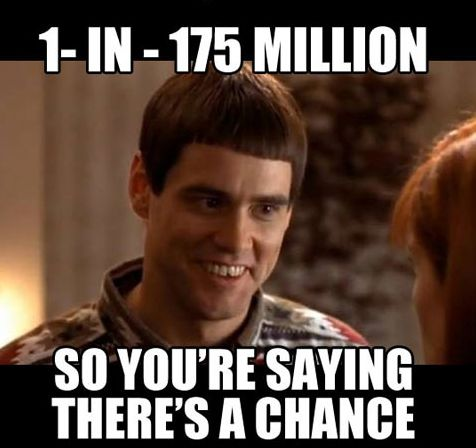
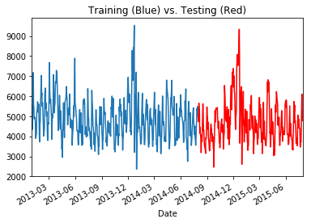
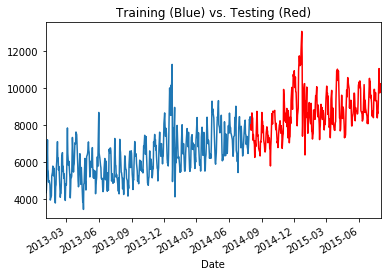
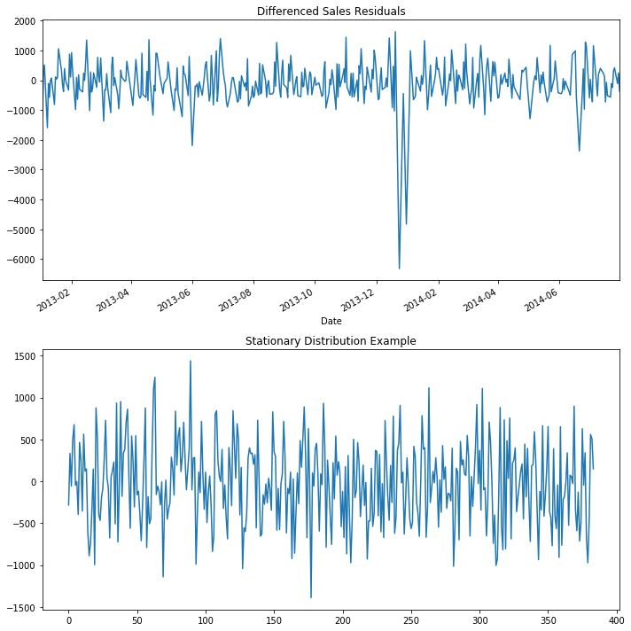
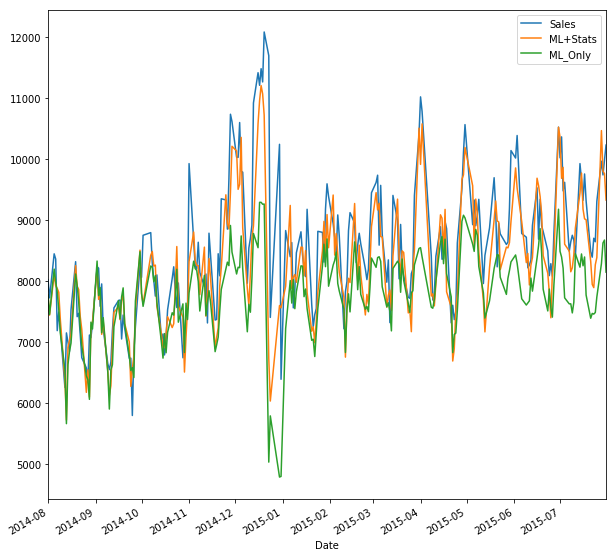
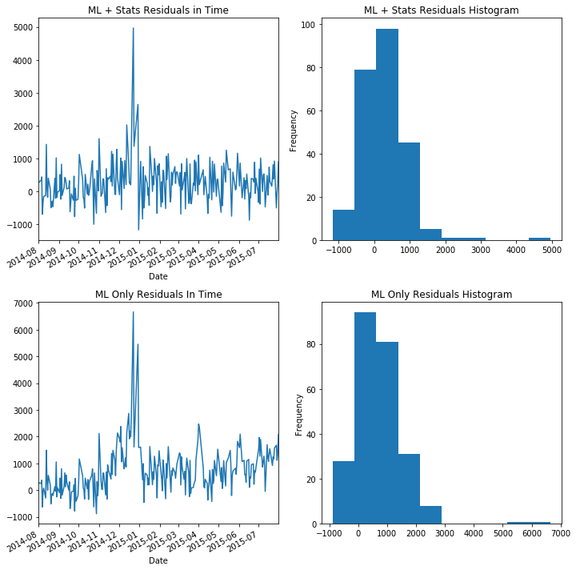

A standard assumption underlying a standard machine learning model is that the model will be used on the same population during training and testing (and production). This poses an interesting issue with time series data, as the underlying process could change over time which would cause the production population to look differently from the original training data. In this post, we will explore the concept of a data model, a theoretical tool from statistics, and in particular the idea of a random walk to handle this situation, improving your modeling toolkit.

If we are all honest with ourselves, our working knowledge of probability and statistics at some point (maybe now?) was not much better than Lloyd's here:



But that can change! We're going to combine the data model concept to machine learning via a modified example from the Kaggle [Rossmann](https://www.kaggle.com/c/rossmann-store-sales/) competition, which will guide our thinking and feature engineering. 

The problem we will study is how to build a model to predict the turnover (sales) when the model has data available to it from the day before. This is a typical use case for a model living in production and is a different flavor from the competition itself. This also presents new challenges that aren't always attached to a static data set: changing trends over time. For our purposes, we only need the data from a single store. 

## Tree-Based Models and Trends in Time

Using tree-based models in the presence of trends over time can lead to terrible results, and the reason is how decision trees make predictions. Decision Trees make regression predictions by seeing which "leaf" the data point belongs to and assigning the average of the target variable from the training set to that point. That means they are unable to "extrapolate" to data they have not already seen, and data from a significantly different population (perhaps after some trend in time) will cause the model to make inaccurate predictions. Random Forests and Gradient Boosting Tree algorithms inherit this problem because they are averages of the output of Decision Trees. The techniques in this post will allow you to alleviate this issue.


# A Glance at the Data

First, we will load the data and split out basic time-based features.

```python
import pandas as pd

d = pd.read_csv('train.csv')

d.head()
```

<div>
<table border="1" class="dataframe">
  <thead>
    <tr style="text-align: right;">
      <th></th>
      <th>Store</th>
      <th>DayOfWeek</th>
      <th>Date</th>
      <th>Sales</th>
      <th>Customers</th>
      <th>Open</th>
      <th>Promo</th>
      <th>StateHoliday</th>
      <th>SchoolHoliday</th>
    </tr>
  </thead>
  <tbody>
    <tr>
      <th>0</th>
      <td>1</td>
      <td>5</td>
      <td>2015-07-31</td>
      <td>5263</td>
      <td>555</td>
      <td>1</td>
      <td>1</td>
      <td>0</td>
      <td>1</td>
    </tr>
    <tr>
      <th>1</th>
      <td>2</td>
      <td>5</td>
      <td>2015-07-31</td>
      <td>6064</td>
      <td>625</td>
      <td>1</td>
      <td>1</td>
      <td>0</td>
      <td>1</td>
    </tr>
    <tr>
      <th>2</th>
      <td>3</td>
      <td>5</td>
      <td>2015-07-31</td>
      <td>8314</td>
      <td>821</td>
      <td>1</td>
      <td>1</td>
      <td>0</td>
      <td>1</td>
    </tr>
    <tr>
      <th>3</th>
      <td>4</td>
      <td>5</td>
      <td>2015-07-31</td>
      <td>13995</td>
      <td>1498</td>
      <td>1</td>
      <td>1</td>
      <td>0</td>
      <td>1</td>
    </tr>
    <tr>
      <th>4</th>
      <td>5</td>
      <td>5</td>
      <td>2015-07-31</td>
      <td>4822</td>
      <td>559</td>
      <td>1</td>
      <td>1</td>
      <td>0</td>
      <td>1</td>
    </tr>
  </tbody>
</table>
</div>


```python
t= d[d['Store'] == 1]
t.drop('Store', inplace=True,axis=1)

import datetime
def make_date(x):
    s = x.split('-')
    return datetime.datetime(int(s[0]),int(s[1]),int(s[2]))

t['Date'] = t['Date'].apply(lambda x : make_date(x))
t['Day'] = t['Date'].apply(lambda x : x.day)
t['Month'] = t['Date'].apply(lambda x : x.month)
t['Year'] = t['Date'].apply(lambda x : x.year)

# To get the previous day's sales later
t['DayOfYear'] = t['Date'].apply(lambda x : x.dayofyear)
t['DayOfYear+1'] = t['Date'].apply(lambda x : x.dayofyear+1)

t = t.set_index('Date').sort_index()
t = t[t.apply(lambda x : x['Open'] == 1 and x['Sales'] > 0, axis=1)] # Open stores with positive sales only
t.dropna(axis=0, inplace=True)

```

## Training Vs. Testing Population

Our goal is to learn about models dealing with a changing underlying population, i.e. a trend. Let's take a look if our data is in line with the situation we want to study.


```python
t['Sales'].loc[:'2014-08-01'].plot(kind='line')
t['Sales'].loc['2014-08-01':].plot(kind='line', color='r')
plt.title('Training (Blue) vs. Testing (Red)')
```




If you look at the data, you can see there does not seem to be any non-periodic trends to the data. The sales in 2015 are arguably the same as in 2014 and are the same in 2013. This is not what we want to study! Tree based models do really well when the data they're predicting on looks the same, and as mentioned, this is a common assumption when doing machine learning. A major problem for any data science model is a changing population. A trend over time can do will change the population and decimate performance. How do you deal with that situation? Well, we're going to inject a trend and then explore that question!


```python
t['Sales'] += np.cumsum(np.abs(np.cos(np.linspace(1,20,len(t))))*10)
t['Sales'].loc[:'2014-08-01'].plot(kind='line')
t['Sales'].loc['2014-08-01':].plot(kind='line', color='r')
plt.title('Training (Blue) vs. Testing (Red)')
```





Much better! Of course, in practice you wouldn't want to look at your test set, and would be unable to look at future production data. We are doing this to illustrate a point rather than a best practice. The assumption of a trend should be deduced from the training set, which we will go over below. This trend is actually what will cause a standard tree-based model to not perform, leading us to explore a more advanced modeling technique.

# Gaussian Random Walks

A [data model](https://en.wikipedia.org/wiki/Statistical_model) is an statistical process that is assumed to generate observed data and when applied correctly can lead to better results from your machine learning models. A random walk is a data model used to describe processes where their current location only depends on their previous location and a random "step". That is to say,

$$\text{position}_{t+1} = \text{position}_{t} + \text{random step}.$$

It is commonplace to hear the term "random walk" associated with stock returns. In fact, due to a deep theoretical connection between random walks and Brownian motion, very often the random step is modeled by a draw from a normal distribution. The technical term for this is a [Gaussian random walk](https://en.wikipedia.org/wiki/Random_walk#Gaussian_random_walk). In fact, if our quantity of interest is denoted $$y$$, then a process $$y_t$$ satisfying a Gaussian random walk has the distribution

$$ y_{t+1} \sim y_{t} + \mathcal{N}(0,\sigma^2).$$

Now, if the jumps of the random walk have a non random component based on some factors defined by $$x_t$$, then we can choose a function $$f$$ such that

$$ y_{t+1} \sim y_{t} + f(x_t) + \mathcal{N}(0,\sigma^2).$$

Finally, define $$Y_t := y_{t+1}-y_t$$ to end up with the equation

$$ Y_t \sim f(x_t) + \mathcal{N}(0,\sigma^2).$$

If this is starting to look like the formula for linear regression, that's because it is the formula, where $$f$$ would be a linear function.

So, if we expect a process follows a random walk-type progression with some deterministic component, this would be a perfectly valid data model for generating the time series data. If we have accurately selected the data model, that would give our model a much stronger change of success and in fact we can validate it, just as in the time-independent care, by looking at the residuals.

#### Fun Fact

A (symmetric) random walk in two dimensions will return to its starting point infinitely many times, while a random walk in three dimensions have a 0% probability that it will return to its starting point. See this [discussion](http://math.stackexchange.com/questions/536/proving-that-1-and-2-d-simple-symmetric-random-walks-return-to-the-origin-with) for the 1d and 2d case.

## Time Series Residuals 

In statistics, a time series that is "stationary" is nice to work with. Essentially, a stationary time series is a series with a constant mean and variance in time. A simple stationary series would be a series 
$$s_t \sim N(0,\sigma^2)$$
where at all time $t$ you simply sample from a normal distribution.

However, the series 
$$s_t \sim N(t,\sigma^2)$$
is not stationary as its mean changes in time. However, we can transform the series to make it stationary by defining the new series

$$\hat s_t := s_t - t \sim N(0,\sigma^2).$$

For a problem without a time domain, it's common wisdom that the residuals should be normal. For a time dependent problem, the equivalent widsom is that the residuals should be stationary. If our data model was selected correctly, then notice our model's residuals would be stationary

$$Y_t - f(x_t) \sim \mathcal{N}(0,\sigma^2).$$

When thinking about the viability of assuming such a model, you should look at basic transformations of the training data and see if stationary residuals might be possible.

## Differencing 

The act of subtracting the previous data point to obtain a stationary series ($$y_{t+1}-y_{t}$$) is a method of "differencing" in the statistical literature. The goal in any type of differencing is to obtain a stationary series, which would mean your data model accurately represents the data. In many cases, this was simply not enough and a trend of some kind remained.

To show the data model may be viable, the residuals of $$y_{t+1}-y_{t}$$ should appear approximately normal. At that point, we'd rely on our machine learning model to capture the rest of the variation by learning $$f(x_t)$$. Then, on our test set, we'd hope to see stationary residuals. 

Seeing stationary residuals on the test set validates the entire approach and gives us additional confidence that our model will perform well in production. Not only would the model be performing well on our evaluation metric, but it appears to capture the statistical properties of the generating process of the data in question.

# Data Exploration to Test Data Model Viability

To have increased confidence in our final model through a statistical framework, we want to see that stationary residuals might ultimately be possible. That means that the differenced variable should exhibit no trends over time that we believe our features would be unable to explain. Of course, this is more of an art than a science. For this exploration, we're going to treat it like any other machine learning model-- we exclude the test set data from our analysis to avoid cheating.

## Practical Gotcha: Defining Your Training Set

You have to be more careful defining your training set. In our case, the data spans 1/2013 to 7/2015. So, I choose a year of data starting 8/2014-7/2015 as my test set. This way, I have a chance to test my model on every day of the year. Any data exploration should only be done on your training set, and if possible, a part of the training set you don't use for actual model training. This is not a hard and fast rule, but it's an attempt to avoid overfitting the theory to the training set.


```python
# Combining current day's data with previous day's data
dfs = []
t.drop(['StateHoliday','Open'], inplace=True, axis=1)
t.reset_index(inplace=True)
bad_words = set(['Day','Month','Year','DayOfWeek','Date'])

def select_df_cols(df,suffix):
    return df[[x for x in df.columns if (suffix in x and not np.any([word in x for word in bad_words]) ) or x=='Date']]


dfs.append(t.copy())

df=t.merge(t, left_on = ['Year','DayOfYear'], right_on = ['Year','DayOfYear+1'], suffixes=['','_day-1'])
df = select_df_cols(df, '_day-1')
dfs.append(df)

dfs = [df.set_index('Date') for df in dfs]
nt = pd.concat(dfs, axis=1).dropna(axis=0)

# Making Training Set
import numpy as np
X_train = nt.iloc[:np.where(nt.index == '2014-08-01')[0][0], :]
X_test = nt.iloc[np.where(nt.index == '2014-08-01')[0][0]:, :]

# Check the basic differencing residuals on the training set
f, axs = plt.subplots(2, figsize=(10,10))
(X_train['Sales']-X_train['Sales_day-1']).plot(kind='line', ax=axs[0])
axs[0].set_title('Differenced Sales Residuals')
# Compare to a sampling the normal distribution in time
axs[1].plot(np.random.normal(0,500,size=len(X_train)))
axs[1].set_title('Stationary Distribution Example')
plt.tight_layout()
```





From a quick inspection, you can see the residuals does look similar to drawing a normal distribution in time except for a few point, which is something we expect a model could capture.

## Practical Gotcha: Cleaning Time Series

You have to be careful with cleaning data for a time dependent models. Although it can make your Kaggle score go up (as you'll see in the competition, most people do it), but it can also hurt the real-life viability of the model. In fact, it could cause your model to fail on the most import production scenarios. 

In this [notebook](http://nbviewer.jupyter.org/github/JohanManders/ROSSMANN-KAGGLE/blob/master/ROSSMANN%20STORE%20SALES%20COMPETITION%20KAGGLE.ipynb) for the competition, both outlier and abberant trends are cleaned from the store data. The outliers are cleaned via a modified z-score using the median absolute deviation and the erroneous trends are scrubbed by inspection. The theoretical framework we have introduced will take both of these cases into account, removing the need for such cleaning.

As you might expect, many of the outliers turn out to be holidays. Do we want to remove those data points? Sometimes such cleaning can improve the performance of your model on a test set, but it could lead to overfitting your model to an idealized version of the data. This can be dangerous and should be done with caution, if not at all.

# Training


There's a few other features we are going to exclude. The original data set had a "Customers" feature which was the number of customers in the store on a given day. If our goal is to predict tomorrow's sales from today, this seems unreasonable to have in the data set. We'll also train a model without the information on the previous day to compare the results.


```python
y = X_train['Sales'] -X_train['Sales_day-1'] # For the statistical data model approach
to_drop = ['Sales', 'Year', u'DayOfYear+1', 'Customers']

y2 = X_train['Sales'] # No statistical data model
X = X_train.drop(to_drop, axis=1)
X_test_p = X_test.drop(to_drop, axis=1 )
```


```python
from sklearn.ensemble import GradientBoostingRegressor

# Using our statistical data model
model = GradientBoostingRegressor(n_estimators=200)
model.fit(X,y)

# No statistical data model
model2 = GradientBoostingRegressor(n_estimators=200)
model2.fit(X,y2)
```

# Evaluation 

The Rossmann Kaggle competition used "root mean squared percentage error" as their metric. Or in another words, it is the square root of the MSE of the relative error. We will calculate this metric as well as show plots of the model "with stats" and without. For reference, the winning model in that competition scored a .1 RMSPE. 

Notice, we have to add back the previous day's sales to the prediction because we subtracted that off of our target variable.


```python
X_test['ML+Stats'] = model.predict(X_test_p) + X_test['Sales_day-1'] # Using our data model / theory
X_test['ML_Only'] = model2.predict(X_test_p) # Vanilla ML model

X_test[['Sales','ML+Stats', 'ML_Only']].plot(kind="line", figsize=(10,10))
```




```python
f, axs=plt.subplots(2,2, figsize=(10,10))
(X_test['Sales']-X_test['ML+Stats']).plot(kind="line", ax=axs[0][0])
axs[0][0].set_title('ML + Stats Residuals in Time')
axs[0][1].set_title('ML + Stats Residuals Histogram')

(X_test['Sales']-X_test['ML+Stats']).plot(kind="hist", ax=axs[0][1])

(X_test['Sales']-X_test['ML_Only']).plot(kind="line", ax=axs[1][0])
(X_test['Sales']-X_test['ML_Only']).plot(kind="hist", ax=axs[1][1])

axs[1][0].set_title('ML Only Residuals In Time')
axs[1][1].set_title('ML Only Residuals Histogram')
plt.tight_layout()
```





```python
print('ML + Stats RMSPE', np.sqrt(np.mean(((X_test['Sales']-X_test['ML+Stats'])/X_test['Sales'])**2)))
print('ML Only RMSPE', np.sqrt(np.mean(((X_test['Sales']-X_test['ML_Only'])/X_test['Sales'])**2)))
```

    ('ML + Stats RMSPE', 0.07455399875280469)
    ('ML Only RMSPE', 0.11567913104977838)


Although each model had trouble with the holidays, the model which uses our statistical framework did almost twice as well on the Kaggle metric of root mean squared percentage error, and we can see from the histogram of the residuals that the model is less biased as well (in the statistical sense) and appear almost stationary. By looking at the residuals in time, we can see that the ML + Stats model has more stationary residuals when compared to the ML Only model. You can see this manifest itself in a slight upward drift in the residuals of the ML Only model.

With more data and additional features, we would hope we'd be able to anticipate that problem. However, the holidays might be so important to the year end sales you may even train a model just to predict the excess.

# Extension: Seasonal Differencing

There are many ways to improve the approach and handle the holidays. Differencing is not just for adjacent time points but can be applied on larger scales as well to adjust for seasonal trends. This would be a proper way to account for the spike around the holidays, but as we only have two holiday periods in the data set, I am unable to have holiday data points in both the training set and the testing set. However, the same theory and overarching approach applied and can be used with enough data.

# Conclusion

Another way to view this approach is *reframing* the problem we are studying to fit a key assumption in machine learning, namely that the data the model is trained and tested on come from the same population. The technique of differencing is one way to make sure this happens. There are other ways as well, but the point is that reframing a problem in such a way can lead to huge performance gains, but really the only thing you have done is think about the problem differently and follow the standard approach for such a problem. 
