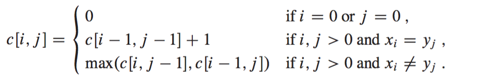
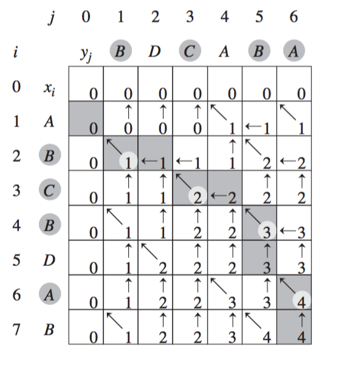

动态规划方法通常是用来求解**最优化问题**(optimization problem)。比起分治方法，动态规划对于子问题只求解一次，算是用空间换时间。

书中提到了设计动态规划算法的4个步骤：

1.  刻画一个最优解的结构特此
2.  递归地定义最优解的值
3.  计算最优解的值，通常采用自底向上的方法
4.  利用计算出的信息构造一个最优解

<a id="more"></a>

## 钢条切割

这个算是比较简单的应用动态规划的例子。只需要用一个一维数组保存最有解就可以了。书中提到一个子问题图，很形象的能表达出各个子问题之间的关系。这里钢条切割使用才思想是分两块，左边一部分完全不切割，右边随便切割，然后比较产生的利润最大的组合，所以右边就变成了子问题。

## 矩阵链乘法

首先需要知道一个概念是只有两个矩阵A和B相容，即A的列数等于B的行数时，才能相乘。矩阵链乘法问题就是求完全括号化的方案，不同的括号方法产生不同次数的标量乘法。首先可以得到一个穷举的算法思路，令P(n)P(n)表示可供选择的括号化方案的数量，当n=1n=1时，显然只有一种完全括号化方案，当n⩾2n⩾2时，完全括号化的矩阵乘积可描述为两个完全括号化的部分积相乘的形式，而两个部分积的划分点在第kk个矩阵和第k+1k+1个矩阵之间。所以可以得到如下递归公式：

```
import sys
def MaxtrixChainOrder(p):
    n = len(p)-1
    m = [[0]*(n) for _ in xrange(n)]
    s = [[0]*(n) for _ in xrange(n)]
    for i in xrange(0, n):
        m[i][i] = 0
    for l in xrange(2, n+1):
        for i in xrange(0, n - l + 1):
            j = i + l -1
            m[i][j] = sys.maxint
            for k in xrange(i, j):
                q = m[i][k]+m[k+1][j]+p[i]*p[k+1]*p[j+1]
                if q < m[i][j]:
                    m[i][j] = q
                    s[i][j] = k
    return m, s

m, s = MaxtrixChainOrder([30,35,15,5,10,20,25])
print 'm:'
print '\n'.join(map(str, m))
print 's:'
print '\n'.join(map(str, s))

print '矩阵链乘法的方案是:',

def PrintOptimalParens(s, i, j):
    ret = ''
    if i == j:
        return 'A'+str(j)
    else:
        ret += '('
        ret += PrintOptimalParens(s, i, s[i][j])
        ret += PrintOptimalParens(s, s[i][j]+1, j)
        ret +=  ')'
        return ret

print PrintOptimalParens(s, 0, 5)

```

得到以下输出

```
m:
[0, 15750, 7875, 9375, 11875, 15125]
[0, 0, 2625, 4375, 7125, 10500]
[0, 0, 0, 750, 2500, 5375]
[0, 0, 0, 0, 1000, 3500]
[0, 0, 0, 0, 0, 5000]
[0, 0, 0, 0, 0, 0]
s:
[0, 0, 0, 2, 2, 2]
[0, 0, 1, 2, 2, 2]
[0, 0, 0, 2, 2, 2]
[0, 0, 0, 0, 3, 4]
[0, 0, 0, 0, 0, 4]
[0, 0, 0, 0, 0, 0]
矩阵链乘法的方案是: ((A0(A1A2))((A3A4)A5))

```

## [](http://xinqiu.me/2016/10/04/CLRS-2/#u52A8_u6001_u89C4_u5212_u539F_u7406 "动态规划原理")动态规划原理

### [](http://xinqiu.me/2016/10/04/CLRS-2/#u6700_u4F18_u5B50_u7ED3_u6784 "最优子结构")最优子结构

书中说了4条通用模式，简单点概况就是每个问题能被分成几个子问题，这几个子问题有解且都是最优解，那么这个问题就是这几个最优解的结合。构建最优子结构需要考虑这两个方面：

1.  原问题的最优解设计多少个子问题
2.  确定最优解使用哪些子问题时，要考察多少种选择

和递归不同，因为递归太深会出现异常。动态规划确实反过来，自底向上的使用最优子结构。也就是说，首先求得子问题的最优解，然后求原问题的最优解。

### [](http://xinqiu.me/2016/10/04/CLRS-2/#u91CD_u53E0_u5B50_u95EE_u9898 "重叠子问题")重叠子问题

如果递归算法反复求解相同的子问题，这就是最优化问题具有重叠子问题性质。动态规划对每个子问题求解一次，将解存入一个表中，这样当再次需要这个子问题时直接查表。

这里也提到了一种带备忘的自顶到下动态规划算法，时间复杂度和自底向上的动态规划算法一样。

## [](http://xinqiu.me/2016/10/04/CLRS-2/#u6700_u957F_u516C_u5171_u5B50_u5E8F_u5217 "最长公共子序列")最长公共子序列

同之前的矩阵链乘法问题相似，还是要建立最优解的递归式。



书中的图15-8很形象,列举出了X=[A, B, C, B, D, A, B], Y=[B, D, C, A, B, A]得到的表c和表b。



```
def LCSLength(x, y):
    m = len(x)
    n = len(y)
    b = [[0 for _ in xrange(n+1)] for _ in xrange(m+1)]
    c = [[0 for _ in xrange(n+1)] for _ in xrange(m+1)]
    for i in xrange(1, m+1):
        for j in xrange(1, n+1):
            if x[i-1] == y[j-1]:
                c[i][j] = c[i-1][j-1]+1
                b[i][j] = '↖'
            elif c[i-1][j] >= c[i][j-1]:
                c[i][j] = c[i-1][j]
                b[i][j] = '↑'
            else:
                c[i][j] = c[i][j-1]
                b[i][j] = '←'
    return c, b

def PrintLCS(b, x, i, j):
    if i == 0 or j == 0:
        return
    if b[i][j] == '↖':
        PrintLCS(b, x, i-1, j-1)
        print x[i-1],
    elif b[i][j] == '↑':
        PrintLCS(b, x, i - 1, j)
    else:
        PrintLCS(b, x, i, j - 1)
x = 'ABCBDAB'.strip()
y = 'BDCABA'.strip()
c, b = LCSLength(x, y)

print '\n'.join(map(str, c))

for i in b:
    for c in i:
        print c,
    print

PrintLCS(b, x, len(x), len(y))

```

结果分别显示了c， b和最长公共子序列。

```
[0, 0, 0, 0, 0, 0, 0]
[0, 0, 0, 0, 1, 1, 1]
[0, 1, 1, 1, 1, 2, 2]
[0, 1, 1, 2, 2, 2, 2]
[0, 1, 1, 2, 2, 3, 3]
[0, 1, 2, 2, 2, 3, 3]
[0, 1, 2, 2, 3, 3, 4]
[0, 1, 2, 2, 3, 4, 4]
0 0 0 0 0 0 0
0 ↑ ↑ ↑ ↖ ← ↖
0 ↖ ← ← ↑ ↖ ←
0 ↑ ↑ ↖ ← ↑ ↑
0 ↖ ↑ ↑ ↑ ↖ ←
0 ↑ ↖ ↑ ↑ ↑ ↑
0 ↑ ↑ ↑ ↖ ↑ ↖
0 ↖ ↑ ↑ ↑ ↖ ↑
B C B A
```