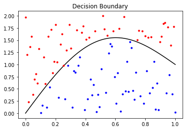
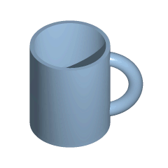
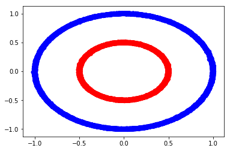

How neural networks learn classification tasks is ["deep magic"](http://catb.org/jargon/html/D/deep-magic.html) to many people, but in this post, we will demystify the training component of neural networks with geometric visualizations. After motivating the approach mathematically, we will dive into animating how a neural network learns using python and Keras. 

This post was inspired by an [article](http://colah.github.io/posts/2014-03-NN-Manifolds-Topology/) by one of Google's machine learning researchers. The article is very informative, but a full understanding requires a significant background in mathematics. My goal in this blog post is to explore the same topic in an approach more directed towards beginner students of machine learning.

# Preliminaries

In this section, we'll go over some preliminaries to piece together a geometric picture of the decision making process of a neural network. At a high level, the neural network "learns" a representation of the data where it can separate the classes with a decision boundary. You can visualize this boundary superimposed on the input space, where in most neural network applications you will see a highly nonlinear boundary. 



Notice, the boundary (mostly) seperates the "red" class and the "blue" class. You can also visualize the boundary on the output of the hidden layers. In the case of binary classification, the decision boundary visualized in the second to last layer will be a hyper plane in a typical neural network.

Before going further, I want to cement what I mean by "visualized in the n-th layer", as this is not a precise statement. What I mean is I want to plot the image of the training data under the n-th layer. For binary classification, typically you would map the training data X through the neural network, extracting the output of the activation function of the n-th layer, and plot that output, coloring the points based on their label. Now, ideally the n-th layer has 2 or 3 hidden units, otherwise the plot will not completely characterize the "output space".

### Topology

The motivation to do such a thing comes from a branch of mathematics called Topology. What is Topology, you may be asking... Let me go through an example. First imagine a ball of dough. What can you make from the dough without "tearing" it or "glueing" the edges together? Well, you could make a pizza or a baguette, but you couldn't make a donut. This is because to make a donut you either poke a hole in the middle of the dough, or you roll it out and "glue" the ends together. This notion is captured mathematically by a special kind of function called a "homeomorphism", a central concept in Topology. Any "shape" that can be "continuously deformed" to another without tearing or glueing are "topologically equivalent". There is some kind of geometric structure (i.e. topological structure) which is maintained during the process. An oversimplified (and not always correct) heuristic to get your bearings is that two "shapes" are topologically equivalent if they have the same number of holes. The obligatory joke is that a topologist does not know the difference between a donut and a coffee cup, because the two objects can be continuously deformed to one another (from the [wiki](https://en.wikipedia.org/wiki/General_topology)):



Continuous functions induce topologies (i.e. geometric structure of some kind) on their output. With a typical activation function, a neural network is a continuous map and so it "induces" structure on its output. In lay terms, that means that the network won't "tear" or "glue together" the input space. Each mini-batch update will alter the neural network slightly and the visualization of these changes over time will create a "continuous deformation" from the starting induced topology on the output to the final output. That means we will see the neural network bending and conforming the input space to try to separate the classes.

### Geometric Tranformations of Hidden Layers

Hidden layers are made up of a matrix, a bias term, and an activation function. Each of these components can be understood by how they geometrically effect their input.

Matrices are linear maps. Matrices "act on" an object in only two ways geometrically: stretching and rotating. For a matrix of full rank (an invertible square matrix), the matrix performs these geometric actions in the dimensions it "lives" in. If the matrix is not of full rank, it will collapse one of the dimensions as well. For example, a two dimensional matrix can only rotate and stretch planar objects, like a piece of paper on a table. However, a three dimensional matrix could rotate a piece of paper in any direction in 3d-space. A 3-by-2 matrix will collapse a three dimensional object like a sphere into a two dimensional circle (while rotating and stretching).

The bias term represents a translation in space, meaning it moves the object. 

The activation function is what makes a neural network nonlinear. This function is typically nonlinear and allows a hidden layer to "bend" its input.

A hidden layer whose output is a dimension lower than its input allows the network to give the appearence of manipulations like "folding" the space over onto itself (more on that below!).

### Making Decisions Geometrically

A neural network makes a binary classification decision in a similar way to how a support vector machine does. It takes the input space and bends and twists it around until the classes are separated, and then it draws a line. Everything on one side of the line is classified as a 1 and 0 otherwise. This line is called the decision boundary.

The decision boundary is the visual representation of the threshold where the model will predict 0 or 1. To enable this visualization to be possible, we set up our neural network to have a layer with 2 hidden units before a layer of 1 hidden unit and a sigmoid activation function. Then, we plot the points in 2-D (corresponding to the 2-hidden unit layer) which map to .5 in the final output. 

Let's write the equation. Define $$x,y\in\mathbb{R}$$ to be the first and second component of the output of the 2-hidden unit layer. Then, let $$a,b,c\in\mathbb{R}$$ be the weights and bias of the last hidden layer. Then, the set of points in the $$(x,y)$$-plane for the decision line is:
    $$\{ (x,y)\ | \ \text{sigmoid}(ax+by+x)=.5   \}.$$
    
The strategy for doing this is to choose points of $$x$$ and then calculate $y$ from the equation with $$x$$ fixed. By plotting this set, we can visualize the decision boundary, and therefore visualize the training process. Indeed, if the line is able to completely separate the input points into classes, then we have a perfect classifier.


# Classification Problem

In order to visualize the output, we define the following simple classification problem. We have two circles in a two dimensional plane and we color their points based on their radius. We will train a classifier to identify if the point should be "blue" or "red" based on the x-y position of the point.


```python
import keras
import pandas as pd
import numpy as np
import matplotlib.pyplot as plt
%matplotlib inline
from keras import backend as K

n=20000
t = np.linspace(0,2,n)
x = np.sin(np.pi*t) + np.random.normal(0,.005,n)
y = np.cos(np.pi*t) + np.random.normal(0,.005,n)
label = np.ones(n)

tdf = pd.DataFrame({'label' : label, 'x' : x, 'y' : y})

t = np.linspace(0,2,n)
x = .5*np.sin(np.pi*t) + np.random.normal(0,.005,n)
y = .5*np.cos(np.pi*t) + np.random.normal(0,.005,n)
label = 0.*np.ones(n)

df = pd.concat([tdf, pd.DataFrame({'label' : label, 'x' : x, 'y' : y})])
```


```python
plt.scatter(df['x'],df['y'], color=df['label'].apply(lambda x :  'b' if x > .5 else 'r'))
```


    <matplotlib.collections.PathCollection at 0x7f90203a0f60>





# Animation Code


```python
def get_decision_boundary(model):
    """ Function to return the x-y coodinates of the decision boundary given a model.
        This assumes the second to last hidden layer is a 2 hidden unit layer with a bias term
        and sigmoid activation on the last layer."""
    a = model.layers[-1].get_weights()[0][0][0]
    b = model.layers[-1].get_weights()[0][1][0]
    c = model.layers[-1].get_weights()[1][0]
    decision_x = np.linspace(-1,1,100)
    decision_y = (scipy.special.logit(.5)-c-a*decision_x)/b
    return decision_x, decision_y
```


```python
import matplotlib.pyplot as plt
import matplotlib.animation as animation
from IPython.display import HTML
from keras import backend as K

def animate_model(model, n_frames=100):
    """ Function to animate a model's first n_frames epochs of training. """
    
    # Define necessary lines to plot a grid-- this will represent the vanilla "input space".
    grids = [np.column_stack((np.linspace(-1,1, 100), k*np.ones(100)/10.)) for k in range(-10,11)] +\
                [np.column_stack((k*np.ones(100)/10.,np.linspace(-1,1, 100))) for k in range(-10,11) ]

    # Define functions for the output of the 2-hidden unit layer. 
    # We assume this is the second to last layer
    f = K.function(inputs = model.inputs, outputs = model.layers[-1].output)
    
    decision_x, decision_y = get_decision_line(model)

    # Plot the original space's deformation by the neural network and use it as the init()
    fig, ax = plt.subplots()

    orig_vals = f(inputs=[df[['x','y']].values])
    line, = ax.plot(decision_x,decision_y,color='black')
    lineb, = ax.plot(orig_vals[indb,0], orig_vals[indb,1], marker='.', color='b')
    liner, = ax.plot(orig_vals[indr,0], orig_vals[indr,1], marker='.', color='r')
    grid_lines = []

    for grid in grids:
        vals = np.array(grid)
        l, = ax.plot(vals[:,0],vals[:,1], color='grey', alpha=.5)
        grid_lines.append(l)

    all_lines = tuple([line, lineb, liner, *grid_lines])

    def animate(i):
        model.fit(df[['x','y']].values, df[['label']].values, epochs=1, batch_size=32, verbose=0)
        line.set_data(*get_decision_line(model))
        vals = f(inputs = [df[['x','y']].values])
        lineb.set_data(vals[indb,0], vals[indb,1])
        liner.set_data(vals[indr,0], vals[indr,1])

        for k in range(len(grid_lines)):
            ln = grid_lines[k]
            grid = grids[k]
            vals = f(inputs = [np.array(grid)])
            ln.set_data(vals[:,0],vals[:,1])

        return all_lines

    def init():
        line.set_ydata(np.ma.array(decision_x, mask=True))
        lineb.set_data(orig_vals[indb,0],orig_vals[indb,1])
        liner.set_data(orig_vals[indr,0],orig_vals[indr,1])
        for k in range(len(grid_lines)):
            ln = grid_lines[k]
            grid = grids[k]
            vals = f(inputs = [np.array(grid)])
            ln.set_data(vals[:,0],vals[:,1])
        return all_lines

    return animation.FuncAnimation(fig, animate, np.arange(1, n_frames), init_func=init,
                                  interval=100, blit=True)

```

# Animating Models

Let's define a few models and see how they deform the 2-hidden unit layer's output for classification. Of course, these visualization depend on the initializations of each layer-- so don't be surprised if you don't see the same ones when you try it at home.

## 2d Geometric Tranformations

If we only allow the model to have 2d geometric transformations, we will find that the model is unable to learn any useful representation of the data for classification, but it sure does bend the space into a boomerang.


```python
from keras.models import Sequential
from keras.layers import Dense, Activation

model = Sequential()
model.add(Dense(2, activation='tanh', input_dim=2))
model.add(Dense(2, activation='tanh'))
model.add(Dense(1, activation='sigmoid'))
sgd = keras.optimizers.SGD(lr=0.001)
model.compile(optimizer=sgd,
              loss='mse',
              metrics=['accuracy'])

anim = animate_model(model)
HTML(anim.to_html5_video())
```

<video width="432" height="288" controls loop>
  <source type="video/mp4" src="../images/nnlearn/2d.mp4">
</video>


As you can see, with only two dimensional transformations (bends, rotations and scaling), the neural network cannot fully separate the two classes.

# 3d Linear Transformations

Now, let's enable the model to move the space in three dimensions:


```python
model = Sequential()
model.add(Dense(3, activation='tanh', input_dim=2))
model.add(Dense(2, activation='tanh'))
model.add(Dense(1, activation='sigmoid'))
sgd = keras.optimizers.SGD(lr=0.005)
model.compile(optimizer=sgd,
              loss='mse',
              metrics=['accuracy'])

anim2 = animate_model(model)
HTML(anim2.to_html5_video())
```


<video width="432" height="288" controls loop>
  <source type="video/mp4" src="../images/nnlearn/3d.mp4">
</video>

It's clear that the model easily can surmise a useful projection to 2d space to separate the classes.

# 4d Geometric Transformations

When we beging to add dimensions, the projections to the 2d plan can become more exotic as seen below.

```python
model = Sequential()
model.add(Dense(4, activation='tanh', input_dim=2))
model.add(Dense(2, activation='tanh'))
model.add(Dense(1, activation='sigmoid'))
sgd = keras.optimizers.SGD(lr=0.005)
model.compile(optimizer=sgd,
              loss='mse',
              metrics=['accuracy'])

anim3 = animate_model(model)
HTML(anim3.to_html5_video())
```

<video width="432" height="288" controls loop>
  <source type="video/mp4" src="../images/nnlearn/4d.mp4">
</video>

# Conclusion

Geometric demonstrations in mathematics typically build intuition about more abstract topics. The training process of a neural network can be understood as a stochastic gradient descent to minimize the loss function on the training set, but at the same time, it can also be understood geometrically as demonstrated above. Both viewpoints are informative and useful for becoming a more well rounded machine learning practitioner. In this case, the geometric viewpoint makes the need for additional hidden units obvious, a fact which would be more difficult to deduce otherwise.