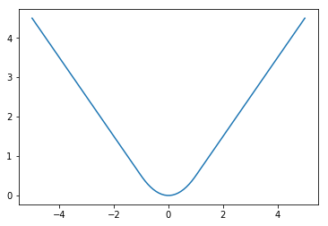

Starting with the Google DeepMind paper, there has been a lot of new attention around training models to play video games. You, the data scientist/engineer/enthusiast, may not work in reinforcement learning but probably are interested in teaching neural networks to play video games. Who isn't? With that in mind, here's a list of nuances that should jumpstart your own implementation.

The lessons below were gleaned from working on my [own implementation](http://www.github.com/srome/ExPyDQN) of the [Nature](http://www.nature.com/nature/journal/v518/n7540/full/nature14236.html) paper. The lessons are aimed at people who work with data but may run into some issues with some of the non-standard approaches used in the reinforcement learning community when compared with typical supervised learning use cases. I will address both technical details of the parameters of the neural networks and the libraries involved. This post assumes limited knowledge of the Nature paper, in particular in regards to basic notation used around Q learning. My implementation was written to be instructive by relying mostly on Keras and Gym. I avoided theano/tensorflow specific tricks (e.g., theano's [disconnected gradient](https://github.com/Theano/theano/blob/52903f8267cff316fc669e207eac4e2ecae952a6/theano/gradient.py#L2002-L2021)) to keep the focus on the main components.


# Learning Rate and Loss Functions

If you have looked at some of the [some](https://github.com/spragunr/deep_q_rl/blob/master/deep_q_rl/q_network.py) of the [implementations](https://github.com/matthiasplappert/keras-rl/blob/master/rl/agents/dqn.py), you'll see there's usually an option between summing the loss function of a minibatch or taking a mean. Most loss functions you hear about in machine learning start with the word "mean" or at least take a mean over a mini batch. Let's talk about what a summed loss really means in the context of your learning rate.

A typical gradient descent update looks like this:

\begin{equation}
\theta_{t+1} \leftarrow \theta_{t} - \lambda \nabla(\ell_{\theta_t})
\end{equation}

where $$\theta_{t}$$ is your learner's weights at time $$t$$, $$\lambda$$ is the learning rate and $$\ell_{\theta_t}$$ is your loss function which depends on $$\theta_t$$. I will suppress the $$\theta_t$$ dependence on the loss function moving forward. Let us define $$\ell$$ as a loss function (where we assume it is the sum over) and $$\hat{\ell}$$ as your loss function taking the mean over the mini batch. For a fixed mini batch of size $$m$$, notice:
\begin{equation}
\hat{\ell} = \frac{1}{m} \ell
\end{equation}
and so mathematically we have
\begin{equation}
\nabla(\hat{\ell}) = \frac{1}{m} \nabla(\ell).
\end{equation}
    
What does this tell us? If you train two models each with learning rate $$\lambda$$, these two variants will have very different behavior as the magnitude of the updates will be off by a factor of $$m$$! In theory, with a small enough learning rate, you can take into account the size of the mini batch and recover the behavior of the mean version of the loss from the summed version. However, this would lead other components coefficients in the loss like for regularization needing adjustment as well. Sticking with the mean version leads to standard coefficients which work well in many situations. Therefore, it's atypical in other data science applications to use a summed loss function rather than a mean, but the option is frequently present in reinforcement learning. So, you should be aware that you may need to adjust the learning rate! With that said, my implementation uses the mean version and a learning rate of .00025.

# Stochasticity, Frame Skipping, and Gym Defaults

Many (good) blog posts on reinforcement learning show a model being trained using "(Game Name)-v0" and so you might decide to use the ROM as you've seen it done before. So far so good. Then you read the various papers and see a technique called "frame skipping", where you stack $$n$$ output screens from the emulator into a single $$n$$-by-length-by-width image and pass that to the model, and so you implement that thinking everything is going according to plan. It's not. Depending on your version of Gym, you can run into trouble.

In older versions of Gym, the Atari environment *randomly* [repeated your action for 2-4 steps](https://github.com/openai/gym/blob/bde0de609d3645e76728b3b8fc2f3bf210187b27/gym/envs/atari/atari_env.py#L69-L71), and returning the resulting frame. In terms of the code, this is what happens in terms of your frame skip implementation.


```python
for k in range(frame_skip):
    obs, reward, is_terminal, info = env.step(action) # 2-4 step occur in the emulator with the given action
```

If you implement frame skipping with n=4, it's possible that your learning is seeing every 8-16 (or more!) frames rather than every 4. You can imagine the impact on performance. Thankfully,  this has since been been made [optional](https://github.com/openai/gym/blob/master/gym/envs/atari/atari_env.py#L75-L80) via new ROMs, which we will mention in a second. However, there is another setting to be aware of and that's repeat_action_probability. For "(Game Name)-v0" ROMs, this is on by default. This is the probability that the game will ignore a new action and repeat a previous action at each time step. To remove both frameskip and the repeat action probability, use the "(Game Name)NoFrameskip-v4" ROMs. A full understanding of these settings can be found [here](https://github.com/openai/gym/blob/5cb12296274020db9bb6378ce54276b31e7002da/gym/envs/__init__.py#L298-L376).

I would be remiss not to point out that Gym is not doing this just to ruin your DQN. There is a legitimate reason for doing this, but this setting can lead to *unending* frustrating when your neural network is ramming itself into the boundary of the stage rather than hitting the ping pong pixel-square. The reason is to introduce stochasticity into the environment. Otherwise, the game will be deterministic and your network is simply memorizing a series of steps like a dance. When using a NoFrameskip ROM, you have to introduce your own stochasticity to avoid said dance. The Nature paper (and many libraries) do this by the "null op max" setting. At the beginning of each episode (i.e., a round for a game of Pong), the agent will perform a series of $$k$$ consecutive null operations (action=0 for the Atari emulator in Gym) where $$k$$ is an integer sampled uniformly from $$[0,\text{null op max}]$$. It can be implemented by the following pseudo-code at the start of an episode: 


```python
obs = env.reset()

# Perform a null operation to make game stochastic
for k in range(np.random.randint(0 , null_op_max, size=1)):
    obs, reward, is_terminal, info = env.step(action)
```

# Gradient Clipping, Error Clipping, Reward Clipping

There are several different types of clipping going on in the Nature paper, and each can easily be confused and implemented incorrectly. In fact, if you thought error clipping and gradient clipping were different, you're already confused!

## What is Gradient Clipping?

The Nature paper states it is helpful to "clip the error term". The community seems to have rejected "error clipping" for the term "gradient clipping". Without knowing the background, the term can be ambiguous. In both instances, there is actual no clipping involved of the loss function or of the error or of the gradient. Really, they are choosing a loss function whose gradient does not grow with the size of the error past a certain region, thus limiting the size of the gradient update for large errors. In particular, if the value of the loss function is greater than 1, they switch the loss function to absolute value. Why? Let's look at the derivative!

This term represents the loss of a mean squared error-like function:

\begin{equation}
 \frac{d}{dx} (x-y)^2 = \frac{1}{2}(x-y)
\end{equation}

Now compare that to the term resulting from an absolute value-like function when $$x-y>0$$:

\begin{equation}
 \frac{d}{dx} (x-y)= 1
\end{equation}

If we think of the value of the loss function, or of the error, as $$x-y$$, we can see one gradient update would contain $$x-y$$ while the other does not. There isn't really a good, catchy phrase to describe the above mathematical trick that is more representative than "gradient clipping".

The standard approach is to accomplish this is to use the [Huber loss](https://en.wikipedia.org/wiki/Huber_loss) function. The definition of this function is as follows:

\begin{equation}
f(x) =  \frac{1}{2}x^2 \text{ if } |x| \leq \delta \text{, } \delta(|x| - \frac{1}{2}\delta)  \text{ otherwise.}
\end{equation}

There is a common trick to implement this so that symbolic mathematics libraries like theano and tensorflow can take the derivative easier without the use of a switch statement. That trick is outlined/coded below and is commonly employed in most implementations.

The function you actually code is as follows: Let $$q=\min(|x|,\delta)$$. Then,
\begin{equation}
g(x) =   \frac{q^2}{2}  + \delta(|x| - q ).
\end{equation}
When $$|x|\leq \delta$$, plugging into the formula shows that we recover $$g(x) = \frac{1}{2}x^2$$. Otherwise when $$|x|>\delta$$, 
\begin{equation}
g(x) = \frac{\delta^2}{2} + \delta(|x| - \delta) = \delta |x| - \frac{1}{2}\delta^2 = \delta(|x|-\frac{1}{2}\delta).
\end{equation}

So, $$g=f$$. This is coded below and plotted to show the function is continuous with a continuous derivative. The Nature paper uses $$\delta=1$$. 


```python
%matplotlib inline
import matplotlib.pyplot as plt
import numpy as np

def huber_loss(x, clip_delta=1):
    error = np.abs(x) 
    quadratic_part = np.minimum(error, clip_delta)
    return 0.5 * np.square(quadratic_part) + clip_delta * (error - quadratic_part)

f=np.vectorize(huber_loss)
x = np.linspace(-5,5,100)
plt.plot(x, f(x))
```





As you can see, the slope of the graph (the derivative) is "clipped" to never be bigger in magnitude than 1. An interesting point is the second derivative is not continuous:

\begin{equation}
f^{\prime\prime}(x) = 1 \text{ if } |x| \leq \delta \text{, } 0   \text{ otherwise.}
\end{equation}

This could cause problems using second order methods for gradiet descent, which is why some suggest a pseudo-Huber loss function which is a smooth approximation to the Huber loss. However, Huber loss is sufficient for our goals.


## What Reward Do I Clip?

This is actually a much subtler question when you introduce frame skipping to the equation. Do you take the last reward returned from the emulator? But what if there was a reward during the skipped frames? When you're so far down in the weeds of neural network implementation, it's surprising when the answer comes from the basic [Q learning](https://en.wikipedia.org/wiki/Q-learning) framework. In Q learning, one uses the total reward since the last action, and this is what they did in their paper as well. This means even on frames you skipped you need to save the reward observed and aggregate them as the "reward" for a given state $$(s_t,a_t,r_t,s_{t+1})$$. This cumulative reward is what you clip. In my implementation, you can see this during the step function on the TrainingEnvironment class. The pseudo code is below:


```python
for k in range(frame_skip):
    obs, reward, is_terminal, info = env.step(action) # 1 step in the emulator
    total_reward += reward
```

This total reward is what is stored in the experience replay memory.

# Memory Consideration

The "experience replay memory" is a store where training examples $$(s_t,a_t,r_t,s_{t+1})$$ are sampled from to break the time correlation of the data points, stopping the network's learning from diverging. The original paper mentions a replay memory of a million examples $$(s_t,a_t,r_t,s_{t+1})$$. Both the $$s_t$$'s and the $$s_{t+1}$$'s are $$n$$-by-length-by-width images and so you can imagine the memory requirements can become very large. This is one of the cases where knowing more about programming and types while working in Python can be useful. By default, Gym returns images as numpy arrays with the datatype int8. If you do any processing of the images, it's likely that your images will now be of type float32. So, it's important when you store your images to make sure they're in int8 for space considerations, and any transformations that are necessary for the neural network (like scaling) are done before training rather than before storing the states in the replay memory.

It is also helpful to pre-allocate this replay memory. In my implementation, I do this as follows:


```python
def __init__(self, size, image_size, phi_length, minibatch_size):
    self._memory_state = np.zeros(shape=(size, phi_length, image_size[0], image_size[1]), dtype=np.int8)
    self._memory_future_state = np.zeros(shape=(size, phi_length, image_size[0], image_size[1]), dtype=np.int8)
    self._rewards = np.zeros(shape=(size, 1), dtype=np.float32)
    self._is_terminal = np.zeros(shape=(size, 1), dtype=np.bool)
    self._actions = np.zeros(shape=(size, 1), dtype=np.int8)
```

Of course, phi_length=$$n$$ from our previous discussion, the number of screens from the emulator stacked together to form a state.

# Debugging In Circles

With so many moving parts and parameters, there's a lot that can go wrong in an implementation. My recommendation is to set your starting parameters as the same as the original paper to nail down one source of error. Most of the changes from the original NIPS paper to the Nature paper were to standardize learning parameters and performance across different Atari games. There are many quirks that arise from game to game, and most of the techniques in the Nature paper guard against this problem. For example, the consecutive max is used to deal with screens flickering causing objects to disappear under certain frame skip settings. So once you have set the parameters, here are a few things to check when your network is not learning well (or at all):

- Check if your Q-value output jumps in size between batch updates, this means your gradient update is large. Take a look at your learning rate and investigate your gradient to find the problem.
- Look at the states you are sending to the neural network. Does the frame skipping/consecutive max seem to be correct? Are your future states different from your current states? Do you see a logical progression of images? If not, you may have some memory reference issues, which can happen when you try to conserve memory in Python.
- Verify that your fixed target network's weights are actually fixed. In Python, it's easy to make the fixed network point to the same location in memory, and then your fixed target network isn't actually fixed!
- If you find your implementation is not working on a certain game, test your code on a simpler game like Pong. Your implementation may be fine, but you don't have enough of the cutting-edge advances to learn harder games! Explore Double DQN, Dueling Q Networks, and prioritized experience replay.

# Conclusion

Implementing the DeepMind paper is a rewarding first step into modern advancements in reinforcement learning. If you work mostly in a more traditional supervised learning setting, many of the common ideas and tricks may seem foreign at first. Deep Q Networks are just neural networks afterall, and many of the techniques to stabilize learning can be applied to traditional uses as well. The most interesting point to me is the topic of regularization. If you noticed, we did not use Dropout or $$L_2$$ or $$L_1$$-- all the traditional approaches to stabalize training for neural networks. Instead, the same goal of regularization is accomplished with how the mini batches are selected (experience replay) and how future rewards are defined (using a fixed target network). That is one of the most exciting and novel theoretical approaches from the original Nature paper which has continued to be iterated upon and refined in subsequent papers. When you want to further improve your implementation, you should investigate the next iteration of the techniques: [prioritized experience replay](https://arxiv.org/abs/1511.05952), [Double DQN](https://arxiv.org/abs/1509.06461), and [Dueling Q Networks](https://arxiv.org/abs/1511.06581). The (mostly) current standard comes from a modification to allow asyncronous learning called [A3C](https://arxiv.org/abs/1602.01783).
