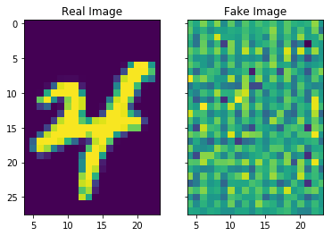
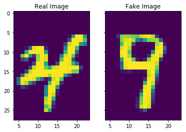
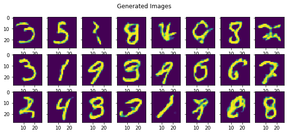
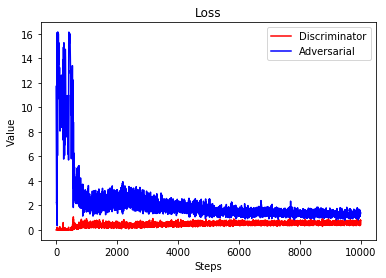

The preferred illustration of Generative Adversarial Networks (which seems indoctrinated at this point like Bob, Alice and Eve for cryptography) is the scenario of counterfitting money. The Generator is a counterfits money and the Discriminator is supposed to discriminate between real and fake dollars. As the Generator gets better, the Discriminator has to improve also. This implies a dual training scheme where each model tries to one up the other (i.e. through additional learning). In this post, we will explore the proof from the original paper and demonstrate a typical implementation.

## The Perfect Generator Mathematically

The illustration is only half the battle. In order to prove anything, we need to be able to formally (mathematically) write down the objective.  This informs not only the proof strategy but gives one the end goal to "keep an eye out for" while studying the proof. 

The goal is that the Generator generates a examples that is indistinguishable from the real data. Mathematically, this is the concept of random variables being equal in distribution (or in law). Another way to say this is that their probability density functions (i.e. the probability measure induced by the random variable on its range) are equal: $$p_G(x)=p_{data}(x)$$. This is exactly the strategy of the proof: define an optimization problem where the optimal $$G$$ satisfies $$p_G(x)=p_{data}(x)$$. If you knew that your solution $$G$$ satisfies this relationship, then you have a reasonable expectation that you can represent the optimal $$G$$ as a neural network via typical SGD training!


## The Optimization Problem

With the counterfitting illustration in mind, the motivation for defining the optimization problem is guided by the following two terms. First, we require that the discriminator $$D$$ recognizes examples from the $$p_{data}(x)$$ distribution, hence:
\begin{equation}
E_{x \sim p_{data}(x)}\log(D(x))
\end{equation}
where $$E$$ denotes the expectation. This term comes from the "positive class" of the log-loss function. Maximizing this term corresponds to $$D$$ being able to precisely predict $$D(x)=1$$ when $$x\sim p_{data}(x)$$.

The next term has to do with the Generator $$G$$ tricking the discriminator. In particular, the term comes from the "negative class" of the log-loss function:
\begin{equation}
E_{z \sim p_{z}(z)}\log(1-D(G(z))).
\end{equation}
If this value is maximized (remember, the log of $$x<1$$ is negative), that means $$D(G(z))\approx 0$$ and so $$G$$ is NOT tricking $$D$$.

To combine these two concepts, the Discriminator's goal is to maximize
\begin{equation}
E_{x \sim p_{data}(x)}\log(D(x))+E_{z \sim p_{z}(z)}\log(1-D(G(z)))
\end{equation}
given $$G$$, which means that $$D$$ properly identifies real and fake data points.
The optimal Discriminator in the sense of the above equation for a given $$G$$ will be denoted $$D^*_G$$. Define the value function

\begin{equation}
V(G,D):= E_{x \sim p_{data}(x)}\log(D(x))+E_{z \sim p_z(z)}\log(1-D(G(z))).
\end{equation}

Then we can write $$D_G^* = \text{argmax}_D V(G,D)$$. Now, $$G$$'s aim is the reverse-- the optimial $$G$$ minimizes the previous equation when $$D=D^*_G$$. In the paper, they prefer to write the optimial $$G$$ and $$D$$ to solve the minimax game for the value function

\begin{equation}
V(G,D)= E_{x \sim p_{data}(x)}\log(D(x))+E_{z \sim p_z(z)}\log(1-D(G(z))).
\end{equation}

Then, we can write the optimial solution satisfies
\begin{equation}
G^* = \text{argmin}_G V(G,D_G^*).
\end{equation}


## The Annotated Proof

At this point, we must show that this optimization problem has a unique solution $$G^*$$ and that this solution satisfies $$p_G=p_{data}$$.

One big idea from the GAN paper-- which is different from other approaches-- is that $$G$$ need not be invertible. This is crucial because in practice $$G$$ is NOT invertible. Many pieces of notes online miss this fact when they try to replicate the proof and incorrectly use the change of variables formula from calculus (which would depend on $$G$$ being invertible). Rather, the whole proof relies on this equality:

\begin{equation}
E_{z \sim p_{z}(z)}\log(1-D(G(z))) = E_{x \sim p_{G}(x)}\log(1-D(x)) .
\end{equation}

This equality comes from the [Radon-Nikodym Theorem](https://en.wikipedia.org/wiki/Radon%E2%80%93Nikodym_theorem) of measure theory. Colloquially, it's sometimes called the [law of the unconscious statistician](https://en.wikipedia.org/wiki/Law_of_the_unconscious_statistician), which was probably given its name by mathematicians-- if I had to guess. This equality shows up in the proof of Proposition 1 in the [original GAN paper](https://arxiv.org/pdf/1406.2661.pdf) to little fanfare when they write:

\begin{equation}
\int_{x} p_{data}(x)\log D(x) \, \mathrm{d}x + \int_{z} p(z)\log ( 1- D(G(z))) \, \mathrm{d}z
\end{equation}
\begin{equation}
=\int_{x} p_{data}(x)\log D(x) + p_G(x) \log ( 1- D(x)) \, \mathrm{d}x
\end{equation}


I have seen lecture notes use the [change of variables formula](https://en.wikipedia.org/wiki/Probability_density_function#Dependent_variables_and_change_of_variables) for this line! That is incorrect, as to do a change of variables, one must calculate $$G^{-1}$$ which is not assumed to exist (and in practice for neural networks-- does not exist!). I imagine this approach is so common in the machine learning / stats literature that it goes unnamed.

### Finding the Best Discriminator

Due to the last equation, we actually can write down the optimal $$D$$ given $$G$$. Perhaps surprisingly, it comes from simple calculus. We will find a maximum of the integrand in the equation above and then choose that for $$D$$. Notice, the integrand can be written:
\begin{equation}
f(y)= a \log y + b \log(1-y).
\end{equation}
To find the critical points,
\begin{equation}
f^\prime(y) = 0 \Rightarrow \frac{a}{y} - \frac{b}{1-y} = 0 \Rightarrow y = \frac{a}{a+b}
\end{equation}
if $$a+b \neq 0$$. If you continue and do the second derivative test:
\begin{equation}
f^{\prime\prime}\big ( \frac{a}{a+b} \big) = - \frac{a}{(\frac{a}{a+b})^2} - \frac{b}{1-(\frac{a}{a+b})^2} < 0
\end{equation}
when $$a,b \in (0,1)$$, and so $$\frac{a}{a+b}$$ is a maximum. 

So, we can then write that 
\begin{equation}
V(G,D) = \int_{x} p_{data}(x)\log D(x) + p_G(x) \log ( 1- D(x)) \, \mathrm{d}x 
\end{equation}
\begin{equation}
\leq \int_x \max_y {p_{data}(x)\log y + p_G(x) \log ( 1- y)}\, \mathrm{d}x.
\end{equation}
If you let $$D(x) = \frac{p_{data}}{p_{data}+p_{G}}$$, you then achieve this maximum. Since $$f$$ has a unique maximizer on the interval of interest, optimal $$D$$ is unique as well, as no other choice of $$D$$ will achieve the maximum.

Notice, that this optimal $$D$$ is not practically calculable, but mathematically it is still very important. We do not know $$p_{data}(x)$$ a priori and so we would never be able to use it directly during training. On the other hand, its existence enables us to prove that an optimal $$G$$ exists, and during training we only need to approximate this $$D$$.

### Finding the Best Generator

Of course, the goal of the GAN process is for $$p_G = p_{data}$$. What does this mean for the optimal $$D$$? Substituting into the equation for $$D^*_G$$, 
\begin{equation}
D_G^* = \frac{p_{data}}{p_{data}+p_G} = \frac{1}{2}.
\end{equation}
This means that the Discriminator is completely confused, outputting $$1/2$$ for examples from both $$p_{G}$$ and $$p_{data}$$. Using this idea, the authors exploit this to prove that this $$G$$ is the solution to the minimax game. The theorem is as follows:

"The global minimum of the virtual training criterion $$C(G)=\max_D V(G,D)$$ is acheived if and only if $$p_G = p_{data}$$."

The theorem in the paper is and if and only if statement, and so we prove both directions. First, we approach the backwards direction and show what value $$C(G)$$ takes. Then, we approach the forward direction with the newfound knowledge from the backwards direction.
Assuming $$p_G=p_{data}$$, we can write

\begin{equation}
V(G, D_G^*) = \int_{x} p_{data}(x)\log \frac{1}{2} + p_G(x) \log \big ( 1- \frac{1}{2}\big) \, \mathrm{d}x 
\end{equation}

and
\begin{equation}
V(G,D_G^*) = - \log 2 \int_{x}p_{G}(x) \,\mathrm{d}x  - \log 2  \int_x p_{data}(x)\, \mathrm{d}x  =  - 2 \log 2 = -\log4.
\end{equation}
This value is a candidate for the global minimum (since it is what occurs when $$p_G=p_{data}$$). We will stop the backwards direction for now because we want to prove that this value always the minimum (which will satisfy the "if" and "only if" pieces at the same time). So, drop the assumption that $$p_G=p_{data}$$ and observe that for any $$G$$, we can plug in $$D^*_{G}$$ into $$C(G)=\max_D V(G,D)$$:
\begin{equation}
C(G) = \int_{x} p_{data}(x)\log \big (\frac{p_{data}(x)}{p_{G}(x)+p_{data}(x)} \big )  + p_G(x) \log\big ( \frac{p_{G}(x)}{p_{G}(x)+p_{data}(x)}\big ) \, \mathrm{d}x. 
\end{equation}

The second integrand comes from the following trick:

\begin{equation}
1-D_G^*(x) = 1 - \frac{p_{data}(x)}{p_{G}(x)+p_{data}(x)} =\frac{p_G(x) + p_{data}(x)}{p_{G}(x)+p_{data}(x)} -  \frac{p_{data}(x)}{p_{G}(x)+p_{data}(x)} 
\end{equation}
\begin{equation}
= \frac{p_{G}(x)}{p_{G}(x)+p_{data}(x)}.
\end{equation}

Knowing the $$-\log 4$$ is the candidate for the global minimum, I want to stuff that value into the equation, so I add and subtract $$\log2$$ from each integral, multiplied by the probabiliy densities. This is a common mathematical proof technique which doesn't change the equality because in essense I am adding 0 to the equation.

\begin{equation}
C(G) = \int_{x} (\log2 -\log2)p_{data}(x) + p_{data}(x)\log \big (\frac{p_{data}(x)}{p_{G}(x)+p_{data}(x)} \big ) 
\end{equation}
\begin{equation}
\quad+(\log2 - \log2)p_G(x) + p_G(x) \log\big ( \frac{p_G(x)}{p_G(x)+p_{data}(x)}\big ) \, \mathrm{d}x. 
\end{equation}

\begin{equation}
C(G) = - \log2\int_{x} p_{G}(x) + p_{data}(x)\, \mathrm{d}x 
\end{equation}
\begin{equation}+\int_{x}p_{data}(x)\Big(\log2 + \log \big (\frac{p_{data}(x)}{p_{G}(x)+p_{data}(x)} \big ) \big) 
\end{equation}
\begin{equation}+ p_G(x)\Big (\log2 + \log\big ( \frac{p_{G}(x)}{p_{G}(x)+p_{data}(x)}\big ) \Big ) \, \mathrm{d}x. 
\end{equation}

Due to the definition of probability densities, integrating $$p_G$$ and $$p_{data}$$ over their domain equals 1, i.e.:
\begin{equation}
-\log2\int_{x} p_{G}(x) + p_{data}(x)\, \mathrm{d}x = -\log2 ( 1 + 1) = -2\log2 = -\log4.
\end{equation}
Moreover, using the definition of the logarithm, 
\begin{equation}
\log2 + \log \big (\frac{p_{data}(x)}{p_{G}(x)+p_{data}(x)} \big ) =  \log \big ( 2\frac{p_{data}(x)}{p_{G}(x)+p_{data}(x)} \big )\end{equation}
\begin{equation} =  \log \big (\frac{p_{data}(x)}{(p_{G}(x)+p_{data}(x))/2}  \big ).
\end{equation}

So, substituting in these equalities we can write:
\begin{equation}
C(G) = - \log4 + \int_{x}p_{data}(x)\log \big (\frac{p_{data}(x)}{(p_{G}(x)+p_{data}(x))/2} \big )\,\mathrm{d}x 
\end{equation}
\begin{equation}+ \int_x p_G(x)\log\big ( \frac{p_{G}(x)}{(p_{G}(x)+p_{data}(x))/2}\big ) \, \mathrm{d}x. 
\end{equation}

Now, for those of you who have heard of the [Kullback-Leibler divergence](https://en.wikipedia.org/wiki/Kullback%E2%80%93Leibler_divergence), you will recognize that each integral is exactly that! In particular,
\begin{equation}
C(G) = - \log4 + KL\big (p_{data} \big \| \frac{p_{data}+p_{G}}{2} \big ) + KL\big(p_{G} \big \| \frac{p_{data}+p_{G}}{2}\big) . 
\end{equation}

The Kullback-Leibler divergence is always non-negative, so we immediately see that $$-\log 4$$ is the global minimum of $$C(G)$$. If we prove only one $$G$$ acheives this, then we are finished because $$p_G=p_{data}$$ would be the unique point where $$C(G)=-\log 4 $$. To do this, we have to notice a second identity:
\begin{equation}
C(G) = - \log4 + 2\cdot JSD \big (p_{data} \| p_{G}\big ) . 
\end{equation}

The JSD term is known as the [Jenson-Shannon divergence](https://en.wikipedia.org/wiki/Jensen%E2%80%93Shannon_divergence). Of course, you would have to be initiated in the field to know this identify. This divergence is actually the square of the Jenson-Shannon distance metric, which gives us the property that $$JSD \big (p_{data} \| p_{G}\big )$$ is only 0 when $$p_{data}=p_{G}$$. 

### Convergence

Now, the main thrust of the paper has been proven: namely, that $$p_G=p_{data}$$ at the optimum of $$\max_D V(G,D)$$. There is an additional proof in the paper that states given enough training data and the right circumstances, the training process will converge to the optimal $$G$$. We will omit the details. 


# Implementation

Most implementations do not explicitly perform the minimax optimization suggested in the original paper. Instead, they use a more typical training regiment inspired by the paper. For clarity, we will use the concrete case of generating images. First, we define two models. The first is the Discriminator $$D(x)$$ and the second is the Adversarial net $$A(z)=D(G(z))$$. Notice, the adversarial net is also a classifier. In our setting, we will define the positive label 1 to be a real image and 0 to be a fake image. So, training will consist of two steps for each minibatch:

    1. Train the Discriminator D to discriminate between real images and generated images via a standard 0-1 classification loss function.
    2. Freeze the weights of D and train the adversarial network A with generated images with their labels forced to be 1.
    
The second step is interesting because it's very intuitive. We are not updating $$D$$'s weights, but we are updating $$G$$ to make the generated images "look more like real images" (i.e. having the Adversarial net output 1 for fake images). If the Adversarial network outputs a 1, that means we have tricked the Discriminator.


```python
import sklearn
from sklearn.datasets import fetch_mldata
mnist = fetch_mldata('MNIST original')
mnist['data'] = mnist['data'].astype(float) /  255. # Normalized!
```


```python
import keras
from keras.models import Sequential
from keras.layers import Dense, Activation, Conv2D, BatchNormalization, Input, Dropout, UpSampling2D, Reshape, Flatten, Conv2DTranspose
from keras.layers.advanced_activations import LeakyReLU
```

## Network Architecture Highlights

For the network itself, I combined my [favorite](https://medium.com/towards-data-science/gan-by-example-using-keras-on-tensorflow-backend-1a6d515a60d0) [implementations](https://github.com/osh/KerasGAN/blob/master/MNIST_CNN_GAN.ipynb) and approaches. It's sometimes a pain to pick hyperparameters for a network, so it's always good to have a reference for your first implementation. The Discriminator is a standard Convolutional Neural Network. The Generator is in a sense the reverse of a CNN. We will use transposed convolutional layers to take a dense vector from the latent distribution and upscale/transform those vectors to our desired image shape.

### Conv2dTranspose

Rather than using Convolution2D and UpSampling2D as some implementations do, you can achieve the same results from using Conv2DTranspose in Keras. There's deep mathematical reasoning why they are equivalent, but I will leave that for possibly a future post. There's a [page](https://github.com/vdumoulin/conv_arithmetic) that graphically shows the difference between convolutions and transposed convolutions.

### BatchNormalization

BatchNormalization has become known as another source of regularization, but there is no rigorous proof of this. Like RMSprop, it just appears to work better. BatchNormalization normalizes the output of each layer before passing it through the next layer. This speeds up training and appears to lead to better results. There is no consensus (as of right now) on whether it should be used before or after the activation function, and so I use it before.

## Generator


```python
depth=200
dropout=.3
image_size = 28
half_image_size = 7
gan_layers = [
    Dense(depth*half_image_size*half_image_size, input_shape=(100,), init='glorot_normal'),
    BatchNormalization(momentum=0.9),
    Activation('relu'),
    Dropout(dropout),
    Reshape([half_image_size,half_image_size,depth]),
    Conv2DTranspose(depth/2, 5, strides=(2,2), padding='same', init='glorot_uniform'), # (14,14,128)
    BatchNormalization(momentum=0.9),
    Activation('relu'),
    Dropout(dropout), 
    Conv2DTranspose(depth/4, 3, strides=(2,2), padding='same', init='glorot_uniform'), # (28,28,64)
    BatchNormalization(momentum=0.9),
    Activation('relu'),
    Dropout(dropout), 
    Conv2DTranspose(depth/8, 3, padding='same', init='glorot_uniform'), # (28,28,32) 
    BatchNormalization(momentum=0.9),
    Activation('relu'),
    Dropout(dropout), 
    Conv2DTranspose(1, 3, padding='same'), # (28,28,1) 
    Activation('sigmoid')
]
gen = Sequential(layers=gan_layers)
```

## Discriminator


```python
leaky_alpha = .2
d_depth = 256
discriminator_layers = [
       Conv2D(d_depth, 5, strides=(2,2), input_shape=(image_size, image_size, 1), data_format='channels_last', padding='same'),
       LeakyReLU(alpha=leaky_alpha),
       Dropout(dropout),
       Conv2D(d_depth*2, 5, strides=(2,2), padding='same'),
       LeakyReLU(alpha=leaky_alpha),
       Dropout(dropout),
       Flatten(),
       Dense(256),
       LeakyReLU(alpha=leaky_alpha),
       Dropout(dropout),
       Dense(2),
       Activation('softmax')
]
dsc = Sequential(layers=discriminator_layers)
```


```python
from keras import optimizers
opt = optimizers.Adam(lr=2e-4)
dopt = optimizers.Adam(lr=1e-4)
```


```python
dsc.compile(optimizer=dopt, loss='categorical_crossentropy')
```

## Adversarial Network

Remember to turn off training on the Discriminator's weights!


```python
for layer in dsc.layers:
    layer.trainable = False
```


```python
from keras.models import Model
adv_model = Sequential([gen,dsc])
adv_model.compile(optimizer=opt, loss='categorical_crossentropy')
adv_model.summary()
```

    _________________________________________________________________
    Layer (type)                 Output Shape              Param #   
    =================================================================
    sequential_1 (Sequential)    (None, 28, 28, 1)         1586351   
    _________________________________________________________________
    sequential_2 (Sequential)    (None, 2)                 9707266   
    =================================================================
    Total params: 11,293,617
    Trainable params: 1,566,401
    Non-trainable params: 9,727,216
    _________________________________________________________________


Notice you can clearly see the discriminator's weights are not trainable.

## Pretraining

The jury is out on whether or not pretraining the Discriminator is worthwhile. Many recent papers suggest it is not needed. However, this is based on subjectively what Generators predict "more realistic" images. So, I'll just follow what the original paper did.


```python
# prior distribution
generate_values = lambda x : np.random.uniform(-1,1, size=(x,100))
```


```python
# Initial Discriminator Training
import numpy as np
initial_training_size = 10000
real_images = mnist['data'][np.random.choice(len(mnist['data']), size=initial_training_size)].reshape(initial_training_size,image_size, image_size,1)
fake_images = gen.predict(generate_values(initial_training_size))
```


```python
%matplotlib inline
import matplotlib.pyplot as plt
f, axs =plt.subplots(1,2, sharey=True)
axs[0].imshow(real_images[1,:,:,0])
axs[1].imshow(fake_images[1,:,:,0])
axs[0].set_title('Real Image')
axs[1].set_title('Fake Image')

```




```python
# Compile initial training set
X = np.concatenate([real_images, fake_images])
y = np.zeros((2*initial_training_size,2))
y[:initial_training_size,1] = 1
y[initial_training_size:,0] = 1
dsc.fit(X,y, batch_size=32, epochs=1)
```

## The Combined Training


```python
steps = 10000
y = np.zeros(shape=(mini_batch_size,2))
y[:mini_batch_size/2, 1]=1
y[mini_batch_size/2:, 0]=1

d_loss = np.zeros(steps)
a_loss = np.zeros(steps)

for k in range(steps):
    if k % 50 == 0:
        print(k)
        
    X = np.concatenate([ 
        mnist['data'][np.random.choice(len(mnist['data']), size=mini_batch_size/2)].reshape(mini_batch_size/2,image_size, image_size,1),
        gen.predict(generate_values(mini_batch_size/2))        
    ])
    d_loss[k] = dsc.train_on_batch(X,y)
    
    # Train GAN
    X_adv = generate_values(mini_batch_size)
    a_loss[k] = adv_model.train_on_batch(X_adv, y_adv)
```

# Results

Full Disclosure: I may have ran the code a few times to get a good looking image...


```python
%matplotlib inline
import matplotlib.pyplot as plt
f, axs =plt.subplots(1,2, sharey=True)
axs[0].imshow(real_images[1,:,:,0])
axs[0].set_title('Real Image')
axs[1].set_title('Fake Image')
axs[1].imshow(gen.predict(generate_values(1))[0,:,:,0])
```




```python
%matplotlib inline
import matplotlib.pyplot as plt
f, axs =plt.subplots(3,8, sharey=True, figsize=(10,4))
plt.suptitle('Generated Images')
for j in range(3):
    for k in range(8):
        axs[j][k].imshow(gen.predict(generate_values(1))[0,:,:,0])

```





```python
plt.plot(d_loss, color='r')
plt.plot(a_loss, color='b')
plt.xlabel('Steps')
plt.ylabel('Value')
plt.title('Loss')
plt.legend(['Discriminator','Adversarial'])
```



