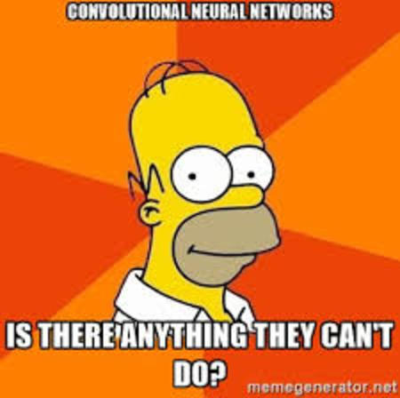

## Intro

Before I actually begin describing CNNs, let me tell you why you should be excited about CNNs. This post might not be amazing but CNNs are! :wink:

Convolutional Neural Networks were first introduced by Yann Le Cun. The potential of CNNs was first realized when AlexNet won the ImageNet challenge by a significant margin.From Microsoft's Azure ML API to Apple's FaceID, CNNs are almost everywhere.

CNNs work amazingly well with grid-like data i.e Images(2D grids), Time series data etc. CNNs are combined with LSTMs to achieve Image captioning, Code generation from a GUI screenshot. 

## Intuition

This is the intuition that I formed when I was first introduced to CNNs. This is not technically sound, but it does the job of making you understand why CNNs work. Imagine that you are in a dark room and you've been given a torch [:snake:](http://pytorch.org) . You've been told that there's text on the wall that you're supposed to read. Since the area covered by the light is limited, you start from corner of the wall and stride through it. With this, you get an idea of what's on the wall and you relate the present view to the words that you've seen in the past to form sentences. This is in the most abstract way, how a CNN works.

In a CNN, we have "filters" or "kernels" which is just a matrix of numbers. These filters stride through the image while performing operations on it. The output **feature maps** from the convolutions is a lower dimensional representation of the image that describes the input data well.

## What's the relation between a Fully connected layer and a Convolution layer?

Alright, you might have this feeling that the Convolution layer is more complex than an FC layer because of this "kernel" concept. These two layers are more similar than you might think. Let's consider 2 fully connected layers, how do we turn this into a convolution operation? We just remove some connections and introduce weight sharing. Let me be more specific, consider two FC layers with `m` and `n` number of neurons. The total number of weights would be `n x m` i.e for each neuron in the second layer, there's a vector of weights corresponding to the neurons in the first layer. Now, we cut off some connections and make some of the weights identical. You'll see why this is true.

## The Convolution Operation :fireworks:

Wikipedia:

>In mathematics (and, in particular, functional analysis) convolution is a mathematical operation on two functions (f and g); it produces a third function, that is typically viewed as a modified version of one of the original functions, giving the integral of the pointwise multiplication of the two functions as a function of the amount that one of the original functions is translated. 

Time to get into the details of the convolution operation. The convolution operation is defined as:

#### 1D Convolution

$$ c(t) = \sum_{a=-\infty}^\infty i(a)w(t-a) = (x*w)(t)$$

### What to analyze?

- Why is it a function of time (t)? 

- What is a?

- Why is the range $$-\infty$$ to $$\infty$$ ?

- Why is `w` a function of $$t-a$$ ?

- How do I interpret this equation?

### Analysis

- To understand this equation, consider a function varying with time. A good example would be a car moving around on a plane. Let's suppose we have a device that measures the position of the car at a time instant, call this $$i(t)$$. Our goal is to get an estimate of the position of the car as a function of time. Nothing is free from errors. Neither is the device that we're using. So, we would like to average the positions of the car over time to get a good estimate. It makes sense to give the latest measurements more weightage while calculating the average.

- Now, `a` is the age of measurement. We need to give the highest priority to the youngest measurement.

- Whenever a is less than 0, we take i(a) as 0 since it does not make sense if age is negative.

- a=0 implies it is the youngest measurement that needs to be assigned the highest priority. Hence, the $$t-a$$

- This is a weighted average which means that the sum of w(t-a) from a=$$-\infty$$ to $$\infty$$ needs to be $$1$$. That's why $$w$$ is represented as a probability distribution function.

We have decided to write the equations using $$\sum$$ instead of $$\int$$ because in most cases, measurements are taken at discrete time intervals.

## Simple Convolution layer

The above convolution doesn't retain the size of the input. In most CNN architectures, we retain the input size and downsize in the max-pooling stage(later post).

We've discussed 1D convolution. But our goal is to work with images as well which requires a convolution operation in 2D space. How do we represent 2D convolution? Here's the equation:

#### 2D convolution

$$ S(i,j) = (K*I)(i,j) = \sum_{m=0}^{k_1-1} \sum_{n=0}^{k_2-1} I(i-m,j-n)K(m,n) $$

Here, k1 and k2 are the dimensions of the kernel(rows and columns). Notice that we have started using the term "kernel". Remember, we have 2D weight matrices now.

The above equation retains the size of the input. Let's see how it works by considering a 3x3 kernel and 3x3 input size.

$$i,j$$ represent the coordinate of the output feature map. Since the input is of same size, it corresponds to the input image as well.

Expanding the summation for a 3x3 kernel. We have,

$$   I(i,j)K(0,0) + I(i-1,j)K(1,0) + I(i-2,j)K(2,0)$$

$$ + I(i,j-1)K(0,1) + I(i-1,j-1)K(1,1) + I(i-2,j-1)K(2,1) $$

$$ + I(i,j-2)K(0,2) + I(i-1,j-2)K(1,2) + I(i-2,j-2)K(2,2) $$ 

Now, To find the output value at (0,0), we just have to substitute $$i=0,j=0$$ in the the above expansion. I'll leave the substitution to you. Notice that you'll have a lot negative values in the arguments like $$I(0,-1)K(0,1)$$.

How do we handle this? We **zero-pad** the input matrix so that the value at negative coordinates is zero. The visualization for this:

The above visualization is just an example. It's not a 3x3 input if that wasn't obvious. :grimacing:

Now, let's calculate the output value at (0,0), we have I(0,0)K(0,0) as the output since everything else is zeroed due to padding. Also notice from the visualization that the equation should have been $$I(0,0)K(2,2)$$. Draw the kernel and matrix to understand why it's I(0,0)K(2,2). What do we do to fix this? During a convolution operation, we flip the kernel both horizontally and vertically to get the right outputs. That means, a kernel 

$$
        \begin{matrix}
        a & b & c \\
        d & e & f \\
        g & h & i \\
        \end{matrix}
$$

becomes

$$
        \begin{matrix}
        i & h & g \\
        f & e & d \\
        c & b & a \\
        \end{matrix}
$$

So, we flip the kernel before we convolve. This is how we get the output feature maps.

### PS

I feel this is enough for one post. I'll continue CNNs in my next post where I'll write about Batch Normalization, max pooling etc. I'll save the forward propagation and backward pass for later. This can be overwhelming which is why I added the comments section. Please feel free to ask any questions that you have or to point out mistakes that I might have made.

Written by [Siddhartha Rao Kamalakara](https://srk97.github.io) for activeAI.

My [Twitter](https://twitter.com/sid_srk) account. 
My email: srk97c@gmail.com

Hey, I deserve to promote myself a bit  :stuck_out_tongue_winking_eye:

Also, there's an easter egg in the post. Try to find it :smile:

### References

- Deep Learning by Ian Goodfellow, Yoshua Bengio, Aaron Courville

- [Visualization source](https://github.com/vdumoulin/conv_arithmetic)

