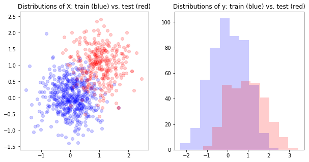
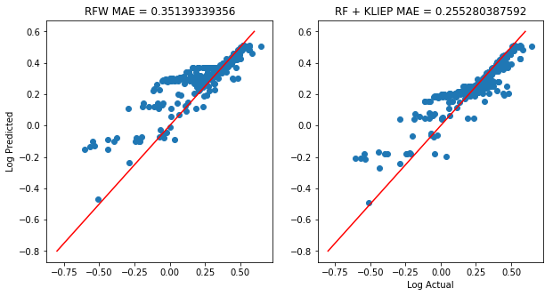
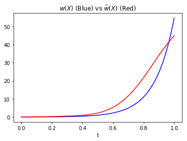

In in many classification problems, time is not a feature (literally). Case in point: healthcare. Say you want to predict if a person has a deadly disease. You probably have some historical data that you plan use to train a model and then deploy it into production. Great-- but what happens if the distribution of people you predict on changes by the time your model starts (miss) flagging people? This *covariate shift* can be a real issue. In healthcare, the Affordable Care Act completely reshaped the landscape of the insured population, so there definitely were models out there that were faced with a healthier population than they were trained on. The question is: Is there anything you can do during training to correct for covariate shift? The answer is yes.

In this post, we are going to discuss the [Kullback-Leibler Importance Estimation Procedure](http://proceedings.mlr.press/v38/sasaki15.pdf) (KLIEP) for importance weighting training samples. This approach was implemented in the DensityRatioEstimator class from [pykliep](https://github.com/srome/pykliep). First, we will motivate KLIEP and identify how it weights training examples. Then we will outline the API for pykliep and walk through an example.

## The Setup

Assume you have a training set that is distributed according to 
\begin{equation} x \sim p(x)\end{equation}
and a test set distributed via
\begin{equation}  x \sim q(x). \end{equation} 
When p!=q, this is called *covariate shift*, and it violates a key assumption of machine learning: the training set distribution is the same as the test set distribution. (In this case, $$x=(X,y)$$ for  notational convenience.)  One approach to correct this phenomenom is called importance weighting. Essentially, you attach a sample weight to each training example during training in order to satisfy:
\begin{equation}
E_{x \sim w(x)p(x)} \text{loss}(x) = E_{x\sim q(x)} \text{loss}(x) 
\end{equation}

Theoretically, the best choice of $$w(x)=q(x)/p(x)$$ because
\begin{equation}
E_{x \sim w(x)p(x)} \text{loss}(x) = \int_{supp(w(x)p(x))} \text{loss}(x)w(x)p(x)\, dx \end{equation}
\begin{equation}
 \int_{supp(q(x))} \text{loss}(x)q(x)\, dx = E_{x\sim q(x)} \text{loss}(x),
\end{equation}
assuming their supports are equal. So, we can see that the expected loss on the test distribution $$q$$ is the same as using the sample weights $$w(x)$$ on the training set! (Notice, this is trivially the case when $$p(x)=q(x)$$.) 

Don't celebrate yet. It is not very easy to estimate $$w(x)$$, and many approaches are unstable. A simple approach is to train a classifier to predict if an example comes from the training set or the test set. Then you would use the likelihood score from a model 
\begin{equation}\hat w(x)= \frac{p(y =1 |x)}{ p(y=0 |x) }\end{equation}
where $$y=1$$ indicates membership in the test set. This tends to work poorly in practice as the ratio is very sensitive.

A more stable approach is the aforementioned KLIEP algorithm. This approach directly estimates the density ratio $$q(x)/p(x)$$. The original implementation is not very scalable, but since the first publication, there have been new approaches to increase its efficiency. 

## KLIEP 

The KLIEP algorithm defines an estimate for $$w$$ of the following form:

\begin{equation}
\hat w(x) = \sum_{x_i \in D_{te}} \alpha_i K(x,x_i,\sigma),
\end{equation}

where $$D_{te}\subset X_{te}$$ and $$\alpha_i,\sigma \in \mathbb{R}$$. The original paper choose $$K$$ to be a Gaussian kernel, i.e.:
\begin{equation}
K(x,x_i,\sigma) = e^{ - \frac{\| x-x_i\|^2}{2\sigma^2}}.
\end{equation}

The set $$D_{te}$$ is a random sample of test set vectors. The parameter $$\sigma$$ is called the "width" of the kernel. The authors then introduce the quantity

\begin{equation}
J =  \frac{1}{|X_{te}|} \sum_{x\in X_{te}}\log \hat w (x),
\end{equation}
where $$X_{te}$$ is the test set. They prove that the larger this value is, the closer $$q(x)$$ and $$\hat w(x) p(x)$$ are in Kullback-Leibler divergence. In other words, you want that value maximized to have the best possible sample weights for training. The KLIEP uses gradient descent to find $$\alpha_i$$ which maximizes $$J$$ given $$D_{te}$$ and $$\sigma$$ with the constraints that
\begin{equation}
\alpha_i \geq 0 \quad\text{and}\quad\int \hat w(x) p(x) \, dx = 1,
\end{equation}
which means the quantity $$\hat w(x) p(x)$$ is akin to a true probability density function (i.e. it integrates to 1).

### Model Selection via Likelihood Cross Validation


The DensityRatioEstimator class has two main parameters to tune: *num_params* and *sigma*, which correspond to the size of $$D_{te}$$ and $$\sigma$$ respectively. An interesting component of the approach is the use of likelihood cross validation (LCV). As opposed to grid search cross validation, this approach only splits the test set into folds. It turns out that this is the proper form of cross validation to estimate the theoretical quantity that indicates goodness of fit. Otherwise, it is very similar to grid search cross validation:

1. Split the test set into k-folds.
2. For each test fold, train each candidate model (i.e. model + param settings) on the full training set and i!=k test folds. Score the resulting model on the kth test fold.
3. Choose the best parameter based on the averaged scored and train the model on the full training set and full test set.
    

## DensityRatioEstimator Usage

Let's walk through how to use the DensityRatioEstimator class which implements KLIEP. It's meant to follow the spirit of sklearn's conventions. Overall, the API is similar to sklearn, but there are key differences. This estimator takes as its input both the training and test set, which already breaks sklearn's "fit" API. One facet of "fit" is that X and y are the same length, and obviously that is not the case for your training and test set in general.

In theory, there's nothing stopping us from using the procedure on $$x=(X,y)$$. For training sets with a time element, one can test if KLIEP improves your validation scores. In problems without time explicitly as a feature, the underlying distribution can still drift over time. You can still cut your data up by time (collection time? date added to the data?) and apply KLIEP. You might even have data to predict that is unlabeled. In that case, you can simply use $$X_{test}$$ to develop sample weights (and then your approach is edging towards a semi-supervised learning approach as you use labeled and unlabeled examples).

Next, an example: We will define a simple learning problem where $$x\in\mathbb{R}^3$$. The training set is generated via
\begin{equation}
X \sim N(0,.5)^2 
\end{equation}
and a covariate shift in $$X$$ will occur and the test set will be distributed say:
\begin{equation}
X \sim (N(1,.5), N(1,.5)).
\end{equation}

The y data will be generated by
\begin{equation}
y= \sin(n\pi)+m + N(0,\epsilon)
\end{equation}
where $$X=(m,n)\in \mathbb{R}^2$$. 

### Training and Test Definition

First, let's visualize the covariate shift.


```python
eps = 1e-3
np.random.seed(1)
X_train = np.random.normal(0,.5,size=(500,2))
X_test = np.column_stack((np.random.normal(1,.5,size=(300,)),np.random.normal(1,.5,size=(300,))))
y_train = np.sin(X_train[:,1]*np.pi) + X_train[:,0] + np.random.normal(0,eps)
y_test = np.sin(X_test[:,1]*np.pi) + X_test[:,0]  + np.random.normal(0,eps)
```


```python
%matplotlib inline
import matplotlib.pyplot as plt
f,axs=plt.subplots(1,2, figsize=(10,5))
axs[0].scatter(X_train[:,0],X_train[:,1], color='b', alpha=.2)
axs[0].scatter(X_test[:,0],X_test[:,1], color='r', alpha=.2)
axs[0].set_title('Distributions of X: train (blue) vs. test (red)')

axs[1].set_title('Distributions of y: train (blue) vs. test (red)')
axs[1].hist(y_train, color='b', alpha=.2)
axs[1].hist(y_test, color='r', alpha=.2)
```




### Estimating the Density Ratio w

Now, we will train two random forests: with and without KLIEP sample weights.


```python
from pykliep import DensityRatioEstimator 

# Estimate the density ratio w
kliep = DensityRatioEstimator(random_state=7)
kliep.fit(X_train, X_test) # keyword arguments are X_train and X_test
weights = kliep.predict(X_train)

rf = RandomForestRegressor(n_estimators=50, random_state=2)
rf2 = RandomForestRegressor(n_estimators=50, random_state=2)

f,axs = plt.subplots(1,2, figsize=(10,5))

rf.fit(X_train, y_train)
axs[0].scatter(np.log10(y_test+1), np.log10(rf.predict(X_test)+1))
axs[0].set_title('RFW MAE = %s' % np.mean(np.abs(y_test-rf.predict(X_test))))

rf2.fit(X_train, y_train, sample_weight=weights) # Train using the sample weights!
axs[1].scatter(np.log10(y_test+1), np.log10(rf2.predict(X_test)+1))
axs[1].set_title('RF + KLIEP MAE = %s' % np.mean(np.abs((y_test-rf2.predict(X_test)))))

axs[0].set_ylabel('Log Predicted')
axs[1].set_xlabel('Log Actual')
axs[0].plot([-.8,.6], [-.8,.6], color='r')
axs[1].plot([-.8,.6], [-.8,.6], color='r')
```




##  Validation With Known w

If you had access to the true $$w(x)$$, you could just look at $$w(x)$$ and $$\hat w(x)$$ and compare. We are going to do just that.

If we use the last example above, the pdf for $$X=(m,n)$$ is independent in each component and so 
\begin{equation}
p(X) = p(m)p(n)
\end{equation}
for the training and test set. So then, $$w(X)$$ is given by 
\begin{equation}
w(X) = \frac{p_{te}(m) p_{te}(n)}{p_{tr}(m) p_{tr}(n)}.
\end{equation}
We can then plot how well $$\hat w (X)$$ approximates $$w(X)$$.


```python
np.random.seed(128)
X_train = np.random.normal(0,.5,size=(1000,2))
X_test = np.random.normal(1,.5,size=(1500,2))
```


```python
kliep = DensityRatioEstimator(random_state=4)
kliep.fit(X_train, X_test)
```


```python
# Take a look at the LCV results for (num_params, sigma)
kliep._j_scores
```

    [((0.2, 0.25), 2.3883652107662297),
     ((0.1, 0.25), 2.2569424774193245),
     ((0.2, 0.5), 1.8987499277478477),
     ((0.1, 0.5), 1.8136986917106765),
     ((0.2, 0.75), 1.4189331965313798),
     ((0.1, 0.75), 1.3891472114097529),
     ((0.2, 1), 1.0377502976502824),
     ((0.1, 1), 0.98391914587619367),
     ((0.2, 0.1), 0.94975924498825803),
     ((0.1, 0.1), 0.19270111220322969)]


```python
import scipy.stats

# Define the true w(X)
def w_true(X):
    num = scipy.stats.norm(loc=1, scale=.5).pdf(X[:,0])*scipy.stats.norm(loc=1, scale=.5).pdf(X[:,1])
    denom =scipy.stats.norm(scale=.5).pdf(X[:,0])*scipy.stats.norm(scale=.5).pdf(X[:,1])
    return num/denom
```

As $$X$$ is two dimentional, we'll actually plot a parametrized line $$X(t):= (m(t),n(t))$$ where $$m(t)=n(t)=t$$. This is like we are taking a slice of $$w(X)$$ and will allow us to plot a 2-D image.


```python
Xt = np.column_stack((np.linspace(0,1,100),np.linspace(0,1,100)))
```


```python
%matplotlib inline
import matplotlib.pyplot as plt
plt.plot(np.linspace(0,1,100),w_true(Xt),'b')
plt.plot(np.linspace(0,1,100),kliep.predict(Xt),color='r')
plt.title('$$w(X)$$ (Blue) vs $$\hat w(X)$$ (Red)')
plt.xlabel('t')
```




